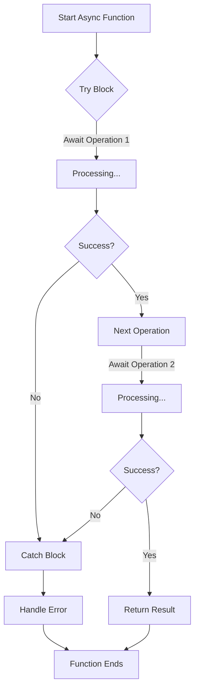

# JavaScript Async/Await

## Introduction

Asynchronous programming is essential in JavaScript, especially when building React applications where you'll frequently need to fetch data, handle user interactions, or perform operations that take time to complete. While Promises provided a more structured approach to handling asynchronous code compared to callbacks, **async/await** takes it a step further by making asynchronous code look and behave more like synchronous code.

In this lesson, we'll explore how async/await works, why it's beneficial for React development, and how to use it effectively in your projects.

## What is Async/Await?

Async/await is a modern JavaScript syntax that was introduced in ES2017 (ES8) to simplify working with Promises. It provides a more readable and maintainable way to write asynchronous code.

- **`async`**: A keyword that turns a regular function into one that returns a Promise.
- **`await`**: A keyword that can only be used inside an async function and makes JavaScript wait until the Promise settles before continuing.

## Basic Syntax

### The Async Function

To create an async function, you simply add the `async` keyword before the function declaration:

```javascript
// Regular function
function regularFunction() {
  return "Hello";
}

// Async function
async function asyncFunction() {
  return "Hello";
}

// Regular arrow function
const regularArrow = () => {
  return "Hello";
};

// Async arrow function
const asyncArrow = async () => {
  return "Hello";
};
```

When you call an async function, it always returns a Promise, even if you return a non-Promise value:

```javascript
async function greet() {
  return "Hello World";
}

greet().then(response => console.log(response)); // Output: "Hello World"
```

### The Await Operator

The `await` keyword can only be used inside an async function. It pauses the execution of the async function until the Promise is resolved:

```javascript
async function fetchData() {
  const response = await fetch('https://api.example.com/data');
  const data = await response.json();
  return data;
}

// Usage
fetchData()
  .then(data => console.log(data))
  .catch(error => console.error('Error:', error));
```

## From Promises to Async/Await

Let's see how async/await simplifies Promise-based code:

### Using Promises

```javascript
function getUserData(userId) {
  return fetch(`https://api.example.com/users/${userId}`)
    .then(response => {
      if (!response.ok) {
        throw new Error('Failed to fetch user data');
      }
      return response.json();
    })
    .then(userData => {
      return fetch(`https://api.example.com/posts?userId=${userData.id}`);
    })
    .then(response => {
      if (!response.ok) {
        throw new Error('Failed to fetch user posts');
      }
      return response.json();
    })
    .then(posts => {
      // Process user data and posts
      return {
        user: userData,
        posts: posts
      };
    })
    .catch(error => {
      console.error('Error:', error);
    });
}
```

### Using Async/Await

```javascript
async function getUserData(userId) {
  try {
    const userResponse = await fetch(`https://api.example.com/users/${userId}`);
    
    if (!userResponse.ok) {
      throw new Error('Failed to fetch user data');
    }
    
    const userData = await userResponse.json();
    
    const postsResponse = await fetch(`https://api.example.com/posts?userId=${userData.id}`);
    
    if (!postsResponse.ok) {
      throw new Error('Failed to fetch user posts');
    }
    
    const posts = await postsResponse.json();
    
    // Process user data and posts
    return {
      user: userData,
      posts: posts
    };
  } catch (error) {
    console.error('Error:', error);
  }
}
```

As you can see, the async/await version is more readable and follows a more linear flow, making it easier to understand the sequence of operations.

## Error Handling with Async/Await

With async/await, you can use regular try/catch blocks for error handling:

```javascript
async function fetchUserData(userId) {
  try {
    const response = await fetch(`https://api.example.com/users/${userId}`);
    
    if (!response.ok) {
      throw new Error(`HTTP error! Status: ${response.status}`);
    }
    
    const userData = await response.json();
    return userData;
  } catch (error) {
    console.error('Error fetching user data:', error);
    // You can also re-throw the error if needed
    throw error; 
  }
}
```

## Practical Examples for React Development

### 1. Data Fetching in React Components

```javascript
import React, { useState, useEffect } from 'react';

function UserProfile({ userId }) {
  const [user, setUser] = useState(null);
  const [loading, setLoading] = useState(true);
  const [error, setError] = useState(null);

  useEffect(() => {
    async function fetchUser() {
      try {
        setLoading(true);
        const response = await fetch(`https://api.example.com/users/${userId}`);
        
        if (!response.ok) {
          throw new Error(`Error: ${response.status}`);
        }
        
        const userData = await response.json();
        setUser(userData);
      } catch (err) {
        setError(err.message);
      } finally {
        setLoading(false);
      }
    }

    fetchUser();
  }, [userId]);

  if (loading) return <p>Loading...</p>;
  if (error) return <p>Error: {error}</p>;
  if (!user) return null;

  return (
    <div>
      <h1>{user.name}</h1>
      <p>Email: {user.email}</p>
      {/* Rest of your component */}
    </div>
  );
}
```

### 2. Form Submission with Async/Await

```javascript
import React, { useState } from 'react';

function ContactForm() {
  const [formData, setFormData] = useState({ name: '', email: '', message: '' });
  const [status, setStatus] = useState({ submitting: false, success: false, error: null });

  const handleChange = (e) => {
    const { name, value } = e.target;
    setFormData(prevData => ({ ...prevData, [name]: value }));
  };

  const handleSubmit = async (e) => {
    e.preventDefault();
    
    try {
      setStatus({ submitting: true, success: false, error: null });
      
      const response = await fetch('https://api.example.com/contact', {
        method: 'POST',
        headers: {
          'Content-Type': 'application/json'
        },
        body: JSON.stringify(formData)
      });
      
      if (!response.ok) {
        throw new Error('Failed to submit form');
      }
      
      const result = await response.json();
      setStatus({ submitting: false, success: true, error: null });
      setFormData({ name: '', email: '', message: '' });
      console.log('Form submitted successfully:', result);
    } catch (error) {
      console.error('Error submitting form:', error);
      setStatus({ submitting: false, success: false, error: error.message });
    }
  };

  return (
    <form onSubmit={handleSubmit}>
      <div>
        <label htmlFor="name">Name:</label>
        <input
          type="text"
          id="name"
          name="name"
          value={formData.name}
          onChange={handleChange}
          required
        />
      </div>
      
      <div>
        <label htmlFor="email">Email:</label>
        <input
          type="email"
          id="email"
          name="email"
          value={formData.email}
          onChange={handleChange}
          required
        />
      </div>
      
      <div>
        <label htmlFor="message">Message:</label>
        <textarea
          id="message"
          name="message"
          value={formData.message}
          onChange={handleChange}
          required
        />
      </div>
      
      <button type="submit" disabled={status.submitting}>
        {status.submitting ? 'Submitting...' : 'Submit'}
      </button>
      
      {status.success && <p className="success">Message sent successfully!</p>}
      {status.error && <p className="error">Error: {status.error}</p>}
    </form>
  );
}
```

## Common Patterns and Best Practices

### 1. Parallel Execution

If you need to execute multiple promises in parallel, you can still use `Promise.all` with await:

```javascript
async function fetchMultipleResources() {
  try {
    const [users, posts, comments] = await Promise.all([
      fetch('https://api.example.com/users').then(res => res.json()),
      fetch('https://api.example.com/posts').then(res => res.json()),
      fetch('https://api.example.com/comments').then(res => res.json())
    ]);
    
    return { users, posts, comments };
  } catch (error) {
    console.error('Error fetching resources:', error);
  }
}
```

### 2. Sequential vs Concurrent Execution

Sequential (one after another):

```javascript
async function sequential() {
  const result1 = await asyncOperation1();
  const result2 = await asyncOperation2(result1);
  return result2;
}
```

Concurrent (start all at once):

```javascript
async function concurrent() {
  const promise1 = asyncOperation1();
  const promise2 = asyncOperation2();
  
  // Wait for both to finish
  const [result1, result2] = await Promise.all([promise1, promise2]);
  return { result1, result2 };
}
```

### 3. Using Async/Await with Event Handlers

```javascript
function SearchComponent() {
  const handleSearch = async (event) => {
    event.preventDefault();
    const searchTerm = event.target.search.value;
    
    try {
      const results = await searchApi(searchTerm);
      setSearchResults(results);
    } catch (error) {
      setError('Search failed');
      console.error(error);
    }
  };
  
  return (
    <form onSubmit={handleSearch}>
      {/* Form content */}
    </form>
  );
}
```

## Gotchas and Limitations

1. **Top-level await**: Until recently, `await` could only be used inside async functions. With modern JavaScript (ES2022), top-level await is now supported in ES modules, but not in all environments.

2. **Error handling**: If you don't use try/catch with await, unhandled Promise rejections can occur:

```javascript
// Bad practice - no error handling
async function fetchData() {
  const response = await fetch('https://api.example.com/data');
  const data = await response.json(); // If response is not ok, this will fail
  return data;
}

// Good practice - with error handling
async function fetchData() {
  try {
    const response = await fetch('https://api.example.com/data');
    if (!response.ok) throw new Error(`HTTP error: ${response.status}`);
    const data = await response.json();
    return data;
  } catch (error) {
    console.error('Fetching data failed:', error);
    throw error; // Re-throw if you want to handle it elsewhere
  }
}
```

3. **Loop iteration with async/await**: Using async/await in loops might not behave as expected:

```javascript
// Sequential execution (often not what you want)
async function processArray(array) {
  for (const item of array) {
    await processItem(item); // Each iteration waits for the previous one
  }
}

// Parallel execution
async function processArray(array) {
  const promises = array.map(item => processItem(item));
  await Promise.all(promises); // Wait for all to complete
}
```

## Async/Await in React Context

In React, async/await is particularly useful in:

1. **useEffect** for data fetching (as shown earlier)
2. **Event handlers** for form submissions, button clicks, etc.
3. **Custom hooks** that perform asynchronous operations

```javascript
// Custom hook example
function useApi(url) {
  const [data, setData] = useState(null);
  const [loading, setLoading] = useState(true);
  const [error, setError] = useState(null);

  useEffect(() => {
    const fetchData = async () => {
      try {
        setLoading(true);
        const response = await fetch(url);
        if (!response.ok) throw new Error(`HTTP error: ${response.status}`);
        const result = await response.json();
        setData(result);
      } catch (err) {
        setError(err.message);
      } finally {
        setLoading(false);
      }
    };

    fetchData();
  }, [url]);

  return { data, loading, error };
}

// Usage in a component
function MyComponent() {
  const { data, loading, error } = useApi('https://api.example.com/data');
  
  if (loading) return <p>Loading...</p>;
  if (error) return <p>Error: {error}</p>;
  
  return (
    <div>
      {/* Render data */}
    </div>
  );
}
```

## Async/Await Flow Visualization



## Summary

Async/await provides a cleaner, more readable way to work with Promises in JavaScript. Key benefits include:

- **Readability**: Code flows top-to-bottom like synchronous code
- **Error handling**: Standard try/catch blocks work with asynchronous operations
- **Debugging**: Easier to follow execution flow and set breakpoints
- **Less nesting**: Avoids the "callback hell" or "Promise chain" nesting

For React developers, mastering async/await is crucial for:
- Fetching data from APIs
- Handling form submissions
- Managing user interactions
- Creating responsive UIs that don't block during async operations

## Practice Exercises

1. **Basic Fetch**: Create an async function that fetches data from a public API (like JSONPlaceholder) and logs the results.

2. **Error Handling**: Modify your function to properly handle errors using try/catch.

3. **Sequential Requests**: Write an async function that makes two dependent API calls (where the second call needs data from the first).

4. **Parallel Requests**: Create a function that fetches data from multiple endpoints simultaneously using Promise.all with async/await.

5. **React Component**: Build a simple React component that uses async/await in useEffect to fetch and display data.

## Additional Resources

- [MDN Web Docs: Async functions](https://developer.mozilla.org/en-US/docs/Web/JavaScript/Reference/Statements/async_function)
- [JavaScript.info: Async/await](https://javascript.info/async-await)
- [React Docs: Data Fetching](https://reactjs.org/docs/faq-ajax.html)
- [React Query](https://react-query.tanstack.com/) - A library for managing async data in React that works great with async/await

By understanding async/await, you'll write cleaner, more maintainable React applications that handle asynchronous operations with ease.