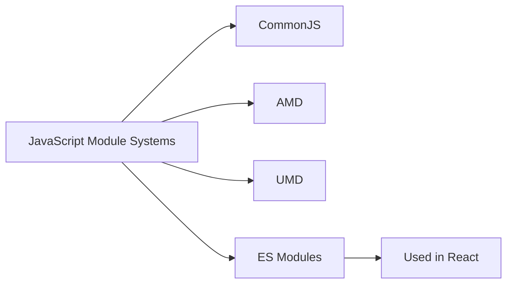

# JavaScript Modules

## Introduction

JavaScript modules are a way to organize code into reusable, independent pieces that can be imported and exported between files. Before modules, JavaScript code often lived in the global scope, leading to naming conflicts and hard-to-maintain codebases.

Modules solve this problem by providing a structured way to encapsulate code, making applications more maintainable, testable, and scalable. They're especially important in React applications, which tend to be component-based and rely heavily on modular architecture.

In this lesson, we'll explore how modules work in JavaScript, the various module systems, and how they're used in React applications.

## Why Use Modules?

Modules provide several key benefits:

1. **Code Organization**: Separate functionality into different files
2. **Encapsulation**: Keep certain code private within a module
3. **Dependency Management**: Explicitly declare dependencies
4. **Reusability**: Use the same code across multiple projects
5. **Namespacing**: Avoid naming conflicts

## Module Systems in JavaScript

JavaScript has had several module systems over the years:



While there are several module formats, we'll focus on two main ones:

1. **CommonJS** - Used primarily in Node.js
2. **ES Modules** - The standard JavaScript module system used in modern browsers and React applications

## ES Modules

ES Modules (ESM) is the official standard module system in JavaScript. It's supported in all modern browsers and is commonly used in React applications.

### Basic Export and Import

Let's start with a simple example:

**math.js**
```javascript
// Named exports
export const add = (a, b) => a + b;
export const subtract = (a, b) => a - b;

// Default export
export default function multiply(a, b) {
  return a * b;
}
```

**app.js**
```javascript
// Importing named exports
import { add, subtract } from './math.js';

// Importing default export
import multiply from './math.js';

console.log(add(5, 3));       // Output: 8
console.log(subtract(10, 4)); // Output: 6
console.log(multiply(2, 3));  // Output: 6
```

### Named Exports vs Default Exports

ES Modules support two types of exports:

#### Named Exports

Named exports allow you to export multiple values from a module:

```javascript
// utils.js
export const formatDate = (date) => {
  return new Date(date).toLocaleDateString();
};

export const capitalizeText = (text) => {
  return text.charAt(0).toUpperCase() + text.slice(1);
};
```

Then import them using curly braces:

```javascript
import { formatDate, capitalizeText } from './utils.js';

console.log(formatDate('2023-01-15')); // Output: 1/15/2023 (format depends on locale)
console.log(capitalizeText('hello')); // Output: Hello
```

#### Default Export

Each module can have one default export:

```javascript
// Button.js
const Button = (props) => {
  return <button className="btn">{props.label}</button>;
};

export default Button;
```

Import default exports without curly braces:

```javascript
import Button from './Button.js';

// Use the Button component
const app = <Button label="Click me" />;
```

### Renaming Imports and Exports

You can rename exports when importing them:

```javascript
import { formatDate as formatDateString } from './utils.js';

console.log(formatDateString('2023-01-15')); // Using the renamed import
```

Or rename them during export:

```javascript
// utils.js
const formatDate = (date) => {
  return new Date(date).toLocaleDateString();
};

export { formatDate as formatDateString };
```

### Importing Everything

You can import all exports from a module using the `*` syntax:

```javascript
import * as Utils from './utils.js';

console.log(Utils.formatDate('2023-01-15'));
console.log(Utils.capitalizeText('hello'));
```

## Re-exporting

Sometimes you want to collect exports from multiple modules and re-export them from a single file:

```javascript
// components/index.js
export { default as Button } from './Button.js';
export { default as Input } from './Input.js';
export { default as Form } from './Form.js';
```

Then import them all from one place:

```javascript
import { Button, Input, Form } from './components';
```

This pattern is commonly used in React applications to create a cleaner API for component libraries.

## Dynamic Imports

ES Modules also support dynamic imports, which allow you to load modules on demand:

```javascript
const loadModule = async () => {
  try {
    // Module is loaded only when this function runs
    const module = await import('./heavyCalculation.js');
    const result = module.calculate(10);
    console.log(result);
  } catch (error) {
    console.error('Failed to load module:', error);
  }
};

// Load module when needed
button.addEventListener('click', loadModule);
```

This is useful for code splitting in React applications, enabling faster initial load times by only loading code when it's needed.

## CommonJS Modules

While ES Modules are the standard in modern JavaScript and React applications, you might encounter CommonJS modules, especially when working with Node.js or older libraries.

**math.js (CommonJS)**
```javascript
const add = (a, b) => a + b;
const subtract = (a, b) => a - b;

module.exports = {
  add,
  subtract,
  multiply: (a, b) => a * b
};
```

**app.js (CommonJS)**
```javascript
const math = require('./math.js');

console.log(math.add(5, 3));       // Output: 8
console.log(math.subtract(10, 4)); // Output: 6
console.log(math.multiply(2, 3));  // Output: 6
```

## Modules in React Applications

Modern React applications typically use ES Modules for organizing components and functionality. Here's an example of how modules are used in a React application:

**Button.jsx**
```jsx
import React from 'react';
import './Button.css';

const Button = ({ onClick, children, variant = 'primary' }) => {
  return (
    <button 
      className={`button button-${variant}`} 
      onClick={onClick}
    >
      {children}
    </button>
  );
};

export default Button;
```

**App.jsx**
```jsx
import React, { useState } from 'react';
import Button from './Button';
import { formatDate } from './utils';

function App() {
  const [count, setCount] = useState(0);
  const today = formatDate(new Date());
  
  return (
    <div className="app">
      <h1>Counter App</h1>
      <p>Today is {today}</p>
      <p>You clicked {count} times</p>
      <Button onClick={() => setCount(count + 1)}>
        Increment
      </Button>
      <Button variant="secondary" onClick={() => setCount(0)}>
        Reset
      </Button>
    </div>
  );
}

export default App;
```

## Module Bundlers

In React applications, module bundlers like Webpack, Rollup, or Vite transform and package your modules for production. These tools:

1. Bundle multiple modules into a few optimized files
2. Transform modern JavaScript for older browsers
3. Handle non-JavaScript assets like CSS, images, and fonts
4. Optimize code for production
5. Enable features like code splitting and lazy loading

Modern React frameworks like Create React App, Next.js, and Vite handle module bundling configuration for you, allowing you to focus on writing code.

## Best Practices for Using Modules in React

1. **One Component Per File**: Define each React component in its own module
2. **Index Files**: Use index.js files to re-export components from a directory
3. **Organize by Feature**: Group related modules together by feature or domain
4. **Absolute Imports**: Configure absolute imports to avoid deep nesting (`import Button from 'components/Button'`)
5. **Avoid Circular Dependencies**: Structure your imports to prevent modules from depending on each other circularly
6. **Consistent Naming**: Use consistent naming conventions for files and exports

## Practical Example: Building a Todo Application

Let's see how modules can be used in a small React todo application:

**types.js**
```javascript
export const TODO_STATUS = {
  PENDING: 'pending',
  COMPLETED: 'completed'
};
```

**todoService.js**
```javascript
import { TODO_STATUS } from './types';

let nextId = 1;

export const createTodo = (title) => ({
  id: nextId++,
  title,
  status: TODO_STATUS.PENDING
});

export const toggleTodoStatus = (todo) => ({
  ...todo,
  status: todo.status === TODO_STATUS.PENDING 
    ? TODO_STATUS.COMPLETED 
    : TODO_STATUS.PENDING
});
```

**TodoItem.jsx**
```jsx
import React from 'react';
import { TODO_STATUS } from './types';

const TodoItem = ({ todo, onToggle, onDelete }) => {
  return (
    <div className="todo-item">
      <input
        type="checkbox"
        checked={todo.status === TODO_STATUS.COMPLETED}
        onChange={() => onToggle(todo.id)}
      />
      <span style={{
        textDecoration: 
          todo.status === TODO_STATUS.COMPLETED 
            ? 'line-through' 
            : 'none'
      }}>
        {todo.title}
      </span>
      <button onClick={() => onDelete(todo.id)}>Delete</button>
    </div>
  );
};

export default TodoItem;
```

**TodoApp.jsx**
```jsx
import React, { useState } from 'react';
import TodoItem from './TodoItem';
import { createTodo, toggleTodoStatus } from './todoService';

const TodoApp = () => {
  const [todos, setTodos] = useState([]);
  const [input, setInput] = useState('');

  const addTodo = () => {
    if (input.trim()) {
      setTodos([...todos, createTodo(input)]);
      setInput('');
    }
  };

  const toggleTodo = (id) => {
    setTodos(todos.map(todo => 
      todo.id === id ? toggleTodoStatus(todo) : todo
    ));
  };

  const deleteTodo = (id) => {
    setTodos(todos.filter(todo => todo.id !== id));
  };

  return (
    <div className="todo-app">
      <h1>Todo App</h1>
      <div className="add-todo">
        <input
          value={input}
          onChange={(e) => setInput(e.target.value)}
          placeholder="Add a new todo"
        />
        <button onClick={addTodo}>Add</button>
      </div>
      <div className="todo-list">
        {todos.map(todo => (
          <TodoItem
            key={todo.id}
            todo={todo}
            onToggle={toggleTodo}
            onDelete={deleteTodo}
          />
        ))}
      </div>
    </div>
  );
};

export default TodoApp;
```

**index.jsx**
```jsx
import React from 'react';
import ReactDOM from 'react-dom/client';
import TodoApp from './TodoApp';
import './styles.css';

ReactDOM.createRoot(document.getElementById('root')).render(
  <React.StrictMode>
    <TodoApp />
  </React.StrictMode>
);
```

This example demonstrates how to organize a React application using modules:
- Type definitions in a separate module
- Service functions for business logic
- Component modules that import what they need
- Clear separation of concerns

## Summary

JavaScript modules are a fundamental building block of modern web applications, especially in React. They allow you to:

- Organize code into reusable, separate files
- Encapsulate implementation details
- Explicitly declare dependencies
- Share code between different parts of your application

Understanding modules is crucial for writing maintainable React applications. The ES Modules system with its `import` and `export` syntax has become the standard way to organize JavaScript code in the browser.

## Exercises

1. Create a simple utility module with functions for string manipulation (capitalize, truncate, etc.)
2. Build a small React component library with Button, Input, and Card components, and export them from an index.js file
3. Refactor an existing piece of code to use modules instead of global variables
4. Practice dynamic imports by loading a heavy calculation module only when a button is clicked
5. Create a module with both named and default exports, and practice different ways of importing them

## Additional Resources

- [MDN Web Docs: JavaScript Modules](https://developer.mozilla.org/en-US/docs/Web/JavaScript/Guide/Modules)
- [ES modules: A cartoon deep-dive](https://hacks.mozilla.org/2018/03/es-modules-a-cartoon-deep-dive/)
- [JavaScript Modules: From IIFEs to CommonJS to ES6 Modules](https://tylermcginnis.com/javascript-modules-iifes-commonjs-esmodules/)
- [How to use JavaScript Modules with React](https://www.robinwieruch.de/javascript-modules-for-react/)