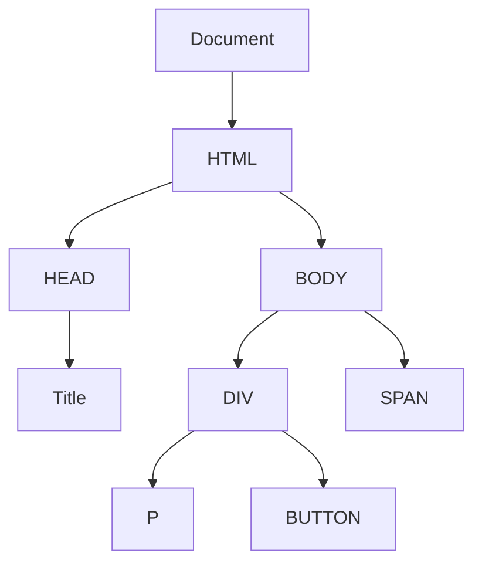

# JavaScript DOM Manipulation

## Introduction

The Document Object Model (DOM) is a programming interface for HTML and XML documents. It represents the structure of a document as a tree of objects, where each object corresponds to a part of the document. JavaScript DOM manipulation refers to using JavaScript to modify this tree, which in turn changes what the user sees on the screen.

Understanding DOM manipulation is essential for React developers because:

1. It forms the foundation of how React's Virtual DOM works
2. It helps you understand what React is doing "under the hood" 
3. You'll still need these skills for certain integrations or when working outside of React

Let's dive into how you can manipulate the DOM directly with JavaScript.

## DOM Structure Basics

Before we start manipulating the DOM, let's understand its structure:



Every HTML element becomes a node in this tree structure, and JavaScript gives us methods to traverse this tree, select nodes, and modify them.

## Selecting DOM Elements

To manipulate elements, we first need to select them. JavaScript provides several methods for this:

### getElementById

Select an element by its ID attribute:

```javascript
// HTML: <div id="app">Hello World</div>
const appDiv = document.getElementById('app');
console.log(appDiv.textContent); // Output: "Hello World"
```

### querySelector

Select the first element that matches a CSS selector:

```javascript
// HTML: <div class="container"><p>First paragraph</p><p>Second paragraph</p></div>
const firstParagraph = document.querySelector('.container p');
console.log(firstParagraph.textContent); // Output: "First paragraph"
```

### querySelectorAll

Select all elements that match a CSS selector:

```javascript
// HTML: <div class="container"><p>First paragraph</p><p>Second paragraph</p></div>
const allParagraphs = document.querySelectorAll('.container p');
allParagraphs.forEach(paragraph => {
  console.log(paragraph.textContent);
});
// Output:
// "First paragraph"
// "Second paragraph"
```

## Modifying DOM Elements

Once we've selected elements, we can modify them in various ways:

### Changing Content

```javascript
// Change text content
const title = document.querySelector('h1');
title.textContent = 'Updated Title';

// Change HTML content
const container = document.querySelector('.container');
container.innerHTML = '<p>This is <strong>new</strong> content</p>';
```

### Modifying Attributes

```javascript
const link = document.querySelector('a');
link.setAttribute('href', 'https://example.com');
link.setAttribute('target', '_blank');

// For class attribute, we can use classList
const button = document.querySelector('button');
button.classList.add('active');
button.classList.remove('disabled');
button.classList.toggle('highlighted'); // Adds if missing, removes if present
```

### Changing Styles

```javascript
const paragraph = document.querySelector('p');

// Direct style manipulation
paragraph.style.color = 'blue';
paragraph.style.fontSize = '18px';
paragraph.style.marginTop = '20px';

// Alternatively, use classes for better organization
paragraph.classList.add('text-primary');
```

## Creating and Adding Elements

You can also create new DOM elements and add them to the document:

### Creating Elements

```javascript
// Create a new element
const newDiv = document.createElement('div');
newDiv.textContent = 'This is a dynamically created div';
newDiv.classList.add('new-element');

// Create a text node
const textNode = document.createTextNode('Simple text node');
```

### Adding Elements to the DOM

```javascript
const container = document.querySelector('.container');

// Append at the end
container.appendChild(newDiv);

// Insert before a specific element
const existingElement = document.querySelector('.existing');
container.insertBefore(newDiv, existingElement);

// Modern methods
container.append(newDiv); // Can append multiple nodes and text
container.prepend(newDiv); // Insert at the beginning
existingElement.before(newDiv); // Insert before existingElement
existingElement.after(newDiv); // Insert after existingElement
```

## Removing Elements

To remove elements from the DOM:

```javascript
// Remove element directly
const elementToRemove = document.querySelector('.obsolete');
elementToRemove.remove();

// Remove a child element
const parent = document.querySelector('.container');
const childToRemove = document.querySelector('.container .child');
parent.removeChild(childToRemove);
```

## Event Handling

DOM manipulation is often triggered by user actions. JavaScript allows us to listen for and respond to these events:

```javascript
const button = document.querySelector('button');

// Add a click event listener
button.addEventListener('click', function(event) {
  console.log('Button clicked!');
  
  // The event object contains useful information
  console.log(event.target); // The element that was clicked
  
  // Modify the DOM in response to the event
  const resultDiv = document.querySelector('.result');
  resultDiv.textContent = 'You clicked the button!';
  resultDiv.style.color = 'green';
});
```

### Common Events

- `click`: When an element is clicked
- `submit`: When a form is submitted
- `input`: When the value of an input element changes
- `change`: When the value of a form element changes (fires after losing focus)
- `mouseenter`/`mouseleave`: When the mouse enters/leaves an element
- `keydown`/`keyup`: When a keyboard key is pressed/released

## Practical Example: Todo List Application

Let's combine what we've learned to create a simple todo list:

```javascript
// HTML structure:
// <div id="todo-app">
//   <input type="text" id="todo-input" placeholder="Enter a task">
//   <button id="add-button">Add Task</button>
//   <ul id="todo-list"></ul>
// </div>

document.addEventListener('DOMContentLoaded', function() {
  const todoInput = document.getElementById('todo-input');
  const addButton = document.getElementById('add-button');
  const todoList = document.getElementById('todo-list');
  
  addButton.addEventListener('click', function() {
    // Get input value
    const taskText = todoInput.value.trim();
    
    if (taskText !== '') {
      // Create new list item
      const listItem = document.createElement('li');
      
      // Create task text
      const taskSpan = document.createElement('span');
      taskSpan.textContent = taskText;
      
      // Create delete button
      const deleteButton = document.createElement('button');
      deleteButton.textContent = 'Delete';
      deleteButton.classList.add('delete-btn');
      
      // Add event listener to delete button
      deleteButton.addEventListener('click', function() {
        listItem.remove();
      });
      
      // Add event listener to mark tasks as complete
      taskSpan.addEventListener('click', function() {
        taskSpan.classList.toggle('completed');
      });
      
      // Assemble and add the new todo item
      listItem.appendChild(taskSpan);
      listItem.appendChild(deleteButton);
      todoList.appendChild(listItem);
      
      // Clear the input
      todoInput.value = '';
    }
  });
  
  // Allow adding tasks with Enter key
  todoInput.addEventListener('keypress', function(e) {
    if (e.key === 'Enter') {
      addButton.click();
    }
  });
});
```

For this to work properly, you'd add some CSS:

```css
.completed {
  text-decoration: line-through;
  color: gray;
}

.delete-btn {
  margin-left: 10px;
}

li {
  margin: 8px 0;
  cursor: pointer;
}
```

## DOM Traversal

Sometimes you need to navigate from one element to its related elements:

```javascript
const list = document.querySelector('ul');

// Get the parent
const parent = list.parentElement;

// Get children
const children = list.children; // returns HTMLCollection
Array.from(children).forEach(child => console.log(child));

// Get siblings
const firstItem = list.querySelector('li');
const nextSibling = firstItem.nextElementSibling;
const previousSibling = firstItem.previousElementSibling;
```

## DOM Manipulation and React

Now that you understand how to manipulate the DOM directly, it's important to understand how this relates to React:

1. **React's Virtual DOM**: React uses a "virtual DOM" to minimize direct DOM manipulation, which can be slow and inefficient. React builds a lightweight representation of the DOM in memory, and when state changes, it compares the virtual DOM with the real DOM and makes only the necessary updates.

2. **Declarative vs Imperative**: The direct DOM manipulation we've been doing is imperative programming (specifying exactly how to update the DOM). React uses declarative programming (you describe what the UI should look like, and React handles the "how").

3. **When to use direct DOM manipulation in React**: Generally, you should let React handle DOM updates, but occasionally you might need to interact directly with the DOM using refs (React's way of accessing DOM nodes).

```javascript
// Example of React ref for DOM access
function ExampleComponent() {
  const inputRef = React.useRef(null);
  
  const focusInput = () => {
    // Direct DOM manipulation, but through React's ref system
    inputRef.current.focus();
  };
  
  return (
    <div>
      <input ref={inputRef} type="text" />
      <button onClick={focusInput}>Focus Input</button>
    </div>
  );
}
```

## Summary

DOM manipulation is a fundamental skill for front-end development. In this guide, we've covered:

- Selecting DOM elements using methods like `getElementById` and `querySelector`
- Modifying element content, attributes, and styles
- Creating and removing DOM elements
- Handling events to make pages interactive
- Traversing the DOM tree to access related elements
- How DOM manipulation relates to React's approach

Understanding these concepts will give you a solid foundation for working with React, as you'll better understand what React is doing behind the scenes and when direct DOM access might still be necessary.

## Exercises

1. Create a form with validation that displays error messages when fields fail validation
2. Build an image slider that changes images when left/right buttons are clicked
3. Create a collapsible accordion component without using any libraries
4. Build a simple drag-and-drop interface for reordering list items
5. Create a dynamic table that allows sorting when column headers are clicked

## Additional Resources

- [MDN Web Docs: Document Object Model](https://developer.mozilla.org/en-US/docs/Web/API/Document_Object_Model)
- [JavaScript.info: DOM Manipulation](https://javascript.info/document)
- [W3Schools: JavaScript HTML DOM](https://www.w3schools.com/js/js_htmldom.asp)
- [React Documentation: Refs and the DOM](https://reactjs.org/docs/refs-and-the-dom.html)

Understanding DOM manipulation will make you a more effective React developer, as you'll better comprehend how React abstracts these operations and when you might need to fall back to direct DOM access.