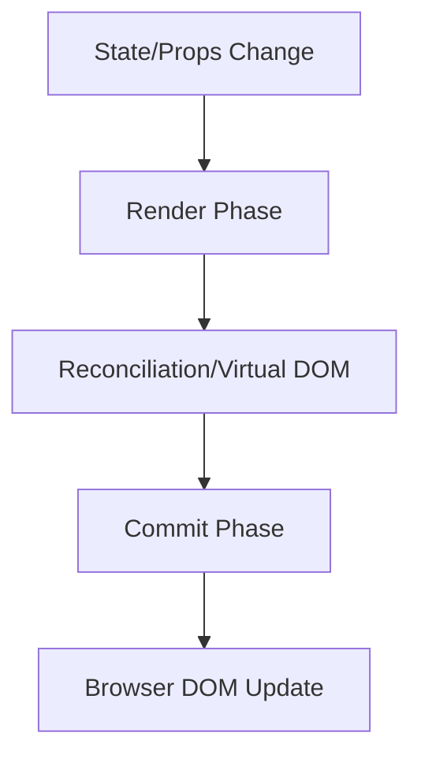

# React Performance Overview

React is incredibly fast out of the box, but as your application grows in complexity, you may encounter performance bottlenecks. Understanding how to identify and resolve these issues is crucial for building responsive and efficient React applications.

## Why Performance Matters

Performance directly impacts the user experience. Studies show that:

- Users abandon websites that take more than 3 seconds to load
- A 100ms delay in load time can decrease conversion rates by 7%
- 53% of mobile users abandon sites that take over 3 seconds to load

In React applications, poor performance can manifest as:

- Slow initial page loads
- Laggy user interactions
- Unresponsive UI elements
- High memory usage

## React's Rendering Process

To optimize React applications, you first need to understand how React renders components:



1. **Render Phase**: React builds a new Virtual DOM tree when state or props change
2. **Reconciliation**: React compares the new tree with the previous one
3. **Commit Phase**: React applies the necessary changes to the actual DOM

## Common Performance Issues in React

### 1. Unnecessary Re-renders

React components re-render when:
- Their state changes
- Their props change
- Their parent component re-renders

Here's an example of a component that re-renders unnecessarily:

```jsx
function Counter({ label }) {
  const [count, setCount] = useState(0);
  
  // This function is recreated on every render
  const increment = () => {
    setCount(count + 1);
  };
  
  console.log(`${label} rendered!`);
  
  return (
    <div>
      <p>{label}: {count}</p>
      <button onClick={increment}>Increment</button>
    </div>
  );
}

function App() {
  const [, forceUpdate] = useState(0);
  
  // This causes ALL counters to re-render, even though their props didn't change
  return (
    <div>
      <button onClick={() => forceUpdate(prev => prev + 1)}>Force Update</button>
      <Counter label="Counter 1" />
      <Counter label="Counter 2" />
    </div>
  );
}
```

### 2. Expensive Calculations

Performing complex calculations on every render can slow down your application:

```jsx
function ExpensiveComponent({ data }) {
  // This expensive calculation runs on EVERY render
  const processedData = data.map(item => {
    // Imagine this is a complex calculation
    let result = 0;
    for (let i = 0; i < 10000; i++) {
      result += Math.sqrt(item * i);
    }
    return result;
  });
  
  return (
    <div>
      {processedData.map((item, index) => (
        <div key={index}>{item}</div>
      ))}
    </div>
  );
}
```

### 3. Large Component Trees

As your component tree grows, React needs to process more components:

```jsx
function LargeList({ items }) {
  return (
    <div>
      {/* If items is large, this creates many components at once */}
      {items.map(item => (
        <ComplexItem key={item.id} data={item} />
      ))}
    </div>
  );
}
```

## Performance Measurement Tools

Before optimizing, you need to identify actual performance issues:

### React DevTools Profiler

The React DevTools Profiler helps you identify which components are rendering and how long they take:

1. Install the React DevTools browser extension
2. Open DevTools and navigate to the "Profiler" tab
3. Click "Record" and interact with your application
4. Analyze which components are rendering frequently or slowly

### Chrome Performance Tab

The Chrome DevTools Performance tab provides insights into your application's runtime performance:

1. Open Chrome DevTools and go to the "Performance" tab
2. Click "Record" and interact with your application
3. Stop recording and analyze the flame chart
4. Look for long tasks and rendering bottlenecks

## Key Performance Optimization Techniques

### 1. Memoization with React.memo

`React.memo` prevents unnecessary re-renders by memoizing component output:

```jsx
// Before optimization
function MovieCard({ title, year, rating }) {
  console.log(`Rendering MovieCard: ${title}`);
  return (
    <div className="card">
      <h3>{title}</h3>
      <p>Year: {year}</p>
      <p>Rating: {rating}</p>
    </div>
  );
}

// After optimization
const MovieCard = React.memo(function MovieCard({ title, year, rating }) {
  console.log(`Rendering MovieCard: ${title}`);
  return (
    <div className="card">
      <h3>{title}</h3>
      <p>Year: {year}</p>
      <p>Rating: {rating}</p>
    </div>
  );
});

// Usage
function MovieList({ movies }) {
  const [sortOrder, setSortOrder] = useState('asc');
  
  return (
    <div>
      <button onClick={() => setSortOrder(sortOrder === 'asc' ? 'desc' : 'asc')}>
        Toggle Sort Order
      </button>
      {movies.map(movie => (
        <MovieCard 
          key={movie.id}
          title={movie.title}
          year={movie.year}
          rating={movie.rating}
        />
      ))}
    </div>
  );
}
```

Now, when `sortOrder` changes, `MovieCard` components won't re-render if their props remain the same.

### 2. useMemo for Expensive Calculations

`useMemo` caches the result of expensive calculations:

```jsx
function DataProcessor({ data, filter }) {
  // Before optimization
  // const processedData = processData(data, filter); // Runs on every render
  
  // After optimization
  const processedData = useMemo(() => {
    console.log('Processing data...');
    return data.filter(item => item.includes(filter));
  }, [data, filter]); // Only recalculates when data or filter changes
  
  return (
    <div>
      {processedData.map((item, index) => (
        <div key={index}>{item}</div>
      ))}
    </div>
  );
}
```

### 3. useCallback for Stable Function References

`useCallback` prevents function recreation on each render:

```jsx
function SearchForm({ onSearch }) {
  const [query, setQuery] = useState('');
  
  // Before optimization
  // const handleSubmit = (e) => {
  //   e.preventDefault();
  //   onSearch(query);
  // };
  
  // After optimization
  const handleSubmit = useCallback((e) => {
    e.preventDefault();
    onSearch(query);
  }, [query, onSearch]); // Only recreates when query or onSearch changes
  
  return (
    <form onSubmit={handleSubmit}>
      <input 
        value={query} 
        onChange={e => setQuery(e.target.value)} 
      />
      <button type="submit">Search</button>
    </form>
  );
}
```

### 4. Virtualization for Large Lists

Virtualization renders only what's visible in the viewport:

```jsx
import { FixedSizeList } from 'react-window';

function VirtualizedList({ items }) {
  const Row = ({ index, style }) => (
    <div style={style} className="row">
      {items[index].name}
    </div>
  );
  
  return (
    <FixedSizeList
      height={400}
      width="100%"
      itemCount={items.length}
      itemSize={35}
    >
      {Row}
    </FixedSizeList>
  );
}
```

### 5. Code Splitting

Split your code into smaller chunks loaded on demand:

```jsx
// Before code splitting
// import HeavyComponent from './HeavyComponent';

// After code splitting
import React, { Suspense, lazy } from 'react';
const HeavyComponent = lazy(() => import('./HeavyComponent'));

function App() {
  return (
    <div>
      <Header />
      <Suspense fallback={<div>Loading...</div>}>
        <HeavyComponent />
      </Suspense>
      <Footer />
    </div>
  );
}
```

## Real-World Example: Optimizing a Dashboard

Let's look at a real-world example of optimizing a dashboard application:

```jsx
// Before optimization
function Dashboard({ user }) {
  const [data, setData] = useState([]);
  const [filter, setFilter] = useState('all');
  
  useEffect(() => {
    fetchDashboardData().then(setData);
  }, []);
  
  // Expensive calculation on every render
  const filteredData = data.filter(item => {
    if (filter === 'all') return true;
    return item.category === filter;
  });
  
  // Function recreated on every render
  const handleFilterChange = (newFilter) => {
    setFilter(newFilter);
  };
  
  return (
    <div className="dashboard">
      <UserInfo user={user} />
      <FilterControls onFilterChange={handleFilterChange} />
      
      {/* Every widget re-renders when filter changes */}
      <div className="widgets">
        {filteredData.map(item => (
          <DashboardWidget key={item.id} data={item} />
        ))}
      </div>
    </div>
  );
}
```

Now, let's optimize it:

```jsx
// After optimization
function Dashboard({ user }) {
  const [data, setData] = useState([]);
  const [filter, setFilter] = useState('all');
  
  useEffect(() => {
    fetchDashboardData().then(setData);
  }, []);
  
  // Memoize expensive calculation
  const filteredData = useMemo(() => {
    console.log('Filtering data...');
    return data.filter(item => {
      if (filter === 'all') return true;
      return item.category === filter;
    });
  }, [data, filter]);
  
  // Stable function reference
  const handleFilterChange = useCallback((newFilter) => {
    setFilter(newFilter);
  }, []);
  
  return (
    <div className="dashboard">
      <UserInfo user={user} />
      <FilterControls onFilterChange={handleFilterChange} />
      
      {/* Only widgets that need to update will re-render */}
      <div className="widgets">
        {filteredData.length > 100 ? (
          <VirtualizedWidgetList data={filteredData} />
        ) : (
          filteredData.map(item => (
            <MemoizedDashboardWidget key={item.id} data={item} />
          ))
        )}
      </div>
    </div>
  );
}

// Memoized widget component
const MemoizedDashboardWidget = React.memo(DashboardWidget);

// Virtualized list for many items
function VirtualizedWidgetList({ data }) {
  const Row = ({ index, style }) => (
    <div style={style}>
      <MemoizedDashboardWidget data={data[index]} />
    </div>
  );
  
  return (
    <FixedSizeList
      height={600}
      width="100%"
      itemCount={data.length}
      itemSize={150}
    >
      {Row}
    </FixedSizeList>
  );
}
```

This optimized version:
1. Uses `useMemo` to avoid recalculating filtered data
2. Uses `useCallback` for stable function references
3. Memoizes components with `React.memo`
4. Applies virtualization for large lists

## Summary: React Performance Best Practices

1. **Measure before optimizing** - Use the React DevTools Profiler to identify slow components
2. **Prevent unnecessary re-renders** - Use `React.memo`, `useMemo`, and `useCallback`
3. **Virtualize long lists** - Render only what's visible using libraries like `react-window`
4. **Split your code** - Use dynamic imports to load components on demand
5. **Optimize state structure** - Keep state as local as possible
6. **Use production builds** - Always test and deploy with production builds
7. **Implement lazy loading** - Load components and images only when needed

## Additional Resources

- [React's Official Performance Documentation](https://reactjs.org/docs/optimizing-performance.html)
- [Profiling React Applications](https://reactjs.org/blog/2018/09/10/introducing-the-react-profiler.html)
- [Web Vitals](https://web.dev/vitals/) - Google's metrics for website performance

## Exercises

1. Profile an existing React application and identify three components that re-render unnecessarily
2. Optimize a list component that renders 1000+ items using virtualization
3. Implement `useMemo` and `useCallback` in a form component with multiple expensive operations
4. Create a code-splitting strategy for a multi-page React application
5. Measure the performance improvements of your optimizations using React DevTools

By following these optimization techniques, you can ensure your React applications remain fast and responsive, even as they grow in complexity.