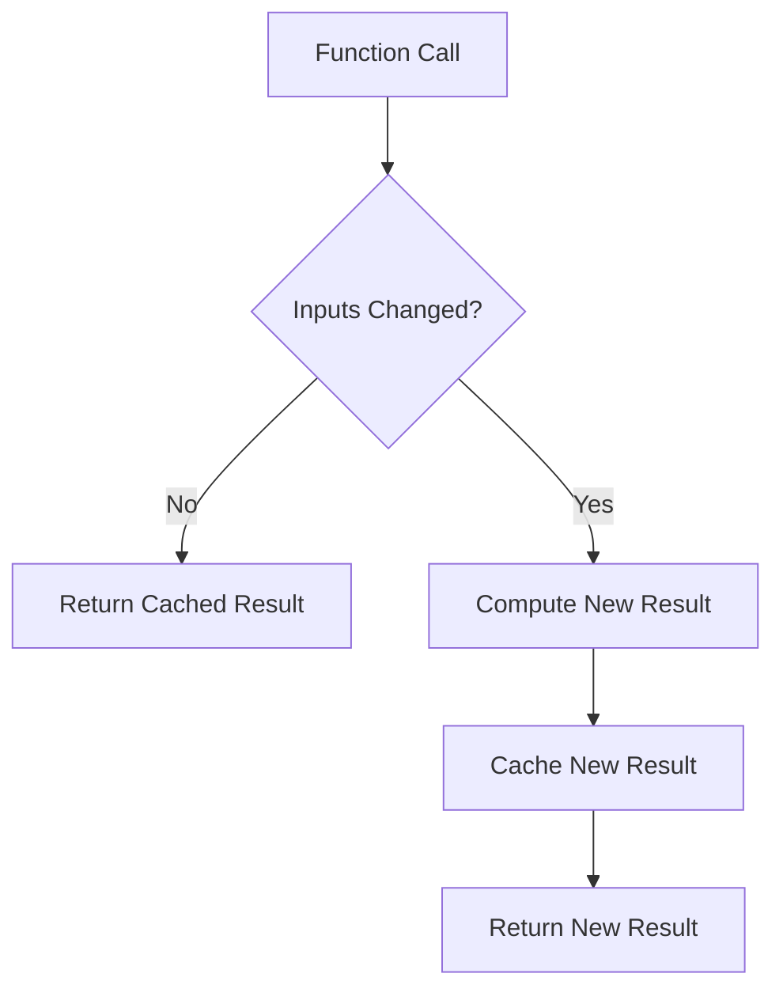

# React Memoization

## Introduction

When building React applications, performance optimization becomes crucial as your app grows in complexity. One common performance bottleneck occurs when components re-render unnecessarily, causing sluggish user experiences. React memoization is a powerful technique that helps solve this problem by preventing unnecessary re-renders and recalculations.

In this guide, we'll explore the concept of memoization in React and how to implement it effectively using `React.memo`, `useMemo`, and `useCallback` hooks.

## What is Memoization?

Memoization is a programming technique that stores the results of expensive function calls and returns the cached result when the same inputs occur again. In React terms, this means remembering a component or value and using it again if none of the dependencies have changed.



## Why Memoization Matters in React

React's rendering behavior follows a simple rule: when a component's state or props change, the component re-renders. But this can lead to performance issues:

1. **Unnecessary Re-renders**: A parent component's re-render causes all child components to re-render, even if their props haven't changed.
2. **Expensive Calculations**: Complex calculations are repeated on every render, even when inputs haven't changed.
3. **New Function References**: New function references are created on each render, breaking optimization in child components.

Let's explore how to address these issues with different memoization techniques.

## Memoization Techniques in React

### 1. React.memo - Memoizing Components

`React.memo` is a higher-order component (HOC) that memoizes your component to prevent unnecessary re-renders when the props haven't changed.

#### Basic Usage:

```jsx
import React from 'react';

// Without memoization - will re-render whenever parent re-renders
function RegularComponent({ name }) {
  console.log("RegularComponent rendered");
  return <div>Hello, {name}!</div>;
}

// With memoization - will only re-render if props change
const MemoizedComponent = React.memo(function MemoizedComponent({ name }) {
  console.log("MemoizedComponent rendered");
  return <div>Hello, {name}!</div>;
});

// Usage
function App() {
  const [count, setCount] = useState(0);
  const [name, setName] = useState("John");
  
  return (
    <div>
      <button onClick={() => setCount(count + 1)}>
        Increment count: {count}
      </button>
      <RegularComponent name={name} />
      <MemoizedComponent name={name} />
    </div>
  );
}
```

**What happens:**
- Each time you click the button, `count` changes and `App` re-renders
- `RegularComponent` always re-renders even though its `name` prop hasn't changed
- `MemoizedComponent` only renders once when it first mounts, and won't re-render when `count` changes

#### Custom Comparison Function

`React.memo` accepts a second parameter - a custom comparison function that gives you more control over when to re-render:

```jsx
const MemoizedComponentWithCustomComparison = React.memo(
  function CustomComparisonComponent({ user }) {
    console.log("CustomComparisonComponent rendered");
    return <div>Hello, {user.name}!</div>;
  },
  (prevProps, nextProps) => {
    // Return true if you want to PREVENT a re-render
    // This will only re-render if the name property changes
    return prevProps.user.name === nextProps.user.name;
  }
);
```

### 2. useMemo - Memoizing Values

`useMemo` lets you memoize expensive calculations so they're only recomputed when dependencies change.

#### Basic Usage:

```jsx
import React, { useState, useMemo } from 'react';

function ExpensiveCalculation({ list, filter }) {
  // Without memoization - calculation runs on every render
  // const filteredList = list.filter(item => item.includes(filter));
  
  // With memoization - calculation only runs when list or filter changes
  const filteredList = useMemo(() => {
    console.log("Filtering list...");
    return list.filter(item => item.includes(filter));
  }, [list, filter]); // Dependency array
  
  return (
    <div>
      <h2>Filtered Items:</h2>
      <ul>
        {filteredList.map((item, index) => (
          <li key={index}>{item}</li>
        ))}
      </ul>
    </div>
  );
}

// Usage
function App() {
  const [count, setCount] = useState(0);
  const [filter, setFilter] = useState("");
  const list = ["apple", "banana", "orange", "grape", "pineapple"];
  
  return (
    <div>
      <button onClick={() => setCount(count + 1)}>
        Clicked {count} times
      </button>
      <input 
        value={filter}
        onChange={e => setFilter(e.target.value)}
        placeholder="Filter fruits..."
      />
      <ExpensiveCalculation list={list} filter={filter} />
    </div>
  );
}
```

**What happens:**
- The filtered list is only recalculated when either `list` or `filter` changes
- When you click the count button, the filtering logic doesn't run again
- When you type in the filter input, the filtering logic runs with each keystroke

### 3. useCallback - Memoizing Functions

`useCallback` memoizes function definitions between renders, which is especially important when passing functions as props to memoized child components.

#### Basic Usage:

```jsx
import React, { useState, useCallback } from 'react';

// Child component using React.memo
const Button = React.memo(function Button({ onClick, children }) {
  console.log(`Button "${children}" rendered`);
  return <button onClick={onClick}>{children}</button>;
});

function CallbackExample() {
  const [count1, setCount1] = useState(0);
  const [count2, setCount2] = useState(0);
  
  // Without useCallback - new function reference on every render
  // const handleClick1 = () => {
  //   setCount1(count1 + 1);
  // };
  
  // With useCallback - same function reference between renders
  const handleClick1 = useCallback(() => {
    setCount1(count1 + 1);
  }, [count1]); // Only changes when count1 changes
  
  const handleClick2 = useCallback(() => {
    setCount2(count2 + 1);
  }, [count2]); // Only changes when count2 changes
  
  console.log("Parent component rendered");
  
  return (
    <div>
      <p>Count 1: {count1}</p>
      <p>Count 2: {count2}</p>
      <Button onClick={handleClick1}>Increment Count 1</Button>
      <Button onClick={handleClick2}>Increment Count 2</Button>
    </div>
  );
}
```

**What happens:**
- When you click "Increment Count 1", only the first button re-renders because its callback changed
- When you click "Increment Count 2", only the second button re-renders
- Without `useCallback`, both buttons would re-render every time either count changes

## Real-World Applications

### Example 1: Data Grid with Filtering and Sorting

Here's a more complex example showing how memoization can improve a data grid component:

```jsx
import React, { useState, useMemo, useCallback } from 'react';

function DataGrid({ data, itemsPerPage = 10 }) {
  const [sortField, setSortField] = useState(null);
  const [sortDirection, setSortDirection] = useState('asc');
  const [filter, setFilter] = useState('');
  const [currentPage, setCurrentPage] = useState(1);
  
  // Memoize the filtered and sorted data
  const processedData = useMemo(() => {
    console.log("Processing data...");
    
    // Filter data
    let result = data;
    if (filter) {
      result = data.filter(item => 
        Object.values(item).some(val => 
          String(val).toLowerCase().includes(filter.toLowerCase())
        )
      );
    }
    
    // Sort data
    if (sortField) {
      result = [...result].sort((a, b) => {
        if (a[sortField] < b[sortField]) 
          return sortDirection === 'asc' ? -1 : 1;
        if (a[sortField] > b[sortField]) 
          return sortDirection === 'asc' ? 1 : -1;
        return 0;
      });
    }
    
    return result;
  }, [data, filter, sortField, sortDirection]);
  
  // Memoize pagination calculation
  const paginatedData = useMemo(() => {
    const startIndex = (currentPage - 1) * itemsPerPage;
    return processedData.slice(startIndex, startIndex + itemsPerPage);
  }, [processedData, currentPage, itemsPerPage]);
  
  // Memoize total pages calculation
  const totalPages = useMemo(() => 
    Math.ceil(processedData.length / itemsPerPage),
    [processedData, itemsPerPage]
  );
  
  // Memoize event handlers
  const handleSort = useCallback((field) => {
    setSortField(field);
    setSortDirection(prev => 
      field === sortField && prev === 'asc' ? 'desc' : 'asc'
    );
  }, [sortField]);
  
  const handleFilter = useCallback((e) => {
    setFilter(e.target.value);
    setCurrentPage(1); // Reset to first page when filtering
  }, []);
  
  const handlePageChange = useCallback((page) => {
    setCurrentPage(page);
  }, []);
  
  return (
    <div className="data-grid">
      <div className="controls">
        <input 
          type="text" 
          value={filter}
          onChange={handleFilter}
          placeholder="Search..."
        />
      </div>
      
      <table>
        <thead>
          <tr>
            {Object.keys(data[0] || {}).map(field => (
              <th key={field} onClick={() => handleSort(field)}>
                {field}
                {sortField === field && (
                  sortDirection === 'asc' ? ' ↑' : ' ↓'
                )}
              </th>
            ))}
          </tr>
        </thead>
        <tbody>
          {paginatedData.map((item, i) => (
            <tr key={i}>
              {Object.values(item).map((value, j) => (
                <td key={j}>{value}</td>
              ))}
            </tr>
          ))}
        </tbody>
      </table>
      
      <div className="pagination">
        {Array.from({ length: totalPages }, (_, i) => i + 1).map(page => (
          <button
            key={page}
            onClick={() => handlePageChange(page)}
            disabled={page === currentPage}
          >
            {page}
          </button>
        ))}
      </div>
      
      <div className="stats">
        Showing {paginatedData.length} of {processedData.length} results
      </div>
    </div>
  );
}
```

In this example:
- `useMemo` ensures filtering and sorting only run when related inputs change
- `useCallback` prevents new function references causing unnecessary re-renders
- Each operation is optimally memoized based on its dependencies

### Example 2: Optimizing a Form with Validation

```jsx
import React, { useState, useMemo, useCallback } from 'react';

// Memoized form field component
const FormField = React.memo(function FormField({ 
  label, 
  value, 
  onChange, 
  error 
}) {
  console.log(`Rendering field: ${label}`);
  return (
    <div className="form-field">
      <label>{label}</label>
      <input value={value} onChange={onChange} />
      {error && <p className="error">{error}</p>}
    </div>
  );
});

function ContactForm() {
  const [formData, setFormData] = useState({
    name: '',
    email: '',
    message: ''
  });
  
  // Memoize validation logic
  const errors = useMemo(() => {
    console.log("Validating form...");
    
    const errors = {};
    
    if (formData.name.length < 3) {
      errors.name = "Name must be at least 3 characters";
    }
    
    if (!formData.email.includes('@')) {
      errors.email = "Please enter a valid email";
    }
    
    if (formData.message.length < 10) {
      errors.message = "Message must be at least 10 characters";
    }
    
    return errors;
  }, [formData.name, formData.email, formData.message]);
  
  // Memoize field change handlers
  const handleNameChange = useCallback((e) => {
    setFormData(prev => ({ ...prev, name: e.target.value }));
  }, []);
  
  const handleEmailChange = useCallback((e) => {
    setFormData(prev => ({ ...prev, email: e.target.value }));
  }, []);
  
  const handleMessageChange = useCallback((e) => {
    setFormData(prev => ({ ...prev, message: e.target.value }));
  }, []);
  
  // Memoize form validity
  const isFormValid = useMemo(() => 
    Object.keys(errors).length === 0,
    [errors]
  );
  
  const handleSubmit = useCallback((e) => {
    e.preventDefault();
    if (isFormValid) {
      console.log("Form submitted:", formData);
      // Process form data
    }
  }, [formData, isFormValid]);
  
  return (
    <form onSubmit={handleSubmit}>
      <FormField 
        label="Name"
        value={formData.name}
        onChange={handleNameChange}
        error={errors.name}
      />
      <FormField 
        label="Email"
        value={formData.email}
        onChange={handleEmailChange}
        error={errors.email}
      />
      <FormField 
        label="Message"
        value={formData.message}
        onChange={handleMessageChange}
        error={errors.message}
      />
      <button type="submit" disabled={!isFormValid}>
        Submit
      </button>
    </form>
  );
}
```

In this form example:
- `React.memo` on `FormField` ensures fields only re-render when their specific props change
- `useMemo` for validation ensures we don't revalidate the form on every render
- `useCallback` for event handlers prevents unnecessary re-renders of form fields

## Best Practices & Common Pitfalls

### When to Use Memoization

- **Use `React.memo` when:** A component renders the same result given the same props and is expensive to render
- **Use `useMemo` when:** You have expensive calculations that shouldn't be redone on every render
- **Use `useCallback` when:** You're passing functions as props to memoized child components

### Pitfalls to Avoid

1. **Over-optimization:**
   ```jsx
   // Don't memoize everything!
   // This is overkill for simple components
   const SimpleText = React.memo(({ text }) => <span>{text}</span>);
   ```

2. **Incorrect dependency arrays:**
   ```jsx
   // Missing dependency - will use stale data
   const filteredList = useMemo(() => {
     return list.filter(item => item.includes(filter));
   }, []); // Missing dependencies: list, filter
   ```

3. **Memoizing with object/array literals:**
   ```jsx
   // This defeats the purpose of memoization
   // A new object is created on every render
   const MemoizedComponent = React.memo(({ user }) => {
     return <div>{user.name}</div>;
   });
   
   // In parent:
   return <MemoizedComponent user={{ name: "John" }} />; // New object every time!
   ```

4. **Forgetting that functions are objects:**
   ```jsx
   function ParentComponent() {
     // This function is recreated on every render
     const handleClick = () => {
       console.log("Clicked");
     };
     
     // Even with memoization, ChildComponent will re-render
     // because handleClick is a new reference each time
     return <MemoizedChildComponent onClick={handleClick} />;
   }
   ```

## When Not to Use Memoization

Not everything needs to be memoized. Consider these guidelines:

1. **Simple components:** Memoization adds overhead that can outweigh benefits for simple components
2. **Components that usually render with different props:** Memoization won't help if props change on most renders
3. **State updates that always affect the entire component tree:** If everything needs to update anyway, memoization won't help

## Performance Measurement

Before adding memoization, measure your app's performance to identify actual bottlenecks:

1. Use React DevTools Profiler to find unnecessary re-renders
2. Use `console.time()` and `console.timeEnd()` to measure expensive operations
3. Use Chrome DevTools Performance tab to find rendering bottlenecks

## Summary

Memoization in React is a powerful technique to optimize performance by preventing unnecessary re-renders and recalculations. The three main tools are:

1. **React.memo** - Memoizes components to prevent re-renders when props haven't changed
2. **useMemo** - Memoizes values to prevent recalculation when dependencies haven't changed
3. **useCallback** - Memoizes functions to maintain reference equality between renders

When used correctly, these techniques can significantly improve your React application's performance. However, remember that premature optimization can lead to more complex code without meaningful benefits, so always measure performance before and after changes.

## Exercises

1. Take a simple React app and identify components that might benefit from memoization.
2. Create a list component that uses `useMemo` for filtering and sorting data.
3. Refactor a form component to use `useCallback` for event handlers and compare the performance.
4. Use React DevTools Profiler to measure the impact of adding memoization to a component.
5. Create a custom hook that uses memoization to cache API responses.

## Additional Resources

- [React Documentation on memo](https://reactjs.org/docs/react-api.html#reactmemo)
- [React Documentation on useMemo](https://reactjs.org/docs/hooks-reference.html#usememo)
- [React Documentation on useCallback](https://reactjs.org/docs/hooks-reference.html#usecallback)
- [When to useMemo and useCallback](https://kentcdodds.com/blog/usememo-and-usecallback)
- [React DevTools Profiler](https://reactjs.org/blog/2018/09/10/introducing-the-react-profiler.html)