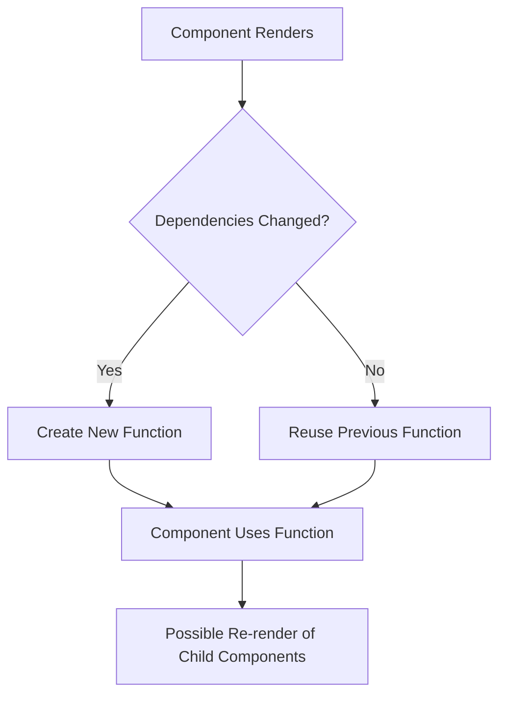

# React useCallback Performance

## Introduction

When building React applications, performance optimization becomes crucial as your app grows in complexity. One common performance issue occurs when components re-render unnecessarily. React provides several tools to tackle this problem, and the `useCallback` hook is one of the most important ones.

In this guide, we'll explore how `useCallback` works, when to use it, and how it can help improve your application's performance.

## What is the useCallback Hook?

`useCallback` is a React Hook that lets you cache a function definition between re-renders. It returns a memoized (cached) version of the callback function that only changes if one of its dependencies has changed.

Here's the basic syntax:

```jsx
const memoizedCallback = useCallback(
  () => {
    doSomething(a, b);
  },
  [a, b]
);
```

The hook takes two arguments:
1. The function you want to cache
2. An array of dependencies that, when changed, will recreate the function

## Why Function References Matter in React

To understand why `useCallback` is useful, let's first understand a fundamental JavaScript concept: functions are objects, and each time you create a function, it creates a new reference.

```jsx
// These are two different function references
const functionOne = () => console.log('Hello');
const functionTwo = () => console.log('Hello');

console.log(functionOne === functionTwo); // false
```

In React, when a component re-renders, all functions inside the component are recreated with new references. This might not seem like a problem until you pass those functions as props to child components, especially memoized ones.

## When to Use useCallback

### 1. Preventing Unnecessary Renders in Child Components

The most common use case for `useCallback` is when you pass callbacks to optimized child components that rely on reference equality to prevent unnecessary renders.

Consider this example:

```jsx
function ParentComponent() {
  const [count, setCount] = useState(0);
  const [text, setText] = useState('');
  
  // This function is recreated on every render
  const handleClick = () => {
    console.log('Button clicked!');
    setCount(count + 1);
  };
  
  return (
    <div>
      <input value={text} onChange={e => setText(e.target.value)} />
      <ExpensiveComponent onClick={handleClick} />
      <div>Count: {count}</div>
    </div>
  );
}

// Using React.memo to optimize the component
const ExpensiveComponent = React.memo(({ onClick }) => {
  console.log('ExpensiveComponent rendered');
  return <button onClick={onClick}>Click me</button>;
});
```

In this example, even though `ExpensiveComponent` is wrapped in `React.memo`, it will still re-render every time the parent re-renders (like when typing in the input), because `handleClick` is a different function on each render.

Let's fix it with `useCallback`:

```jsx
function ParentComponent() {
  const [count, setCount] = useState(0);
  const [text, setText] = useState('');
  
  // Now this function's reference is stable between renders
  const handleClick = useCallback(() => {
    console.log('Button clicked!');
    setCount(count + 1);
  }, [count]);
  
  return (
    <div>
      <input value={text} onChange={e => setText(e.target.value)} />
      <ExpensiveComponent onClick={handleClick} />
      <div>Count: {count}</div>
    </div>
  );
}
```

Now, `handleClick` only changes when `count` changes, not when the `text` changes. This means `ExpensiveComponent` won't re-render when you type in the input field.

### 2. When Creating Event Handlers that Depend on Props or State

If your callback uses props or state values, you should include them in the dependency array to ensure the callback uses the latest values:

```jsx
function SearchComponent({ onSearch }) {
  const [query, setQuery] = useState('');
  
  const handleSearch = useCallback(() => {
    onSearch(query);
  }, [onSearch, query]);
  
  return (
    <div>
      <input value={query} onChange={e => setQuery(e.target.value)} />
      <button onClick={handleSearch}>Search</button>
    </div>
  );
}
```

### 3. When a Function is a Dependency of Another Hook

When a function is used in the dependency array of other hooks like `useEffect`, using `useCallback` can prevent unnecessary effects from running:

```jsx
function DataFetcher({ productId }) {
  const [data, setData] = useState(null);
  
  // Without useCallback, this would be a new function on every render
  const fetchData = useCallback(async () => {
    const response = await fetch(`/api/products/${productId}`);
    const result = await response.json();
    setData(result);
  }, [productId]);
  
  // fetchData is stable between renders as long as productId doesn't change
  useEffect(() => {
    fetchData();
  }, [fetchData]);
  
  // Rest of component...
}
```

## Visualizing useCallback with a Diagram



## Real-World Example: Debounced Search with useCallback

Here's a practical example of using `useCallback` with a debounced search function:

```jsx
import { useState, useCallback, useEffect } from 'react';
import SearchResults from './SearchResults';

function SearchBar() {
  const [searchTerm, setSearchTerm] = useState('');
  const [results, setResults] = useState([]);
  const [isSearching, setIsSearching] = useState(false);
  
  // Memoize the search function
  const debouncedSearch = useCallback(
    async (term) => {
      if (!term) {
        setResults([]);
        return;
      }
      
      setIsSearching(true);
      try {
        const response = await fetch(`/api/search?term=${term}`);
        const data = await response.json();
        setResults(data);
      } catch (error) {
        console.error('Search failed:', error);
        setResults([]);
      } finally {
        setIsSearching(false);
      }
    },
    [] // No dependencies because this function doesn't need to change
  );
  
  // This effect runs when searchTerm changes
  useEffect(() => {
    const handler = setTimeout(() => {
      debouncedSearch(searchTerm);
    }, 300);
    
    return () => {
      clearTimeout(handler);
    };
  }, [searchTerm, debouncedSearch]);
  
  return (
    <div className="search-container">
      <input
        type="text"
        value={searchTerm}
        onChange={(e) => setSearchTerm(e.target.value)}
        placeholder="Search..."
        className="search-input"
      />
      
      {isSearching ? (
        <div>Loading...</div>
      ) : (
        <SearchResults results={results} />
      )}
    </div>
  );
}
```

Here, we use `useCallback` to memoize our search function. This ensures that `debouncedSearch` doesn't cause the `useEffect` to re-run unnecessarily.

## Common Pitfalls and Best Practices

### 1. Don't Overuse useCallback

Not every function needs to be wrapped in `useCallback`. If a function is only used in the rendering phase and not passed to child components or other hooks, `useCallback` might be unnecessary overhead.

### 2. Watch Your Dependencies

Missing dependencies can lead to stale closures:

```jsx
// ❌ Bug: count will always be the initial value
const increment = useCallback(() => {
  setCount(count + 1);
}, []); // Missing count dependency

// ✅ Fixed version
const increment = useCallback(() => {
  setCount(count + 1);
}, [count]);

// ✅ Even better: use functional updates
const increment = useCallback(() => {
  setCount(prevCount => prevCount + 1);
}, []); // No dependencies needed now
```

### 3. Combine with React.memo for Maximum Benefit

`useCallback` works best when used together with `React.memo`:

```jsx
// Parent component
function Parent() {
  const [count, setCount] = useState(0);
  
  const handleClick = useCallback(() => {
    // handle click logic
  }, []);
  
  return <Child onClick={handleClick} />;
}

// Child component
const Child = React.memo(({ onClick }) => {
  console.log("Child rendered");
  return <button onClick={onClick}>Click me</button>;
});
```

### 4. Consider Using the useEvent RFC

The React team is working on a potential new hook called `useEvent` that may eventually replace some use cases for `useCallback`. It's designed to create stable event handlers that always have access to the latest props and state.

## Measuring Performance Improvements

To verify if `useCallback` is actually improving performance, you can use React DevTools Profiler:

1. Use the React DevTools Profiler to record renders
2. Look for unnecessary re-renders in your component tree
3. Apply `useCallback` where appropriate
4. Record again and compare the results

## Summary

`useCallback` is a powerful tool for optimizing React applications by memoizing callback functions. It's most useful when:

- You're passing callbacks to memoized child components
- Your callbacks are dependencies of other hooks
- You need stable function references for event handlers in complex components

Remember:
- Don't overuse it for functions that don't need stable references
- Always include the proper dependencies
- Combine it with `React.memo` for child components
- Use the functional update form for state updaters when possible

By using `useCallback` appropriately, you can significantly reduce unnecessary re-renders and improve the overall performance of your React applications.

## Additional Resources

- [React official documentation on useCallback](https://reactjs.org/docs/hooks-reference.html#usecallback)
- [When to useMemo and useCallback](https://kentcdodds.com/blog/usememo-and-usecallback) by Kent C. Dodds
- [A Complete Guide to useCallback](https://dmitripavlutin.com/react-usecallback/) by Dmitri Pavlutin

## Exercises

1. Identify and fix performance issues in a component that passes functions to children
2. Convert a class component with `shouldComponentUpdate` to a functional component using `useCallback` and `React.memo`
3. Create a custom hook that uses `useCallback` to optimize a frequently used operation
4. Implement a data fetching component that prevents unnecessary API calls using `useCallback`