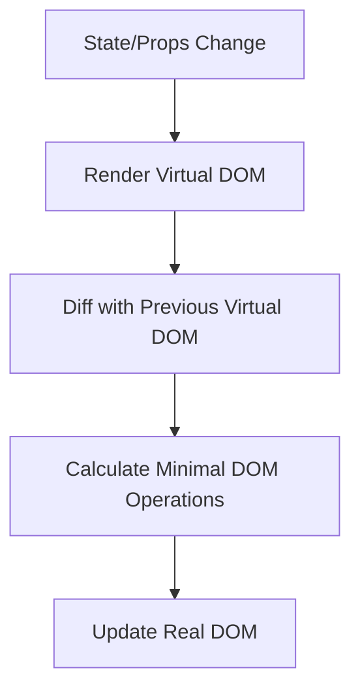

# React Virtual DOM

## Introduction

The Virtual DOM is one of React's most powerful features and a key reason why React offers excellent performance. For beginners entering the React ecosystem, understanding the Virtual DOM is essential as it forms the foundation of how React efficiently updates the UI.

In this guide, we'll explore what the Virtual DOM is, how it works, why it matters for performance, and how you can leverage this knowledge to build faster React applications.

## What is the Virtual DOM?

The Virtual DOM (VDOM) is a programming concept where an ideal, or "virtual", representation of a UI is kept in memory and synced with the "real" DOM by a library such as ReactDOM. This process is called **reconciliation**.

### The Problem with Direct DOM Manipulation

Before we dive into the Virtual DOM, let's understand why direct DOM manipulation can be problematic:

1. **DOM operations are expensive** - Updating the actual DOM is one of the slowest parts of web development
2. **Inefficient updates** - Without a smart system, developers might update more than necessary
3. **Complex state tracking** - Keeping track of what needs updating is difficult

### Enter the Virtual DOM

React solves these problems with a two-step process:

1. Maintain a lightweight copy of the DOM in memory (the Virtual DOM)
2. Use a diffing algorithm to determine the minimal set of changes needed to update the real DOM

## How the Virtual DOM Works

Let's break down the Virtual DOM process:



### 1. Create Virtual DOM

When you write React code, you're essentially describing how the UI should look:

```jsx
function WelcomeMessage({ name }) {
  return <h1>Hello, {name}!</h1>;
}
```

React creates Virtual DOM nodes for this component - JavaScript objects that represent the actual DOM elements.

### 2. Rendering and Diffing

When a component's state changes:

```jsx
function Counter() {
  const [count, setCount] = React.useState(0);
  
  return (
    <div>
      <p>You clicked {count} times</p>
      <button onClick={() => setCount(count + 1)}>
        Click me
      </button>
    </div>
  );
}
```

React:
1. Creates a new Virtual DOM tree with the updated state
2. Compares it with the previous Virtual DOM tree (diffing)
3. Identifies what has actually changed

### 3. Reconciliation

After identifying changes, React updates only those parts of the real DOM that have changed. In our counter example, only the text content of the paragraph would update, without rebuilding the entire component.

## Virtual DOM in Action

Let's visualize how React handles updates with this practical example:

Consider a to-do list application:

```jsx
function TodoList() {
  const [todos, setTodos] = React.useState([
    { id: 1, text: "Learn React", completed: false },
    { id: 2, text: "Build a project", completed: false }
  ]);

  const toggleTodo = (id) => {
    setTodos(todos.map(todo => 
      todo.id === id ? { ...todo, completed: !todo.completed } : todo
    ));
  };

  return (
    <ul>
      {todos.map(todo => (
        <li 
          key={todo.id} 
          onClick={() => toggleTodo(todo.id)}
          style={{ textDecoration: todo.completed ? 'line-through' : 'none' }}
        >
          {todo.text}
        </li>
      ))}
    </ul>
  );
}
```

When a user clicks on a todo item:

1. The state updates with the toggled "completed" value
2. React creates a new Virtual DOM with this change
3. The diffing algorithm identifies only the style of the clicked item has changed
4. React updates only that specific style attribute in the real DOM

Without the Virtual DOM, the entire list might need to be re-rendered, which would be much less efficient.

## The Diffing Algorithm

React's diffing algorithm (called Reconciliation) follows certain assumptions to achieve O(n) complexity instead of O(n³):

### Key Rules of React's Diffing:

1. **Different Component Types:** If a component changes from `<div>` to `<span>`, React rebuilds the entire subtree
2. **Same Component Type:** React updates only the changed properties
3. **List Items:** React uses `key` props to match elements between renders

```jsx
// Bad: No key prop
{items.map(item => <ListItem />)}

// Good: With key prop
{items.map(item => <ListItem key={item.id} />)}
```

The `key` prop helps React identify which items have changed, been added, or been removed, making the diffing process more efficient.

## Batched Updates

React also optimizes performance by batching multiple state updates together. For example:

```jsx
function handleClick() {
  // React batches these updates in a single render
  setCount(count + 1);
  setUser({ ...user, lastClick: Date.now() });
  setActive(true);
}
```

Instead of causing three separate re-renders, React smartly batches these updates to perform just one render cycle and one DOM update.

## When the Virtual DOM Might Not Help

While the Virtual DOM is generally efficient, there are cases where additional optimization is needed:

1. **Very large lists** - May need virtualization techniques
2. **Complex animations** - May benefit from CSS animations instead
3. **Extremely frequent updates** - Might need more granular control

## Best Practices to Work with the Virtual DOM

To maximize the benefits of React's Virtual DOM:

1. **Use keys properly** for lists
2. **Avoid unnecessary renders** with `React.memo`, `useMemo`, and `useCallback`
3. **Keep component state localized** where possible
4. **Avoid direct DOM manipulation** when using React

### Example: Optimizing a Component

```jsx
// Before optimization
function ProfileCard({ user, posts }) {
  return (
    <div className="profile-card">
      <h2>{user.name}</h2>
      <p>{user.bio}</p>
      <div className="stats">
        <span>Followers: {user.followers}</span>
      </div>
      <PostList posts={posts} />
    </div>
  );
}

// After optimization
const PostList = React.memo(({ posts }) => {
  return (
    <ul>
      {posts.map(post => (
        <li key={post.id}>{post.title}</li>
      ))}
    </ul>
  );
});

function ProfileCard({ user, posts }) {
  return (
    <div className="profile-card">
      <h2>{user.name}</h2>
      <p>{user.bio}</p>
      <div className="stats">
        <span>Followers: {user.followers}</span>
      </div>
      <PostList posts={posts} />
    </div>
  );
}
```

In this optimized version, the `PostList` component only re-renders if the posts change, not if other properties of the parent change.

## Summary

The Virtual DOM is a key performance feature in React that:

1. Creates a lightweight representation of the UI in memory
2. Uses efficient diffing algorithms to identify changes
3. Updates only the necessary parts of the real DOM
4. Batches multiple updates for better performance

Understanding how the Virtual DOM works helps you write more efficient React code and make better decisions about component structure and state management.

## Additional Resources

- Explore React's [reconciliation documentation](https://reactjs.org/docs/reconciliation.html) for a deeper dive
- Learn about React Fiber, the new reconciliation engine
- Practice optimizing components with React DevTools Profiler

## Exercises

1. Build a simple list application and use React DevTools to observe how changes to the list affect the DOM
2. Experiment with and without keys in a list to see the difference in performance
3. Create a component with frequent updates and optimize it using `React.memo` and `useCallback`
4. Compare the performance of a large table with and without virtualization techniques

By mastering the concepts of React's Virtual DOM, you'll be able to build more performant applications and better understand how React works behind the scenes.