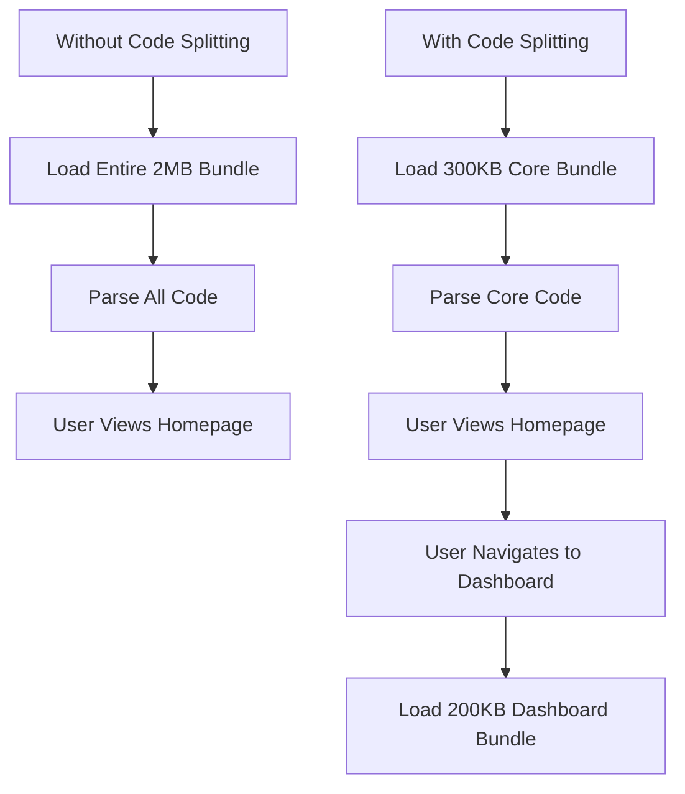

# React Code Splitting

## Introduction

When building React applications, especially larger ones, performance becomes a critical concern. As your application grows, so does your JavaScript bundle size. Sending a massive bundle to users when they only need a fraction of that code is inefficient and can lead to slow initial load times.

**Code splitting** is a technique that allows you to break down your application code into smaller chunks that can be loaded on-demand. Instead of loading your entire application at once, code splitting helps you "split" your code and load only what's necessary when it's necessary.

In this guide, we'll explore:
- Why code splitting matters
- Different approaches to code splitting in React 
- How to implement code splitting using React's built-in features
- Best practices and common patterns

## Why Code Splitting Matters

Before diving into the implementation, let's understand why code splitting is important:

1. **Faster Initial Load**: Users only download the code they need for the current view.
2. **Reduced Memory Usage**: The browser needs to parse and keep less JavaScript in memory.
3. **Better Resource Utilization**: Network bandwidth is used more efficiently.

Consider this comparison:



## Basic Code Splitting with Dynamic Imports

The most fundamental way to implement code splitting is through JavaScript's dynamic `import()` syntax, which is supported by most modern bundlers like webpack, Rollup, and Parcel.

### Before Code Splitting:

```jsx
import { expensiveFunction } from './heavyModule';

function App() {
  const handleClick = () => {
    const result = expensiveFunction();
    console.log(result);
  };
  
  return (
    <button onClick={handleClick}>
      Perform Heavy Calculation
    </button>
  );
}
```

### After Code Splitting:

```jsx
function App() {
  const handleClick = async () => {
    // This module will be loaded only when the button is clicked
    const heavyModule = await import('./heavyModule');
    const result = heavyModule.expensiveFunction();
    console.log(result);
  };
  
  return (
    <button onClick={handleClick}>
      Perform Heavy Calculation
    </button>
  );
}
```

In this example, `heavyModule.js` will be split into a separate chunk and only loaded when the user clicks the button.

## React.lazy and Suspense

React provides built-in support for code splitting through two features:

1. `React.lazy` - A function that lets you render a dynamic import as a regular component.
2. `Suspense` - A component that lets you display a fallback while waiting for code to load.

### Implementing Route-based Code Splitting

The most common use case for code splitting is on routes. Let's see how to implement this with React Router:

```jsx
import React, { Suspense, lazy } from 'react';
import { BrowserRouter as Router, Route, Routes } from 'react-router-dom';

// Regular import
import Navbar from './components/Navbar';

// Lazy-loaded components
const Home = lazy(() => import('./pages/Home'));
const About = lazy(() => import('./pages/About'));
const Dashboard = lazy(() => import('./pages/Dashboard'));

function App() {
  return (
    <Router>
      <Navbar />
      <Suspense fallback={<div>Loading...</div>}>
        <Routes>
          <Route path="/" element={<Home />} />
          <Route path="/about" element={<About />} />
          <Route path="/dashboard" element={<Dashboard />} />
        </Routes>
      </Suspense>
    </Router>
  );
}
```

In this example:
- Each page component is loaded only when its route is accessed
- The `Suspense` component shows a loading indicator while components are loading
- The `Navbar` component is always included in the main bundle because it's used on every page

## Component-Level Code Splitting

You're not limited to splitting code by routes. You can also split individual components that are:
- Large and complex
- Not immediately visible (below the fold)
- Only used in certain scenarios

### Example: Modal Dialog

```jsx
import React, { Suspense, lazy, useState } from 'react';

// The heavy modal component will only be loaded when needed
const HeavyModalDialog = lazy(() => import('./components/HeavyModalDialog'));

function App() {
  const [isModalOpen, setModalOpen] = useState(false);

  return (
    <div>
      <h1>My Application</h1>
      <button onClick={() => setModalOpen(true)}>Open Complex Modal</button>
      
      {isModalOpen && (
        <Suspense fallback={<div>Loading modal...</div>}>
          <HeavyModalDialog 
            onClose={() => setModalOpen(false)}
          />
        </Suspense>
      )}
    </div>
  );
}
```

Here, the modal dialog is only loaded when the user clicks to open it, which improves the initial load time.

## Advanced Patterns

### Preloading Components

Sometimes, you might want to start loading a component before the user actually needs it to make transitions feel faster:

```jsx
import React, { Suspense, lazy, useState } from 'react';

// Define the lazy component
const HeavyFeature = lazy(() => import('./components/HeavyFeature'));

// Create a preload function
const preloadHeavyFeature = () => import('./components/HeavyFeature');

function App() {
  const [showFeature, setShowFeature] = useState(false);
  
  return (
    <div>
      <button
        onMouseEnter={preloadHeavyFeature} // Preload on hover
        onClick={() => setShowFeature(true)}
      >
        Show Advanced Feature
      </button>
      
      {showFeature && (
        <Suspense fallback={<div>Loading feature...</div>}>
          <HeavyFeature />
        </Suspense>
      )}
    </div>
  );
}
```

By triggering the import on `mouseEnter`, we can start loading the component before the user actually clicks the button.

### Error Handling with Error Boundaries

When loading code dynamically, network errors can occur. React Error Boundaries can help catch and handle these errors gracefully:

```jsx
import React, { Suspense, lazy } from 'react';
import ErrorBoundary from './components/ErrorBoundary';

const LazyComponent = lazy(() => import('./components/LazyComponent'));

function MyComponent() {
  return (
    <ErrorBoundary fallback={<div>Failed to load component</div>}>
      <Suspense fallback={<div>Loading...</div>}>
        <LazyComponent />
      </Suspense>
    </ErrorBoundary>
  );
}
```

A simple ErrorBoundary component might look like this:

```jsx
class ErrorBoundary extends React.Component {
  constructor(props) {
    super(props);
    this.state = { hasError: false };
  }

  static getDerivedStateFromError(error) {
    return { hasError: true };
  }

  render() {
    if (this.state.hasError) {
      return this.props.fallback;
    }
    return this.props.children;
  }
}
```

### Named Exports with Dynamic Imports

When working with named exports, you need to adjust your code slightly:

```jsx
// Before code splitting (using named export)
import { SpecificComponent } from './components';

// After code splitting (with named export)
const ComponentContainer = lazy(() => 
  import('./components').then(module => ({ 
    default: module.SpecificComponent 
  }))
);
```

## Real-World Example: Dashboard Application

Let's see a more comprehensive example of a dashboard application that uses code splitting effectively:

```jsx
import React, { Suspense, lazy, useState } from 'react';
import { BrowserRouter, Routes, Route, Link } from 'react-router-dom';
import Loading from './components/Loading';
import ErrorBoundary from './components/ErrorBoundary';

// Always loaded
import Header from './components/Header';
import Sidebar from './components/Sidebar';

// Lazily loaded routes
const Dashboard = lazy(() => import('./pages/Dashboard'));
const Analytics = lazy(() => import('./pages/Analytics'));
const Settings = lazy(() => import('./pages/Settings'));

// Lazily loaded dashboard widgets
const RevenueWidget = lazy(() => import('./widgets/RevenueWidget'));
const UserStatsWidget = lazy(() => import('./widgets/UserStatsWidget'));
const ActivityWidget = lazy(() => import('./widgets/ActivityWidget'));

// Widget loader with error handling
const WidgetLoader = ({ children }) => (
  <div className="widget-container">
    <ErrorBoundary fallback={<div className="widget-error">Failed to load widget</div>}>
      <Suspense fallback={<div className="widget-loading">Loading widget...</div>}>
        {children}
      </Suspense>
    </ErrorBoundary>
  </div>
);

// Main Dashboard content
function DashboardContent() {
  return (
    <div className="dashboard-grid">
      <WidgetLoader>
        <RevenueWidget />
      </WidgetLoader>
      
      <WidgetLoader>
        <UserStatsWidget />
      </WidgetLoader>
      
      <WidgetLoader>
        <ActivityWidget />
      </WidgetLoader>
    </div>
  );
}

function App() {
  return (
    <BrowserRouter>
      <div className="app-container">
        <Header />
        <div className="content-wrapper">
          <Sidebar />
          <main>
            <ErrorBoundary fallback={<div>Something went wrong. Please refresh.</div>}>
              <Suspense fallback={<Loading />}>
                <Routes>
                  <Route path="/" element={<Dashboard />} />
                  <Route path="/analytics" element={<Analytics />} />
                  <Route path="/settings" element={<Settings />} />
                </Routes>
              </Suspense>
            </ErrorBoundary>
          </main>
        </div>
      </div>
    </BrowserRouter>
  );
}

export default App;
```

In this example:
1. The core layout components (Header, Sidebar) are always loaded
2. Each page is loaded only when its route is visited
3. Within the Dashboard, each widget is loaded independently
4. Error boundaries provide graceful fallbacks at different levels

## Best Practices

1. **Don't Over-Split**: Too many small chunks can actually hurt performance due to the overhead of additional requests.

2. **Analyze Your Bundle**: Use tools like [webpack-bundle-analyzer](https://github.com/webpack-contrib/webpack-bundle-analyzer) to visualize your bundle and identify code splitting opportunities.

3. **Strategic Splitting**: Split at logical boundaries such as:
   - Routes/pages
   - Large third-party libraries
   - Features used by only a subset of users
   - Below-the-fold content

4. **Loading Indicators**: Always provide meaningful loading states using Suspense.

5. **Error Handling**: Always wrap lazy-loaded components with error boundaries.

6. **Consider Preloading**: For critical components the user is likely to need soon.

## Common Challenges and Solutions

### Challenge: Flashing Loading States

**Problem**: Quick loading components might show a flash of loading state that looks jarring.

**Solution**: Implement a delay before showing loading indicators:

```jsx
function DelayedSuspense({ children, fallback, delay = 300 }) {
  const [showFallback, setShowFallback] = useState(false);
  
  useEffect(() => {
    const timer = setTimeout(() => {
      setShowFallback(true);
    }, delay);
    
    return () => clearTimeout(timer);
  }, [delay]);
  
  return (
    <Suspense fallback={showFallback ? fallback : null}>
      {children}
    </Suspense>
  );
}
```

### Challenge: Code Splitting with Server-Side Rendering

**Problem**: Code splitting gets complicated with server-side rendering (SSR).

**Solution**: Use loadable-components instead of React.lazy for SSR compatibility:

```jsx
// Using @loadable/component for SSR support
import loadable from '@loadable/component';

const Dashboard = loadable(() => import('./Dashboard'), {
  fallback: <div>Loading...</div>
});
```

## Summary

Code splitting is a powerful technique for improving React application performance. By breaking your bundle into smaller chunks that load on demand, you can significantly improve the initial load time and overall user experience of your application.

Key takeaways from this guide:

1. Use `React.lazy()` and `Suspense` for component-level code splitting
2. Implement route-based code splitting for multi-page applications
3. Consider component-level splitting for large, conditionally displayed components
4. Use error boundaries to handle loading failures gracefully
5. Consider preloading techniques for smoother user experiences
6. Analyze your bundles to make informed code splitting decisions

## Exercises

1. Take an existing React application and implement route-based code splitting.
2. Identify a large third-party library in your project and load it only when needed.
3. Create a modal or accordion component that lazily loads its content.
4. Implement preloading for a component that users are likely to need soon.
5. Use a bundle analyzer to identify code splitting opportunities in your application.

## Additional Resources

- [React Documentation on Code Splitting](https://reactjs.org/docs/code-splitting.html)
- [Webpack Code Splitting Guide](https://webpack.js.org/guides/code-splitting/)
- [loadable-components](https://loadable-components.com/) for advanced code splitting scenarios
- [preval.macro](https://github.com/kentcdodds/preval.macro) for evaluating code at build time
- [Performance Monitoring Tools](https://web.dev/vitals-tools/) to measure the impact of your optimizations

By implementing code splitting strategically in your React applications, you'll create faster, more efficient experiences that your users will appreciate.