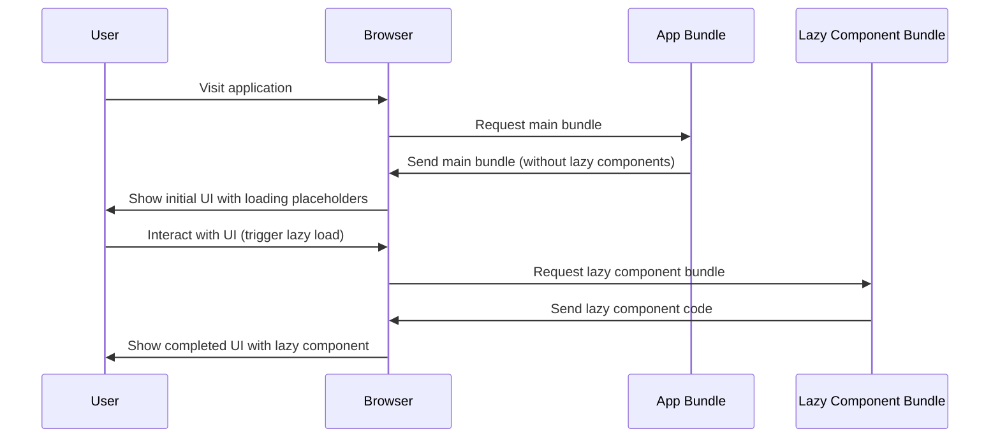

# React Lazy Loading

## Introduction

When building React applications, especially larger ones, you may notice that the initial load time can become slow as the bundle size increases. This happens because traditionally, all of your JavaScript code is bundled together and sent to the client at once, even if some parts aren't immediately needed.

React Lazy Loading is a technique that allows you to split your code into smaller chunks and load components only when they're actually needed. This approach significantly improves:

- Initial loading time
- Time-to-Interactive (TTI)
- Overall user experience
- Resource consumption

In this tutorial, we'll explore how to implement lazy loading in React, understand the underlying concepts, and see real-world examples of when and how to use it effectively.

## Understanding Code Splitting

Before diving into lazy loading, it's important to understand code splitting, which is the foundation that makes lazy loading possible.

Code splitting is the process of dividing your application bundle into smaller chunks that can be loaded on demand. Instead of loading your entire application at once, you load only what's necessary for the current view, and defer loading the rest until needed.

React provides built-in support for code splitting through:

1. `React.lazy()` function
2. `Suspense` component
3. Dynamic `import()` syntax (part of JavaScript, not specific to React)

## Basic Implementation of React Lazy Loading

Let's start with a simple example of how to implement lazy loading in React.

### Without Lazy Loading

Here's how you might typically import and use a component:

```jsx
import ExpensiveComponent from './ExpensiveComponent';

function App() {
  return (
    <div>
      <header>My App</header>
      <main>
        <ExpensiveComponent />
      </main>
    </div>
  );
}
```

### With Lazy Loading

Now, let's modify this to use lazy loading:

```jsx
import React, { Suspense } from 'react';
// Instead of direct import, we use React.lazy
const ExpensiveComponent = React.lazy(() => import('./ExpensiveComponent'));

function App() {
  return (
    <div>
      <header>My App</header>
      <main>
        <Suspense fallback={<div>Loading...</div>}>
          <ExpensiveComponent />
        </Suspense>
      </main>
    </div>
  );
}
```

Let's break down what's happening:

1. We import `Suspense` from React
2. We use `React.lazy()` to dynamically import the component
3. We wrap our lazy component with `Suspense` and provide a fallback UI to show while it's loading

When the application first renders, the code for `ExpensiveComponent` isn't included in the initial bundle. It's only when the component needs to be rendered that React triggers the loading of this component.

## The Suspense Component

The `Suspense` component is a crucial part of lazy loading in React. It lets you specify a fallback UI to show while components are loading.

Key points about `Suspense`:

- You can wrap multiple lazy components with a single `Suspense` component
- You can nest `Suspense` components to create different loading states for different parts of your UI
- The fallback prop accepts any React elements that you want to render during loading

```jsx
import React, { Suspense } from 'react';

const LazyComponent1 = React.lazy(() => import('./LazyComponent1'));
const LazyComponent2 = React.lazy(() => import('./LazyComponent2'));

function MyComponent() {
  return (
    <div>
      <Suspense fallback={<div>Loading components...</div>}>
        <LazyComponent1 />
        <LazyComponent2 />
      </Suspense>
    </div>
  );
}
```

## Error Handling with Error Boundaries

When lazy loading components, network issues or other errors might occur during the loading process. To handle these gracefully, React recommends using Error Boundaries:

```jsx
import React, { Suspense } from 'react';
import ErrorBoundary from './ErrorBoundary';

const LazyComponent = React.lazy(() => import('./LazyComponent'));

function MyComponent() {
  return (
    <div>
      <ErrorBoundary fallback={<p>Failed to load component</p>}>
        <Suspense fallback={<div>Loading...</div>}>
          <LazyComponent />
        </Suspense>
      </ErrorBoundary>
    </div>
  );
}
```

Here's a simple implementation of an `ErrorBoundary` component:

```jsx
import React from 'react';

class ErrorBoundary extends React.Component {
  constructor(props) {
    super(props);
    this.state = { hasError: false };
  }

  static getDerivedStateFromError(error) {
    return { hasError: true };
  }

  componentDidCatch(error, errorInfo) {
    // Log the error to an error reporting service
    console.log('Component error:', error, errorInfo);
  }

  render() {
    if (this.state.hasError) {
      return this.props.fallback || <h1>Something went wrong.</h1>;
    }

    return this.props.children;
  }
}

export default ErrorBoundary;
```

## Route-Based Code Splitting

One of the most common and effective ways to implement lazy loading is to do it at the route level. This approach ensures that each page of your application loads only the code it needs:

```jsx
import React, { Suspense } from 'react';
import { BrowserRouter as Router, Routes, Route } from 'react-router-dom';

// Regular import for components needed right away
import Navbar from './components/Navbar';

// Lazy load routes
const Home = React.lazy(() => import('./pages/Home'));
const About = React.lazy(() => import('./pages/About'));
const Dashboard = React.lazy(() => import('./pages/Dashboard'));
const Profile = React.lazy(() => import('./pages/Profile'));

function App() {
  return (
    <Router>
      <Navbar />
      <Suspense fallback={<div className="container">Loading page...</div>}>
        <Routes>
          <Route path="/" element={<Home />} />
          <Route path="/about" element={<About />} />
          <Route path="/dashboard" element={<Dashboard />} />
          <Route path="/profile" element={<Profile />} />
        </Routes>
      </Suspense>
    </Router>
  );
}
```

This setup ensures that each page's code is only loaded when a user navigates to that route.

## Component-Based Code Splitting

Another approach is to lazy load specific components within a page, especially those that:

- Are large or complex
- Are below the fold (not visible without scrolling)
- Are conditionally rendered
- Are not immediately needed by the user

Here's an example of conditionally loading a heavy chart component only when it's needed:

```jsx
import React, { Suspense, useState } from 'react';

const HeavyChart = React.lazy(() => import('./components/HeavyChart'));

function Dashboard() {
  const [showChart, setShowChart] = useState(false);
  
  return (
    <div className="dashboard">
      <h1>Dashboard</h1>
      
      <div className="quick-stats">
        {/* Always visible stats */}
        <div className="stat">Users: 1,245</div>
        <div className="stat">Revenue: $8,432</div>
      </div>
      
      {!showChart ? (
        <button onClick={() => setShowChart(true)}>
          Show Detailed Analytics
        </button>
      ) : (
        <Suspense fallback={<div>Loading chart...</div>}>
          <HeavyChart />
        </Suspense>
      )}
    </div>
  );
}
```

## Preloading Components

Sometimes, you might want to start loading a component before it's actually needed to improve perceived performance. This technique is called preloading.

For example, you might start loading a component when a user hovers over a button that will eventually show that component:

```jsx
import React, { Suspense, useState } from 'react';

// Define the lazy component
const HeavyModal = React.lazy(() => import('./components/HeavyModal'));

// Preload function
const preloadHeavyModal = () => {
  // This will trigger the import
  import('./components/HeavyModal');
};

function ProductPage() {
  const [showModal, setShowModal] = useState(false);
  
  return (
    <div className="product-page">
      <h1>Product Details</h1>
      
      <button
        onMouseEnter={preloadHeavyModal} // Preload on hover
        onClick={() => setShowModal(true)}
      >
        Show Specifications
      </button>
      
      {showModal && (
        <Suspense fallback={<div>Loading specifications...</div>}>
          <HeavyModal onClose={() => setShowModal(false)} />
        </Suspense>
      )}
    </div>
  );
}
```

## Dynamic Imports with Named Exports

Sometimes, your components might use named exports instead of default exports. Here's how you can lazy load these components:

```jsx
// Component with named export
// MyComponent.js
export const MyComponent = () => <div>My Component</div>;

// Lazy loading a named export
const MyLazyComponent = React.lazy(() => 
  import('./MyComponent').then(module => ({ 
    default: module.MyComponent 
  }))
);
```

## Measuring the Impact of Lazy Loading

To see the real benefits of lazy loading, it's important to measure the performance improvements. You can use tools like:

- Chrome DevTools Network tab to observe how chunks are loaded
- Lighthouse to measure performance metrics before and after implementing lazy loading
- React Developer Tools's Profiler to measure component rendering times

## Real-World Example: E-commerce Product Page

Let's put everything together in a more complex, real-world example of an e-commerce product page:

```jsx
import React, { Suspense, useState, useEffect } from 'react';
import ErrorBoundary from './ErrorBoundary';
import ProductBasicInfo from './components/ProductBasicInfo';

// Lazy loaded components
const ProductReviews = React.lazy(() => import('./components/ProductReviews'));
const SimilarProducts = React.lazy(() => import('./components/SimilarProducts'));
const ProductVideo = React.lazy(() => import('./components/ProductVideo'));
const SizeChart = React.lazy(() => import('./components/SizeChart'));

function ProductPage({ productId }) {
  const [product, setProduct] = useState(null);
  const [loading, setLoading] = useState(true);
  const [showSizeChart, setShowSizeChart] = useState(false);
  const [activeTab, setActiveTab] = useState('description');
  
  // Fetch basic product data
  useEffect(() => {
    fetch(`/api/products/${productId}`)
      .then(res => res.json())
      .then(data => {
        setProduct(data);
        setLoading(false);
      });
  }, [productId]);
  
  // Preload reviews when user gets close to that section
  const preloadReviews = () => {
    import('./components/ProductReviews');
  };
  
  if (loading) return <div>Loading product...</div>;
  if (!product) return <div>Product not found</div>;
  
  return (
    <div className="product-page">
      <ProductBasicInfo product={product} />
      
      <button onClick={() => setShowSizeChart(true)}>
        View Size Chart
      </button>
      
      {showSizeChart && (
        <ErrorBoundary fallback={<p>Failed to load size chart</p>}>
          <Suspense fallback={<div>Loading size chart...</div>}>
            <SizeChart 
              onClose={() => setShowSizeChart(false)}
              category={product.category}
            />
          </Suspense>
        </ErrorBoundary>
      )}
      
      <div className="product-tabs">
        <div className="tab-buttons">
          <button 
            className={activeTab === 'description' ? 'active' : ''}
            onClick={() => setActiveTab('description')}
          >
            Description
          </button>
          <button 
            className={activeTab === 'video' ? 'active' : ''}
            onClick={() => setActiveTab('video')}
          >
            Product Video
          </button>
          <button 
            className={activeTab === 'reviews' ? 'active' : ''}
            onClick={() => setActiveTab('reviews')}
            onMouseEnter={preloadReviews}
          >
            Reviews ({product.reviewCount})
          </button>
        </div>
        
        <div className="tab-content">
          {activeTab === 'description' && (
            <div dangerouslySetInnerHTML={{ __html: product.description }} />
          )}
          
          {activeTab === 'video' && (
            <ErrorBoundary fallback={<p>Failed to load video</p>}>
              <Suspense fallback={<div>Loading video...</div>}>
                <ProductVideo videoId={product.videoId} />
              </Suspense>
            </ErrorBoundary>
          )}
          
          {activeTab === 'reviews' && (
            <ErrorBoundary fallback={<p>Failed to load reviews</p>}>
              <Suspense fallback={<div>Loading reviews...</div>}>
                <ProductReviews productId={productId} />
              </Suspense>
            </ErrorBoundary>
          )}
        </div>
      </div>
      
      <div 
        className="similar-products-section"
        onMouseEnter={() => import('./components/SimilarProducts')}
      >
        <h3>You Might Also Like</h3>
        <ErrorBoundary fallback={<p>Failed to load recommendations</p>}>
          <Suspense fallback={<div>Loading recommendations...</div>}>
            <SimilarProducts 
              categoryId={product.categoryId}
              currentProductId={productId} 
            />
          </Suspense>
        </ErrorBoundary>
      </div>
    </div>
  );
}

export default ProductPage;
```

This example demonstrates several lazy loading strategies:
- Modal content (size chart) is loaded only when opened
- Tab content is loaded only when the tab is selected
- Similar products section begins loading when the user hovers near it
- Reviews are preloaded when the user hovers over the tab
- Everything is wrapped in error boundaries for graceful error handling

## Best Practices for Lazy Loading

To get the most benefit from lazy loading, consider these best practices:

1. **Analyze your bundle**: Use tools like `source-map-explorer` or Webpack Bundle Analyzer to identify large components that are good candidates for lazy loading.

2. **Choose the right granularity**: Don't lazy load components that are too small, as the overhead might outweigh the benefits.

3. **Consider the user's journey**: Lazy load components that aren't needed for the initial render but might be needed soon after.

4. **Use preloading strategically**: Preload components when you have high confidence they'll be needed soon.

5. **Provide meaningful loading states**: Make your loading fallbacks informative and try to match the size/shape of the component being loaded to minimize layout shifts.

6. **Always use Error Boundaries**: Network failures happen, so make sure to handle them gracefully.

7. **Test on slow connections**: Use Chrome DevTools to simulate slow network conditions to ensure your loading states provide a good user experience.

## Limitations and Considerations

While lazy loading is powerful, it's important to understand its limitations:

1. **Initial delay**: The first time a lazy component loads, there might be a noticeable delay.

2. **Network dependency**: Lazy loading requires additional network requests, which could fail.

3. **Server-Side Rendering**: React.lazy doesn't support server-side rendering out of the box. For SSR apps, consider using libraries like Loadable Components.

4. **Avoid excessive splitting**: Too many small chunks can actually hurt performance due to the overhead of multiple requests.

## Flow Diagram of Lazy Loading

Here's a visual representation of how lazy loading works in React:



## Summary

React Lazy Loading is a powerful technique for improving application performance by only loading code when it's needed. We've covered:

- The basics of code splitting and lazy loading
- Using `React.lazy()` and `Suspense`
- Error handling with Error Boundaries
- Route-based and component-based code splitting
- Preloading strategies
- Real-world implementation examples
- Best practices and considerations

By implementing lazy loading in your React applications, you can significantly improve initial load time and overall performance, especially for larger applications with many complex components.

## Additional Resources and Exercises

### Resources
- [React Documentation on Code Splitting](https://reactjs.org/docs/code-splitting.html)
- [Web.dev Guide on Code Splitting](https://web.dev/code-splitting-suspense/)
- [MDN Documentation on Dynamic Imports](https://developer.mozilla.org/en-US/docs/Web/JavaScript/Reference/Statements/import#dynamic_imports)

### Exercises

1. **Basic Implementation**: Add lazy loading to an existing React application for at least one component.

2. **Route-Based Splitting**: Convert an application to use lazy loading for each route.

3. **Performance Testing**: Measure the bundle size and load time before and after implementing lazy loading.

4. **Preloading Strategy**: Implement a preloading strategy for a wizard or multi-step form where you preload the next step.

5. **Advanced Challenge**: Create a component library that lazy loads components but also provides a way to preload all components at once for users on fast connections.

By mastering React Lazy Loading, you'll be able to create more performant and user-friendly applications that load quickly and efficiently utilize system resources.