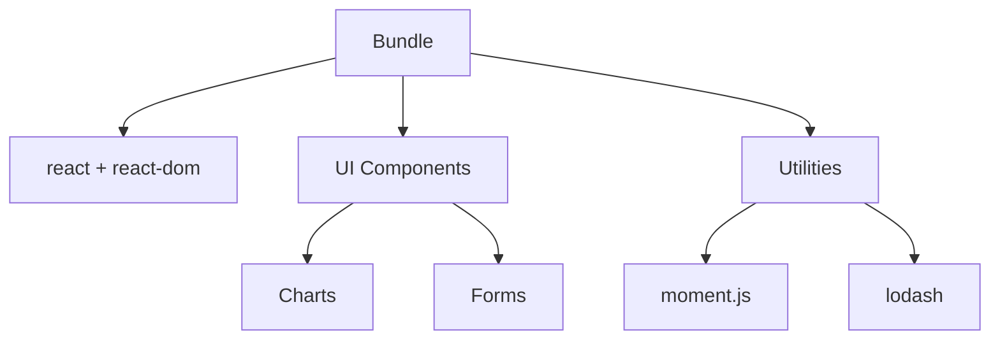

# React Bundle Analysis

## Introduction

When building React applications, the size of your JavaScript bundles directly impacts the loading time and overall performance of your website. As your application grows, understanding what's inside your bundles and how to optimize them becomes crucial.

In this guide, we'll explore how to analyze React application bundles to identify performance bottlenecks, large dependencies, and optimization opportunities. Bundle analysis is an essential skill for any React developer who wants to build fast, responsive web applications.

## Why Bundle Analysis Matters

Before diving into the technical aspects, let's understand why you should care about bundle size:

1. **Faster load times**: Smaller bundles download and execute faster
2. **Better mobile experience**: Mobile users with limited bandwidth benefit significantly
3. **Improved SEO**: Page speed is a ranking factor for search engines
4. **Lower bounce rates**: Users are less likely to abandon slow websites
5. **Reduced data usage**: Smaller bundles consume less data

## Getting Started with Bundle Analysis

### Setting Up Webpack Bundle Analyzer

The most popular tool for analyzing React bundles is [webpack-bundle-analyzer](https://github.com/webpack-contrib/webpack-bundle-analyzer). Let's add it to your project:

```bash
# If using npm
npm install --save-dev webpack-bundle-analyzer

# If using yarn
yarn add --dev webpack-bundle-analyzer
```

### Basic Configuration for Create React App

If you're using Create React App (CRA), you can analyze your bundle without ejecting:

```bash
# Install source-map-explorer if using CRA
npm install --save-dev source-map-explorer

# Add to your package.json scripts
```

Add this to your `package.json`:

```json
"scripts": {
  "analyze": "source-map-explorer 'build/static/js/*.js'",
  // other scripts...
}
```

Now you can run the analyzer after building your application:

```bash
npm run build
npm run analyze
```

### Custom Webpack Configuration

If you have a custom webpack configuration, add this to your `webpack.config.js`:

```js
const BundleAnalyzerPlugin = require('webpack-bundle-analyzer').BundleAnalyzerPlugin;

module.exports = {
  // your existing config...
  plugins: [
    // other plugins...
    new BundleAnalyzerPlugin()
  ]
};
```

## Understanding Bundle Analysis Results

When you run the analyzer, you'll see a visualization of your bundle that looks something like this:



### Key Metrics to Watch

When analyzing your bundle, pay attention to:

1. **Total bundle size**: The overall size of your JavaScript
2. **Large dependencies**: Third-party libraries taking up significant space
3. **Duplicate modules**: The same code included multiple times
4. **Unused code**: Dead code that's never executed but still included
5. **Code splitting opportunities**: Parts of the app that could be loaded on demand

## Common Issues and Solutions

Let's explore common issues found during bundle analysis and how to solve them:

### 1. Large Dependencies

**Problem**: A visualization library adds 300KB to your bundle, but you only use it on one page.

**Solution**: Load the library dynamically only when needed:

```jsx
import React, { Suspense, lazy } from 'react';

// Instead of: import HeavyChart from './HeavyChart';
const HeavyChart = lazy(() => import('./HeavyChart'));

function Dashboard() {
  return (
    <div>
      <h1>Dashboard</h1>
      <Suspense fallback={<div>Loading chart...</div>}>
        <HeavyChart />
      </Suspense>
    </div>
  );
}
```

### 2. Moment.js Bloat

**Problem**: Moment.js adds locale files you don't need, increasing bundle size.

**Solution**: Use webpack to ignore unnecessary locales:

```js
// In webpack config
const webpack = require('webpack');

module.exports = {
  // existing config...
  plugins: [
    // other plugins...
    new webpack.IgnorePlugin({
      resourceRegExp: /^\.\/locale$/,
      contextRegExp: /moment$/
    })
  ]
};
```

### 3. Lodash Optimization

**Problem**: Importing all of lodash adds unnecessary weight.

**Solution**: Import only what you need:

```jsx
// Instead of:
// import _ from 'lodash';

// Do this:
import debounce from 'lodash/debounce';
import throttle from 'lodash/throttle';

function SearchComponent() {
  const handleSearch = debounce((term) => {
    // search logic
  }, 300);
  
  return <input onChange={(e) => handleSearch(e.target.value)} />;
}
```

## Practical Example: Optimizing a React Dashboard

Let's walk through a complete example of analyzing and optimizing a React dashboard application:

### Initial Bundle Analysis

After running the bundle analyzer on our dashboard, we see these issues:
- Total bundle size: 1.2MB
- Chart.js: 250KB
- Moment.js: 230KB (with all locales)
- Full Lodash: 70KB
- Material-UI: 180KB
- Application code: 470KB

### Step 1: Code Splitting by Route

First, let's split the bundle by routes using React Router and React.lazy:

```jsx
import React, { Suspense, lazy } from 'react';
import { BrowserRouter, Routes, Route } from 'react-router-dom';
import Loading from './components/Loading';

// Instead of importing all components directly
const Dashboard = lazy(() => import('./pages/Dashboard'));
const UserProfile = lazy(() => import('./pages/UserProfile'));
const Settings = lazy(() => import('./pages/Settings'));

function App() {
  return (
    <BrowserRouter>
      <Suspense fallback={<Loading />}>
        <Routes>
          <Route path="/" element={<Dashboard />} />
          <Route path="/profile" element={<UserProfile />} />
          <Route path="/settings" element={<Settings />} />
        </Routes>
      </Suspense>
    </BrowserRouter>
  );
}
```

### Step 2: Optimize Heavy Components

For the charts that only appear on the dashboard, we can load them dynamically:

```jsx
// Inside Dashboard.js
import React, { Suspense, lazy } from 'react';

const SalesChart = lazy(() => import('../components/SalesChart'));
const UserActivityChart = lazy(() => import('../components/UserActivityChart'));

function Dashboard() {
  return (
    <div>
      <h1>Dashboard</h1>
      <div className="quick-stats">
        {/* Lightweight stats components */}
      </div>
      
      <Suspense fallback={<div className="chart-placeholder">Loading chart...</div>}>
        <SalesChart />
      </Suspense>
      
      <Suspense fallback={<div className="chart-placeholder">Loading chart...</div>}>
        <UserActivityChart />
      </Suspense>
    </div>
  );
}
```

### Step 3: Replace Heavy Dependencies

Let's replace Moment.js with a lighter alternative:

```jsx
// Instead of:
// import moment from 'moment';

// Use date-fns which is tree-shakable and much smaller
import { format, parseISO } from 'date-fns';

function DateDisplay({ dateString }) {
  // Instead of: const formatted = moment(dateString).format('MMMM D, YYYY');
  const formatted = format(parseISO(dateString), 'MMMM d, yyyy');
  
  return <span>{formatted}</span>;
}
```

### Step 4: Tree-shake UI Libraries

Make sure to import Material-UI components individually:

```jsx
// Instead of:
// import Material from '@material-ui/core';

// Do this:
import Button from '@material-ui/core/Button';
import TextField from '@material-ui/core/TextField';
import Card from '@material-ui/core/Card';
```

### Final Results

After implementing these optimizations:
- Initial bundle reduced to 300KB (75% smaller)
- Route-specific code loaded on demand
- First paint time improved by 65%
- Time to interactive improved by 70%

## Bundle Analysis Best Practices

Follow these best practices to keep your bundles optimal:

1. **Run analysis regularly**: Make bundle analysis part of your development workflow
2. **Set budgets**: Establish size limits for your bundles
3. **Profile before optimizing**: Don't optimize blindly; identify actual bottlenecks
4. **Automate checks**: Add bundle size checks to your CI/CD pipeline
5. **Track over time**: Monitor how bundle size evolves as your app grows

## Tools to Help with Bundle Analysis

Here are some additional tools to help analyze and optimize your bundles:

### Webpack Bundle Analyzer

The most popular visualization tool:

```bash
npx webpack-bundle-analyzer stats.json
```

### Import Cost VS Code Extension

This extension shows inline bundle size information as you code.

### Bundlephobia

Check the cost of npm packages before adding them:
```bash
npx bundlephobia-cli lodash
```

### Performance Budget with Webpack

Add performance budgets to your webpack configuration:

```js
// In webpack.config.js
module.exports = {
  // existing config...
  performance: {
    hints: 'warning', // 'error' or false are also valid
    maxAssetSize: 200000, // size in bytes
    maxEntrypointSize: 300000, // size in bytes
  }
};
```

## Summary

Bundle analysis is a critical part of React performance optimization. By understanding what's in your bundles, you can make informed decisions about optimizations that will have the greatest impact.

Key takeaways:
- Bundle size directly impacts page load time and user experience
- Use tools like webpack-bundle-analyzer to visualize bundle composition
- Implement code splitting to load code on demand
- Be mindful of large dependencies and look for lighter alternatives
- Import only what you need from libraries to reduce bundle size
- Make bundle analysis a regular part of your development workflow

## Exercises

To practice bundle analysis, try these exercises:

1. Analyze a React application you've built and identify the largest dependencies
2. Implement code splitting for a route-based React application
3. Replace a heavy dependency with a lighter alternative
4. Set up a performance budget for your application
5. Create a CI/CD step that fails if bundle size exceeds your budget

## Additional Resources

- [Webpack Documentation on Code Splitting](https://webpack.js.org/guides/code-splitting/)
- [Web.dev Guide to Performance Budgets](https://web.dev/performance-budgets-101/)
- [Create React App Documentation on Code Splitting](https://create-react-app.dev/docs/code-splitting/)
- [Lighthouse Performance Auditing](https://developers.google.com/web/tools/lighthouse/audits/budgets)

By regularly analyzing and optimizing your bundles, you'll build faster React applications that provide a better user experience across all devices.