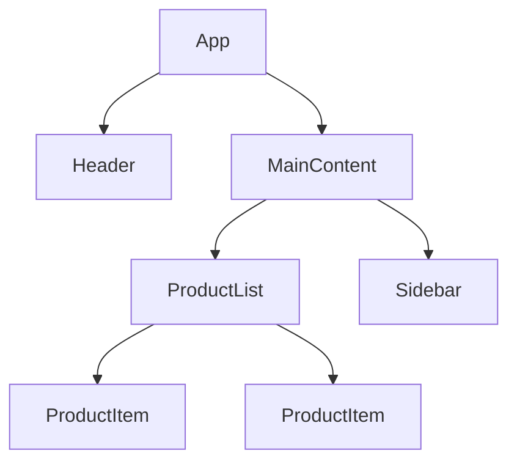

# React Performance Profiling

Performance optimization is a critical aspect of building React applications that provide great user experiences. Before you can optimize your application, you need to identify where the performance issues exist. This is where performance profiling comes into play.

## Introduction to React Performance Profiling

Performance profiling is the process of measuring and analyzing your application's behavior to identify bottlenecks and inefficiencies. In React applications, this typically involves monitoring component rendering, identifying unnecessary re-renders, and optimizing state updates.

React provides built-in tools for performance profiling, and there are also third-party solutions that can help you gain deeper insights into your application's performance.

## Why Profile Your React Application?

- **Identify performance bottlenecks**: Find the specific components or operations causing slowdowns
- **Measure improvement**: Quantify the impact of your optimization efforts
- **Validate optimization decisions**: Ensure that your performance-related changes actually improve the user experience
- **Prevent performance regressions**: Detect when new changes negatively impact performance

## React DevTools Profiler

The React DevTools Profiler is an official tool created by the React team to help developers analyze the performance of their React applications.

### Setting up React DevTools

1. Install the React DevTools extension for [Chrome](https://chrome.google.com/webstore/detail/react-developer-tools/fmkadmapgofadopljbjfkapdkoienihi) or [Firefox](https://addons.mozilla.org/en-US/firefox/addon/react-devtools/)
2. Open your application in the browser
3. Open developer tools (F12 or right-click and select "Inspect")
4. Navigate to the "Profiler" tab in the React DevTools

### Recording a Profiling Session

To record a profiling session using React DevTools:

```jsx
// No specific code required to enable profiling with DevTools
// Just ensure you're not using the production build of React
// as DevTools Profiler requires the development build
```

1. Click the "Record" button in the Profiler tab
2. Perform the actions you want to profile in your application
3. Click "Stop" to end the recording

### Understanding the Flame Graph

After recording, you'll see a flame graph visualization:



In this visualization:
- Each bar represents a component render
- The width of the bar indicates how long it took to render
- Yellow and red components took longer to render
- Grey components rendered quickly

### Analyzing Component Renders

The Profiler shows you:

1. **Render durations**: How long each component took to render
2. **Commit information**: Details about what triggered the render
3. **Component interaction**: Which components rendered as a result of state updates

Here's how to interpret the data:

```jsx
// Example of a component that might be identified as slow
function SlowComponent({ data }) {
  // This expensive calculation runs on every render
  const processedData = data.map(item => {
    // Complex processing that could be memoized
    return expensiveCalculation(item);
  });
  
  return (
    <div>
      {processedData.map(item => (
        <div key={item.id}>{item.name}</div>
      ))}
    </div>
  );
}

// Optimized version using memoization
function OptimizedComponent({ data }) {
  // memoized calculation only runs when data changes
  const processedData = useMemo(() => {
    return data.map(item => expensiveCalculation(item));
  }, [data]);
  
  return (
    <div>
      {processedData.map(item => (
        <div key={item.id}>{item.name}</div>
      ))}
    </div>
  );
}
```

### Ranked Chart

The React DevTools Profiler also provides a "Ranked" view that sorts components by render time, making it easy to identify the most expensive components in your application.

## Using the Performance Tab in Chrome DevTools

While React DevTools focuses on component rendering, Chrome's Performance tab gives you a broader view of your application's performance, including JavaScript execution, layout, painting, and more.

### Recording a Performance Profile

1. Open Chrome DevTools (F12)
2. Navigate to the "Performance" tab
3. Click "Record"
4. Perform the actions you want to profile
5. Click "Stop" to end recording

### Analyzing JavaScript Execution

In the Performance tab, you can find:

- **Main thread activity**: Shows JavaScript execution, rendering, and layout operations
- **Call tree**: Hierarchical view of where time is spent in your code
- **Bottom-up view**: Functions sorted by total time consumption

This helps identify expensive JavaScript operations that might be slowing down your React components.

## Using the React Profiler API

React provides a programmatic Profiler component that lets you measure rendering performance within your application code.

```jsx
import React, { Profiler } from 'react';

function onRenderCallback(
  id, // the "id" prop of the Profiler tree
  phase, // either "mount" or "update"
  actualDuration, // time spent rendering the committed update
  baseDuration, // estimated time to render the entire subtree
  startTime, // when React began rendering this update
  commitTime, // when React committed this update
  interactions // the Set of interactions belonging to this update
) {
  console.log(`Component ${id} took ${actualDuration}ms to render`);
}

function MyApp() {
  return (
    <Profiler id="Application" onRender={onRenderCallback}>
      <App />
    </Profiler>
  );
}
```

This approach allows you to:
1. Collect performance data in specific parts of your application
2. Store performance metrics for later analysis
3. Conditionally enable profiling in development environments

## Practical Example: Profiling and Optimizing a Product List

Let's walk through a real-world example of profiling and optimizing a product list component:

### Step 1: Identify the Issue

```jsx
function ProductList({ products, category }) {
  // Filter products by category on every render
  const filteredProducts = products.filter(
    product => product.category === category
  );

  return (
    <div className="product-list">
      {filteredProducts.map(product => (
        <ProductItem 
          key={product.id} 
          product={product} 
          onAddToCart={() => console.log(`Added ${product.name} to cart`)}
        />
      ))}
    </div>
  );
}

function ProductItem({ product, onAddToCart }) {
  return (
    <div className="product-item">
      <h3>{product.name}</h3>
      <p>${product.price}</p>
      <button onClick={onAddToCart}>Add to Cart</button>
    </div>
  );
}
```

### Step 2: Profile the Component

Using the React DevTools Profiler, we can see that:
1. `ProductList` re-renders frequently
2. The filtering operation runs on every render
3. `ProductItem` components re-render even when they don't change

### Step 3: Optimize the Component

```jsx
import React, { useMemo, useCallback } from 'react';

function ProductList({ products, category }) {
  // Memoize filtered products
  const filteredProducts = useMemo(() => {
    return products.filter(product => product.category === category);
  }, [products, category]);

  return (
    <div className="product-list">
      {filteredProducts.map(product => (
        <MemoizedProductItem 
          key={product.id} 
          product={product} 
          onAddToCart={useCallback(
            () => console.log(`Added ${product.name} to cart`),
            [product.name]
          )}
        />
      ))}
    </div>
  );
}

// Memoize the ProductItem component
const MemoizedProductItem = React.memo(function ProductItem({ product, onAddToCart }) {
  return (
    <div className="product-item">
      <h3>{product.name}</h3>
      <p>${product.price}</p>
      <button onClick={onAddToCart}>Add to Cart</button>
    </div>
  );
});
```

### Step 4: Re-Profile and Compare

After applying these optimizations, we can record another profile to confirm that:
1. `ProductList` only re-filters products when products or category changes
2. Individual `ProductItem` components don't re-render unnecessarily

## Common Performance Issues and How to Identify Them

| Issue | Symptoms in Profile | Solution |
|-------|-------------------|----------|
| Unnecessary re-renders | Components constantly appearing in profiles | Use `React.memo`, `useMemo`, or `useCallback` |
| Expensive calculations | Long yellow/red bars for specific components | Memoize calculations with `useMemo` |
| Render blocking operations | Long "Script" sections in Performance tab | Move work to useEffect or Web Workers |
| Large component trees | Many tiny renders adding up to significant time | Consider component splitting and virtualization |

## When to Use Different Profiling Tools

- **React DevTools Profiler**: For component-specific performance issues, understanding render patterns
- **Chrome Performance Tab**: For overall application performance, including JavaScript, rendering, and layout
- **React Profiler API**: For programmatic performance tracking in specific sections of your app
- **Lighthouse**: For overall performance audits and recommendations

## Summary

Performance profiling is an essential skill for React developers who want to build high-quality, responsive applications. By using the tools we've discussed:

1. React DevTools Profiler for component rendering analysis
2. Chrome Performance tab for overall application profiling
3. React Profiler API for programmatic performance measurement

You can identify and resolve performance bottlenecks in your React applications.

Remember that performance optimization should be data-driven. Always profile before optimizing, and measure the impact of your changes to ensure they're providing real benefits to your users.

## Additional Resources

- [React DevTools Documentation](https://reactjs.org/blog/2019/08/15/new-react-devtools.html)
- [Chrome DevTools Performance Documentation](https://developers.google.com/web/tools/chrome-devtools/evaluate-performance)
- [React's Profiler API Documentation](https://reactjs.org/docs/profiler.html)

## Exercises

1. Profile a simple React application and identify components that render unnecessarily.
2. Use the Chrome Performance tab to analyze JavaScript execution in a React application.
3. Implement the Profiler API in a React application to log render times for specific components.
4. Profile an application before and after applying memoization techniques, and compare the results.
5. Create a component with an expensive calculation, profile it, optimize it with useMemo, and profile it again to see the difference.