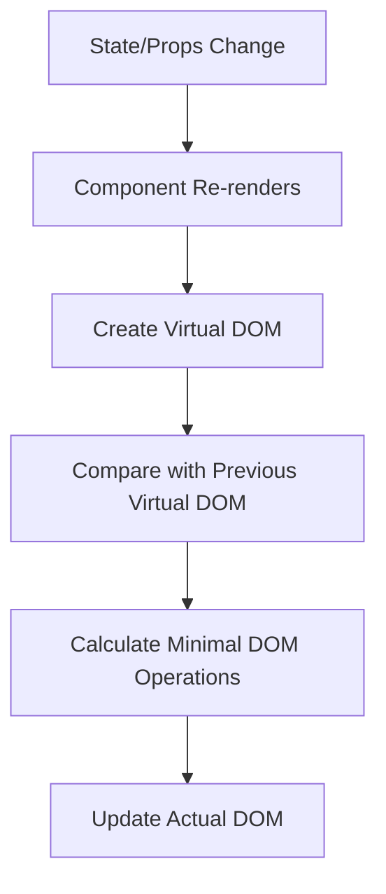

# React Rendering Optimization

React's virtual DOM and rendering mechanism make it efficient by default, but as applications grow in complexity, performance issues can emerge. This guide explores how React's rendering process works and provides practical techniques to optimize your components for better performance.

## Understanding React's Rendering Process

Before diving into optimization techniques, it's important to understand how React renders components.

### The Render Phase

When React renders a component:

1. It calls your component function/class
2. It creates a virtual representation of the UI (Virtual DOM)
3. It compares this with the previous version (diffing)
4. It updates only the necessary parts of the actual DOM



The problem arises when components re-render unnecessarily, affecting performance. Let's explore how to identify and fix these issues.

## Identifying Unnecessary Re-renders

React components re-render when:
- Their state changes
- Their props change (or parent re-renders and passes new props)
- Their context changes
- Their parent component re-renders

A common issue is when child components re-render even when they don't need to:

```jsx
function ParentComponent() {
  const [count, setCount] = useState(0);
  
  // This function is recreated on every render
  const handleClick = () => {
    console.log('Clicked!');
  };
  
  return (
    <div>
      <h1>Count: {count}</h1>
      <button onClick={() => setCount(count + 1)}>Increment</button>
      
      {/* ChildComponent re-renders on every count change even though its props haven't changed */}
      <ChildComponent onClick={handleClick} />
    </div>
  );
}

function ChildComponent({ onClick }) {
  console.log('Child rendered!');
  return <button onClick={onClick}>Click me</button>;
}
```

## Key Optimization Techniques

### 1. React.memo for Functional Components

`React.memo` is a higher-order component that memoizes your component, preventing re-renders if props haven't changed.

```jsx
// Before optimization
function MovieCard({ title, rating, onFavorite }) {
  console.log(`Rendering: ${title}`);
  return (
    <div className="movie-card">
      <h3>{title}</h3>
      <p>Rating: {rating}/10</p>
      <button onClick={onFavorite}>Add to Favorites</button>
    </div>
  );
}

// After optimization with React.memo
const MovieCard = React.memo(function MovieCard({ title, rating, onFavorite }) {
  console.log(`Rendering: ${title}`);
  return (
    <div className="movie-card">
      <h3>{title}</h3>
      <p>Rating: {rating}/10</p>
      <button onClick={onFavorite}>Add to Favorites</button>
    </div>
  );
});
```

Now, `MovieCard` will only re-render if its props change.

### 2. Custom Comparison Functions with React.memo

Sometimes you need more control over when components should re-render:

```jsx
const MovieCard = React.memo(
  function MovieCard({ title, rating, metadata }) {
    console.log(`Rendering: ${title}`);
    return (
      <div className="movie-card">
        <h3>{title}</h3>
        <p>Rating: {rating}/10</p>
        <p>Release Year: {metadata.year}</p>
      </div>
    );
  },
  // Custom comparison function
  (prevProps, nextProps) => {
    // Only re-render if title or rating change
    // Ignores changes to deep metadata object
    return prevProps.title === nextProps.title && 
           prevProps.rating === nextProps.rating;
  }
);
```

### 3. useMemo for Expensive Calculations

The `useMemo` hook helps you memoize expensive calculations to prevent recalculating on every render:

```jsx
function ProductList({ products, filter }) {
  // Without useMemo - expensive calculation runs on every render
  // const filteredProducts = products.filter(product => 
  //   product.name.includes(filter) || product.category.includes(filter)
  // );
  
  // With useMemo - calculation only runs when products or filter changes
  const filteredProducts = useMemo(() => {
    console.log("Filtering products...");
    return products.filter(product => 
      product.name.includes(filter) || product.category.includes(filter)
    );
  }, [products, filter]);
  
  return (
    <ul>
      {filteredProducts.map(product => (
        <li key={product.id}>{product.name} - ${product.price}</li>
      ))}
    </ul>
  );
}
```

### 4. useCallback for Memoizing Functions

`useCallback` memoizes functions to prevent unnecessary re-renders of child components:

```jsx
function TodoList() {
  const [todos, setTodos] = useState([]);
  const [newTodo, setNewTodo] = useState('');
  
  // Without useCallback - handleDelete recreated on every render
  // const handleDelete = (id) => {
  //   setTodos(todos.filter(todo => todo.id !== id));
  // };
  
  // With useCallback - function reference remains stable
  const handleDelete = useCallback((id) => {
    setTodos(prevTodos => prevTodos.filter(todo => todo.id !== id));
  }, []);
  
  const handleAdd = () => {
    if (newTodo.trim()) {
      setTodos([...todos, { id: Date.now(), text: newTodo }]);
      setNewTodo('');
    }
  };
  
  return (
    <div>
      <input 
        value={newTodo} 
        onChange={(e) => setNewTodo(e.target.value)} 
      />
      <button onClick={handleAdd}>Add</button>
      <ul>
        {todos.map(todo => (
          <TodoItem 
            key={todo.id} 
            todo={todo} 
            onDelete={handleDelete} // Stable reference with useCallback
          />
        ))}
      </ul>
    </div>
  );
}

// Optimize TodoItem with React.memo
const TodoItem = React.memo(function TodoItem({ todo, onDelete }) {
  console.log(`Rendering todo: ${todo.text}`);
  return (
    <li>
      {todo.text}
      <button onClick={() => onDelete(todo.id)}>Delete</button>
    </li>
  );
});
```

### 5. Using the React DevTools Profiler

React DevTools Profiler helps identify components that render unnecessarily:

1. Record a rendering session
2. Identify components that rendered
3. Look for components rendering when they shouldn't
4. Apply optimizations where needed

## Real-world Application: Optimizing a Dashboard

Let's apply these techniques to a dashboard with multiple components:

```jsx
import React, { useState, useMemo, useCallback } from 'react';

// Main Dashboard component
function Dashboard({ userData }) {
  const [activeTab, setActiveTab] = useState('overview');
  const [refreshCount, setRefreshCount] = useState(0);
  
  // User stats - expensive calculation
  const userStats = useMemo(() => {
    console.log("Calculating user statistics...");
    return {
      totalPurchases: userData.purchases.length,
      totalSpent: userData.purchases.reduce((sum, p) => sum + p.amount, 0),
      averageSpent: userData.purchases.length 
        ? userData.purchases.reduce((sum, p) => sum + p.amount, 0) / userData.purchases.length 
        : 0
    };
  }, [userData.purchases]);
  
  // Memoized handler for refresh action
  const handleRefresh = useCallback(() => {
    setRefreshCount(count => count + 1);
    console.log("Dashboard refreshed");
  }, []);
  
  return (
    <div className="dashboard">
      <header>
        <h1>User Dashboard</h1>
        <RefreshButton onRefresh={handleRefresh} count={refreshCount} />
      </header>
      
      <TabNavigation 
        activeTab={activeTab} 
        onChange={setActiveTab} 
      />
      
      {activeTab === 'overview' && (
        <OverviewPanel 
          username={userData.name} 
          stats={userStats} 
        />
      )}
      
      {activeTab === 'activity' && (
        <ActivityFeed 
          activities={userData.activities} 
        />
      )}
      
      {activeTab === 'settings' && <SettingsPanel />}
    </div>
  );
}

// Optimized child components
const RefreshButton = React.memo(function RefreshButton({ onRefresh, count }) {
  console.log("Rendering RefreshButton");
  return (
    <button onClick={onRefresh}>
      Refresh Dashboard ({count})
    </button>
  );
});

const TabNavigation = React.memo(function TabNavigation({ activeTab, onChange }) {
  console.log("Rendering TabNavigation");
  return (
    <div className="tabs">
      <button 
        className={activeTab === 'overview' ? 'active' : ''} 
        onClick={() => onChange('overview')}
      >
        Overview
      </button>
      <button 
        className={activeTab === 'activity' ? 'active' : ''} 
        onClick={() => onChange('activity')}
      >
        Activity
      </button>
      <button 
        className={activeTab === 'settings' ? 'active' : ''} 
        onClick={() => onChange('settings')}
      >
        Settings
      </button>
    </div>
  );
});

const OverviewPanel = React.memo(function OverviewPanel({ username, stats }) {
  console.log("Rendering OverviewPanel");
  return (
    <div className="panel">
      <h2>Welcome back, {username}!</h2>
      <div className="stats">
        <div className="stat-card">
          <h3>Total Purchases</h3>
          <p>{stats.totalPurchases}</p>
        </div>
        <div className="stat-card">
          <h3>Total Spent</h3>
          <p>${stats.totalSpent.toFixed(2)}</p>
        </div>
        <div className="stat-card">
          <h3>Average Order</h3>
          <p>${stats.averageSpent.toFixed(2)}</p>
        </div>
      </div>
    </div>
  );
});

const ActivityFeed = React.memo(function ActivityFeed({ activities }) {
  console.log("Rendering ActivityFeed");
  return (
    <div className="panel">
      <h2>Recent Activity</h2>
      <ul className="activity-list">
        {activities.map(activity => (
          <li key={activity.id}>
            <span className="time">{new Date(activity.timestamp).toLocaleString()}</span>
            <span className="description">{activity.description}</span>
          </li>
        ))}
      </ul>
    </div>
  );
});

// SettingsPanel doesn't depend on any props, so it never needs to re-render
const SettingsPanel = React.memo(function SettingsPanel() {
  console.log("Rendering SettingsPanel");
  return (
    <div className="panel">
      <h2>Settings</h2>
      <form>
        <label>
          Email Notifications:
          <input type="checkbox" defaultChecked />
        </label>
        <label>
          Dark Mode:
          <input type="checkbox" />
        </label>
        <button type="button">Save Settings</button>
      </form>
    </div>
  );
});
```

## Common Pitfalls to Avoid

### 1. Over-optimization

Don't prematurely optimize. Focus on components that:
- Render frequently
- Are complex or perform expensive operations
- Have many instances (like items in long lists)

### 2. Incorrect Dependency Arrays

Missing dependencies can lead to stale values, while unnecessary dependencies can trigger too many recalculations:

```jsx
// ❌ Missing dependency
const userTotal = useMemo(() => {
  return calculateTotal(userData);
}, []); // userData is missing from the dependency array

// ✅ Correct dependencies
const userTotal = useMemo(() => {
  return calculateTotal(userData);
}, [userData]);
```

### 3. Object and Function References in Props

Creating new objects or functions inline causes child components to re-render even with `React.memo`:

```jsx
// ❌ New object created each render
<UserProfile 
  user={userData} 
  preferences={{ theme: 'dark', notifications: true }} 
  onSave={() => saveUserData(userData)}
/>

// ✅ Memoized object and function
const userPreferences = useMemo(() => ({ 
  theme: 'dark', 
  notifications: true 
}), []);

const handleSave = useCallback(() => {
  saveUserData(userData);
}, [userData]);

<UserProfile 
  user={userData} 
  preferences={userPreferences} 
  onSave={handleSave}
/>
```

## Advanced Optimization Techniques

### 1. Virtualized Lists for Long Data

For long lists, consider using a virtualization library like `react-window` or `react-virtualized`:

```jsx
import { FixedSizeList } from 'react-window';

function VirtualizedList({ items }) {
  const Row = ({ index, style }) => (
    <div style={style} className="list-item">
      {items[index].name}
    </div>
  );

  return (
    <FixedSizeList
      height={400}
      width="100%"
      itemCount={items.length}
      itemSize={50}
    >
      {Row}
    </FixedSizeList>
  );
}
```

### 2. Code-splitting with React.lazy and Suspense

Split your code into smaller chunks to load only what's needed:

```jsx
import React, { Suspense, lazy } from 'react';

// Instead of importing directly
// import ExpensiveComponent from './ExpensiveComponent';

// Use lazy loading
const ExpensiveComponent = lazy(() => import('./ExpensiveComponent'));

function App() {
  return (
    <div>
      <Suspense fallback={<div>Loading...</div>}>
        <ExpensiveComponent />
      </Suspense>
    </div>
  );
}
```

### 3. Using Web Workers for CPU-intensive Tasks

Move expensive calculations off the main thread:

```jsx
// worker.js
self.onmessage = function(e) {
  const result = performExpensiveCalculation(e.data);
  self.postMessage(result);
}

// Component
function DataProcessor({ data }) {
  const [result, setResult] = useState(null);
  
  useEffect(() => {
    const worker = new Worker('./worker.js');
    worker.onmessage = (e) => {
      setResult(e.data);
    };
    worker.postMessage(data);
    
    return () => worker.terminate();
  }, [data]);
  
  return (
    <div>
      {result ? <ResultDisplay data={result} /> : <p>Processing...</p>}
    </div>
  );
}
```

## Summary

Optimizing React rendering is about preventing unnecessary work. Key techniques include:

1. **React.memo** - Prevent re-renders when props don't change
2. **useMemo** - Memoize expensive calculations
3. **useCallback** - Stabilize function references
4. **Proper key usage** - Help React identify which items changed in lists
5. **Virtualization** - Only render visible items in long lists
6. **Code-splitting** - Load components only when needed

Remember that optimization should be targeted at specific performance issues rather than applied everywhere. Use the React DevTools Profiler to identify bottlenecks and focus your efforts where they'll have the most impact.

## Exercises and Additional Resources

### Practice Exercises

1. **Find and Fix**: Start with an unoptimized component and use React DevTools to identify and fix re-rendering issues.
2. **Dashboard Optimization**: Create a dashboard with multiple panels and optimize it to prevent unnecessary re-renders when one panel's data changes.
3. **List Performance**: Implement a long list (1000+ items) with filtering and sorting, then optimize it using the techniques learned.

### Additional Resources

- [React Official Documentation on Performance](https://reactjs.org/docs/optimizing-performance.html)
- [React Profiler API](https://reactjs.org/blog/2018/09/10/introducing-the-react-profiler.html)
- [Web.dev Guide to RAIL Performance Model](https://web.dev/rail/)
- [When to useMemo and useCallback](https://kentcdodds.com/blog/usememo-and-usecallback)

By applying these optimization techniques judiciously, you can create React applications that remain responsive and performant even as they grow in complexity.