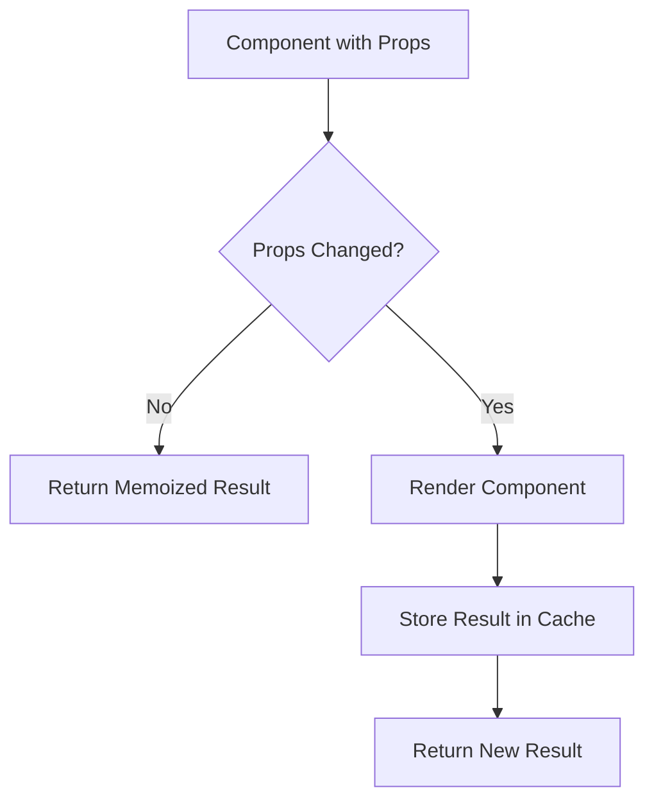

# React.memo

## Introduction

In React applications, performance can become a concern as your application grows. One common performance issue is unnecessary re-renders of components when their props haven't actually changed. This is where `React.memo` comes in.

`React.memo` is a higher-order component (HOC) that memoizes the result of a function component. By wrapping a component with `React.memo`, React will skip rendering the component if its props haven't changed, resulting in performance improvements.

## What is Memoization?

Before diving into `React.memo`, let's understand what memoization is:

Memoization is a programming technique that stores the results of expensive function calls and returns the cached result when the same inputs occur again. In React's context, this means caching a component's rendering output and reusing it when the same props are provided again.



## Basic Usage of React.memo

The simplest way to use `React.memo` is to wrap your function component with it:

```jsx
import React from 'react';

// Without React.memo
function RegularComponent({ name }) {
  console.log("Regular component render");
  return <div>Hello, {name}!</div>;
}

// With React.memo
const MemoizedComponent = React.memo(function MemoizedComponent({ name }) {
  console.log("Memoized component render");
  return <div>Hello, {name}!</div>;
});

// Alternative syntax
const AnotherMemoizedComponent = React.memo(({ name }) => {
  console.log("Another memoized component render");
  return <div>Hello, {name}!</div>;
});
```

Let's see how these components behave in a parent component:

```jsx
function ParentComponent() {
  const [count, setCount] = useState(0);
  const [name, setName] = useState("React");
  
  return (
    <div>
      <button onClick={() => setCount(count + 1)}>
        Increment count: {count}
      </button>
      <button onClick={() => setName(name === "React" ? "Redux" : "React")}>
        Toggle name: {name}
      </button>
      
      {/* This will re-render on every count change, even though name didn't change */}
      <RegularComponent name={name} />
      
      {/* This will only re-render when name changes */}
      <MemoizedComponent name={name} />
    </div>
  );
}
```

In this example, when you click the "Increment count" button:
- `RegularComponent` will re-render on every click
- `MemoizedComponent` won't re-render unless the `name` prop changes

## When to Use React.memo

`React.memo` is most useful in the following scenarios:

1. **Functional components that render often with the same props**
2. **Components that handle large data sets or perform expensive calculations**
3. **Pure components that render the same output for the same props**

## Custom Comparison Function

By default, `React.memo` performs a shallow comparison of props objects. If you need more control over the comparison, you can provide a custom comparison function as the second argument:

```jsx
const MemoizedComponentWithCustomComparison = React.memo(
  function CustomComparisonComponent({ user }) {
    console.log("Custom comparison component render");
    return (
      <div>
        <h2>{user.name}</h2>
        <p>Age: {user.age}</p>
      </div>
    );
  },
  (prevProps, nextProps) => {
    // Return true if you want to skip the render
    // Return false if you want to re-render
    return prevProps.user.id === nextProps.user.id && 
           prevProps.user.name === nextProps.user.name;
    // This ignores changes to other properties like age
  }
);
```

In this example, the component will only re-render if the user's `id` or `name` changes, ignoring changes to other properties like `age`.

## React.memo with Complex Props

When working with objects, arrays, or functions as props, you need to be careful because shallow comparison won't work as expected:

```jsx
function ParentWithComplexProps() {
  const [count, setCount] = useState(0);
  
  // This will cause MemoizedChild to re-render on every count change
  // because a new object is created on each render
  const userData = { name: "John", age: 25 };
  
  // This will also cause MemoizedChild to re-render
  // because a new function is created on each render
  const handleClick = () => {
    console.log("Button clicked");
  };
  
  return (
    <div>
      <button onClick={() => setCount(count + 1)}>
        Increment: {count}
      </button>
      
      <MemoizedChild 
        user={userData} 
        onClick={handleClick}
      />
    </div>
  );
}

const MemoizedChild = React.memo(({ user, onClick }) => {
  console.log("Child rendered");
  return (
    <div>
      <p>Name: {user.name}</p>
      <button onClick={onClick}>Click me</button>
    </div>
  );
});
```

### Solution: useMemo and useCallback

To fix the issue with complex props, use `useMemo` and `useCallback`:

```jsx
function OptimizedParentComponent() {
  const [count, setCount] = useState(0);
  
  // This object won't be recreated on re-renders
  const userData = useMemo(() => ({ name: "John", age: 25 }), []);
  
  // This function won't be recreated on re-renders
  const handleClick = useCallback(() => {
    console.log("Button clicked");
  }, []);
  
  return (
    <div>
      <button onClick={() => setCount(count + 1)}>
        Increment: {count}
      </button>
      
      <MemoizedChild 
        user={userData} 
        onClick={handleClick}
      />
    </div>
  );
}
```

Now, `MemoizedChild` won't re-render when the `count` state changes in the parent.

## Real-world Example: Optimizing a Todo List

Let's build a simple todo list application with performance optimizations:

```jsx
import React, { useState, useCallback, memo } from 'react';

// Individual todo item component
const TodoItem = memo(({ todo, onToggle, onDelete }) => {
  console.log(`Rendering TodoItem: ${todo.id}`);
  return (
    <li style={{ textDecoration: todo.completed ? 'line-through' : 'none' }}>
      <input
        type="checkbox"
        checked={todo.completed}
        onChange={() => onToggle(todo.id)}
      />
      {todo.text}
      <button onClick={() => onDelete(todo.id)}>Delete</button>
    </li>
  );
});

// Todo list component
function TodoList() {
  const [todos, setTodos] = useState([
    { id: 1, text: 'Learn React', completed: false },
    { id: 2, text: 'Build a project', completed: false },
    { id: 3, text: 'Deploy application', completed: false }
  ]);
  const [newTodo, setNewTodo] = useState('');
  const [count, setCount] = useState(0); // Unrelated state
  
  // Memoized callback functions to avoid unnecessary renders
  const handleToggle = useCallback((id) => {
    setTodos(prevTodos => 
      prevTodos.map(todo => 
        todo.id === id ? { ...todo, completed: !todo.completed } : todo
      )
    );
  }, []);
  
  const handleDelete = useCallback((id) => {
    setTodos(prevTodos => prevTodos.filter(todo => todo.id !== id));
  }, []);
  
  const addTodo = () => {
    if (newTodo.trim()) {
      setTodos(prevTodos => [
        ...prevTodos, 
        { id: Date.now(), text: newTodo, completed: false }
      ]);
      setNewTodo('');
    }
  };
  
  return (
    <div>
      <h2>Todo List</h2>
      {/* Unrelated UI element to demonstrate memoization */}
      <div>
        <button onClick={() => setCount(c => c + 1)}>
          Unrelated counter: {count}
        </button>
      </div>
      
      {/* Todo input form */}
      <div>
        <input
          value={newTodo}
          onChange={(e) => setNewTodo(e.target.value)}
          placeholder="Add new todo"
        />
        <button onClick={addTodo}>Add</button>
      </div>
      
      {/* Todo list */}
      <ul>
        {todos.map(todo => (
          <TodoItem
            key={todo.id}
            todo={todo}
            onToggle={handleToggle}
            onDelete={handleDelete}
          />
        ))}
      </ul>
    </div>
  );
}
```

In this example:
1. Each `TodoItem` is wrapped with `React.memo` to prevent re-renders when unrelated state changes
2. The handler functions are wrapped with `useCallback` to maintain referential equality between renders
3. When you click the "Unrelated counter" button, only the counter value updates, not the todo items
4. Todo items only re-render when their specific data changes

## Common Pitfalls

### 1. Premature Optimization

Don't wrap every component with `React.memo` - it adds complexity and might not provide any benefit for simple components.

### 2. Ignoring the Cost of Comparison

Remember that `React.memo` performs a comparison, which itself has a cost. For very simple components, this comparison might be more expensive than just re-rendering.

### 3. Not Handling Deep Objects or Arrays Correctly

As we've seen, you need to use `useMemo` and `useCallback` to maintain referential equality for complex props.

## When Not to Use React.memo

There are cases where `React.memo` might not be beneficial:

1. Components that almost always render with different props
2. Very simple components where the render cost is less than the comparison cost
3. Components that need to re-render when their parent re-renders regardless of props

## Summary

`React.memo` is a powerful tool for optimizing your React applications by preventing unnecessary re-renders. Here's a recap of what we've learned:

- `React.memo` creates a memoized version of a component that skips re-renders when props haven't changed
- It performs a shallow comparison of props by default
- You can provide a custom comparison function for more control
- When using objects, arrays, or functions as props, combine with `useMemo` and `useCallback` to maintain referential equality
- Use `React.memo` judiciously; it's not a silver bullet for all performance issues

## Additional Resources and Exercises

### Resources
- [React Official Docs on React.memo](https://reactjs.org/docs/react-api.html#reactmemo)
- [React Performance Optimization](https://reactjs.org/docs/optimizing-performance.html)

### Exercises

1. **Basic Memoization Exercise**: Create a simple counter application with a display component that shows the current count. Use `React.memo` to prevent unnecessary re-renders when unrelated state changes.

2. **Advanced Memoization Exercise**: Create a filterable list of items where each item is memoized. Implement search functionality and verify that only necessary components re-render.

3. **Performance Analysis Exercise**: Take an existing React application and identify components that might benefit from memoization. Apply `React.memo` and measure the performance improvements using React DevTools' Profiler.

4. **Custom Comparison Function Exercise**: Create a component with complex props and implement a custom comparison function that only triggers re-renders when specific properties change.

By mastering `React.memo`, you'll have a valuable tool in your arsenal to make your React applications more efficient and responsive, especially as they grow in complexity.