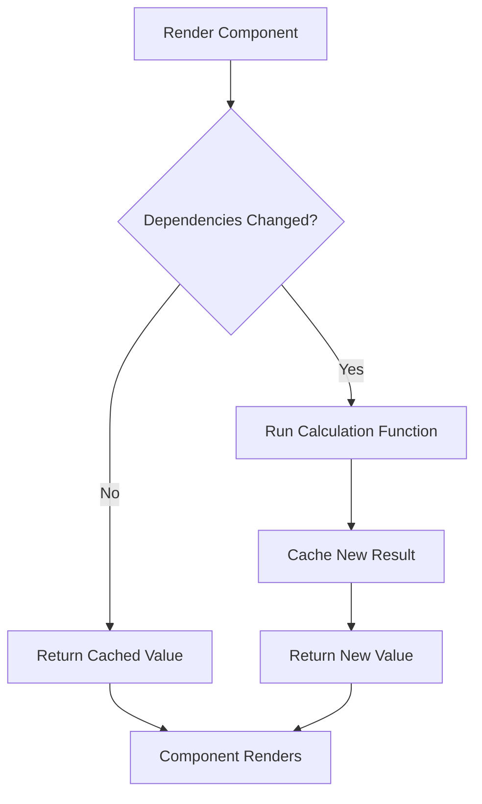

# React useMemo Performance

## Introduction

When building React applications, you might encounter performance issues as your application grows in complexity. One common problem is unnecessary re-calculations during renders. React's `useMemo` hook is designed specifically to address this issue by memoizing expensive calculations.

In this tutorial, we'll explore how the `useMemo` hook works, when to use it, and how it can significantly improve your application's performance.

## What is useMemo?

`useMemo` is a React hook that lets you cache the result of a calculation between re-renders. It "remembers" the output of a function and only recalculates it when one of its dependencies changes.

Here's the basic syntax:

```jsx
const memoizedValue = useMemo(() => computeExpensiveValue(a, b), [a, b]);
```

The first argument is a function that performs your calculation, and the second is an array of dependencies. The hook will only recompute the memoized value when one of the dependencies has changed.

## When to Use useMemo

You should consider using `useMemo` when:

1. You have computationally expensive calculations
2. The calculation result is used in rendering
3. The inputs to that calculation don't change frequently

Let's explore these scenarios with examples.

## Basic Example: Preventing Expensive Calculations

Consider a component that performs a complex calculation:

```jsx
import React, { useState } from 'react';

function ExpensiveCalculation({ list, filter }) {
  // This function will run on EVERY render
  const filteredList = list.filter(item => item.includes(filter));
  
  return (
    <div>
      <h2>Filtered Items:</h2>
      <ul>
        {filteredList.map(item => (
          <li key={item}>{item}</li>
        ))}
      </ul>
    </div>
  );
}
```

If the parent component re-renders frequently, the `filteredList` calculation happens on every render, even if `list` and `filter` haven't changed.

Here's how to optimize it with `useMemo`:

```jsx
import React, { useState, useMemo } from 'react';

function OptimizedCalculation({ list, filter }) {
  // This calculation only runs when list or filter changes
  const filteredList = useMemo(() => {
    console.log('Calculating filtered list...');
    return list.filter(item => item.includes(filter));
  }, [list, filter]);
  
  return (
    <div>
      <h2>Filtered Items:</h2>
      <ul>
        {filteredList.map(item => (
          <li key={item}>{item}</li>
        ))}
      </ul>
    </div>
  );
}
```

Now the calculation only runs when either `list` or `filter` changes, saving unnecessary computation.

## Real-World Example: Data Processing in a Dashboard

Let's imagine a dashboard component that displays processed analytics data:

```jsx
import React, { useState, useMemo } from 'react';
import Chart from './Chart'; // Fictional chart component

function AnalyticsDashboard({ rawData }) {
  const [timeRange, setTimeRange] = useState('week');
  const [showOutliers, setShowOutliers] = useState(false);
  
  // Process the raw data for visualization
  const processedData = useMemo(() => {
    console.log('Processing data...');
    
    // This could be expensive with large datasets
    const filtered = rawData.filter(item => {
      // Filter based on timeRange
      if (timeRange === 'week' && item.date < getLastWeekDate()) {
        return false;
      }
      if (timeRange === 'month' && item.date < getLastMonthDate()) {
        return false;
      }
      
      // Filter outliers if needed
      if (!showOutliers && isOutlier(item)) {
        return false;
      }
      
      return true;
    });
    
    // Process the data (calculate averages, totals, etc.)
    return {
      averages: calculateAverages(filtered),
      totals: calculateTotals(filtered),
      trends: calculateTrends(filtered)
    };
  }, [rawData, timeRange, showOutliers]);
  
  return (
    <div className="dashboard">
      <div className="controls">
        <select 
          value={timeRange} 
          onChange={e => setTimeRange(e.target.value)}
        >
          <option value="week">Last Week</option>
          <option value="month">Last Month</option>
          <option value="year">Last Year</option>
        </select>
        
        <label>
          <input
            type="checkbox"
            checked={showOutliers}
            onChange={e => setShowOutliers(e.target.checked)}
          />
          Show Outliers
        </label>
      </div>
      
      <div className="charts">
        <Chart data={processedData.averages} type="averages" />
        <Chart data={processedData.totals} type="totals" />
        <Chart data={processedData.trends} type="trends" />
      </div>
    </div>
  );
  
  // Helper functions (simplified)
  function getLastWeekDate() { /* implementation */ }
  function getLastMonthDate() { /* implementation */ }
  function isOutlier(item) { /* implementation */ }
  function calculateAverages(data) { /* implementation */ }
  function calculateTotals(data) { /* implementation */ }
  function calculateTrends(data) { /* implementation */ }
}
```

In this example, `useMemo` ensures that our expensive data processing only happens when necessary - when the raw data changes or when the user adjusts the filters.

## Common Pitfall: Over-Optimization

It's important to note that `useMemo` itself has a cost. For simple calculations, the overhead of memoization might outweigh the benefits:

```jsx
// DON'T DO THIS - over-optimization
const fullName = useMemo(() => {
  return `${firstName} ${lastName}`;
}, [firstName, lastName]);

// DO THIS instead - simple calculation
const fullName = `${firstName} ${lastName}`;
```

Use `useMemo` only when the calculation is genuinely expensive or when you need to maintain reference equality.

## useMemo for Referential Equality

Another important use of `useMemo` is to maintain referential equality for objects and arrays that are passed as props or used in dependency arrays:

```jsx
function ParentComponent() {
  const [count, setCount] = useState(0);
  
  // Without useMemo, this creates a new object on every render
  // const config = { theme: 'dark', animate: true };
  
  // With useMemo, the reference stays the same unless dependencies change
  const config = useMemo(() => {
    return { theme: 'dark', animate: true };
  }, []);
  
  return (
    <div>
      <button onClick={() => setCount(count + 1)}>
        Count: {count}
      </button>
      <ChildComponent config={config} />
    </div>
  );
}

// This component uses React.memo to prevent unnecessary renders
const ChildComponent = React.memo(({ config }) => {
  console.log("Child rendered");
  return <div>Child Component</div>;
});
```

Without `useMemo`, each time `ParentComponent` renders, a new `config` object is created with a new reference, causing `ChildComponent` to re-render even though the actual data hasn't changed.

## Visualizing useMemo Behavior

Here's a diagram that explains how `useMemo` works:



## Performance Testing

To measure the impact of `useMemo`, you can use React's built-in Profiler or browser dev tools:

```jsx
import React, { useState, useMemo, useCallback } from 'react';

function PerformanceTest() {
  const [size, setSize] = useState(30000);
  const [count, setCount] = useState(0);
  
  // Toggle this comment to compare with and without useMemo
  const items = useMemo(() => {
  // const items = (() => {
    console.time('calculation');
    const result = Array(size).fill(0).map((_, i) => ({
      id: i,
      value: Math.floor(Math.random() * 1000)
    }));
    console.timeEnd('calculation');
    return result;
  }, [size]);
  // })();
  
  return (
    <div>
      <div>
        <button onClick={() => setCount(c => c + 1)}>
          Rerender ({count})
        </button>
        <button onClick={() => setSize(s => s * 2)}>
          Double Size
        </button>
      </div>
      <div>Size: {size} items</div>
      <div>First few items: {items.slice(0, 5).map(i => i.value).join(', ')}</div>
    </div>
  );
}
```

Open your browser console and click the "Rerender" button to see the difference with and without `useMemo`.

## Best Practices for Using useMemo

1. **Profile first**: Don't optimize prematurely. Use performance profiling tools to identify actual bottlenecks.

2. **Consider the calculation cost**: Use `useMemo` only for expensive calculations.

3. **Keep dependency arrays accurate**: Make sure to include all variables your calculation depends on.

4. **Don't overuse it**: Remember that `useMemo` itself has overhead.

5. **Use it for referential equality**: When passing objects or functions to optimized child components, `useMemo` can prevent unnecessary renders.

## Common useMemo Use Cases

1. **Data filtering and sorting**:
```jsx
const sortedUsers = useMemo(() => {
  return [...users].sort((a, b) => a.name.localeCompare(b.name));
}, [users]);
```

2. **Derived data calculations**:
```jsx
const statistics = useMemo(() => {
  return {
    total: data.reduce((sum, item) => sum + item.value, 0),
    average: data.reduce((sum, item) => sum + item.value, 0) / data.length,
    max: Math.max(...data.map(item => item.value))
  };
}, [data]);
```

3. **Stable object references for dependency arrays**:
```jsx
const options = useMemo(() => ({
  headers: { 'Authorization': `Bearer ${token}` }
}), [token]);

useEffect(() => {
  fetchData(options);
}, [options]); // Will only change when token changes
```

## Summary

`useMemo` is a powerful tool in React's performance optimization toolkit that helps you:

- Avoid recalculating expensive values on every render
- Maintain referential equality between renders
- Prevent unnecessary rerenders of child components

Remember that optimization should be targeted at actual performance problems. Before reaching for `useMemo`, make sure you've identified a genuine performance issue through profiling.

## Additional Resources

- [React Documentation on useMemo](https://react.dev/reference/react/useMemo)
- [When to useMemo and useCallback](https://kentcdodds.com/blog/usememo-and-usecallback)

## Practice Exercises

1. **Create a component that filters and sorts a large list** of items based on user-selected criteria, using `useMemo` to optimize performance.

2. **Build a calculator component** with several input fields that performs complex calculations, and use `useMemo` to only recalculate when inputs change.

3. **Optimize a data visualization component** that transforms API data into a format needed by a charting library. Use `useMemo` to prevent unnecessary data processing.

4. **Compare the performance** of a component with and without `useMemo` using React's Profiler or browser performance tools.

Use these exercises to cement your understanding of when and how to use `useMemo` effectively for performance optimization in React applications.