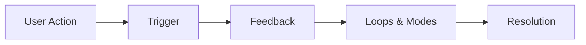

# React Micro-interactions

## Introduction

Micro-interactions are small, subtle animations and feedback mechanisms that occur in response to user actions. They serve to enhance user experience by providing visual feedback, guiding users through tasks, and adding personality to your application. In React applications, well-implemented micro-interactions can significantly improve usability and create a more polished, professional feel.

This guide will explain what micro-interactions are, why they matter, and how to implement them effectively in your React applications.

## What Are Micro-interactions?

Micro-interactions are brief animations or visual responses that:

- Acknowledge user actions
- Provide feedback
- Guide users through interfaces
- Communicate system status
- Add personality to your application

Examples include button hover effects, form input validation indicators, loading states, and transition animations between screens.



## Why Micro-interactions Matter

Micro-interactions might seem small, but they have significant impact:

1. **Improve User Experience**: Provide immediate feedback about actions
2. **Guide Users**: Help users understand how to interact with your interface
3. **Reduce Cognitive Load**: Communicate status without requiring users to read text
4. **Add Personality**: Make your application feel more polished and engaging
5. **Increase User Confidence**: Confirm when actions are successful

## Tools for React Micro-interactions

Several libraries can help implement micro-interactions in React:

1. **Framer Motion**: Powerful production-ready animation library
2. **React Spring**: Physics-based animations
3. **CSS Transitions/Animations**: Built-in browser capabilities
4. **Styled Components**: For component-specific animations
5. **GSAP (GreenSock Animation Platform)**: Advanced animation capabilities

For beginners, we recommend starting with Framer Motion as it provides a nice balance of power and simplicity.

## Getting Started with Framer Motion

Let's start by adding Framer Motion to your project:

```bash
npm install framer-motion
# or
yarn add framer-motion
```

Now, let's create a simple button with a hover effect:

```jsx
import React from 'react';
import { motion } from 'framer-motion';

const AnimatedButton = () => {
  return (
    <motion.button
      whileHover={{ 
        scale: 1.1,
        backgroundColor: "#ff0055",
        color: "white"
      }}
      whileTap={{ scale: 0.95 }}
      transition={{ duration: 0.2 }}
      style={{
        border: 'none',
        padding: '10px 20px',
        borderRadius: '4px',
        backgroundColor: '#f1f1f1',
        cursor: 'pointer'
      }}
    >
      Hover Me!
    </motion.button>
  );
};

export default AnimatedButton;
```

In this example:
- We import `motion` from Framer Motion
- We use `motion.button` instead of a regular `<button>`
- We define what happens when users hover (`whileHover`) and tap (`whileTap`) the button
- We set how fast the animation should be with `transition`

## Common Micro-interactions in React Applications

### 1. Button Feedback

Buttons should provide clear feedback when users interact with them:

```jsx
import { motion } from 'framer-motion';

const FeedbackButton = ({ onClick, children }) => {
  return (
    <motion.button
      onClick={onClick}
      whileHover={{ scale: 1.05 }}
      whileTap={{ scale: 0.95 }}
      initial={{ backgroundColor: "#4287f5" }}
      style={{
        border: 'none',
        borderRadius: '5px',
        color: 'white',
        padding: '10px 20px',
        cursor: 'pointer'
      }}
    >
      {children}
    </motion.button>
  );
};
```

### 2. Form Field Feedback

Provide immediate validation feedback as users type:

```jsx
import React, { useState } from 'react';
import { motion } from 'framer-motion';

const FormField = ({ label, type, validator }) => {
  const [value, setValue] = useState('');
  const [isValid, setIsValid] = useState(null);
  
  const handleChange = (e) => {
    const newValue = e.target.value;
    setValue(newValue);
    
    if (newValue.length > 0) {
      setIsValid(validator ? validator(newValue) : true);
    } else {
      setIsValid(null);
    }
  };
  
  return (
    <div style={{ marginBottom: '15px' }}>
      <label>{label}</label>
      <div style={{ position: 'relative' }}>
        <input
          type={type}
          value={value}
          onChange={handleChange}
          style={{
            width: '100%',
            padding: '8px',
            borderRadius: '4px',
            border: '1px solid #ccc'
          }}
        />
        {isValid !== null && (
          <motion.div
            initial={{ scale: 0, opacity: 0 }}
            animate={{ scale: 1, opacity: 1 }}
            style={{
              position: 'absolute',
              right: '10px',
              top: '50%',
              transform: 'translateY(-50%)',
              color: isValid ? 'green' : 'red'
            }}
          >
            {isValid ? '✓' : '✗'}
          </motion.div>
        )}
      </div>
    </div>
  );
};

// Example usage
const EmailFormField = () => {
  const validateEmail = (email) => {
    return /^[^\s@]+@[^\s@]+\.[^\s@]+$/.test(email);
  };
  
  return <FormField 
    label="Email Address" 
    type="email" 
    validator={validateEmail} 
  />;
};
```

### 3. Loading States

Indicate when content is loading with an animated indicator:

```jsx
import React, { useState } from 'react';
import { motion } from 'framer-motion';

const LoadingButton = () => {
  const [isLoading, setIsLoading] = useState(false);
  
  const handleClick = () => {
    setIsLoading(true);
    
    // Simulate API call
    setTimeout(() => {
      setIsLoading(false);
    }, 2000);
  };
  
  return (
    <motion.button
      onClick={handleClick}
      disabled={isLoading}
      whileHover={!isLoading ? { scale: 1.05 } : {}}
      style={{
        position: 'relative',
        padding: '10px 20px',
        borderRadius: '5px',
        border: 'none',
        backgroundColor: '#4287f5',
        color: 'white',
        cursor: isLoading ? 'default' : 'pointer'
      }}
    >
      {isLoading && (
        <motion.span
          style={{
            display: 'inline-block',
            marginRight: '8px',
            height: '15px',
            width: '15px',
            borderRadius: '50%',
            border: '2px solid #ffffff',
            borderTopColor: 'transparent',
          }}
          animate={{ rotate: 360 }}
          transition={{ duration: 1, repeat: Infinity, ease: "linear" }}
        />
      )}
      {isLoading ? 'Loading...' : 'Submit'}
    </motion.button>
  );
};
```

### 4. Notification Toasts

Create sliding notification toasts:

```jsx
import React, { useState, useEffect } from 'react';
import { motion, AnimatePresence } from 'framer-motion';

const Toast = ({ message, type = 'info', duration = 3000, onClose }) => {
  useEffect(() => {
    const timer = setTimeout(() => {
      onClose();
    }, duration);
    
    return () => clearTimeout(timer);
  }, [duration, onClose]);
  
  const colors = {
    success: '#4caf50',
    info: '#2196f3',
    error: '#f44336',
    warning: '#ff9800'
  };
  
  return (
    <motion.div
      initial={{ x: 300, opacity: 0 }}
      animate={{ x: 0, opacity: 1 }}
      exit={{ x: 300, opacity: 0 }}
      style={{
        padding: '10px 15px',
        backgroundColor: colors[type],
        color: 'white',
        borderRadius: '4px',
        marginBottom: '10px',
        boxShadow: '0 2px 5px rgba(0,0,0,0.2)'
      }}
    >
      {message}
    </motion.div>
  );
};

const ToastContainer = () => {
  const [toasts, setToasts] = useState([]);
  
  const showToast = (message, type) => {
    const id = Date.now();
    setToasts(prev => [...prev, { id, message, type }]);
  };
  
  const removeToast = (id) => {
    setToasts(prev => prev.filter(toast => toast.id !== id));
  };
  
  return (
    <>
      <div>
        <button onClick={() => showToast('Operation successful!', 'success')}>
          Success Toast
        </button>
        <button onClick={() => showToast('Something went wrong!', 'error')}>
          Error Toast
        </button>
      </div>
      
      <div style={{
        position: 'fixed',
        top: '20px',
        right: '20px',
        maxWidth: '300px'
      }}>
        <AnimatePresence>
          {toasts.map(toast => (
            <Toast
              key={toast.id}
              message={toast.message}
              type={toast.type}
              onClose={() => removeToast(toast.id)}
            />
          ))}
        </AnimatePresence>
      </div>
    </>
  );
};
```

## Best Practices for Micro-interactions

### 1. Keep animations subtle and brief

Animations should enhance, not distract. Generally, keep durations between 200-400ms:

```jsx
// Good practice
<motion.div
  whileHover={{ scale: 1.05 }}
  transition={{ duration: 0.2 }} // Fast and subtle
>
  Hover me
</motion.div>

// Too much!
<motion.div
  whileHover={{ scale: 1.5, rotate: 360 }}
  transition={{ duration: 2 }} // Too long and distracting
>
  Hover me
</motion.div>
```

### 2. Use animations purposefully

Every animation should have a purpose, communicating something meaningful to the user:

```jsx
// Good: Shows loading state
<motion.button
  disabled={isLoading}
  style={{ opacity: isLoading ? 0.7 : 1 }}
>
  {isLoading ? 'Saving...' : 'Save'}
</motion.button>

// Good: Indicates which item is selected
<motion.li
  animate={{ 
    backgroundColor: isSelected ? "#e6f7ff" : "#ffffff",
    borderLeft: isSelected ? "3px solid #1890ff" : "none"
  }}
>
  {item.name}
</motion.li>
```

### 3. Consider accessibility

Ensure animations don't cause accessibility issues:

```jsx
// Respect user preferences for reduced motion
import { useReducedMotion } from 'framer-motion';

const MyAnimatedComponent = () => {
  const shouldReduceMotion = useReducedMotion();
  
  const animationProps = shouldReduceMotion 
    ? { opacity: [0, 1] }  // Simpler animation
    : { opacity: [0, 1], x: [-50, 0] };  // Full animation
    
  return (
    <motion.div
      animate={animationProps}
      transition={{ duration: 0.3 }}
    >
      Content
    </motion.div>
  );
};
```

### 4. Test on different devices

Some animations may be smooth on high-end devices but janky on lower-end ones. Always test on various devices.

## Real-world Examples

### Expandable Card Component

```jsx
import React, { useState } from 'react';
import { motion, AnimatePresence } from 'framer-motion';

const ExpandableCard = ({ title, children }) => {
  const [isExpanded, setIsExpanded] = useState(false);
  
  return (
    <motion.div
      layout
      style={{
        backgroundColor: 'white',
        borderRadius: '10px',
        padding: '20px',
        boxShadow: '0px 2px 10px rgba(0,0,0,0.1)',
        marginBottom: '20px',
        overflow: 'hidden',
        cursor: 'pointer'
      }}
      onClick={() => setIsExpanded(!isExpanded)}
    >
      <motion.div layout style={{ display: 'flex', justifyContent: 'space-between', alignItems: 'center' }}>
        <h3 style={{ margin: 0 }}>{title}</h3>
        <motion.div
          animate={{ rotate: isExpanded ? 180 : 0 }}
          transition={{ duration: 0.3 }}
        >
          ▼
        </motion.div>
      </motion.div>
      
      <AnimatePresence>
        {isExpanded && (
          <motion.div
            initial={{ opacity: 0, height: 0 }}
            animate={{ opacity: 1, height: "auto" }}
            exit={{ opacity: 0, height: 0 }}
            transition={{ duration: 0.3 }}
            style={{ paddingTop: '15px' }}
          >
            {children}
          </motion.div>
        )}
      </AnimatePresence>
    </motion.div>
  );
};

// Example usage
const CardExample = () => {
  return (
    <div style={{ maxWidth: '500px' }}>
      <ExpandableCard title="What is React?">
        <p>
          React is a JavaScript library for building user interfaces,
          particularly single-page applications. It's used for handling
          the view layer and allows you to create reusable UI components.
        </p>
      </ExpandableCard>
      
      <ExpandableCard title="Why use Micro-interactions?">
        <p>
          Micro-interactions enhance user experience by providing
          immediate feedback, guiding users through your application,
          and adding a layer of polish that makes your app feel more
          complete and professional.
        </p>
      </ExpandableCard>
    </div>
  );
};
```

### Tabbed Interface with Animations

```jsx
import React, { useState } from 'react';
import { motion } from 'framer-motion';

const Tabs = ({ tabs }) => {
  const [activeTab, setActiveTab] = useState(0);
  
  return (
    <div style={{ maxWidth: '600px' }}>
      <div style={{ display: 'flex', borderBottom: '1px solid #e1e1e1' }}>
        {tabs.map((tab, index) => (
          <div
            key={index}
            style={{
              padding: '10px 20px',
              position: 'relative',
              cursor: 'pointer'
            }}
            onClick={() => setActiveTab(index)}
          >
            {tab.label}
            {activeTab === index && (
              <motion.div
                layoutId="underline"
                style={{
                  position: 'absolute',
                  bottom: '-1px',
                  left: 0,
                  right: 0,
                  height: '2px',
                  backgroundColor: '#1890ff'
                }}
              />
            )}
          </div>
        ))}
      </div>
      <div style={{ padding: '20px 0' }}>
        <AnimatePresence mode="wait">
          <motion.div
            key={activeTab}
            initial={{ opacity: 0, y: 10 }}
            animate={{ opacity: 1, y: 0 }}
            exit={{ opacity: 0, y: -10 }}
            transition={{ duration: 0.2 }}
          >
            {tabs[activeTab].content}
          </motion.div>
        </AnimatePresence>
      </div>
    </div>
  );
};

// Example usage
const TabsExample = () => {
  const tabData = [
    {
      label: 'Home',
      content: (
        <div>
          <h3>Welcome Home!</h3>
          <p>This is the home tab content.</p>
        </div>
      )
    },
    {
      label: 'Profile',
      content: (
        <div>
          <h3>User Profile</h3>
          <p>View and edit your profile information here.</p>
        </div>
      )
    },
    {
      label: 'Settings',
      content: (
        <div>
          <h3>Application Settings</h3>
          <p>Customize your application preferences.</p>
        </div>
      )
    }
  ];
  
  return <Tabs tabs={tabData} />;
};
```

## Performance Considerations

Animations can impact performance if not implemented properly. Here are some tips:

1. **Use `transform` and `opacity` properties** whenever possible as they don't trigger layout recalculations:

```jsx
// Good - uses transform (hardware accelerated)
<motion.div animate={{ scale: 1.5, x: 100 }}>
  Content
</motion.div>

// Avoid - causes layout recalculations
<motion.div animate={{ width: '150%', marginLeft: 100 }}>
  Content
</motion.div>
```

2. **Consider using `will-change`** for complex animations:

```jsx
<motion.div
  style={{
    willChange: 'transform',
    // other styles...
  }}
  animate={{ rotate: 360 }}
  transition={{ duration: 2, repeat: Infinity }}
>
  Spinning element
</motion.div>
```

3. **Use the `layoutId` prop** for shared element transitions:

```jsx
// In component A
<motion.div layoutId="shared-element">
  Click me to expand
</motion.div>

// In component B
<motion.div layoutId="shared-element">
  Expanded content
</motion.div>
```

## Summary

Micro-interactions are subtle animations that significantly improve user experience in React applications by providing feedback, guiding users, and adding personality. Key points to remember:

- Keep animations subtle and purposeful
- Consider accessibility with `useReducedMotion`
- Use libraries like Framer Motion to simplify implementation
- Focus on common interaction points: buttons, forms, loading states, and transitions
- Be mindful of performance implications

By incorporating thoughtful micro-interactions, you can elevate your React applications from functional to delightful, creating interfaces that users enjoy using.

## Additional Resources

- [Framer Motion Documentation](https://www.framer.com/motion/)
- [React Spring](https://react-spring.io/)
- [Micro-interactions: Why, When and How to Use Them](https://www.interaction-design.org/literature/article/micro-interactions-why-when-and-how-to-use-them)

## Exercises

1. Create a button that shows a success message with animation after being clicked
2. Build a form with animated validation feedback
3. Implement a card that flips to reveal additional information when clicked
4. Create a custom toggle switch with smooth animations
5. Build a navigation menu with animated transitions between sections

Try these exercises to practice implementing micro-interactions in your React applications!