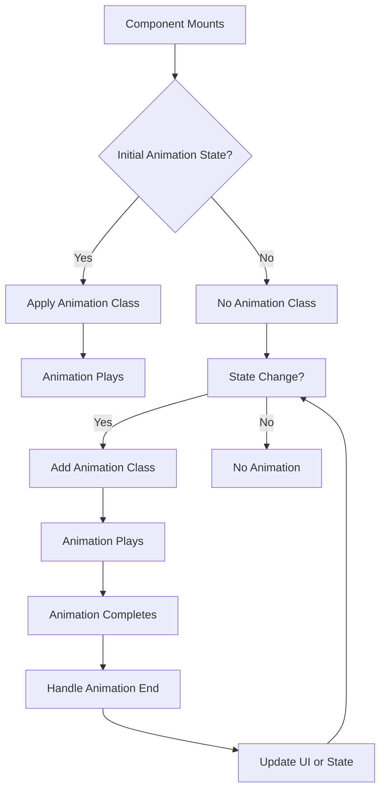

# React CSS Animations

## Introduction

CSS animations provide a powerful way to enhance user experience in React applications without sacrificing performance. Unlike JavaScript-based animations, CSS animations leverage the browser's rendering capabilities, often resulting in smoother performance. In this tutorial, we'll explore how to effectively implement CSS animations in React components, control their behavior through state, and create engaging interfaces that delight your users.

CSS animations in React can be implemented in several ways:
- Using traditional CSS/SCSS files
- With CSS modules
- Through CSS-in-JS libraries
- By conditionally applying CSS classes

Let's explore each approach with practical examples!

## Basic CSS Animations in React

### Traditional CSS Approach

The most straightforward way to add animations is by defining them in separate CSS files and importing them into your React components.

First, let's create a simple fade-in animation:

```css
/* animations.css */
@keyframes fadeIn {
  from {
    opacity: 0;
  }
  to {
    opacity: 1;
  }
}

.fade-in {
  animation: fadeIn 1s ease-in-out;
}
```

Then import and use it in your React component:

```jsx
import React from 'react';
import './animations.css';

function FadeInComponent() {
  return (
    <div className="fade-in">
      <h2>This content will fade in!</h2>
      <p>The animation happens when the component mounts.</p>
    </div>
  );
}

export default FadeInComponent;
```

### Using CSS Modules

For better encapsulation and avoiding class name conflicts, you can use CSS Modules:

```css
/* FadeAnimation.module.css */
@keyframes fadeIn {
  from {
    opacity: 0;
  }
  to {
    opacity: 1;
  }
}

.fadeInElement {
  animation: fadeIn 1s ease-in-out;
}
```

```jsx
import React from 'react';
import styles from './FadeAnimation.module.css';

function FadeInComponent() {
  return (
    <div className={styles.fadeInElement}>
      <h2>This content will fade in!</h2>
      <p>Using CSS Modules for better encapsulation.</p>
    </div>
  );
}

export default FadeInComponent;
```

## Controlling CSS Animations with React State

One of the powerful aspects of using CSS animations with React is the ability to control animations through component state.

### Toggling Animations with State

```jsx
import React, { useState } from 'react';
import './animations.css';

function AnimatedBox() {
  const [isAnimated, setIsAnimated] = useState(false);
  
  return (
    <div>
      <div 
        className={isAnimated ? 'box animated' : 'box'}
        onClick={() => setIsAnimated(!isAnimated)}
      >
        Click me to animate
      </div>
      <button onClick={() => setIsAnimated(!isAnimated)}>
        Toggle Animation
      </button>
    </div>
  );
}

export default AnimatedBox;
```

The corresponding CSS might look like:

```css
/* animations.css */
.box {
  width: 100px;
  height: 100px;
  background-color: #3498db;
  transition: transform 0.5s ease-in-out, background-color 0.5s ease;
  cursor: pointer;
}

.animated {
  transform: rotate(45deg) scale(1.2);
  background-color: #e74c3c;
}
```

## Creating a Reusable Animation Component

Let's create a reusable fade animation component that can wrap any content:

```jsx
import React from 'react';
import './animations.css';

function FadeAnimation({ children, direction = 'in', duration = 1, delay = 0 }) {
  const animationClass = `fade-${direction}`;
  
  const style = {
    animationDuration: `${duration}s`,
    animationDelay: `${delay}s`,
  };
  
  return (
    <div className={animationClass} style={style}>
      {children}
    </div>
  );
}

export default FadeAnimation;
```

With the accompanying CSS:

```css
/* animations.css */
@keyframes fadeIn {
  from { opacity: 0; }
  to { opacity: 1; }
}

@keyframes fadeOut {
  from { opacity: 1; }
  to { opacity: 0; }
}

.fade-in {
  animation: fadeIn forwards;
}

.fade-out {
  animation: fadeOut forwards;
}
```

Using the component:

```jsx
import React from 'react';
import FadeAnimation from './FadeAnimation';

function App() {
  return (
    <div>
      <FadeAnimation duration={0.5}>
        <h1>This header fades in quickly</h1>
      </FadeAnimation>
      
      <FadeAnimation duration={2} delay={0.5}>
        <p>This paragraph fades in slowly, after a delay</p>
      </FadeAnimation>
    </div>
  );
}
```

## Creating Advanced Animations

### Multi-Step Animation Sequence

For more complex animations, we can create multi-step sequences:

```css
@keyframes bounce {
  0%, 20%, 50%, 80%, 100% {
    transform: translateY(0);
  }
  40% {
    transform: translateY(-30px);
  }
  60% {
    transform: translateY(-15px);
  }
}

.bounce {
  animation: bounce 2s infinite;
}
```

### Staggered Animations

Creating staggered animations for lists is a common UI pattern:

```jsx
import React from 'react';
import './animations.css';

function AnimatedList() {
  const items = ['Item 1', 'Item 2', 'Item 3', 'Item 4', 'Item 5'];
  
  return (
    <ul className="animated-list">
      {items.map((item, index) => (
        <li 
          key={item} 
          style={{ animationDelay: `${index * 0.1}s` }}
        >
          {item}
        </li>
      ))}
    </ul>
  );
}

export default AnimatedList;
```

```css
/* animations.css */
.animated-list li {
  animation: slideIn 0.5s forwards;
  opacity: 0;
}

@keyframes slideIn {
  from {
    opacity: 0;
    transform: translateX(-20px);
  }
  to {
    opacity: 1;
    transform: translateX(0);
  }
}
```

## Real-World Example: Animated Navigation Menu

Let's create an animated navigation menu that responds to user interactions:

```jsx
import React, { useState } from 'react';
import './NavMenu.css';

function NavMenu() {
  const [isOpen, setIsOpen] = useState(false);
  
  return (
    <div className="nav-container">
      <button 
        className={`menu-toggle ${isOpen ? 'open' : ''}`}
        onClick={() => setIsOpen(!isOpen)}
      >
        <span></span>
        <span></span>
        <span></span>
      </button>
      
      <nav className={`main-nav ${isOpen ? 'open' : ''}`}>
        <ul>
          <li><a href="#home">Home</a></li>
          <li><a href="#about">About</a></li>
          <li><a href="#services">Services</a></li>
          <li><a href="#contact">Contact</a></li>
        </ul>
      </nav>
    </div>
  );
}

export default NavMenu;
```

```css
/* NavMenu.css */
.nav-container {
  position: relative;
}

.menu-toggle {
  display: flex;
  flex-direction: column;
  justify-content: space-between;
  width: 30px;
  height: 21px;
  background: transparent;
  border: none;
  cursor: pointer;
  padding: 0;
  z-index: 10;
}

.menu-toggle span {
  width: 100%;
  height: 3px;
  background: #333;
  border-radius: 3px;
  transition: all 0.3s linear;
}

.menu-toggle.open span:first-child {
  transform: rotate(45deg) translate(5px, 5px);
}

.menu-toggle.open span:nth-child(2) {
  opacity: 0;
}

.menu-toggle.open span:last-child {
  transform: rotate(-45deg) translate(7px, -6px);
}

.main-nav {
  position: absolute;
  top: 60px;
  left: 0;
  width: 300px;
  background: #fff;
  box-shadow: 0 0 10px rgba(0,0,0,0.1);
  transform: translateX(-100%);
  transition: transform 0.3s ease-in-out;
}

.main-nav.open {
  transform: translateX(0);
}

.main-nav ul {
  list-style: none;
  padding: 0;
  margin: 0;
}

.main-nav li {
  opacity: 0;
  transform: translateY(10px);
}

.main-nav.open li {
  animation: slideIn 0.4s forwards;
}

.main-nav.open li:nth-child(1) { animation-delay: 0.1s; }
.main-nav.open li:nth-child(2) { animation-delay: 0.2s; }
.main-nav.open li:nth-child(3) { animation-delay: 0.3s; }
.main-nav.open li:nth-child(4) { animation-delay: 0.4s; }

.main-nav a {
  display: block;
  padding: 15px 20px;
  color: #333;
  text-decoration: none;
  transition: background 0.3s;
}

.main-nav a:hover {
  background: #f0f0f0;
}

@keyframes slideIn {
  to {
    opacity: 1;
    transform: translateY(0);
  }
}
```

## Animation Performance Optimization

To ensure your animations run smoothly, follow these best practices:

1. **Use transform and opacity properties** - They are the most performant properties to animate
2. **Add the `will-change` property** for animations that will change frequently:

```css
.animated-element {
  will-change: transform, opacity;
}
```

3. **Use hardware acceleration** by forcing a layer creation:

```css
.hardware-accelerated {
  transform: translateZ(0);
}
```

4. **Avoid animating expensive properties** like `box-shadow` or `filter` directly. Instead, animate an opacity on a duplicate element with the end state:

```jsx
import React, { useState } from 'react';
import './performance.css';

function OptimizedAnimation() {
  const [isHovered, setIsHovered] = useState(false);
  
  return (
    <div 
      className="card"
      onMouseEnter={() => setIsHovered(true)}
      onMouseLeave={() => setIsHovered(false)}
    >
      <div className="card-content">Card Content</div>
      <div className={`card-shadow ${isHovered ? 'visible' : ''}`}></div>
    </div>
  );
}
```

```css
.card {
  position: relative;
  width: 300px;
  height: 200px;
  background: white;
}

.card-shadow {
  position: absolute;
  top: 0;
  left: 0;
  right: 0;
  bottom: 0;
  box-shadow: 0 10px 30px rgba(0,0,0,0.3);
  opacity: 0;
  transition: opacity 0.3s ease;
}

.card-shadow.visible {
  opacity: 1;
}
```

## Implementing Animation Hooks

Custom hooks can make animation management cleaner:

```jsx
import { useState, useEffect } from 'react';

function useAnimation(initialState = false, duration = 300) {
  const [isAnimating, setIsAnimating] = useState(initialState);
  const [shouldRender, setShouldRender] = useState(initialState);
  
  useEffect(() => {
    if (isAnimating) {
      setShouldRender(true);
    } else {
      const timer = setTimeout(() => setShouldRender(false), duration);
      return () => clearTimeout(timer);
    }
  }, [isAnimating, duration]);
  
  return [isAnimating, setIsAnimating, shouldRender];
}
```

Using the hook to animate a modal:

```jsx
import React from 'react';
import useAnimation from './useAnimation';
import './Modal.css';

function AnimatedModal({ children }) {
  const [isOpen, setIsOpen, shouldRender] = useAnimation(false, 300);
  
  return (
    <div>
      <button onClick={() => setIsOpen(true)}>Open Modal</button>
      
      {shouldRender && (
        <div className="modal-backdrop">
          <div className={`modal ${isOpen ? 'open' : 'closing'}`}>
            {children}
            <button onClick={() => setIsOpen(false)}>Close</button>
          </div>
        </div>
      )}
    </div>
  );
}
```

```css
.modal-backdrop {
  position: fixed;
  top: 0;
  left: 0;
  right: 0;
  bottom: 0;
  background: rgba(0,0,0,0.5);
  display: flex;
  justify-content: center;
  align-items: center;
}

.modal {
  background: white;
  padding: 20px;
  border-radius: 5px;
  width: 80%;
  max-width: 500px;
  transform: scale(0.8);
  opacity: 0;
  transition: transform 0.3s ease, opacity 0.3s ease;
}

.modal.open {
  transform: scale(1);
  opacity: 1;
}

.modal.closing {
  transform: scale(0.8);
  opacity: 0;
}
```

## Animation Sequence Flow

To better understand the lifecycle of CSS animations in React, here's a flow diagram:



## Integration with React Transitions

CSS animations can be combined with React's transition libraries for even more control:

```jsx
import React, { useState } from 'react';
import { CSSTransition } from 'react-transition-group';
import './transitions.css';

function TransitionExample() {
  const [isVisible, setIsVisible] = useState(false);
  
  return (
    <div>
      <button onClick={() => setIsVisible(!isVisible)}>
        Toggle Content
      </button>
      
      <CSSTransition
        in={isVisible}
        timeout={300}
        classNames="fade"
        unmountOnExit
      >
        <div className="content-box">
          <h3>Animated Content</h3>
          <p>This content animates in and out!</p>
        </div>
      </CSSTransition>
    </div>
  );
}
```

```css
/* transitions.css */
.fade-enter {
  opacity: 0;
}

.fade-enter-active {
  opacity: 1;
  transition: opacity 300ms;
}

.fade-exit {
  opacity: 1;
}

.fade-exit-active {
  opacity: 0;
  transition: opacity 300ms;
}

.content-box {
  background: #f5f5f5;
  padding: 20px;
  border-radius: 5px;
  margin-top: 20px;
}
```

## Summary

In this tutorial, we've explored various ways to implement CSS animations in React applications:

- Basic CSS animations with traditional stylesheets and CSS modules
- Controlling animations with React state
- Creating reusable animation components
- Implementing complex animation patterns
- Optimizing performance
- Using custom hooks for animation management
- Integrating with React transition libraries

CSS animations in React provide an excellent balance between performance and flexibility. By leveraging the browser's native capabilities while controlling animations through React's state management, you can create engaging and responsive user interfaces.

## Exercises for Practice

1. Create a loading spinner component that uses CSS animations
2. Build a photo gallery with animated transitions between images
3. Implement a notification system with slide-in and fade-out animations
4. Create an animated accordion component
5. Build a page transition system for a multi-page React application

## Additional Resources

- [MDN Web Docs: Using CSS Animations](https://developer.mozilla.org/en-US/docs/Web/CSS/CSS_Animations/Using_CSS_animations)
- [React Transition Group](https://reactcommunity.org/react-transition-group/)
- [CSS-Tricks: Animation Performance Guide](https://css-tricks.com/almanac/properties/t/transition/)
- [React Spring](https://www.react-spring.io/) - For more advanced animation needs

By mastering CSS animations in React, you'll add a powerful tool to your frontend development toolkit that can significantly enhance the user experience of your applications.