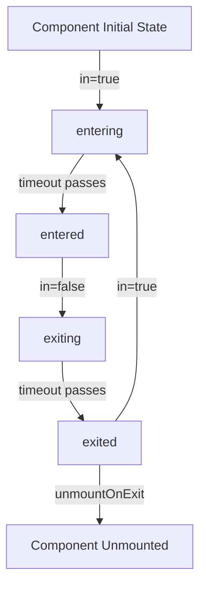

# React Transition Group

## Introduction

Making smooth transitions between different UI states is a crucial aspect of modern web applications. React Transition Group is a popular library that helps React developers add transitions to elements as they enter or leave the DOM. It provides a set of components that make it easier to define and control transition effects.

React Transition Group isn't an animation library like React Spring or Framer Motion. Instead, it exposes transition stages that you can use to apply animations with CSS or other animation libraries. Think of it as a toolkit that helps manage the lifecycle of your components during transitions.

In this tutorial, we'll explore React Transition Group's core components, understand how they work, and build practical examples to demonstrate their usage.

## Prerequisites

Before we begin, make sure you have:

- Basic knowledge of React
- A React project set up
- React Transition Group installed

To install React Transition Group, run:

```bash
npm install react-transition-group
# or
yarn add react-transition-group
```

## Core Components

React Transition Group provides three main components:

1. `Transition` - Low-level API for transitions
2. `CSSTransition` - Builds on `Transition` to make implementing CSS transitions easier
3. `TransitionGroup` - Manages a list of multiple transition components

Let's explore each of these components in detail.

## The `Transition` Component

The `Transition` component is the core component that manages component states during transitions. It doesn't apply any styles by itself but gives you control over different transition phases.

### Transition States

A transition goes through four states:

1. `entering`: Starting state when the component is about to enter
2. `entered`: Final state when the component has fully entered
3. `exiting`: Starting state when the component is about to exit
4. `exited`: Final state when the component has fully exited

### Basic Example

```jsx
import { useState } from 'react';
import { Transition } from 'react-transition-group';

const duration = 300;

const defaultStyle = {
  transition: `opacity ${duration}ms ease-in-out`,
  opacity: 0,
}

const transitionStyles = {
  entering: { opacity: 1 },
  entered: { opacity: 1 },
  exiting: { opacity: 0 },
  exited: { opacity: 0 },
};

function TransitionExample() {
  const [inProp, setInProp] = useState(false);
  
  return (
    <div>
      <button onClick={() => setInProp(prevState => !prevState)}>
        Toggle
      </button>
      <Transition in={inProp} timeout={duration}>
        {state => (
          <div style={{
            ...defaultStyle,
            ...transitionStyles[state]
          }}>
            I'm a fading element!
          </div>
        )}
      </Transition>
    </div>
  );
}
```

In this example:
- We use a state variable `inProp` to control whether the element should be shown.
- The `in` prop determines whether the component is in an "entered" or "exited" state.
- The `timeout` prop specifies how long the transition should take.
- We provide a function as a child that receives the current transition state and returns a component with appropriate styles.

## The `CSSTransition` Component

While `Transition` gives you complete control, it requires manual styling. `CSSTransition` makes this more convenient by automatically applying and removing CSS classes during the transition phases.

### CSS Classes

`CSSTransition` adds these classes to your component:

- `{classPrefix}-enter`: Applied immediately when the component mounts
- `{classPrefix}-enter-active`: Applied one frame after the component mounts
- `{classPrefix}-enter-done`: Applied when the entering transition is completed
- `{classPrefix}-exit`: Applied when the exit transition is triggered
- `{classPrefix}-exit-active`: Applied one frame after the exit transition is triggered
- `{classPrefix}-exit-done`: Applied when the exiting transition is completed

### Basic Example

```jsx
import { useState } from 'react';
import { CSSTransition } from 'react-transition-group';
import './styles.css'; // We'll define our CSS here

function CSSTransitionExample() {
  const [isVisible, setIsVisible] = useState(false);
  
  return (
    <div>
      <button onClick={() => setIsVisible(prevState => !prevState)}>
        Toggle
      </button>
      
      <CSSTransition
        in={isVisible}
        timeout={300}
        classNames="fade"
        unmountOnExit
      >
        <div className="box">
          I'll fade in and out!
        </div>
      </CSSTransition>
    </div>
  );
}
```

And here's the corresponding CSS:

```css
/* styles.css */
.box {
  padding: 20px;
  margin-top: 20px;
  background-color: #3498db;
  color: white;
  border-radius: 4px;
}

/* Enter transitions */
.fade-enter {
  opacity: 0;
}

.fade-enter-active {
  opacity: 1;
  transition: opacity 300ms;
}

/* Exit transitions */
.fade-exit {
  opacity: 1;
}

.fade-exit-active {
  opacity: 0;
  transition: opacity 300ms;
}
```

In this example:
- We use the `classNames` prop to define the prefix for our transition classes.
- The `unmountOnExit` prop ensures the component is removed from the DOM after exiting.
- Our CSS defines how the element should appear during each transition phase.

## The `TransitionGroup` Component

While `Transition` and `CSSTransition` handle single elements, `TransitionGroup` manages a collection of transition components, making it perfect for lists where items may be added or removed.

### List Example

```jsx
import { useState } from 'react';
import { TransitionGroup, CSSTransition } from 'react-transition-group';
import './list-styles.css';

function ListExample() {
  const [items, setItems] = useState([
    { id: 1, text: 'Buy groceries' },
    { id: 2, text: 'Learn React' },
    { id: 3, text: 'Build amazing app' },
  ]);
  
  const [nextId, setNextId] = useState(4);
  const [inputText, setInputText] = useState('');
  
  const addItem = () => {
    if (inputText.trim() !== '') {
      setItems([...items, { id: nextId, text: inputText }]);
      setNextId(nextId + 1);
      setInputText('');
    }
  };
  
  const removeItem = (id) => {
    setItems(items.filter(item => item.id !== id));
  };
  
  return (
    <div>
      <div className="controls">
        <input
          value={inputText}
          onChange={(e) => setInputText(e.target.value)}
          placeholder="Add a new task"
        />
        <button onClick={addItem}>Add</button>
      </div>
      
      <TransitionGroup className="task-list">
        {items.map(item => (
          <CSSTransition
            key={item.id}
            timeout={500}
            classNames="task"
          >
            <div className="task-item">
              <span>{item.text}</span>
              <button onClick={() => removeItem(item.id)}>X</button>
            </div>
          </CSSTransition>
        ))}
      </TransitionGroup>
    </div>
  );
}
```

And the corresponding CSS:

```css
/* list-styles.css */
.task-list {
  margin-top: 20px;
}

.task-item {
  display: flex;
  justify-content: space-between;
  align-items: center;
  padding: 10px;
  margin-bottom: 10px;
  background-color: #f8f9fa;
  border-radius: 4px;
}

/* Enter transitions */
.task-enter {
  opacity: 0;
  transform: translateX(-20px);
}

.task-enter-active {
  opacity: 1;
  transform: translateX(0);
  transition: opacity 500ms, transform 500ms;
}

/* Exit transitions */
.task-exit {
  opacity: 1;
}

.task-exit-active {
  opacity: 0;
  transform: translateX(20px);
  transition: opacity 500ms, transform 500ms;
}
```

In this example:
- `TransitionGroup` wraps our list of tasks.
- Each task is wrapped in a `CSSTransition` component.
- When tasks are added or removed, the appropriate transition effects are applied.

## Real-World Example: Animated Modal

Let's create a more practical example - an animated modal dialog:

```jsx
import { useState } from 'react';
import { CSSTransition } from 'react-transition-group';
import './modal.css';

function AnimatedModal() {
  const [showModal, setShowModal] = useState(false);
  
  return (
    <div className="modal-example">
      <button onClick={() => setShowModal(true)}>Open Modal</button>
      
      <CSSTransition
        in={showModal}
        timeout={300}
        classNames="modal"
        unmountOnExit
      >
        <div className="modal-overlay">
          <div className="modal-content">
            <h2>Welcome to our Modal!</h2>
            <p>This is a modal with smooth enter and exit animations powered by React Transition Group.</p>
            <button onClick={() => setShowModal(false)}>Close</button>
          </div>
        </div>
      </CSSTransition>
    </div>
  );
}
```

CSS for the modal:

```css
/* modal.css */
.modal-overlay {
  position: fixed;
  top: 0;
  left: 0;
  right: 0;
  bottom: 0;
  background-color: rgba(0, 0, 0, 0.7);
  display: flex;
  align-items: center;
  justify-content: center;
  z-index: 1000;
}

.modal-content {
  background-color: white;
  padding: 20px;
  border-radius: 8px;
  max-width: 500px;
  width: 90%;
}

/* Enter transitions */
.modal-enter {
  opacity: 0;
}

.modal-enter .modal-content {
  transform: scale(0.9);
}

.modal-enter-active {
  opacity: 1;
  transition: opacity 300ms;
}

.modal-enter-active .modal-content {
  transform: translateY(0);
  transition: transform 300ms;
}

/* Exit transitions */
.modal-exit {
  opacity: 1;
}

.modal-exit .modal-content {
  transform: scale(1);
}

.modal-exit-active {
  opacity: 0;
  transition: opacity 300ms;
}

.modal-exit-active .modal-content {
  transform: scale(0.9);
  transition: transform 300ms;
}
```

This modal example demonstrates how to create a practical UI component with smooth entrance and exit animations. When the modal opens, it fades in and slightly scales up. When it closes, it fades out and scales down.

## Advanced Usage: Transition Hooks

`CSSTransition` provides hooks for various stages of the transition, which can be useful for executing code at specific points:

```jsx
import { useState, useRef } from 'react';
import { CSSTransition } from 'react-transition-group';

function AdvancedExample() {
  const [isVisible, setIsVisible] = useState(false);
  const nodeRef = useRef(null);
  
  return (
    <div>
      <button onClick={() => setIsVisible(!isVisible)}>
        Toggle Element
      </button>
      
      <CSSTransition
        in={isVisible}
        timeout={500}
        classNames="fade"
        nodeRef={nodeRef}
        unmountOnExit
        onEnter={() => console.log('Enter started')}
        onEntering={() => console.log('Entering...')}
        onEntered={() => console.log('Enter completed')}
        onExit={() => console.log('Exit started')}
        onExiting={() => console.log('Exiting...')}
        onExited={() => console.log('Exit completed')}
      >
        <div ref={nodeRef} className="box">
          I'm using transition hooks!
        </div>
      </CSSTransition>
    </div>
  );
}
```

Note the use of `nodeRef` here, which is the recommended approach in React 18+ to avoid using findDOMNode.

## Performance Considerations

When working with React Transition Group, keep these performance tips in mind:

1. Use the `nodeRef` prop to avoid the deprecated `findDOMNode` method.
2. For large lists, consider virtualizing them with libraries like `react-window` while still using transitions.
3. Keep transition durations reasonable - long animations can feel sluggish.
4. Be careful with complex CSS transforms that might cause layout thrashing.

## Flow of a Transition

Let's visualize how a transition works with React Transition Group:



## Summary

React Transition Group provides a flexible way to add animations to your React applications. We've explored its three main components:

- `Transition`: The low-level component that gives you control over transition states
- `CSSTransition`: Simplifies working with CSS transitions by automatically applying and removing classes
- `TransitionGroup`: Manages lists of transitioning components

By leveraging these components, you can create smooth, engaging user interfaces with minimal effort. Remember that React Transition Group is primarily a state machine for transitions - you'll still need to define the actual animations using CSS or another animation library.

## Additional Resources

To continue learning about animations in React:

- [React Transition Group Documentation](https://reactcommunity.org/react-transition-group/)
- Explore other animation libraries like React Spring or Framer Motion for more advanced animations
- Check out CSS animations and transitions on MDN for a deeper understanding of the underlying technologies

## Exercises

1. Create a dropdown menu that smoothly slides in and out when toggled.
2. Build a tabbed interface where the content fades between different tabs.
3. Implement a notification system where alerts slide in from the top of the screen and fade out after a few seconds.
4. Create an image carousel with smooth transitions between images.
5. Enhance the todo list example to animate not just additions and removals, but also completion status changes.

Happy animating!