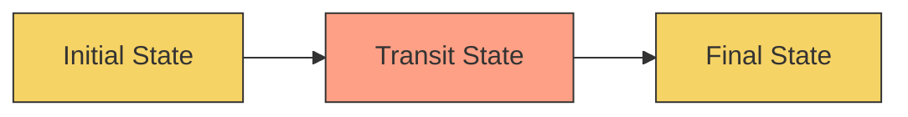
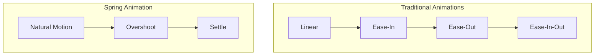

# React Spring

## Introduction

React Spring is a popular animation library for React applications that allows developers to create smooth, physics-based animations. Unlike traditional CSS animations or other animation libraries, React Spring is based on spring physics, which makes animations feel more natural and realistic.

The library provides a way to animate React components with a declarative API that's both powerful and easy to use. It's especially useful for creating interactive user interfaces with fluid transitions and responsive animations.

In this guide, we'll explore React Spring fundamentals, learn how to use its hooks-based API, and build some practical examples to demonstrate its capabilities.

## Getting Started

### Installation

To get started with React Spring, you need to install it in your React project:

```bash
# Using npm
npm install react-spring

# Using yarn
yarn add react-spring
```

### Basic Concepts

Before diving into code examples, let's understand some key concepts:

1. **Spring Physics**: React Spring uses spring physics rather than duration-based animations, which makes movements more natural.

2. **Hooks API**: The modern way to use React Spring is via hooks like `useSpring`, `useSprings`, `useTrail`, `useTransition`, and `useChain`.

3. **Config Parameters**: You can customize how animations behave by adjusting tension, friction, and other parameters.

4. **Interpolation**: Transform animated values into different ranges or formats using interpolation.

## Your First Animation with useSpring

The `useSpring` hook is the most basic hook in React Spring. It allows you to create a single spring animation.

### Basic Example

```jsx
import React, { useState } from 'react';
import { useSpring, animated } from 'react-spring';

function AnimatedBox() {
  const [active, setActive] = useState(false);
  
  const props = useSpring({
    scale: active ? 1.5 : 1,
    opacity: active ? 1 : 0.5,
    rotate: active ? 45 : 0,
    config: { tension: 300, friction: 10 }
  });
  
  return (
    <animated.div
      onClick={() => setActive(!active)}
      style={{
        width: '100px',
        height: '100px',
        background: 'linear-gradient(to right, #f6d365, #fda085)',
        borderRadius: '8px',
        display: 'flex',
        justifyContent: 'center',
        alignItems: 'center',
        cursor: 'pointer',
        transform: props.scale.to(s => `scale(${s}) rotate(${props.rotate.get()}deg)`),
        opacity: props.opacity
      }}
    >
      Click Me!
    </animated.div>
  );
}
```

In this example:
- We create a box that changes scale, opacity, and rotation when clicked
- The `useSpring` hook generates animated values based on the current state
- The `animated.div` component uses these values to render the animation
- When the user clicks, the state changes, and React Spring smoothly animates between states

### Breaking Down the Code

1. **Import the required hooks and components**:
   ```jsx
   import { useSpring, animated } from 'react-spring';
   ```

2. **Define state to control animation**:
   ```jsx
   const [active, setActive] = useState(false);
   ```

3. **Create animated values with useSpring**:
   ```jsx
   const props = useSpring({
     scale: active ? 1.5 : 1,
     opacity: active ? 1 : 0.5,
     rotate: active ? 45 : 0,
     config: { tension: 300, friction: 10 }
   });
   ```

4. **Use animated values with the animated component**:
   ```jsx
   <animated.div style={{ opacity: props.opacity, transform: ... }}>
   ```

5. **Toggle the state on click**:
   ```jsx
   onClick={() => setActive(!active)}
   ```

## Animation Configuration

React Spring provides various configuration options to customize how your animations behave:

```jsx
const springProps = useSpring({
  from: { opacity: 0 },
  to: { opacity: 1 },
  config: {
    tension: 280,     // Controls the speed (higher = faster)
    friction: 20,     // Controls the "bounciness" (higher = less bouncy)
    mass: 1,          // The weight of the spring (higher = slower)
    clamp: false,     // If true, stops the animation when the target is reached
    precision: 0.01,  // Precision threshold for stopping the animation
    velocity: 0,      // Initial velocity
    duration: undefined, // For duration-based animations
    easing: t => t,   // Custom easing function
  }
});
```

React Spring also offers preset configurations:

```jsx
import { useSpring, animated, config } from 'react-spring';

const props = useSpring({
  opacity: 1,
  from: { opacity: 0 },
  config: config.molasses // Use a preset configuration
});

// Available presets:
// config.default
// config.gentle
// config.wobbly
// config.stiff
// config.slow
// config.molasses
```

## Advanced Animation Techniques

### 1. Chaining Animations with useChain

The `useChain` hook allows you to sequence multiple animations:

```jsx
import React, { useState, useRef } from 'react';
import { useSpring, useSprings, animated, useChain } from 'react-spring';

function ChainedAnimation() {
  const [active, setActive] = useState(false);
  
  // Create refs for each animation
  const springRef = useRef();
  const springsRef = useRef();
  
  // First animation (the container)
  const containerProps = useSpring({
    ref: springRef,
    width: active ? '400px' : '100px',
    height: active ? '400px' : '100px',
    background: active ? '#f0f0f0' : '#ff6d6d'
  });
  
  // Second animation (the items inside)
  const itemCount = 4;
  const items = useSprings(
    itemCount,
    Array.from({ length: itemCount }).map((_, i) => ({
      ref: springsRef,
      opacity: active ? 1 : 0,
      transform: active 
        ? `translate3d(0px, 0px, 0px)`
        : `translate3d(0px, ${40 * i}px, 0px)`
    }))
  );
  
  // Chain the animations together
  useChain(
    active ? [springRef, springsRef] : [springsRef, springRef],
    active ? [0, 0.4] : [0, 0.6]
  );
  
  return (
    <div>
      <button onClick={() => setActive(!active)}>
        Toggle Animation
      </button>
      
      <animated.div
        style={{
          ...containerProps,
          display: 'flex',
          flexWrap: 'wrap',
          justifyContent: 'space-around',
          alignItems: 'center',
          padding: '20px',
          margin: '20px',
          borderRadius: '8px'
        }}
      >
        {items.map((style, index) => (
          <animated.div
            key={index}
            style={{
              ...style,
              width: '60px',
              height: '60px',
              background: '#28a745',
              borderRadius: '50%',
              margin: '10px'
            }}
          />
        ))}
      </animated.div>
    </div>
  );
}
```

### 2. Creating Transitions with useTransition

The `useTransition` hook is perfect for animating lists where items can be added or removed:

```jsx
import React, { useState } from 'react';
import { useTransition, animated } from 'react-spring';

function TransitionExample() {
  const [items, setItems] = useState([
    { id: 1, text: 'Item 1' },
    { id: 2, text: 'Item 2' },
    { id: 3, text: 'Item 3' }
  ]);
  
  const transitions = useTransition(items, {
    from: { opacity: 0, height: 0, transform: 'translateY(-20px)' },
    enter: { opacity: 1, height: 50, transform: 'translateY(0px)' },
    leave: { opacity: 0, height: 0, transform: 'translateY(-20px)' },
    keys: item => item.id
  });
  
  const addItem = () => {
    const id = Math.max(0, ...items.map(item => item.id)) + 1;
    setItems([...items, { id, text: `Item ${id}` }]);
  };
  
  const removeItem = id => {
    setItems(items.filter(item => item.id !== id));
  };
  
  return (
    <div>
      <button onClick={addItem}>Add Item</button>
      <div style={{ position: 'relative', marginTop: '20px' }}>
        {transitions((style, item) => (
          <animated.div
            style={{
              ...style,
              marginBottom: '10px',
              padding: '10px',
              background: '#f0f0f0',
              borderRadius: '4px',
              display: 'flex',
              justifyContent: 'space-between'
            }}
          >
            <span>{item.text}</span>
            <button onClick={() => removeItem(item.id)}>Remove</button>
          </animated.div>
        ))}
      </div>
    </div>
  );
}
```

### 3. Creating Parallax Effects

React Spring makes it easy to create parallax scrolling effects:

```jsx
import React from 'react';
import { useSpring, animated } from 'react-spring';
import { useScroll } from 'react-use-gesture';

function ParallaxExample() {
  const [{ scrollY }, setScrollY] = useSpring(() => ({ scrollY: 0 }));
  
  const bind = useScroll(({ xy: [_, y] }) => {
    setScrollY({ scrollY: y });
  });
  
  return (
    <div {...bind()} style={{ height: '200vh', overflow: 'auto' }}>
      <animated.div
        style={{
          position: 'fixed',
          width: '100%',
          height: '100%',
          transform: scrollY.to(y => `translateY(${-y * 0.2}px)`)
        }}
      >
        <div style={{ 
          fontSize: '4rem', 
          textAlign: 'center', 
          marginTop: '40vh',
          color: '#333'
        }}>
          Background Layer
        </div>
      </animated.div>
      
      <animated.div
        style={{
          position: 'fixed',
          width: '100%',
          height: '100%',
          transform: scrollY.to(y => `translateY(${-y * 0.5}px)`)
        }}
      >
        <div style={{ 
          fontSize: '3rem', 
          textAlign: 'center', 
          marginTop: '50vh',
          color: '#666'
        }}>
          Middle Layer
        </div>
      </animated.div>
      
      <animated.div
        style={{
          position: 'fixed',
          width: '100%',
          height: '100%',
          transform: scrollY.to(y => `translateY(${-y * 0.8}px)`)
        }}
      >
        <div style={{ 
          fontSize: '2rem', 
          textAlign: 'center', 
          marginTop: '60vh',
          color: '#999'
        }}>
          Foreground Layer
        </div>
      </animated.div>
      
      <div style={{ height: '200vh' }}></div>
    </div>
  );
}
```

## Real-World Application: Interactive Card Component

Let's build a practical example - an interactive card component that responds to hover and click events:

```jsx
import React, { useState } from 'react';
import { useSpring, animated } from 'react-spring';

function InteractiveCard() {
  const [hovered, setHovered] = useState(false);
  const [clicked, setClicked] = useState(false);
  
  // Animation for the card
  const cardSpring = useSpring({
    transform: hovered 
      ? 'scale(1.05) translateY(-10px)' 
      : 'scale(1) translateY(0px)',
    boxShadow: hovered
      ? '0 20px 25px -5px rgba(0, 0, 0, 0.2)'
      : '0 4px 6px -1px rgba(0, 0, 0, 0.1)',
    config: {
      tension: 300,
      friction: 20
    }
  });
  
  // Animation for the content expansion
  const contentSpring = useSpring({
    height: clicked ? '200px' : '0px',
    opacity: clicked ? 1 : 0,
    overflow: 'hidden',
    config: {
      tension: 280,
      friction: 60
    }
  });
  
  return (
    <animated.div
      style={{
        ...cardSpring,
        width: '300px',
        borderRadius: '12px',
        padding: '20px',
        background: 'white',
        cursor: 'pointer',
        border: '1px solid #eee'
      }}
      onMouseEnter={() => setHovered(true)}
      onMouseLeave={() => setHovered(false)}
      onClick={() => setClicked(!clicked)}
    >
      <h3 style={{ margin: '0 0 10px 0' }}>Interactive Card</h3>
      <p style={{ margin: '0 0 10px 0', fontSize: '14px', color: '#666' }}>
        Hover over me and click to see more content.
      </p>
      
      <animated.div style={contentSpring}>
        <div style={{ padding: '10px 0' }}>
          <p>
            This is the expanded content that appears when you click the card.
            React Spring makes this expansion animation smooth and natural.
          </p>
          <p>
            The physics-based springs ensure that the animation feels realistic
            and responds naturally to user interaction.
          </p>
        </div>
      </animated.div>
    </animated.div>
  );
}
```

This card component showcases several React Spring features:
- Hover effect with transform and shadow changes
- Click-to-expand content with smooth animation
- Realistic movement based on spring physics

## Visualizing Spring Animation

Let's visualize how spring-based animations differ from traditional linear or easing animations:



Traditional animation follows predefined curves:



Spring animations can be configured by adjusting:
- **Mass**: The weight of the object (affects momentum)
- **Tension**: The strength of the spring (affects speed)
- **Friction**: The resistance (affects bounciness)

## Common Patterns and Best Practices

### 1. Combining Multiple Animated Values

You can animate multiple properties simultaneously:

```jsx
const props = useSpring({
  opacity: show ? 1 : 0,
  transform: show ? 'translateY(0px)' : 'translateY(50px)',
  color: show ? '#333' : '#999'
});
```

### 2. Using from-to Pattern

Explicitly define starting and ending states:

```jsx
const props = useSpring({
  from: { 
    opacity: 0, 
    transform: 'translateY(50px)' 
  },
  to: { 
    opacity: 1, 
    transform: 'translateY(0px)' 
  }
});
```

### 3. Async Animations

You can create animations that resolve promises:

```jsx
const animate = async () => {
  await spring.start({ opacity: 1 });
  await spring.start({ scale: 1.5 });
  await spring.start({ scale: 1 });
};
```

### 4. Optimizing Performance

For complex animations, consider using:

```jsx
// Only animate transform and opacity when possible
const props = useSpring({
  transform: `translateX(${position}px)`,
  opacity,
  // Instead of directly animating width, height, etc.
});
```

## Summary

React Spring is a powerful animation library that brings physics-based animations to React applications. Key takeaways from this guide:

1. React Spring uses spring physics instead of duration-based animations to create more natural movements.

2. The hooks-based API (`useSpring`, `useSprings`, `useTrail`, `useTransition`, `useChain`) makes it easy to integrate animations into functional components.

3. You can customize animations by adjusting spring configuration parameters like tension, friction, and mass.

4. React Spring can animate:
   - CSS properties
   - Component entry/exit
   - Lists and transitions
   - Complex sequential animations
   - Gesture-based interactions

5. React Spring performs well because it animates outside of React's render cycle using the requestAnimationFrame API.

By leveraging React Spring, you can create engaging user experiences with smooth, realistic animations that respond naturally to user interaction.

## Additional Resources and Exercises

### Resources

- [React Spring Official Documentation](https://react-spring.dev/)
- [React Spring Examples Repository](https://github.com/pmndrs/react-spring/tree/master/demo/src/sandboxes)
- [React Spring API Reference](https://react-spring.dev/docs/hooks/use-spring)

### Exercises

1. **Basic Animation**
   Create a button that expands and changes color when clicked.

2. **List Transition**
   Build a to-do list with animated entry and exit of items.

3. **Gesture Animation**
   Implement a draggable card that springs back into place when released.

4. **Parallax Effect**
   Create a simple scrolling parallax effect with at least three layers.

5. **Advanced Challenge**
   Build an animated page transition system using React Spring and React Router.

Remember, the key to mastering animations is experimentation and practice. Try adjusting the spring configuration parameters to see how they affect the feel of your animations!