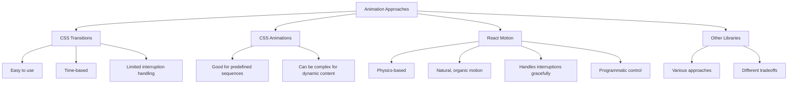

# React Motion

## Introduction

Animation can transform a static React application into a dynamic and engaging user experience. While CSS transitions and animations are useful for simple effects, complex animations often require more sophisticated tools. **React Motion** is a popular library that brings physics-based animations to React applications.

Unlike traditional animation libraries that rely on duration and easing functions, React Motion simulates physical forces like springs and friction to create animations that feel natural. This approach results in more realistic motion and helps interfaces feel responsive and alive.

In this tutorial, we'll explore React Motion's core concepts, learn how to implement various animations, and build practical examples you can use in your own projects.

## Getting Started with React Motion

### Installation

First, let's install React Motion in your React project:

```bash
# Using npm
npm install react-motion

# Using yarn
yarn add react-motion
```

### Basic Components and Concepts

React Motion provides three main components:

1. **`<Motion>`** - The basic animation component
2. **`<StaggeredMotion>`** - For coordinated animations across multiple elements
3. **`<TransitionMotion>`** - For animating elements entering and leaving the DOM

The library works on the concept of a **spring** - a physics model that defines how values change over time.

## Using the Motion Component

The `Motion` component is the simplest way to implement animations with React Motion. Let's start with a basic example:

```jsx
import React from 'react';
import { Motion, spring } from 'react-motion';

const SimpleAnimation = () => {
  const [isExpanded, setIsExpanded] = React.useState(false);

  return (
    <div>
      <button onClick={() => setIsExpanded(!isExpanded)}>
        {isExpanded ? 'Shrink' : 'Expand'}
      </button>
      <Motion style={{ width: spring(isExpanded ? 300 : 100) }}>
        {interpolatedStyles => (
          <div
            style={{
              width: interpolatedStyles.width,
              height: 50,
              background: 'lightblue',
              borderRadius: 4
            }}
          />
        )}
      </Motion>
    </div>
  );
};
```

In this example:
1. We define a component with a toggling state called `isExpanded`
2. The `Motion` component takes a `style` prop with our target animated values
3. The `spring()` function converts our static target value into a spring configuration
4. We render our animated element using the interpolated values provided by React Motion

When you click the button, the blue rectangle will smoothly animate between 100px and 300px width.

### Configuring Springs

Springs can be configured to adjust how the animation feels:

```jsx
// Default spring (medium stiffness and damping)
spring(300)

// Custom spring with higher stiffness (faster movement)
spring(300, { stiffness: 170, damping: 20 })

// "Wobbly" spring (high stiffness, low damping)
spring(300, { stiffness: 300, damping: 10 })

// "Molasses" spring (low stiffness, high damping)
spring(300, { stiffness: 50, damping: 30 })
```

The spring configuration controls:
- **stiffness**: How energetic the animation is (default: 170)
- **damping**: How quickly the animation settles (default: 26)
- **precision**: Precision threshold for stopping the animation (default: 0.01)

## Creating More Complex Animations

Let's animate multiple properties simultaneously:

```jsx
import React from 'react';
import { Motion, spring } from 'react-motion';

const CardAnimation = () => {
  const [isHovered, setIsHovered] = React.useState(false);

  return (
    <Motion 
      style={{
        scale: spring(isHovered ? 1.1 : 1),
        shadow: spring(isHovered ? 15 : 1),
        rotate: spring(isHovered ? 5 : 0)
      }}
    >
      {({ scale, shadow, rotate }) => (
        <div
          onMouseEnter={() => setIsHovered(true)}
          onMouseLeave={() => setIsHovered(false)}
          style={{
            transform: `scale(${scale}) rotate(${rotate}deg)`,
            boxShadow: `0px ${shadow}px ${shadow * 2}px rgba(0,0,0,0.2)`,
            padding: 20,
            background: 'white',
            borderRadius: 4,
            width: 200,
            textAlign: 'center',
            cursor: 'pointer',
            transition: 'background 0.2s'
          }}
        >
          <h3>Hover me!</h3>
          <p>This card animates multiple properties</p>
        </div>
      )}
    </Motion>
  );
};
```

This example creates a card that responds to hover by:
1. Scaling up slightly
2. Increasing its shadow depth
3. Slightly rotating

## Using StaggeredMotion

The `StaggeredMotion` component is useful when you want to create animations where elements follow each other in sequence, like dominoes falling.

```jsx
import React from 'react';
import { StaggeredMotion, spring } from 'react-motion';

const StaggeredMenuAnimation = () => {
  const [isOpen, setIsOpen] = React.useState(false);
  
  const items = ['Home', 'Products', 'About', 'Contact', 'Settings'];
  
  return (
    <div style={{ position: 'relative', height: 300 }}>
      <button 
        onClick={() => setIsOpen(!isOpen)}
        style={{
          position: 'absolute',
          bottom: 0,
          left: 0,
          zIndex: 10
        }}
      >
        {isOpen ? 'Close' : 'Open'} Menu
      </button>
      
      <StaggeredMotion
        defaultStyles={items.map(() => ({ y: 100, opacity: 0 }))}
        styles={prevInterpolatedStyles => prevInterpolatedStyles.map((_, i) => {
          return i === 0
            ? { y: spring(isOpen ? 0 : 100), opacity: spring(isOpen ? 1 : 0) }
            : { 
                y: spring(prevInterpolatedStyles[i - 1].y), 
                opacity: spring(prevInterpolatedStyles[i - 1].opacity)
              };
        })}
      >
        {interpolatingStyles => (
          <div>
            {interpolatingStyles.map((style, i) => (
              <div
                key={i}
                style={{
                  transform: `translateY(${style.y}px)`,
                  opacity: style.opacity,
                  background: 'royalblue',
                  color: 'white',
                  padding: 10,
                  margin: 5,
                  borderRadius: 4,
                  width: 120,
                  position: 'absolute',
                  bottom: 50 + i * 40
                }}
              >
                {items[i]}
              </div>
            ))}
          </div>
        )}
      </StaggeredMotion>
    </div>
  );
};
```

In this example:
1. We create a staggered menu animation that sequentially reveals items
2. Each item's animation depends on the previous item's current position
3. The result is a smooth cascade effect when opening the menu

## Using TransitionMotion for Elements Entering and Leaving

`TransitionMotion` handles the common case of animating elements as they enter or leave:

```jsx
import React from 'react';
import { TransitionMotion, spring, presets } from 'react-motion';

const TodoList = () => {
  const [items, setItems] = React.useState([
    { key: 'item0', text: 'Learn React Motion' },
    { key: 'item1', text: 'Build cool animations' }
  ]);
  const [newItemText, setNewItemText] = React.useState('');
  
  const handleAdd = () => {
    if (newItemText.trim() === '') return;
    const newItem = {
      key: `item${Date.now()}`,
      text: newItemText
    };
    setItems([...items, newItem]);
    setNewItemText('');
  };
  
  const handleRemove = (key) => {
    setItems(items.filter(item => item.key !== key));
  };
  
  return (
    <div>
      <div style={{ marginBottom: 20 }}>
        <input
          type="text"
          value={newItemText}
          onChange={e => setNewItemText(e.target.value)}
          placeholder="Add new item"
        />
        <button onClick={handleAdd}>Add</button>
      </div>
      
      <TransitionMotion
        willLeave={() => ({ opacity: spring(0), height: spring(0) })}
        willEnter={() => ({ opacity: 0, height: 0 })}
        styles={items.map(item => ({
          key: item.key,
          style: { opacity: spring(1), height: spring(60) },
          data: item
        }))}
      >
        {interpolatedStyles => (
          <div>
            {interpolatedStyles.map(config => (
              <div
                key={config.key}
                style={{
                  opacity: config.style.opacity,
                  height: config.style.height,
                  overflow: 'hidden',
                  padding: '10px 20px',
                  margin: '5px 0',
                  background: '#f5f5f5',
                  borderRadius: 4,
                  display: 'flex',
                  justifyContent: 'space-between',
                  alignItems: 'center'
                }}
              >
                <span>{config.data.text}</span>
                <button onClick={() => handleRemove(config.key)}>Delete</button>
              </div>
            ))}
          </div>
        )}
      </TransitionMotion>
    </div>
  );
};
```

In this Todo list example:
1. When adding an item, it grows and fades in
2. When removing an item, it shrinks and fades out
3. The list naturally readjusts as items enter and leave

## Real-World Application: Animated Dropdown Menu

Let's build a practical dropdown menu component with React Motion:

```jsx
import React from 'react';
import { Motion, spring } from 'react-motion';

const Dropdown = ({ title, children }) => {
  const [isOpen, setIsOpen] = React.useState(false);
  
  return (
    <div className="dropdown">
      <button 
        className="dropdown-toggle" 
        onClick={() => setIsOpen(!isOpen)}
      >
        {title}
        <Motion style={{ rotation: spring(isOpen ? 180 : 0) }}>
          {({ rotation }) => (
            <span 
              style={{ 
                display: 'inline-block',
                marginLeft: 8,
                transform: `rotate(${rotation}deg)`
              }}
            >
              ▼
            </span>
          )}
        </Motion>
      </button>
      
      <Motion 
        style={{ 
          maxHeight: spring(isOpen ? 1000 : 0),
          opacity: spring(isOpen ? 1 : 0)
        }}
      >
        {({ maxHeight, opacity }) => (
          <div 
            className="dropdown-menu"
            style={{
              maxHeight: `${maxHeight}px`,
              opacity,
              overflow: 'hidden',
              border: '1px solid #eee',
              borderRadius: 4,
              marginTop: 4
            }}
          >
            {children}
          </div>
        )}
      </Motion>
    </div>
  );
};

// Usage example
const DropdownExample = () => (
  <div style={{ width: 200 }}>
    <Dropdown title="User Settings">
      <div style={{ padding: 10 }}>
        <p>Profile</p>
        <p>Account</p>
        <p>Preferences</p>
        <p>Logout</p>
      </div>
    </Dropdown>
  </div>
);
```

This dropdown:
1. Smoothly expands and collapses its content
2. Rotates the arrow indicator
3. Fades content in/out during the transition

## Comparing Animation Approaches

To understand why React Motion's physics-based approach is beneficial, let's compare different animation methods:



## Best Practices

When using React Motion, consider these best practices:

1. **Start simple**: Begin with basic animations before building more complex ones
2. **Use appropriate spring settings**: Adjust stiffness and damping to match the feel of your UI
3. **Avoid animating too many elements**: Performance can suffer when animating dozens of elements
4. **Combine with CSS**: Use CSS for simple transitions and React Motion for complex physics-based animations
5. **Use interpolating functions**: Transform your animated values to create more complex effects

## Advanced Example: Draggable Element with Bounds

Let's create a more advanced example with a draggable element that bounces when it hits boundaries:

```jsx
import React, { useState } from 'react';
import { Motion, spring } from 'react-motion';

const DraggableBox = () => {
  const [position, setPosition] = useState({ x: 50, y: 50 });
  const [dragging, setDragging] = useState(false);
  const [dragOrigin, setDragOrigin] = useState({ x: 0, y: 0 });
  
  const containerStyle = {
    width: 500,
    height: 300,
    border: '2px dashed #ccc',
    position: 'relative'
  };
  
  const boxSize = { width: 80, height: 80 };
  const bounds = {
    minX: 0,
    maxX: containerStyle.width - boxSize.width,
    minY: 0,
    maxY: containerStyle.height - boxSize.height
  };
  
  const handleMouseDown = (e) => {
    setDragging(true);
    setDragOrigin({
      x: e.clientX - position.x,
      y: e.clientY - position.y
    });
    
    // Prevent text selection during drag
    e.preventDefault();
  };
  
  const handleMouseMove = (e) => {
    if (dragging) {
      const newX = e.clientX - dragOrigin.x;
      const newY = e.clientY - dragOrigin.y;
      
      setPosition({
        x: Math.max(bounds.minX, Math.min(bounds.maxX, newX)),
        y: Math.max(bounds.minY, Math.min(bounds.maxY, newY))
      });
    }
  };
  
  const handleMouseUp = () => {
    setDragging(false);
  };
  
  React.useEffect(() => {
    if (dragging) {
      window.addEventListener('mousemove', handleMouseMove);
      window.addEventListener('mouseup', handleMouseUp);
    }
    
    return () => {
      window.removeEventListener('mousemove', handleMouseMove);
      window.removeEventListener('mouseup', handleMouseUp);
    };
  }, [dragging, dragOrigin]);
  
  const springConfig = { stiffness: 300, damping: 20 };
  
  return (
    <div 
      style={containerStyle}
      className="draggable-container"
    >
      <Motion 
        style={{ 
          x: dragging ? position.x : spring(position.x, springConfig),
          y: dragging ? position.y : spring(position.y, springConfig)
        }}
      >
        {interpolatedValues => (
          <div
            style={{
              width: boxSize.width,
              height: boxSize.height,
              borderRadius: 8,
              backgroundColor: '#3498db',
              position: 'absolute',
              left: interpolatedValues.x,
              top: interpolatedValues.y,
              cursor: dragging ? 'grabbing' : 'grab',
              display: 'flex',
              justifyContent: 'center',
              alignItems: 'center',
              color: 'white',
              userSelect: 'none'
            }}
            onMouseDown={handleMouseDown}
          >
            Drag Me
          </div>
        )}
      </Motion>
    </div>
  );
};
```

This example creates a draggable box that:
1. Responds to mouse drag events
2. Stays within container boundaries
3. Uses physics-based animation when released or when it hits boundaries

## Summary

React Motion provides a powerful system for creating fluid, natural animations in React applications by using physics-based principles. Key takeaways include:

- React Motion uses springs instead of durations for more natural movement
- The library offers three main components: `Motion`, `StaggeredMotion`, and `TransitionMotion`
- Springs can be configured with different stiffness and damping values
- Physics-based animations handle interruptions more gracefully than time-based animations
- React Motion works well for complex UI interactions like draggable elements

By using React Motion, you can create interfaces that feel responsive and alive, enhancing user experience and making your applications stand out.

## Additional Resources

To deepen your understanding of React Motion, explore these resources:

1. [React Motion GitHub repository](https://github.com/chenglou/react-motion)
2. [The Physics of JavaScript](https://www.smashingmagazine.com/2017/09/animation-interaction-techniques-webgl/) - understanding the physics behind animations
3. [Animation principles for UX](https://www.invisionapp.com/inside-design/animation-principles-for-ux/) - design considerations for animations

## Exercises

1. **Simple Toggle Button**: Create a button that smoothly transitions between two states using React Motion.

2. **Animated Navigation Menu**: Build a side navigation that slides in and out with natural motion.

3. **Interactive Card Gallery**: Create a set of cards that respond to hover with staggered animations.

4. **Custom Loading Spinner**: Build a loading indicator with physics-based rotation and scaling.

5. **Advanced Challenge**: Create a sortable list where items animate to their new positions when reordered.