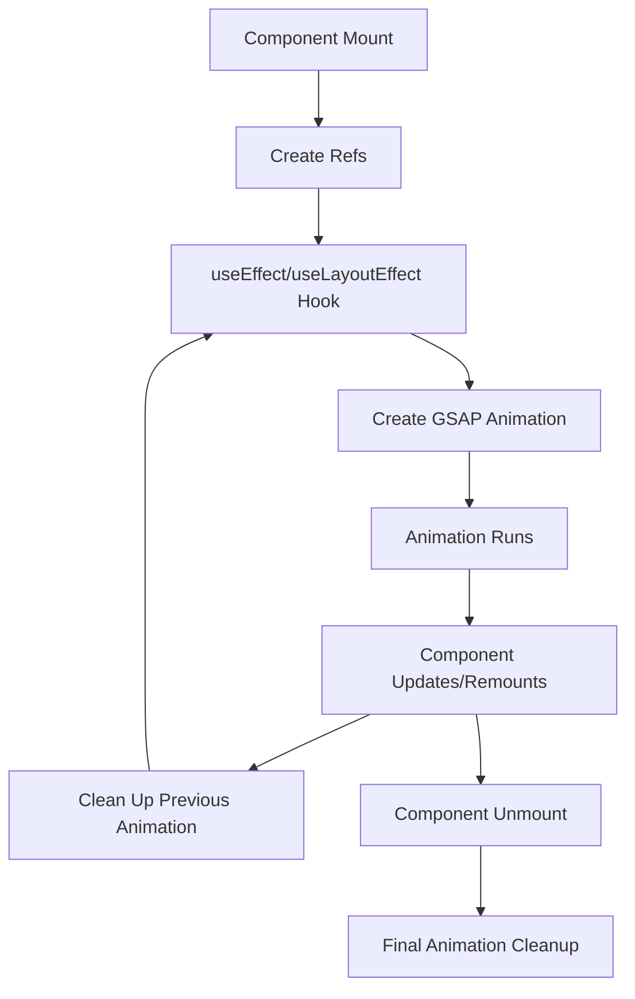

# React GSAP Integration

## Introduction

GSAP (GreenSock Animation Platform) is one of the most powerful animation libraries available for the web. When combined with React, it gives developers the ability to create high-performance, complex animations with minimal effort. This guide will walk you through integrating GSAP with React applications, from basic setup to creating impressive animations.

GSAP excels in:
- Performance optimization
- Cross-browser compatibility
- Animation sequencing
- Complex motion paths
- Fine-grained control over animations

## Getting Started with GSAP in React

### Installation

First, you'll need to install GSAP in your React project:

```bash
npm install gsap
# or
yarn add gsap
```

### Basic Setup

To use GSAP in a React component, you'll import it and then create animations using React's lifecycle methods or hooks.

```jsx
import React, { useEffect, useRef } from 'react';
import { gsap } from 'gsap';

function SimpleAnimation() {
  const boxRef = useRef(null);

  useEffect(() => {
    // GSAP animation
    gsap.to(boxRef.current, {
      x: 100,
      duration: 1,
      backgroundColor: '#8d44ad',
      ease: 'power2.out'
    });
  }, []);

  return (
    <div 
      ref={boxRef} 
      style={{ 
        width: '100px', 
        height: '100px', 
        background: '#3498db' 
      }}
    >
      Animate Me
    </div>
  );
}

export default SimpleAnimation;
```

In this example, when the component mounts, the blue box will animate 100 pixels to the right while changing its color to purple over 1 second.

## Core GSAP Concepts in React

### Using Refs with GSAP

In React, we use refs to target DOM elements for manipulation with GSAP:

```jsx
import React, { useEffect, useRef } from 'react';
import { gsap } from 'gsap';

function MultipleElements() {
  const elementsRef = useRef([]);
  
  useEffect(() => {
    // Animate multiple elements with different delays
    elementsRef.current.forEach((element, index) => {
      gsap.from(element, {
        y: -50,
        opacity: 0,
        delay: index * 0.2,
        duration: 0.8,
        ease: 'power3.out'
      });
    });
  }, []);

  return (
    <div className="container">
      {[0, 1, 2, 3].map((item, i) => (
        <div
          key={i}
          ref={(el) => (elementsRef.current[i] = el)}
          className="box"
          style={{
            width: '75px',
            height: '75px',
            margin: '10px',
            background: '#2ecc71',
            display: 'inline-block'
          }}
        >
          Box {item + 1}
        </div>
      ))}
    </div>
  );
}

export default MultipleElements;
```

### Timeline Animations

GSAP's Timeline feature is perfect for creating sequences of animations:

```jsx
import React, { useEffect, useRef } from 'react';
import { gsap } from 'gsap';

function TimelineAnimation() {
  const boxRef = useRef(null);
  const circleRef = useRef(null);
  const triangleRef = useRef(null);
  
  useEffect(() => {
    const tl = gsap.timeline({ defaults: { duration: 1 } });
    
    // Sequential animations
    tl.to(boxRef.current, { x: 100, ease: 'power1.out' })
      .to(circleRef.current, { y: 50, ease: 'bounce.out' })
      .to(triangleRef.current, { rotation: 360, ease: 'none' });
    
    return () => {
      // Cleanup animation
      tl.kill();
    };
  }, []);
  
  return (
    <div className="timeline-demo">
      <div 
        ref={boxRef}
        style={{ width: '50px', height: '50px', background: '#e74c3c' }}
      ></div>
      
      <div 
        ref={circleRef}
        style={{ 
          width: '50px', 
          height: '50px', 
          borderRadius: '50%', 
          background: '#f39c12',
          marginTop: '20px' 
        }}
      ></div>
      
      <div 
        ref={triangleRef}
        style={{
          width: '0',
          height: '0',
          borderLeft: '25px solid transparent',
          borderRight: '25px solid transparent',
          borderBottom: '50px solid #27ae60',
          marginTop: '20px'
        }}
      ></div>
    </div>
  );
}

export default TimelineAnimation;
```

## Handling Component Lifecycles

When using GSAP in React, it's important to properly manage animations when components mount, update, or unmount.

### Using the useLayoutEffect Hook

For animations that need to run before the browser paints, use `useLayoutEffect`:

```jsx
import React, { useLayoutEffect, useRef } from 'react';
import { gsap } from 'gsap';

function LayoutEffectAnimation() {
  const boxRef = useRef(null);
  
  useLayoutEffect(() => {
    // This runs synchronously after all DOM mutations
    gsap.set(boxRef.current, { opacity: 0, y: 20 });
    
    const animation = gsap.to(boxRef.current, {
      opacity: 1,
      y: 0,
      duration: 0.8,
      ease: 'power3.out'
    });
    
    return () => animation.kill();
  }, []);
  
  return (
    <div 
      ref={boxRef}
      style={{ 
        width: '200px', 
        padding: '20px', 
        background: '#9b59b6',
        color: 'white'
      }}
    >
      This appears with an entrance animation!
    </div>
  );
}

export default LayoutEffectAnimation;
```

### Cleaning Up Animations

It's crucial to clean up GSAP animations when components unmount to prevent memory leaks:

```jsx
import React, { useState, useEffect, useRef } from 'react';
import { gsap } from 'gsap';

function ToggleAnimation() {
  const [isVisible, setIsVisible] = useState(true);
  const elementRef = useRef(null);
  const animationRef = useRef(null);
  
  useEffect(() => {
    if (isVisible && elementRef.current) {
      // Store the animation for later cleanup
      animationRef.current = gsap.to(elementRef.current, {
        rotation: 360,
        repeat: -1, // Infinite repeat
        duration: 2,
        ease: 'linear'
      });
    }
    
    return () => {
      // Clean up animation when component updates or unmounts
      if (animationRef.current) {
        animationRef.current.kill();
      }
    };
  }, [isVisible]);
  
  return (
    <div>
      <button onClick={() => setIsVisible(!isVisible)}>
        {isVisible ? 'Hide' : 'Show'} Element
      </button>
      
      {isVisible && (
        <div 
          ref={elementRef}
          style={{
            width: '100px',
            height: '100px',
            background: '#1abc9c',
            margin: '20px auto'
          }}
        ></div>
      )}
    </div>
  );
}

export default ToggleAnimation;
```

## Creating a GSAP Custom Hook

For better code reusability, you can create a custom hook for GSAP animations:

```jsx
// useGsapAnimation.js
import { useEffect, useRef } from 'react';
import { gsap } from 'gsap';

export function useGsapAnimation(animationFunction, dependencies = []) {
  const elementRef = useRef(null);
  const animationRef = useRef(null);
  
  useEffect(() => {
    if (elementRef.current) {
      // Store animation instance
      animationRef.current = animationFunction(elementRef.current);
    }
    
    // Cleanup function
    return () => {
      if (animationRef.current) {
        animationRef.current.kill();
      }
    };
  }, dependencies);
  
  return elementRef;
}
```

Now you can use this custom hook in your components:

```jsx
import React from 'react';
import { gsap } from 'gsap';
import { useGsapAnimation } from './useGsapAnimation';

function FadeInComponent() {
  const fadeIn = (element) => {
    return gsap.fromTo(
      element,
      { opacity: 0, y: 20 },
      { opacity: 1, y: 0, duration: 1 }
    );
  };
  
  const elementRef = useGsapAnimation(fadeIn);
  
  return (
    <div 
      ref={elementRef}
      style={{ 
        padding: '20px', 
        background: '#3498db', 
        color: 'white',
        borderRadius: '5px'
      }}
    >
      This component fades in smoothly!
    </div>
  );
}

export default FadeInComponent;
```

## Advanced GSAP with React

### GSAP ScrollTrigger Plugin

ScrollTrigger is a powerful GSAP plugin for creating scroll-based animations:

```jsx
import React, { useEffect, useRef } from 'react';
import { gsap } from 'gsap';
import { ScrollTrigger } from 'gsap/ScrollTrigger';

// Register the plugin
gsap.registerPlugin(ScrollTrigger);

function ScrollAnimation() {
  const sectionRef = useRef(null);
  
  useEffect(() => {
    const element = sectionRef.current;
    
    gsap.fromTo(
      element.querySelector('.animated-text'),
      {
        x: -100,
        opacity: 0
      },
      {
        x: 0,
        opacity: 1,
        duration: 1,
        scrollTrigger: {
          trigger: element,
          start: 'top 80%', // when the top of the element hits 80% from the top of the viewport
          end: 'bottom 20%',
          toggleActions: 'play none none reverse',
          // options: play, pause, resume, reverse, restart, reset, complete, none
          markers: false // set to true during development
        }
      }
    );
    
    return () => {
      // Clean up ScrollTrigger
      ScrollTrigger.getAll().forEach(trigger => trigger.kill());
    };
  }, []);
  
  return (
    <section 
      ref={sectionRef}
      style={{ 
        height: '100vh', 
        display: 'flex', 
        alignItems: 'center', 
        justifyContent: 'center',
        background: '#34495e'
      }}
    >
      <h2 
        className="animated-text"
        style={{ 
          fontSize: '2.5rem', 
          color: 'white' 
        }}
      >
        Scroll to see me animate!
      </h2>
    </section>
  );
}

export default ScrollAnimation;
```

### Animating React Component State

You can use GSAP to animate between state changes:

```jsx
import React, { useState, useEffect, useRef } from 'react';
import { gsap } from 'gsap';

function AnimatedCounter() {
  const [count, setCount] = useState(0);
  const countRef = useRef(null);
  const countValueRef = useRef(0);
  
  const incrementCount = () => {
    setCount(prevCount => prevCount + 25);
  };
  
  useEffect(() => {
    // Animate the number changing
    gsap.to(countValueRef, {
      duration: 1,
      value: count,
      roundProps: 'value',
      ease: 'power3.out',
      onUpdate: () => {
        if (countRef.current) {
          countRef.current.textContent = countValueRef.value;
        }
      }
    });
  }, [count]);
  
  return (
    <div style={{ textAlign: 'center', padding: '20px' }}>
      <div
        style={{
          fontSize: '3rem',
          margin: '20px',
          fontWeight: 'bold',
          color: '#e74c3c'
        }}
      >
        <span ref={countRef}>0</span>
      </div>
      
      <button
        onClick={incrementCount}
        style={{
          padding: '10px 20px',
          background: '#3498db',
          color: 'white',
          border: 'none',
          borderRadius: '5px',
          cursor: 'pointer'
        }}
      >
        Increment by 25
      </button>
    </div>
  );
}

export default AnimatedCounter;
```

## Real-World Application: Animated Page Transitions

Here's a practical example of using GSAP for page transitions in a React application:

```jsx
import React, { useRef, useEffect } from 'react';
import { gsap } from 'gsap';

// This would be used with a router in a real application
function PageTransition({ children, location }) {
  const pageRef = useRef(null);
  
  useEffect(() => {
    // Page enter animation
    const tl = gsap.timeline();
    
    tl.fromTo(
      pageRef.current,
      { opacity: 0, y: 20 },
      { opacity: 1, y: 0, duration: 0.6, ease: 'power3.out' }
    );
    
    return () => {
      // Page exit animation can be handled here
      tl.kill();
    };
  }, [location]);
  
  return <div ref={pageRef}>{children}</div>;
}

// Example usage with mock pages
function AnimatedWebsite() {
  const [currentPage, setCurrentPage] = useState('home');
  
  const renderPage = () => {
    switch (currentPage) {
      case 'home':
        return <HomePage />;
      case 'about':
        return <AboutPage />;
      case 'contact':
        return <ContactPage />;
      default:
        return <HomePage />;
    }
  };
  
  return (
    <div>
      <nav style={{ marginBottom: '20px' }}>
        <button onClick={() => setCurrentPage('home')}>Home</button>
        <button onClick={() => setCurrentPage('about')}>About</button>
        <button onClick={() => setCurrentPage('contact')}>Contact</button>
      </nav>
      
      <PageTransition location={currentPage}>
        {renderPage()}
      </PageTransition>
    </div>
  );
}

function HomePage() {
  return <div><h1>Home Page</h1><p>Welcome to our website!</p></div>;
}

function AboutPage() {
  return <div><h1>About Page</h1><p>Learn about our company...</p></div>;
}

function ContactPage() {
  return <div><h1>Contact Page</h1><p>Get in touch with us!</p></div>;
}

export default AnimatedWebsite;
```

## GSAP Animation Flow in React



## Performance Considerations

When using GSAP with React, keep these performance tips in mind:

1. **Clean up animations** when components unmount to prevent memory leaks
2. **Use `useLayoutEffect` instead of `useEffect`** for animations that need to run before browser paint
3. **Target specific properties** instead of animating everything
4. **Use `will-change` CSS property** for elements that will be animated frequently
5. **Leverage GSAP's performance optimizations** like `force3D` for 3D transforms
6. **Consider using `gsap.context()`** for complex components with multiple animations

```jsx
import React, { useLayoutEffect, useRef } from 'react';
import { gsap } from 'gsap';

function OptimizedAnimations() {
  const containerRef = useRef(null);
  
  useLayoutEffect(() => {
    let ctx = gsap.context(() => {
      // This creates a scoped GSAP context
      gsap.to(".box", {
        rotation: 360,
        duration: 2,
        stagger: 0.1,
        ease: "power1.inOut"
      });
    }, containerRef); // scope to containerRef
    
    return () => ctx.revert(); // cleanup
  }, []);
  
  return (
    <div ref={containerRef}>
      <div className="box" style={{ width: '50px', height: '50px', background: 'red' }}></div>
      <div className="box" style={{ width: '50px', height: '50px', background: 'blue' }}></div>
      <div className="box" style={{ width: '50px', height: '50px', background: 'green' }}></div>
    </div>
  );
}

export default OptimizedAnimations;
```

## Summary

GSAP integration with React provides a powerful combination for creating smooth, high-performance animations in web applications. In this guide, you've learned:

- How to set up GSAP in a React project
- Different ways to target and animate elements using refs
- Creating complex animation sequences with GSAP Timeline
- Managing animations properly during component lifecycle changes
- Building reusable animation hooks
- Using advanced GSAP features like ScrollTrigger
- Practical examples for real-world scenarios
- Performance optimization techniques

By applying these techniques, you can enhance your React applications with professional-grade animations that improve user experience and add visual appeal to your interfaces.

## Additional Resources

- Practice building a simple animated card component
- Create a landing page with scroll-triggered animations
- Implement a loading spinner with GSAP animations
- Build a photo gallery with animated transitions
- Experiment with GSAP's morphSVG plugin for advanced SVG animations

As you continue exploring GSAP and React integration, remember that the best animations enhance the user experience without being distracting. Keep performance in mind and use animations purposefully to guide users through your application.