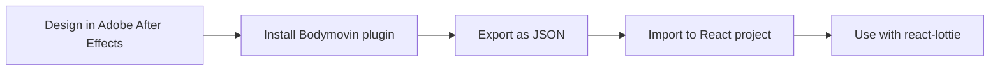

# React Lottie

## Introduction

Lottie is an open-source animation library that renders Adobe After Effects animations in real-time, allowing developers to use complex animations without the performance hit of traditional animation formats. In this tutorial, we'll explore how to use Lottie animations in React applications to create engaging user interfaces with smooth, high-quality animations.

Lottie offers several benefits over traditional animation methods:

- **Small file size**: Lottie animations are JSON-based and typically much smaller than GIF or video files
- **Scalability**: Lottie animations are vector-based, so they look crisp at any size
- **Interactivity**: Animations can be controlled programmatically (play, pause, speed, etc.)
- **Performance**: Lottie animations are rendered efficiently using the device's graphics capabilities

## Getting Started with React Lottie

### Installation

To use Lottie animations in React, we'll use the popular `react-lottie` package. Let's start by installing it:

```bash
npm install react-lottie
```

Or if you're using yarn:

```bash
yarn add react-lottie
```

### Basic Usage

Let's create a simple Lottie animation component:

```jsx
import React from 'react';
import Lottie from 'react-lottie';
import animationData from './animations/loading.json'; // Your animation JSON file

const LottieAnimation = () => {
  const defaultOptions = {
    loop: true,
    autoplay: true,
    animationData: animationData,
    rendererSettings: {
      preserveAspectRatio: 'xMidYMid slice'
    }
  };

  return (
    <div>
      <h2>My First Lottie Animation</h2>
      <Lottie 
        options={defaultOptions}
        height={400}
        width={400}
      />
    </div>
  );
};

export default LottieAnimation;
```

In this example, we:
1. Import the `Lottie` component from `react-lottie`
2. Import our animation JSON file (you can find free Lottie animations on websites like [LottieFiles](https://lottiefiles.com/))
3. Configure the animation options (loop, autoplay, etc.)
4. Render the animation with specific dimensions

## Controlling Animations

One of the great features of Lottie is the ability to control animations programmatically. Let's create a component with play/pause functionality:

```jsx
import React, { useState } from 'react';
import Lottie from 'react-lottie';
import animationData from './animations/rocket.json';

const ControlledLottieAnimation = () => {
  const [isStopped, setIsStopped] = useState(false);
  const [isPaused, setIsPaused] = useState(false);

  const defaultOptions = {
    loop: true,
    autoplay: true,
    animationData: animationData,
    rendererSettings: {
      preserveAspectRatio: 'xMidYMid slice'
    }
  };

  return (
    <div>
      <h2>Controllable Animation</h2>
      <Lottie 
        options={defaultOptions}
        height={300}
        width={300}
        isStopped={isStopped}
        isPaused={isPaused}
      />
      <button onClick={() => setIsPaused(!isPaused)}>
        {isPaused ? 'Play' : 'Pause'}
      </button>
      <button onClick={() => setIsStopped(!isStopped)}>
        {isStopped ? 'Start' : 'Stop'}
      </button>
    </div>
  );
};

export default ControlledLottieAnimation;
```

This example demonstrates how to:
1. Create state variables to track the animation status
2. Use the `isStopped` and `isPaused` props to control the animation
3. Toggle animation state with buttons

## Animation Progress Control

You can also control the specific point or progress of an animation. This is useful for animations that should sync with user interactions:

```jsx
import React, { useState } from 'react';
import Lottie from 'react-lottie';
import animationData from './animations/progress-bar.json';

const ProgressControlAnimation = () => {
  const [animationProgress, setAnimationProgress] = useState(0);

  const defaultOptions = {
    loop: false,
    autoplay: false,
    animationData: animationData,
    rendererSettings: {
      preserveAspectRatio: 'xMidYMid slice'
    }
  };

  return (
    <div>
      <h2>Progress-Controlled Animation</h2>
      <Lottie 
        options={defaultOptions}
        height={200}
        width={400}
        isStopped={false}
        isPaused={false}
        direction={1}
        speed={1}
        segments={[0, 100]}
        eventListeners={[
          {
            eventName: 'enterFrame',
            callback: ({ currentTime, totalTime }) => {
              console.log(`Current time: ${currentTime} / Total time: ${totalTime}`);
            }
          }
        ]}
      />
      <input 
        type="range" 
        min="0" 
        max="100" 
        value={animationProgress} 
        onChange={(e) => setAnimationProgress(parseInt(e.target.value))} 
      />
      <button onClick={() => {
        const anim = document.querySelector('lottie-player');
        if (anim) {
          anim.seek(`${animationProgress}%`);
        }
      }}>
        Set Progress
      </button>
    </div>
  );
};

export default ProgressControlAnimation;
```

In this example, we:
1. Create a slider to represent animation progress
2. Add event listeners to track animation progress
3. Use the `seek` method to jump to specific points in the animation

## Real-world Example: Loading State

One common use of Lottie animations is to create engaging loading states. Let's implement a loading component:

```jsx
import React, { useState, useEffect } from 'react';
import Lottie from 'react-lottie';
import loadingAnimation from './animations/loading-circle.json';
import successAnimation from './animations/success-checkmark.json';
import errorAnimation from './animations/error-x.json';

const LoadingState = ({ status = 'loading', onComplete }) => {
  const [animationData, setAnimationData] = useState(loadingAnimation);
  const [loop, setLoop] = useState(true);

  useEffect(() => {
    if (status === 'success') {
      setAnimationData(successAnimation);
      setLoop(false);
      setTimeout(() => onComplete && onComplete(), 2000);
    } else if (status === 'error') {
      setAnimationData(errorAnimation);
      setLoop(false);
      setTimeout(() => onComplete && onComplete(), 2000);
    } else {
      setAnimationData(loadingAnimation);
      setLoop(true);
    }
  }, [status, onComplete]);

  const defaultOptions = {
    loop,
    autoplay: true,
    animationData,
    rendererSettings: {
      preserveAspectRatio: 'xMidYMid slice'
    }
  };

  return (
    <div className="loading-container">
      <Lottie 
        options={defaultOptions}
        height={200}
        width={200}
      />
      <p>{status === 'loading' ? 'Loading...' : status === 'success' ? 'Success!' : 'Error!'}</p>
    </div>
  );
};

// Example usage:
const LoadingExample = () => {
  const [loadingStatus, setLoadingStatus] = useState('loading');
  
  useEffect(() => {
    // Simulate API call
    setTimeout(() => {
      // Randomly show success or error
      setLoadingStatus(Math.random() > 0.5 ? 'success' : 'error');
    }, 3000);
  }, []);

  return (
    <div>
      <h2>API Request with Loading Animation</h2>
      <LoadingState 
        status={loadingStatus}
        onComplete={() => console.log('Animation completed!')}
      />
      <button onClick={() => setLoadingStatus('loading')}>
        Retry Request
      </button>
    </div>
  );
};

export default LoadingExample;
```

This example demonstrates:
1. Different animations for different states (loading, success, error)
2. Using `useEffect` to change animations based on props
3. Callback functionality when animations complete

## Real-world Example: Animated Onboarding

Let's create an onboarding carousel with Lottie animations:

```jsx
import React, { useState } from 'react';
import Lottie from 'react-lottie';
import welcomeAnimation from './animations/welcome.json';
import featuresAnimation from './animations/features.json';
import startAnimation from './animations/get-started.json';

const OnboardingCarousel = () => {
  const [currentStep, setCurrentStep] = useState(0);
  
  const steps = [
    {
      title: 'Welcome!',
      description: 'Thank you for trying our app. We're excited to have you on board!',
      animation: welcomeAnimation
    },
    {
      title: 'Discover Features',
      description: 'Our app offers powerful tools to boost your productivity.',
      animation: featuresAnimation
    },
    {
      title: 'Get Started',
      description: 'You're all set! Let's begin your journey.',
      animation: startAnimation
    }
  ];
  
  const currentStepData = steps[currentStep];
  
  const defaultOptions = {
    loop: true,
    autoplay: true,
    animationData: currentStepData.animation,
    rendererSettings: {
      preserveAspectRatio: 'xMidYMid slice'
    }
  };

  return (
    <div className="onboarding-carousel">
      <Lottie 
        options={defaultOptions}
        height={300}
        width={300}
      />
      <h2>{currentStepData.title}</h2>
      <p>{currentStepData.description}</p>
      
      <div className="navigation">
        <button 
          disabled={currentStep === 0}
          onClick={() => setCurrentStep(prev => Math.max(0, prev - 1))}
        >
          Previous
        </button>
        
        <div className="indicators">
          {steps.map((_, index) => (
            <div 
              key={index}
              className={`indicator ${index === currentStep ? 'active' : ''}`}
              onClick={() => setCurrentStep(index)}
            />
          ))}
        </div>
        
        <button 
          onClick={() => {
            if (currentStep < steps.length - 1) {
              setCurrentStep(prev => prev + 1);
            } else {
              alert('Onboarding complete!');
            }
          }}
        >
          {currentStep < steps.length - 1 ? 'Next' : 'Finish'}
        </button>
      </div>
    </div>
  );
};

export default OnboardingCarousel;
```

This example shows:
1. How to create a carousel of animations
2. Transitioning between different animations
3. Building a complete user interface component with animations

## Performance Optimization

Lottie animations are generally performant, but heavy animations can impact your app's performance. Here are some tips:

```jsx
import React, { useState, useEffect } from 'react';
import Lottie from 'react-lottie';
import complexAnimation from './animations/complex.json';

const OptimizedLottie = () => {
  const [shouldRender, setShouldRender] = useState(false);
  
  // Only render the animation when component is in viewport
  useEffect(() => {
    const observer = new IntersectionObserver(
      ([entry]) => {
        setShouldRender(entry.isIntersecting);
      },
      { threshold: 0.1 }
    );
    
    const element = document.getElementById('animation-container');
    if (element) {
      observer.observe(element);
    }
    
    return () => {
      if (element) {
        observer.unobserve(element);
      }
    };
  }, []);
  
  const defaultOptions = {
    loop: true,
    autoplay: true,
    animationData: complexAnimation,
    rendererSettings: {
      preserveAspectRatio: 'xMidYMid slice',
      progressiveLoad: true, // Load animation progressively
      hideOnTransparent: true // Hide parts with opacity 0
    }
  };

  return (
    <div id="animation-container" style={{ minHeight: '400px' }}>
      {shouldRender ? (
        <Lottie 
          options={defaultOptions}
          height={400}
          width={400}
        />
      ) : (
        <div className="animation-placeholder" style={{ height: 400, width: 400 }}>
          Loading animation...
        </div>
      )}
    </div>
  );
};

export default OptimizedLottie;
```

This example demonstrates:
1. Lazy loading animations when they enter the viewport
2. Using progressive loading for better performance
3. Optimized renderer settings

## Advanced Techniques: Lottie Interactivity

The `lottie-web` and `lottie-interactivity` packages allow for more advanced interactivity with Lottie animations. Let's create a scroll-linked animation:

```jsx
import React, { useEffect, useRef } from 'react';
import lottie from 'lottie-web';
import { LottieInteractivity } from '@lottiefiles/lottie-interactivity';
import scrollAnimation from './animations/scroll-progress.json';

const ScrollLinkedAnimation = () => {
  const animationContainer = useRef(null);
  const animationInstance = useRef(null);

  useEffect(() => {
    if (animationContainer.current) {
      // Initialize Lottie animation
      animationInstance.current = lottie.loadAnimation({
        container: animationContainer.current,
        renderer: 'svg',
        loop: false,
        autoplay: false,
        animationData: scrollAnimation
      });
      
      // Configure Lottie Interactivity
      LottieInteractivity.create({
        mode: 'scroll',
        player: animationInstance.current,
        container: '#scroll-container',
        actions: [
          {
            visibility: [0, 1.0],
            type: 'seek',
            frames: [0, 180], // Animation has 180 frames
          },
        ],
      });
    }
    
    return () => {
      if (animationInstance.current) {
        animationInstance.current.destroy();
      }
    };
  }, []);

  return (
    <div>
      <h2>Scroll-Linked Animation</h2>
      <p>Scroll down to see the animation progress</p>
      <div id="scroll-container" style={{ height: '1000px', overflow: 'auto' }}>
        <div style={{ height: '200vh' }}>
          <div ref={animationContainer} style={{ height: '300px', width: '100%', position: 'sticky', top: '50px' }} />
          <div style={{ padding: '20px' }}>
            <p>Keep scrolling to see the animation progress...</p>
            {/* Additional content */}
          </div>
        </div>
      </div>
    </div>
  );
};

export default ScrollLinkedAnimation;
```

This example demonstrates:
1. Using the native `lottie-web` package directly for more control
2. Implementing scroll-based animation progress with `lottie-interactivity`
3. Creating a "sticky" animation that progresses as the user scrolls

## Creating and Exporting Lottie Animations

While we've focused on using Lottie animations in React, it's also worth understanding how to create and export them:



To create your own Lottie animations:

1. Design your animation in Adobe After Effects
2. Install the Bodymovin plugin for After Effects
3. Export your animation as a JSON file
4. Import the JSON to your React project
5. Use the animation with react-lottie

## Summary

In this tutorial, we've explored how to use Lottie animations in React applications:

- Basic implementation with the `react-lottie` library
- Controlling animations (play, pause, stop)
- Managing animation progress and events
- Real-world examples including loading states and onboarding flows
- Performance optimization techniques
- Advanced interactivity with scroll-linked animations

Lottie provides a powerful way to add high-quality, lightweight animations to your React applications. By leveraging the techniques covered in this tutorial, you can create engaging and interactive user experiences with minimal performance impact.

## Additional Resources

Here are some resources to further explore React Lottie:

- [Official Lottie Documentation](https://airbnb.io/lottie/)
- [LottieFiles](https://lottiefiles.com/) - Discover and download free Lottie animations
- [react-lottie on GitHub](https://github.com/chenqingspring/react-lottie)
- [lottie-web on GitHub](https://github.com/airbnb/lottie-web)
- [LottieFiles React Component](https://github.com/LottieFiles/lottie-react)

## Practice Exercises

1. Create a button with a hover animation using Lottie
2. Build a loading spinner that transitions to a success or error state based on an API response
3. Implement a progress bar animation that tracks form completion
4. Create an animated icon system for your application using Lottie
5. Build a scroll-linked animation that tells a story as the user scrolls down the page