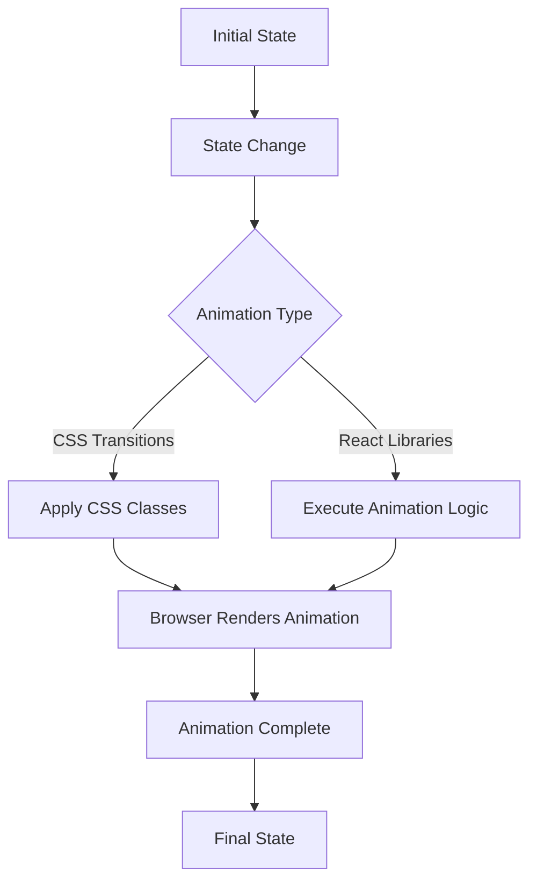

# React Animation Patterns

Animation plays a crucial role in creating engaging user interfaces. In this guide, we'll explore common animation patterns in React that can help bring your applications to life. Whether you're building simple transitions or complex motion sequences, understanding these patterns will enhance your UI design skills.

## Introduction

Animation in React isn't just about making things look pretty—it's about improving user experience by providing visual feedback, guiding attention, and creating a sense of continuity between different states of your application. In this tutorial, we'll cover various animation patterns that you can implement in your React applications.

## Basic Animation Patterns

### 1. CSS Transitions

The simplest way to add animations in React is by using CSS transitions. This approach works well for simple state changes.

```jsx
import React, { useState } from 'react';
import './styles.css';

function FadeButton() {
  const [isActive, setIsActive] = useState(false);
  
  return (
    <div>
      <button 
        className={`fade-button ${isActive ? 'active' : ''}`}
        onClick={() => setIsActive(!isActive)}
      >
        Click Me
      </button>
    </div>
  );
}
```

Corresponding CSS:

```css
.fade-button {
  padding: 10px 20px;
  background-color: #f0f0f0;
  border: none;
  border-radius: 4px;
  transition: background-color 0.3s ease, transform 0.3s ease;
}

.fade-button.active {
  background-color: #4caf50;
  transform: scale(1.1);
}
```

When the button is clicked, it transitions smoothly between the normal and active states.

### 2. CSS Animation

For more complex animations that include keyframes, you can use CSS animations:

```jsx
import React, { useState } from 'react';
import './animations.css';

function PulseComponent() {
  const [isPulsing, setIsPulsing] = useState(false);
  
  return (
    <div>
      <div 
        className={`pulse-box ${isPulsing ? 'pulsing' : ''}`}
        onClick={() => setIsPulsing(!isPulsing)}
      >
        Click to {isPulsing ? 'stop' : 'start'} pulse
      </div>
    </div>
  );
}
```

CSS for the pulse animation:

```css
@keyframes pulse {
  0% { transform: scale(1); opacity: 1; }
  50% { transform: scale(1.05); opacity: 0.8; }
  100% { transform: scale(1); opacity: 1; }
}

.pulse-box {
  width: 200px;
  height: 200px;
  display: flex;
  align-items: center;
  justify-content: center;
  background-color: #3498db;
  color: white;
  cursor: pointer;
  border-radius: 8px;
}

.pulse-box.pulsing {
  animation: pulse 1.5s infinite ease-in-out;
}
```

## Intermediate Animation Patterns

### 1. Enter/Exit Animations with React Transition Group

For more control over mounting/unmounting animations, [React Transition Group](https://reactcommunity.org/react-transition-group/) is very useful:

```jsx
import React, { useState } from 'react';
import { CSSTransition } from 'react-transition-group';
import './transition.css';

function NotificationAlert() {
  const [showMessage, setShowMessage] = useState(false);
  
  return (
    <div>
      <button onClick={() => setShowMessage(!showMessage)}>
        {showMessage ? 'Hide' : 'Show'} Message
      </button>
      
      <CSSTransition
        in={showMessage}
        timeout={300}
        classNames="alert"
        unmountOnExit
      >
        <div className="alert">
          This is an important notification!
        </div>
      </CSSTransition>
    </div>
  );
}
```

CSS for the transition:

```css
.alert {
  background-color: #f8d7da;
  color: #721c24;
  padding: 10px;
  border-radius: 4px;
  margin-top: 10px;
}

.alert-enter {
  opacity: 0;
  transform: scale(0.9);
}

.alert-enter-active {
  opacity: 1;
  transform: scale(1);
  transition: opacity 300ms, transform 300ms;
}

.alert-exit {
  opacity: 1;
  transform: scale(1);
}

.alert-exit-active {
  opacity: 0;
  transform: scale(0.9);
  transition: opacity 300ms, transform 300ms;
}
```

This creates a smooth fade-in/scale animation when the alert appears, and a fade-out/shrink animation when it disappears.

### 2. List Animations

Animating lists is a common requirement in web applications. Here's how to do it with `react-transition-group`:

```jsx
import React, { useState } from 'react';
import { TransitionGroup, CSSTransition } from 'react-transition-group';
import './list-animation.css';

function AnimatedList() {
  const [items, setItems] = useState([
    { id: 1, text: 'Buy groceries' },
    { id: 2, text: 'Finish homework' },
    { id: 3, text: 'Call mom' }
  ]);
  const [nextId, setNextId] = useState(4);
  const [inputText, setInputText] = useState('');
  
  const addItem = () => {
    if (inputText.trim() !== '') {
      setItems([...items, { id: nextId, text: inputText }]);
      setNextId(nextId + 1);
      setInputText('');
    }
  };
  
  const removeItem = id => {
    setItems(items.filter(item => item.id !== id));
  };
  
  return (
    <div>
      <div className="form-group">
        <input
          value={inputText}
          onChange={(e) => setInputText(e.target.value)}
          placeholder="Add a new task"
        />
        <button onClick={addItem}>Add</button>
      </div>
      
      <TransitionGroup className="task-list">
        {items.map(item => (
          <CSSTransition
            key={item.id}
            timeout={500}
            classNames="task"
          >
            <div className="task-item">
              <span>{item.text}</span>
              <button onClick={() => removeItem(item.id)}>✕</button>
            </div>
          </CSSTransition>
        ))}
      </TransitionGroup>
    </div>
  );
}
```

CSS for the list animation:

```css
.task-list {
  margin-top: 20px;
}

.task-item {
  display: flex;
  justify-content: space-between;
  align-items: center;
  padding: 10px;
  margin-bottom: 8px;
  background-color: #f9f9f9;
  border-radius: 4px;
}

.task-enter {
  opacity: 0;
  transform: translateX(-30px);
}

.task-enter-active {
  opacity: 1;
  transform: translateX(0);
  transition: opacity 500ms, transform 500ms;
}

.task-exit {
  opacity: 1;
}

.task-exit-active {
  opacity: 0;
  transform: translateX(30px);
  transition: opacity 500ms, transform 500ms;
}
```

This creates sliding animations for adding and removing items from the list.

## Advanced Animation Patterns

### 1. Choreographed Animations with Framer Motion

For complex, orchestrated animations, [Framer Motion](https://www.framer.com/motion/) provides a powerful solution:

```jsx
import React, { useState } from 'react';
import { motion } from 'framer-motion';

function ExpandableCard() {
  const [isExpanded, setIsExpanded] = useState(false);
  
  const cardVariants = {
    collapsed: {
      height: '100px',
      backgroundColor: '#f0f0f0'
    },
    expanded: {
      height: '300px',
      backgroundColor: '#ffffff',
      transition: {
        duration: 0.5
      }
    }
  };
  
  const contentVariants = {
    collapsed: {
      opacity: 0
    },
    expanded: {
      opacity: 1,
      transition: {
        delay: 0.3,
        duration: 0.4
      }
    }
  };
  
  return (
    <motion.div
      className="expandable-card"
      initial="collapsed"
      animate={isExpanded ? "expanded" : "collapsed"}
      variants={cardVariants}
      onClick={() => setIsExpanded(!isExpanded)}
      style={{
        width: '300px',
        borderRadius: '8px',
        padding: '20px',
        boxShadow: '0 4px 8px rgba(0,0,0,0.1)',
        cursor: 'pointer',
        overflow: 'hidden'
      }}
    >
      <h3>Click to Expand</h3>
      
      <motion.div
        variants={contentVariants}
        style={{ display: isExpanded ? 'block' : 'none' }}
      >
        <p>This is additional content that appears when the card is expanded.</p>
        <p>You can add more information here that users will see after expanding the card.</p>
      </motion.div>
    </motion.div>
  );
}
```

This creates a card that expands smoothly when clicked, with content that fades in after the expansion animation completes.

### 2. Scroll-Based Animations

Animations triggered by scroll position can create engaging experiences:

```jsx
import React, { useEffect } from 'react';
import { motion, useAnimation } from 'framer-motion';
import { useInView } from 'react-intersection-observer';

function ScrollRevealSection() {
  const controls = useAnimation();
  const [ref, inView] = useInView({
    threshold: 0.3,
    triggerOnce: true
  });
  
  useEffect(() => {
    if (inView) {
      controls.start('visible');
    }
  }, [controls, inView]);
  
  const sectionVariants = {
    hidden: {
      opacity: 0,
      y: 50
    },
    visible: {
      opacity: 1,
      y: 0,
      transition: {
        duration: 0.6,
        staggerChildren: 0.2
      }
    }
  };
  
  const itemVariants = {
    hidden: { opacity: 0, y: 20 },
    visible: { opacity: 1, y: 0 }
  };
  
  return (
    <motion.div
      ref={ref}
      initial="hidden"
      animate={controls}
      variants={sectionVariants}
      style={{
        padding: '40px',
        margin: '100px 0',
        backgroundColor: '#f9f9f9',
        borderRadius: '8px',
        maxWidth: '600px'
      }}
    >
      <motion.h2 variants={itemVariants}>Features</motion.h2>
      
      <motion.div variants={itemVariants} style={{ marginTop: '20px' }}>
        <h3>Responsive Design</h3>
        <p>Our product looks great on all devices, from mobile to desktop.</p>
      </motion.div>
      
      <motion.div variants={itemVariants} style={{ marginTop: '20px' }}>
        <h3>User-Friendly Interface</h3>
        <p>Intuitive controls and clear navigation make our app easy to use.</p>
      </motion.div>
      
      <motion.div variants={itemVariants} style={{ marginTop: '20px' }}>
        <h3>Fast Performance</h3>
        <p>Optimized code ensures quick loading times and smooth interactions.</p>
      </motion.div>
    </motion.div>
  );
}
```

This creates a section that animates in when scrolled into view, with features appearing one after another.

## State-Driven Animation Flow

Understanding the flow of animation in response to state changes is crucial:



## Best Practices

1. **Performance**: Always consider performance implications when adding animations.
   ```jsx
   // Good practice: Use CSS transform and opacity for smoother animations
   <div style={{ transform: 'translateX(10px)', opacity: 0.8 }}>Content</div>

   // Avoid: These properties cause layout recalculations
   <div style={{ left: '10px', height: 'auto' }}>Content</div>
   ```

2. **Accessibility**: Ensure your animations don't cause issues for users who are sensitive to motion.
   ```jsx
   // Check for reduced motion preference
   import { useReducedMotion } from 'framer-motion';

   function AccessibleAnimation() {
     const shouldReduceMotion = useReducedMotion();
     
     const animationProps = shouldReduceMotion 
       ? { opacity: [0, 1] }  // Simple fade only
       : { opacity: [0, 1], scale: [0.9, 1] };  // Fade and scale
     
     return <motion.div animate={animationProps}>Content</motion.div>;
   }
   ```

3. **Purpose**: Animations should serve a purpose rather than just being decorative.
   - Communicate relationships between elements
   - Guide user attention
   - Provide feedback on actions
   - Create a sense of continuity

## Real-World Example: Page Transitions

Here's a complete example showing a simple page transition system using React Router and Framer Motion:

```jsx
import React from 'react';
import { BrowserRouter, Route, Routes, Link, useLocation } from 'react-router-dom';
import { motion, AnimatePresence } from 'framer-motion';

// Page Components
function Home() {
  return (
    <div className="page">
      <h1>Home Page</h1>
      <p>Welcome to our website!</p>
    </div>
  );
}

function About() {
  return (
    <div className="page">
      <h1>About Us</h1>
      <p>Learn more about our company and mission.</p>
    </div>
  );
}

function Contact() {
  return (
    <div className="page">
      <h1>Contact Us</h1>
      <p>Get in touch with our team.</p>
    </div>
  );
}

// Animation wrapper component
function AnimatedRoutes() {
  const location = useLocation();
  
  return (
    <AnimatePresence mode="wait">
      <motion.div
        key={location.pathname}
        initial={{ opacity: 0, x: 100 }}
        animate={{ opacity: 1, x: 0 }}
        exit={{ opacity: 0, x: -100 }}
        transition={{ duration: 0.3 }}
      >
        <Routes location={location}>
          <Route path="/" element={<Home />} />
          <Route path="/about" element={<About />} />
          <Route path="/contact" element={<Contact />} />
        </Routes>
      </motion.div>
    </AnimatePresence>
  );
}

// Main App
function App() {
  return (
    <BrowserRouter>
      <div className="app">
        <nav>
          <ul style={{ display: 'flex', listStyle: 'none', gap: '20px' }}>
            <li><Link to="/">Home</Link></li>
            <li><Link to="/about">About</Link></li>
            <li><Link to="/contact">Contact</Link></li>
          </ul>
        </nav>
        
        <main style={{ padding: '20px', position: 'relative', overflow: 'hidden' }}>
          <AnimatedRoutes />
        </main>
      </div>
    </BrowserRouter>
  );
}
```

This creates a seamless transition between pages, with the current page sliding out to the left while the new page slides in from the right.

## Summary

React animation patterns offer a wide range of options for creating engaging user interfaces:

1. **Basic Patterns**:
   - CSS Transitions for simple state changes
   - CSS Animations for keyframe-based animations

2. **Intermediate Patterns**:
   - React Transition Group for enter/exit animations
   - List animations for smooth item additions/removals

3. **Advanced Patterns**:
   - Choreographed animations with Framer Motion
   - Scroll-based animations for dynamic content reveal

Remember that animations should enhance user experience rather than distract from it. By using these patterns appropriately, you can create interfaces that are both beautiful and functional.

## Additional Resources

- [React Transition Group Documentation](https://reactcommunity.org/react-transition-group/)
- [Framer Motion API Documentation](https://www.framer.com/motion/)
- [CSS Animations MDN Guide](https://developer.mozilla.org/en-US/docs/Web/CSS/CSS_Animations/Using_CSS_animations)
- [React Spring](https://react-spring.dev/) - Another popular animation library

## Exercises

1. Create a toggle button that animates between two different icons.
2. Build a dropdown menu with smooth expand/collapse animations.
3. Implement a photo gallery with animated transitions between images.
4. Create a form with validation that shows animated error messages.
5. Build a custom loading animation using CSS or a React animation library.

By practicing these exercises, you'll gain practical experience with different animation patterns and develop an intuition for when and how to use them effectively in your React applications.