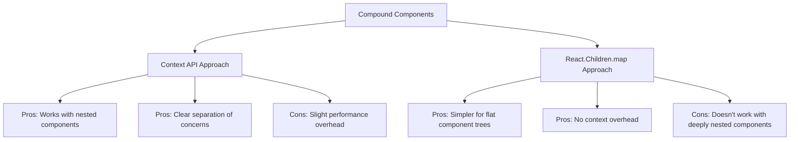

# React Compound Components

## Introduction

Have you ever used a component library that provides components like `Tabs` where you can write code like this?

```jsx
<Tabs>
  <TabList>
    <Tab>First Tab</Tab>
    <Tab>Second Tab</Tab>
  </TabList>
  <TabPanels>
    <TabPanel>Content for first tab</TabPanel>
    <TabPanel>Content for second tab</TabPanel>
  </TabPanels>
</Tabs>
```

This is an example of the **Compound Components** pattern - one of the most elegant and flexible patterns for building React component APIs. 

Compound components are a pattern where multiple components work together to form a cohesive unit. They share an implicit state that allows them to coordinate and communicate. This pattern provides a more declarative and flexible API compared to passing numerous props to a single component.

## Why Use Compound Components?

Before diving into how to build compound components, let's understand why they're valuable:

1. **Flexible Markup Structure** - Users can arrange child components as needed
2. **Clear Component Relationships** - The parent-child structure makes component relationships obvious
3. **Encapsulated State Logic** - Internal state is managed by the parent but accessible to children
4. **Semantic and Readable** - Component composition mirrors HTML structure
5. **Reduced Prop Drilling** - No need to pass many configuration props

## Basic Example: Building a Toggle Component

Let's start with a simple example - a toggle component. First, let's see how it would be used:

```jsx
<Toggle onToggle={(on) => console.log(on)}>
  <Toggle.On>The button is on</Toggle.On>
  <Toggle.Off>The button is off</Toggle.Off>
  <Toggle.Button />
</Toggle>
```

Now, let's implement this:

```jsx
import React, { createContext, useContext, useState } from 'react';

// Create a context to share state between components
const ToggleContext = createContext();

// Main Toggle component that manages state
function Toggle({ children, onToggle }) {
  const [on, setOn] = useState(false);
  
  const toggle = () => {
    const newState = !on;
    setOn(newState);
    if (onToggle) {
      onToggle(newState);
    }
  };
  
  const value = { on, toggle };
  
  return (
    <ToggleContext.Provider value={value}>
      {children}
    </ToggleContext.Provider>
  );
}

// Custom hook to use the Toggle context
function useToggle() {
  const context = useContext(ToggleContext);
  if (context === undefined) {
    throw new Error('useToggle must be used within a Toggle component');
  }
  return context;
}

// Compound components
Toggle.On = function ToggleOn({ children }) {
  const { on } = useToggle();
  return on ? children : null;
};

Toggle.Off = function ToggleOff({ children }) {
  const { on } = useToggle();
  return on ? null : children;
};

Toggle.Button = function ToggleButton(props) {
  const { on, toggle } = useToggle();
  return (
    <button 
      {...props} 
      onClick={toggle} 
      aria-pressed={on}
    >
      {on ? 'On' : 'Off'}
    </button>
  );
};

export default Toggle;
```

### How It Works

1. We create a context (`ToggleContext`) to share state between components
2. The main `Toggle` component manages state and provides it via context
3. We define subcomponents as static properties on the main component
4. Each subcomponent accesses the shared state through the context

## React Context vs React Children Mapping

There are two main ways to implement compound components in React:

1. **Using React Context** (as shown above)
2. **Using React.Children.map**

Let's explore the React.Children approach with the same Toggle example:

```jsx
import React, { useState, cloneElement, Children } from 'react';

function Toggle({ children, onToggle }) {
  const [on, setOn] = useState(false);
  
  const toggle = () => {
    const newState = !on;
    setOn(newState);
    if (onToggle) {
      onToggle(newState);
    }
  };
  
  return Children.map(children, child => {
    // Return non-React elements as is
    if (!React.isValidElement(child)) {
      return child;
    }
    
    // Clone the element with additional props
    return cloneElement(child, {
      on,
      toggle
    });
  });
}

function ToggleOn({ on, children }) {
  return on ? children : null;
}

function ToggleOff({ on, children }) {
  return on ? null : children;
}

function ToggleButton({ on, toggle, ...props }) {
  return (
    <button
      {...props}
      onClick={toggle}
      aria-pressed={on}
    >
      {on ? 'On' : 'Off'}
    </button>
  );
}

Toggle.On = ToggleOn;
Toggle.Off = ToggleOff;
Toggle.Button = ToggleButton;

export default Toggle;
```

### Comparing the Two Approaches



**Context API Approach:**
- ✅ Works with components at any depth (not just direct children)
- ✅ More explicit about component dependencies
- ⚠️ Slightly more code to set up
- ⚠️ Small performance cost for context

**React.Children.map Approach:**
- ✅ Simpler implementation for basic cases
- ✅ No context overhead
- ❌ Only works with direct children
- ❌ Less explicit about dependencies

The React Context approach is generally more flexible and is recommended for most use cases, especially as components grow in complexity.

## Real-World Example: Building a Select Component

Let's build a more complex example - a custom Select component:

```jsx
import React, { createContext, useContext, useState, useRef, useEffect } from 'react';

const SelectContext = createContext();

function Select({ children, onChange }) {
  const [isOpen, setIsOpen] = useState(false);
  const [selectedOption, setSelectedOption] = useState(null);
  const selectRef = useRef();
  
  const registerOption = (option) => {
    if (option.selected) {
      setSelectedOption(option);
    }
  };
  
  const selectOption = (option) => {
    setSelectedOption(option);
    setIsOpen(false);
    if (onChange) {
      onChange(option);
    }
  };
  
  useEffect(() => {
    const handleClickOutside = (event) => {
      if (selectRef.current && !selectRef.current.contains(event.target)) {
        setIsOpen(false);
      }
    };
    
    document.addEventListener('mousedown', handleClickOutside);
    return () => {
      document.removeEventListener('mousedown', handleClickOutside);
    };
  }, []);
  
  const value = {
    isOpen,
    selectedOption,
    toggleOpen: () => setIsOpen(!isOpen),
    registerOption,
    selectOption
  };
  
  return (
    <SelectContext.Provider value={value}>
      <div ref={selectRef} className="select-container">
        {children}
      </div>
    </SelectContext.Provider>
  );
}

function useSelectContext() {
  const context = useContext(SelectContext);
  if (!context) {
    throw new Error('Select compound components must be used within a Select component');
  }
  return context;
}

Select.Trigger = function SelectTrigger({ children }) {
  const { selectedOption, toggleOpen, isOpen } = useSelectContext();
  
  return (
    <button 
      className="select-trigger" 
      onClick={toggleOpen}
      aria-haspopup="listbox"
      aria-expanded={isOpen}
    >
      {selectedOption ? selectedOption.label : children}
      <span className="arrow">{isOpen ? '▲' : '▼'}</span>
    </button>
  );
};

Select.Option = function SelectOption({ children, value, selected }) {
  const { isOpen, selectOption, registerOption, selectedOption } = useSelectContext();
  const isSelected = selectedOption && selectedOption.value === value;
  
  useEffect(() => {
    registerOption({ value, label: children, selected });
  }, []);
  
  if (!isOpen) return null;
  
  return (
    <div 
      className={`select-option ${isSelected ? 'selected' : ''}`}
      onClick={() => selectOption({ value, label: children })}
      role="option"
      aria-selected={isSelected}
    >
      {children}
    </div>
  );
};

Select.OptionsList = function SelectOptionsList({ children }) {
  const { isOpen } = useSelectContext();
  
  if (!isOpen) return null;
  
  return (
    <div className="select-options" role="listbox">
      {children}
    </div>
  );
};

export default Select;
```

And here's how you'd use it:

```jsx
function App() {
  return (
    <div className="App">
      <h1>Favorite Fruit Selector</h1>
      <Select onChange={(option) => console.log(`Selected: ${option.label}`)}>
        <Select.Trigger>Select a fruit</Select.Trigger>
        <Select.OptionsList>
          <Select.Option value="apple" selected>Apple</Select.Option>
          <Select.Option value="banana">Banana</Select.Option>
          <Select.Option value="orange">Orange</Select.Option>
          <Select.Option value="grape">Grape</Select.Option>
        </Select.OptionsList>
      </Select>
    </div>
  );
}
```

## Best Practices for Compound Components

1. **Use clear naming conventions** - Component names should clearly express their relationship (e.g., `Accordion` and `AccordionItem`)

2. **Provide sensible defaults** - Make components work reasonably well without requiring excessive configuration

3. **Include appropriate accessibility attributes** - Build accessibility into your compound components (as shown in our examples)

4. **Document the component API clearly** - Ensure users understand how the components work together

5. **Consider adding TypeScript support** - For type safety and better developer experience:

```tsx
type ToggleProps = {
  children: React.ReactNode;
  onToggle?: (on: boolean) => void;
};

type ToggleContextType = {
  on: boolean;
  toggle: () => void;
};

const ToggleContext = createContext<ToggleContextType | undefined>(undefined);

function Toggle({ children, onToggle }: ToggleProps) {
  // Implementation...
}

// And so on...
```

6. **Only expose what's necessary** - Keep internal implementation details hidden

7. **Use compound components when:**
   - Components have a natural parent-child relationship
   - Multiple components need to share state
   - You want to give users control over markup structure
   - The pattern improves the readability of component usage

## Common Pitfalls and Solutions

### Nested Components Don't Access Context

**Problem**: Compound components that are nested deeper in the tree can't access the context.

**Solution**: Use the Context API approach instead of React.Children.map.

### Performance Issues with Context

**Problem**: Using Context for every tiny component might cause unnecessary re-renders.

**Solution**: 
- Consider using React.memo for performance-critical components
- Use the useCallback hook for functions passed through context
- Split context if there are distinct parts that change independently

### Too Many Subcomponents

**Problem**: As your compound component grows, you might end up with many subcomponents.

**Solution**: Group related subcomponents into logical units or consider a different pattern like Slots.

## Summary

The Compound Components pattern is a powerful way to build flexible and intuitive component APIs in React. It provides a natural way to express relationships between components while encapsulating complex state logic.

Key takeaways:
- Compound components use shared state via context or props cloning
- They give users control over component composition
- The pattern excels at expressing parent-child relationships
- React Context approach works better for complex cases
- React.Children approach is simpler but limited to direct children

## Exercises

1. Extend the Toggle component to include a `Toggle.Count` component that displays the number of times the toggle has been switched.

2. Convert the Select component example to use TypeScript.

3. Build a Tabs compound component with `Tabs`, `TabList`, `Tab`, and `TabPanel` components.

4. Create an Accordion compound component that allows multiple items to be open simultaneously when a certain prop is provided.

5. Try building a compound component that doesn't use React Context or React.Children - what are the limitations?

## Additional Resources

- [Kent C. Dodds' Advanced React Patterns course](https://kentcdodds.com/courses/advanced-react-patterns)
- [React Official Documentation on Context](https://reactjs.org/docs/context.html) 
- [Ryan Florence's article on Compound Components](https://reacttraining.com/blog/compound-components-with-react-hooks/)

By using the Compound Components pattern effectively, you'll create more flexible, maintainable, and intuitive component APIs that your teammates and other developers will love working with.