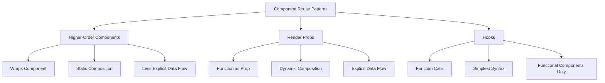

# React Render Props

## Introduction

As your React applications grow in complexity, you'll encounter situations where you want to share code or behavior between different components. While there are several patterns to achieve this, one powerful and flexible approach is the **Render Props** pattern.

Render Props is a technique where a component receives a function prop that returns a React element, allowing the component to share its internal state or behavior with the function. This approach enables code reuse in a way that is more dynamic than higher-order components and more explicit than React hooks.

In this tutorial, we'll explore what render props are, how they work, and when to use them in your React applications.

## Understanding Render Props

### What is a Render Props Pattern?

A render prop is a function prop that a component uses to know what to render. The component with the render prop calls this function rather than implementing its own render logic.

The term "render prop" comes from the pattern of using a prop whose value is a function that returns a React element. The component uses this function to render part of its output.

### Basic Syntax

Here's the basic structure of a component using the render props pattern:

```jsx
class DataProvider extends React.Component {
  state = {
    data: []
  };

  componentDidMount() {
    // Fetch or process data
    this.setState({ data: ['Item 1', 'Item 2', 'Item 3'] });
  }

  render() {
    return this.props.render(this.state.data);
  }
}

// Using the component
<DataProvider 
  render={data => (
    <div>
      <h1>Data List</h1>
      <ul>
        {data.map(item => <li key={item}>{item}</li>)}
      </ul>
    </div>
  )}
/>
```

In this example, `DataProvider` is responsible for managing and providing data, while the actual rendering logic is provided by the consumer through the `render` prop.

## Why Use Render Props?

The render props pattern offers several advantages:

1. **Code Reusability**: Share code between components without inheritance
2. **Separation of Concerns**: Separate data management from rendering logic
3. **Composition**: Compose components in a flexible way
4. **Avoiding Prop Drilling**: Pass data deeply through the component tree without explicit props at each level
5. **Testing**: Easier to test components in isolation

## Building Your First Render Props Component

Let's build a simple `MouseTracker` component that tracks the mouse position and shares this data with other components:

```jsx
class MouseTracker extends React.Component {
  state = { x: 0, y: 0 };

  handleMouseMove = (event) => {
    this.setState({
      x: event.clientX,
      y: event.clientY
    });
  };

  render() {
    return (
      <div 
        style={{ height: '100vh' }} 
        onMouseMove={this.handleMouseMove}
      >
        {this.props.render(this.state)}
      </div>
    );
  }
}
```

Now we can use this component to display the mouse position:

```jsx
function App() {
  return (
    <MouseTracker
      render={mouse => (
        <div>
          <h1>Mouse Position</h1>
          <p>X: {mouse.x}, Y: {mouse.y}</p>
        </div>
      )}
    />
  );
}
```

This shows how we can separate the concern of tracking mouse position from how we display that information.

## Different Ways to Implement Render Props

### Using a Prop Named "render"

As we've seen in the examples above, we can use a prop named `render` to pass our rendering function:

```jsx
<DataProvider render={data => <div>{/* render data */}</div>} />
```

### Using Children as a Function

Another common approach is to use the `children` prop as a function:

```jsx
class MouseTracker extends React.Component {
  state = { x: 0, y: 0 };
  
  handleMouseMove = (event) => {
    this.setState({
      x: event.clientX,
      y: event.clientY
    });
  };

  render() {
    return (
      <div style={{ height: '100vh' }} onMouseMove={this.handleMouseMove}>
        {this.props.children(this.state)}
      </div>
    );
  }
}

// Usage with children as a function
<MouseTracker>
  {mouse => (
    <div>
      <h1>Mouse Position</h1>
      <p>X: {mouse.x}, Y: {mouse.y}</p>
    </div>
  )}
</MouseTracker>
```

### Using Any Prop Name

You're not limited to the names "render" or "children". You can use any prop name:

```jsx
<MouseTracker renderMouse={mouse => (
  <div>X: {mouse.x}, Y: {mouse.y}</div>
)} />
```

## Real-World Examples

### Creating a Reusable Data Fetching Component

One common use case for render props is creating reusable data fetching components:

```jsx
class DataFetcher extends React.Component {
  state = {
    data: null,
    loading: true,
    error: null
  };

  componentDidMount() {
    fetch(this.props.url)
      .then(response => response.json())
      .then(data => {
        this.setState({ data, loading: false });
      })
      .catch(error => {
        this.setState({ error, loading: false });
      });
  }

  render() {
    const { data, loading, error } = this.state;
    return this.props.render({
      data,
      loading,
      error
    });
  }
}

// Usage
function UserProfile() {
  return (
    <DataFetcher 
      url="https://api.example.com/user/123"
      render={({ data, loading, error }) => {
        if (loading) return <div>Loading...</div>;
        if (error) return <div>Error: {error.message}</div>;
        return (
          <div>
            <h1>{data.name}</h1>
            <p>Email: {data.email}</p>
          </div>
        );
      }}
    />
  );
}
```

### Creating a Form Validation Component

Another practical example is a reusable form validation component:

```jsx
class FormValidator extends React.Component {
  state = {
    values: this.props.initialValues || {},
    errors: {},
    touched: {}
  };

  handleChange = (e) => {
    const { name, value } = e.target;
    this.setState(prevState => ({
      values: {
        ...prevState.values,
        [name]: value
      }
    }), () => this.validate(name));
  };

  handleBlur = (e) => {
    const { name } = e.target;
    this.setState(prevState => ({
      touched: {
        ...prevState.touched,
        [name]: true
      }
    }), () => this.validate(name));
  };

  validate = (fieldName) => {
    const { validate } = this.props;
    const { values } = this.state;
    
    if (validate) {
      const validationErrors = validate(values);
      this.setState({
        errors: validationErrors
      });
    }
  };

  handleSubmit = (e) => {
    e.preventDefault();
    const { onSubmit } = this.props;
    const { values, errors } = this.state;
    
    this.setState({
      touched: Object.keys(values).reduce((acc, key) => {
        acc[key] = true;
        return acc;
      }, {})
    });
    
    if (Object.keys(errors).length === 0) {
      onSubmit && onSubmit(values);
    }
  };

  render() {
    return this.props.render({
      values: this.state.values,
      errors: this.state.errors,
      touched: this.state.touched,
      handleChange: this.handleChange,
      handleBlur: this.handleBlur,
      handleSubmit: this.handleSubmit
    });
  }
}

// Usage
function SignupForm() {
  return (
    <FormValidator
      initialValues={{ username: '', email: '', password: '' }}
      validate={values => {
        const errors = {};
        if (!values.username) errors.username = 'Username is required';
        if (!values.email) errors.email = 'Email is required';
        else if (!/^\S+@\S+\.\S+$/.test(values.email)) errors.email = 'Invalid email format';
        if (!values.password) errors.password = 'Password is required';
        else if (values.password.length < 6) errors.password = 'Password must be at least 6 characters';
        return errors;
      }}
      onSubmit={values => console.log('Submitting:', values)}
      render={({ values, errors, touched, handleChange, handleBlur, handleSubmit }) => (
        <form onSubmit={handleSubmit}>
          <div>
            <label>Username:</label>
            <input
              type="text"
              name="username"
              value={values.username}
              onChange={handleChange}
              onBlur={handleBlur}
            />
            {touched.username && errors.username && <div style={{ color: 'red' }}>{errors.username}</div>}
          </div>
          <div>
            <label>Email:</label>
            <input
              type="email"
              name="email"
              value={values.email}
              onChange={handleChange}
              onBlur={handleBlur}
            />
            {touched.email && errors.email && <div style={{ color: 'red' }}>{errors.email}</div>}
          </div>
          <div>
            <label>Password:</label>
            <input
              type="password"
              name="password"
              value={values.password}
              onChange={handleChange}
              onBlur={handleBlur}
            />
            {touched.password && errors.password && <div style={{ color: 'red' }}>{errors.password}</div>}
          </div>
          <button type="submit">Sign Up</button>
        </form>
      )}
    />
  );
}
```

## Render Props vs. Higher-Order Components

Render props and Higher-Order Components (HOCs) are both patterns for reusing component logic. Here's how they compare:



### Advantages of Render Props over HOCs

1. **No naming collisions**: HOCs can overwrite props from other HOCs, while render props make the data flow explicit.
2. **More transparent**: It's clear where the data is coming from when using a render prop.
3. **Dynamic composition**: Render props allow for more dynamic composition at runtime.

## Best Practices for Render Props

1. **Avoid unnecessary nesting**: Excessive use of render props can lead to "callback hell" or "nested function pyramid". Consider combining or refactoring when you see multiple nested render props.

2. **Use TypeScript or PropTypes**: Define clear interfaces for your render props to make them more predictable and easier to use.

```jsx
// With PropTypes
DataProvider.propTypes = {
  render: PropTypes.func.isRequired
};

// With TypeScript
interface DataProviderProps<T> {
  render: (data: T[]) => React.ReactNode;
}

class DataProvider<T> extends React.Component<DataProviderProps<T>> {
  // ...
}
```

3. **Consider using the children prop**: Using the children prop as a function can lead to cleaner JSX:

```jsx
<MouseTracker>
  {mouse => (
    <p>Mouse position: {mouse.x}, {mouse.y}</p>
  )}
</MouseTracker>
```

4. **Memoize render functions**: For performance optimization, consider memoizing your render functions if they're defined in a parent component:

```jsx
class ParentComponent extends React.Component {
  renderMouseInfo = mouse => (
    <p>The mouse position is {mouse.x}, {mouse.y}</p>
  );

  render() {
    return <MouseTracker render={this.renderMouseInfo} />;
  }
}
```

## When to Use Render Props vs. Hooks

With the introduction of React Hooks, some use cases for render props have been simplified. Here's a comparison:

### Render Props Approach

```jsx
<MouseTracker>
  {mouse => (
    <p>Mouse position: {mouse.x}, {mouse.y}</p>
  )}
</MouseTracker>
```

### Hooks Approach

```jsx
function MouseInfo() {
  const [mouse, setMouse] = useState({ x: 0, y: 0 });
  
  useEffect(() => {
    const handleMouseMove = event => {
      setMouse({ x: event.clientX, y: event.clientY });
    };
    
    window.addEventListener('mousemove', handleMouseMove);
    return () => {
      window.removeEventListener('mousemove', handleMouseMove);
    };
  }, []);
  
  return <p>Mouse position: {mouse.x}, {mouse.y}</p>;
}
```

### When to Choose Render Props:

- When working with class components
- For complex logic sharing that would be hard to express with hooks
- When you need to share logic with multiple components in different ways
- For component libraries that need to support older React versions

### When to Choose Hooks:

- For simpler state or effect logic
- When working with functional components
- For better code readability with less nesting

## Summary

The Render Props pattern is a powerful technique for sharing code between React components. It works by passing a function as a prop that returns React elements, allowing a component to share its internal state or behavior.

Key takeaways:

1. Render props provide a flexible way to share code between components
2. They separate data management from rendering logic
3. They can be implemented using a "render" prop, children as a function, or any other prop name
4. Render props are excellent for creating reusable components like data fetchers and form handlers
5. While hooks have replaced some use cases for render props, they remain valuable in complex scenarios and component libraries

By mastering the render props pattern, you'll add a powerful tool to your React development toolkit that enables you to create more reusable and composable components.

## Exercises

1. Create a `<Toggle>` component that uses render props to share its on/off state.
2. Implement a `<WindowSize>` component that tracks and shares the browser window dimensions.
3. Build a `<ThemeProvider>` using render props to share theme information with nested components.
4. Refactor the `MouseTracker` component to use hooks, and compare the differences.
5. Create a `<LocalStorage>` component that provides reading and writing to browser local storage via render props.

## Additional Resources

- [React Official Documentation on Render Props](https://reactjs.org/docs/render-props.html)
- [Kent C. Dodds: Advanced React Patterns](https://kentcdodds.com/blog/advanced-react-patterns)
- [Michael Jackson's "Use a Render Prop!" talk](https://cdb.reacttraining.com/use-a-render-prop-50de598f11ce)

Happy coding!