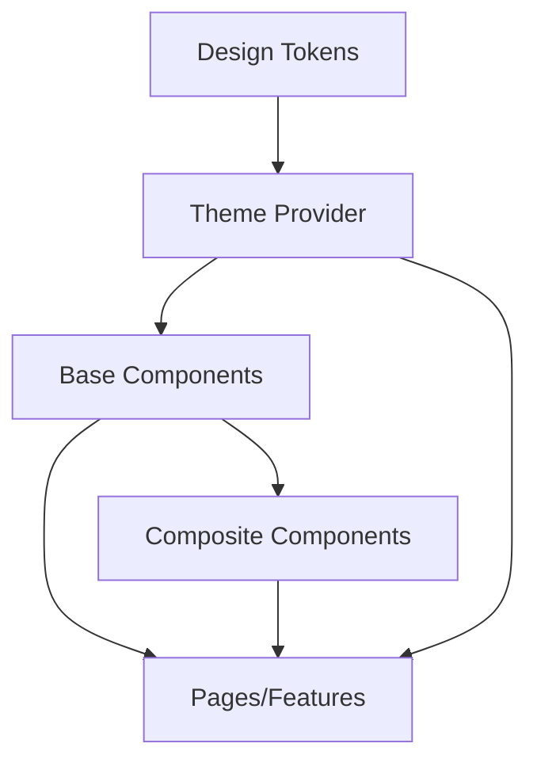

# React Design System Patterns

## Introduction

Design systems are collections of reusable components, guided by clear standards, that help teams build complex applications consistently and efficiently. In the React ecosystem, implementing a design system empowers you to maintain visual consistency across your application while accelerating development.

This guide will walk you through practical patterns for creating and implementing design systems in React, helping you establish a maintainable component architecture that scales with your application's needs.

## What is a Design System?

A design system is more than just a UI kit or component library. It encompasses:

- **Design Tokens**: Foundational values like colors, typography, spacing, etc.
- **Components**: Reusable UI elements built using design tokens
- **Patterns**: Standard solutions to common design problems
- **Documentation**: Guidelines for how and when to use components

In React, a well-implemented design system can dramatically reduce development time and ensure consistency across your application.

## Setting Up the Foundation: Design Tokens

Design tokens are the fundamental building blocks of your design system. They represent the smallest design decisions in your application.

Let's set up a basic tokens structure:

```jsx
// src/design-system/tokens.js
export const tokens = {
  colors: {
    primary: '#0070f3',
    secondary: '#ff4081',
    background: '#ffffff',
    text: '#333333',
    error: '#d32f2f',
    success: '#388e3c',
    warning: '#f57c00',
  },
  typography: {
    fontFamily: {
      base: 'Inter, sans-serif',
      heading: 'Poppins, sans-serif',
    },
    fontSize: {
      xs: '0.75rem',
      sm: '0.875rem',
      md: '1rem',
      lg: '1.25rem',
      xl: '1.5rem',
      xxl: '2rem',
    },
    fontWeight: {
      regular: 400,
      medium: 500,
      bold: 700,
    },
  },
  spacing: {
    xs: '0.25rem',
    sm: '0.5rem',
    md: '1rem',
    lg: '1.5rem',
    xl: '2rem',
    xxl: '3rem',
  },
  borderRadius: {
    sm: '0.25rem',
    md: '0.5rem',
    lg: '1rem',
    pill: '9999px',
  },
  shadows: {
    sm: '0 1px 3px rgba(0,0,0,0.12)',
    md: '0 4px 6px rgba(0,0,0,0.1)',
    lg: '0 10px 15px rgba(0,0,0,0.1)',
  },
}
```

## Creating a Theme Provider

With your tokens defined, the next step is to create a theme provider that will make these design tokens available throughout your application:

```jsx
// src/design-system/ThemeProvider.jsx
import React from 'react';
import { ThemeProvider as StyledThemeProvider } from 'styled-components';
import { tokens } from './tokens';

export const ThemeProvider = ({ children }) => {
  return (
    <StyledThemeProvider theme={tokens}>
      {children}
    </StyledThemeProvider>
  );
};
```

Now wrap your application with this provider:

```jsx
// src/App.jsx
import React from 'react';
import { ThemeProvider } from './design-system/ThemeProvider';

function App() {
  return (
    <ThemeProvider>
      {/* Your app content */}
    </ThemeProvider>
  );
}

export default App;
```

## Building Base Components

With our theme set up, we can now create base components that leverage our design tokens:

### Button Component

```jsx
// src/design-system/components/Button.jsx
import React from 'react';
import styled, { css } from 'styled-components';

const variantStyles = {
  primary: css`
    background-color: ${props => props.theme.colors.primary};
    color: white;
  `,
  secondary: css`
    background-color: ${props => props.theme.colors.secondary};
    color: white;
  `,
  outline: css`
    background-color: transparent;
    border: 1px solid ${props => props.theme.colors.primary};
    color: ${props => props.theme.colors.primary};
  `,
};

const sizeStyles = {
  small: css`
    padding: ${props => `${props.theme.spacing.xs} ${props.theme.spacing.sm}`};
    font-size: ${props => props.theme.typography.fontSize.sm};
  `,
  medium: css`
    padding: ${props => `${props.theme.spacing.sm} ${props.theme.spacing.md}`};
    font-size: ${props => props.theme.typography.fontSize.md};
  `,
  large: css`
    padding: ${props => `${props.theme.spacing.md} ${props.theme.spacing.lg}`};
    font-size: ${props => props.theme.typography.fontSize.lg};
  `,
};

const StyledButton = styled.button`
  border-radius: ${props => props.theme.borderRadius.md};
  font-family: ${props => props.theme.typography.fontFamily.base};
  font-weight: ${props => props.theme.typography.fontWeight.medium};
  border: none;
  cursor: pointer;
  transition: all 0.2s ease;
  
  &:hover {
    opacity: 0.9;
    transform: translateY(-1px);
  }
  
  &:disabled {
    opacity: 0.6;
    cursor: not-allowed;
  }
  
  ${props => variantStyles[props.variant]}
  ${props => sizeStyles[props.size]}
`;

export const Button = ({ 
  variant = 'primary', 
  size = 'medium', 
  children, 
  ...props 
}) => {
  return (
    <StyledButton 
      variant={variant} 
      size={size} 
      {...props}
    >
      {children}
    </StyledButton>
  );
};
```

### Text Component

```jsx
// src/design-system/components/Text.jsx
import styled, { css } from 'styled-components';

const variantStyles = {
  h1: css`
    font-size: ${props => props.theme.typography.fontSize.xxl};
    font-weight: ${props => props.theme.typography.fontWeight.bold};
    margin-bottom: ${props => props.theme.spacing.lg};
  `,
  h2: css`
    font-size: ${props => props.theme.typography.fontSize.xl};
    font-weight: ${props => props.theme.typography.fontWeight.bold};
    margin-bottom: ${props => props.theme.spacing.md};
  `,
  h3: css`
    font-size: ${props => props.theme.typography.fontSize.lg};
    font-weight: ${props => props.theme.typography.fontWeight.medium};
    margin-bottom: ${props => props.theme.spacing.md};
  `,
  body: css`
    font-size: ${props => props.theme.typography.fontSize.md};
    margin-bottom: ${props => props.theme.spacing.md};
  `,
  caption: css`
    font-size: ${props => props.theme.typography.fontSize.sm};
    color: ${props => props.color || props.theme.colors.text};
    opacity: 0.7;
  `,
};

export const Text = styled.div`
  font-family: ${props => props.theme.typography.fontFamily.base};
  color: ${props => props.color || props.theme.colors.text};
  margin: 0;
  
  ${props => variantStyles[props.variant]}
`;

Text.defaultProps = {
  variant: 'body',
};
```

## Creating a Component Catalog

Now let's create a simple index file that exports all of our components:

```jsx
// src/design-system/index.js
export { Button } from './components/Button';
export { Text } from './components/Text';
export { ThemeProvider } from './ThemeProvider';
export { tokens } from './tokens';

// Export more components as you create them
```

## Using the Design System

Now you can use your design system in your application:

```jsx
// src/pages/HomePage.jsx
import React from 'react';
import { Button, Text } from '../design-system';

const HomePage = () => {
  return (
    <div style={{ padding: '2rem' }}>
      <Text variant="h1">Welcome to Our Application</Text>
      <Text variant="body">
        This page demonstrates our design system components in action.
      </Text>
      
      <div style={{ marginTop: '2rem' }}>
        <Button variant="primary" onClick={() => alert('Primary action!')}>
          Primary Action
        </Button>
        <span style={{ marginRight: '1rem' }} />
        <Button variant="secondary" onClick={() => alert('Secondary action!')}>
          Secondary Action
        </Button>
        <span style={{ marginRight: '1rem' }} />
        <Button variant="outline" onClick={() => alert('Outline action!')}>
          Outline Action
        </Button>
      </div>
      
      <div style={{ marginTop: '2rem' }}>
        <Text variant="h2">Button Sizes</Text>
        <div>
          <Button size="small">Small</Button>
          <span style={{ marginRight: '1rem' }} />
          <Button size="medium">Medium</Button>
          <span style={{ marginRight: '1rem' }} />
          <Button size="large">Large</Button>
        </div>
      </div>
    </div>
  );
};

export default HomePage;
```

## Advanced Patterns for Design Systems

### 1. Component Composition Pattern

This pattern encourages building complex components from simpler ones:

```jsx
// src/design-system/components/Card.jsx
import React from 'react';
import styled from 'styled-components';
import { Text } from './Text';

const CardWrapper = styled.div`
  background: ${props => props.theme.colors.background};
  border-radius: ${props => props.theme.borderRadius.md};
  box-shadow: ${props => props.theme.shadows.md};
  padding: ${props => props.theme.spacing.lg};
`;

const Card = ({ children, ...props }) => {
  return <CardWrapper {...props}>{children}</CardWrapper>;
};

Card.Title = ({ children, ...props }) => (
  <Text variant="h3" {...props}>
    {children}
  </Text>
);

Card.Body = ({ children, ...props }) => (
  <Text variant="body" {...props}>
    {children}
  </Text>
);

Card.Footer = styled.div`
  margin-top: ${props => props.theme.spacing.md};
  display: flex;
  justify-content: flex-end;
`;

export { Card };
```

Using the composed Card component:

```jsx
import { Card, Button } from '../design-system';

const ProductCard = ({ product }) => {
  return (
    <Card>
      <Card.Title>{product.name}</Card.Title>
      <Card.Body>{product.description}</Card.Body>
      <Card.Footer>
        <Button variant="primary">Add to Cart</Button>
      </Card.Footer>
    </Card>
  );
};
```

### 2. Variant Pattern

The variant pattern allows for multiple variations of a component:

```jsx
// src/design-system/components/Alert.jsx
import React from 'react';
import styled, { css } from 'styled-components';
import { Text } from './Text';

const variantStyles = {
  info: css`
    background-color: #e3f2fd;
    border-color: ${props => props.theme.colors.primary};
  `,
  success: css`
    background-color: #e8f5e9;
    border-color: ${props => props.theme.colors.success};
  `,
  warning: css`
    background-color: #fff8e1;
    border-color: ${props => props.theme.colors.warning};
  `,
  error: css`
    background-color: #ffebee;
    border-color: ${props => props.theme.colors.error};
  `,
};

const AlertWrapper = styled.div`
  padding: ${props => props.theme.spacing.md};
  border-left: 4px solid;
  border-radius: ${props => props.theme.borderRadius.sm};
  margin-bottom: ${props => props.theme.spacing.lg};
  
  ${props => variantStyles[props.variant]}
`;

export const Alert = ({ variant = 'info', title, children, ...props }) => {
  return (
    <AlertWrapper variant={variant} {...props}>
      {title && <Text variant="h3" style={{ marginTop: 0 }}>{title}</Text>}
      <Text variant="body" style={{ marginBottom: 0 }}>{children}</Text>
    </AlertWrapper>
  );
};
```

### 3. Theme Switching Pattern

Support multiple themes (like dark mode):

```jsx
// src/design-system/theme.js
export const lightTheme = {
  colors: {
    primary: '#0070f3',
    background: '#ffffff',
    text: '#333333',
    // ...other colors
  },
  // ...other tokens
};

export const darkTheme = {
  colors: {
    primary: '#2196f3',
    background: '#121212',
    text: '#ffffff',
    // ...other colors
  },
  // ...other tokens with dark mode values
};
```

Update the ThemeProvider to handle theme switching:

```jsx
// src/design-system/ThemeProvider.jsx
import React, { useState, useContext, createContext } from 'react';
import { ThemeProvider as StyledThemeProvider } from 'styled-components';
import { lightTheme, darkTheme } from './theme';

const ThemeContext = createContext();

export const ThemeProvider = ({ children }) => {
  const [isDark, setIsDark] = useState(false);
  
  const toggleTheme = () => {
    setIsDark(!isDark);
  };
  
  const theme = isDark ? darkTheme : lightTheme;
  
  return (
    <ThemeContext.Provider value={{ isDark, toggleTheme }}>
      <StyledThemeProvider theme={theme}>
        {children}
      </StyledThemeProvider>
    </ThemeContext.Provider>
  );
};

export const useTheme = () => useContext(ThemeContext);
```

Usage example:

```jsx
import { useTheme, Button } from '../design-system';

const ThemeSwitcher = () => {
  const { isDark, toggleTheme } = useTheme();
  
  return (
    <Button onClick={toggleTheme}>
      Switch to {isDark ? 'Light' : 'Dark'} Theme
    </Button>
  );
};
```

## Real-world Application: Building a Dashboard UI

Let's use our design system to create a simple dashboard interface:

```jsx
// src/pages/Dashboard.jsx
import React from 'react';
import { Button, Text, Card, Alert } from '../design-system';

const Dashboard = () => {
  return (
    <div style={{ maxWidth: '1200px', margin: '0 auto', padding: '2rem' }}>
      <header style={{ display: 'flex', justifyContent: 'space-between', alignItems: 'center', marginBottom: '2rem' }}>
        <Text variant="h1">Dashboard</Text>
        <Button variant="primary">+ New Project</Button>
      </header>
      
      <Alert variant="info" title="Welcome!">
        This is your new dashboard. You can manage all your projects from here.
      </Alert>
      
      <Text variant="h2">Your Projects</Text>
      
      <div style={{ display: 'grid', gridTemplateColumns: 'repeat(auto-fill, minmax(300px, 1fr))', gap: '2rem', marginTop: '1rem' }}>
        {projects.map(project => (
          <Card key={project.id}>
            <Card.Title>{project.name}</Card.Title>
            <Card.Body>{project.description}</Card.Body>
            <div style={{ display: 'flex', justifyContent: 'space-between', alignItems: 'center', marginTop: '1rem' }}>
              <Text variant="caption">{project.status}</Text>
              <Button size="small">View</Button>
            </div>
          </Card>
        ))}
      </div>
    </div>
  );
};

// Sample data
const projects = [
  { id: 1, name: 'Website Redesign', description: 'Revamp the company website with new branding', status: 'In Progress' },
  { id: 2, name: 'Mobile App', description: 'Develop a companion mobile app for our customers', status: 'Planning' },
  { id: 3, name: 'Analytics Dashboard', description: 'Build an internal analytics dashboard for sales team', status: 'Completed' },
  { id: 4, name: 'API Integration', description: 'Integrate with partner payment systems', status: 'In Review' },
];

export default Dashboard;
```

## Design System Architecture

Here's a visual representation of how the different parts of a React design system work together:



## Best Practices for Design Systems

1. **Start with tokens**: Begin by defining your design tokens before building components
2. **Keep components focused**: Each component should do one thing well
3. **Document everything**: Create comprehensive documentation for your components
4. **Testing is essential**: Unit test your components to ensure they work as expected
5. **Use component props wisely**: Design props to be intuitive for developers
6. **Maintain consistency**: Ensure visual and behavior consistency across your system
7. **Version your design system**: Use semantic versioning for your design system

## Common Pitfalls to Avoid

1. **Too many variants**: Too many options can make a component confusing to use
2. **Inconsistent naming**: Keep your naming conventions consistent across the system
3. **Overly rigid components**: Components should be flexible enough for various use cases
4. **Poor performance**: Monitor and optimize the performance of your design system
5. **Lack of accessibility**: Ensure components meet accessibility standards

## Summary

In this guide, you've learned how to:

- Create a foundation for a React design system using design tokens
- Set up a theme provider to make tokens available throughout your application
- Build base UI components like buttons and text elements
- Create advanced components through composition
- Implement variant patterns for component flexibility
- Add support for theme switching
- Apply the design system to create a real-world UI

A well-crafted design system is an investment that pays dividends as your application grows. It ensures visual consistency, speeds up development, and creates a cohesive user experience.

## Additional Resources

- [Storybook](https://storybook.js.org/) - A tool for developing UI components in isolation
- [Styled System](https://styled-system.com/) - Style props for rapid UI development
- [Material-UI](https://mui.com/) - A popular React UI framework
- [Chakra UI](https://chakra-ui.com/) - A simple, modular component library
- [Polaris](https://polaris.shopify.com/) - Shopify's design system

## Exercises

1. Extend the design system with a form component that includes labeled inputs, validation states, and helper text.
2. Create a navigation component that supports both horizontal and vertical orientations.
3. Add a responsive grid system to your design system.
4. Implement a component that uses animations from your design tokens.
5. Build a theme builder that allows users to customize the design tokens and see changes in real-time.

By mastering these design system patterns, you'll be well-equipped to create scalable, maintainable React applications with consistent user experiences.