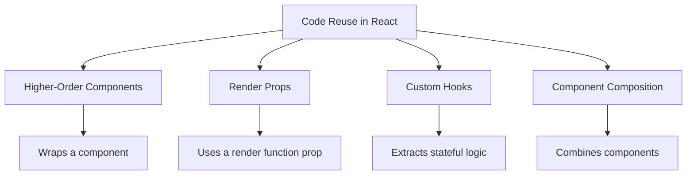

# React Higher-Order Components

## Introduction

Higher-Order Components (HOCs) are one of the most powerful and flexible advanced patterns in React. If you've been using React for a while, you've likely encountered them in libraries like Redux (`connect`) or React Router.

A Higher-Order Component is **a function that takes a component and returns a new enhanced component**. Think of them as "component transformers" that add functionality to your existing components without modifying their original code.

HOCs follow a key principle of functional programming: **composition**. Instead of changing existing code, we compose new features by wrapping components with additional functionality.

## Understanding Higher-Order Components

### The Basic Concept

At its core, an HOC is a function that:

1. Takes a component as input
2. Returns a new component with enhanced features
3. Doesn't modify the input component (follows immutability principles)

Here's the basic pattern:

```jsx
// This is a higher-order component (HOC)
function withSomething(WrappedComponent) {
  // Return a new component
  return function EnhancedComponent(props) {
    // Logic to enhance the component goes here
    
    // Render the wrapped component with additional props
    return <WrappedComponent {...props} somethingExtra="value" />;
  };
}

// Use the HOC
const EnhancedComponent = withSomething(MyComponent);
```

### Naming Convention

By convention, HOCs start with `with` prefix (like `withRouter`, `withStyles`, etc.) to make it clear they are HOCs. This isn't required but makes your code more readable for other developers.

## Creating Your First HOC

Let's create a simple HOC that adds a loading state to any component:

```jsx
// withLoading.js
import React, { useState } from 'react';

function withLoading(WrappedComponent) {
  return function WithLoadingComponent({ isLoading, ...props }) {
    if (isLoading) {
      return <div>Loading...</div>;
    }
    return <WrappedComponent {...props} />;
  };
}

export default withLoading;
```

And here's how you use it:

```jsx
// UserList.js
import React from 'react';
import withLoading from './withLoading';

function UserList({ users }) {
  return (
    <ul>
      {users.map(user => (
        <li key={user.id}>{user.name}</li>
      ))}
    </ul>
  );
}

// Enhance UserList with loading functionality
export default withLoading(UserList);
```

```jsx
// App.js
import React, { useState, useEffect } from 'react';
import UserList from './UserList';

function App() {
  const [users, setUsers] = useState([]);
  const [isLoading, setIsLoading] = useState(true);

  useEffect(() => {
    // Simulate API call
    setTimeout(() => {
      setUsers([
        { id: 1, name: 'John Doe' },
        { id: 2, name: 'Jane Smith' },
        { id: 3, name: 'Mike Johnson' }
      ]);
      setIsLoading(false);
    }, 2000);
  }, []);

  return <UserList isLoading={isLoading} users={users} />;
}
```

In this example:
- `withLoading` is our HOC
- It adds loading state handling to any component
- The original `UserList` component remains focused on rendering users, not handling loading states

## Common Use Cases for HOCs

### 1. Conditional Rendering

We just saw this with the loading example. HOCs excel at conditionally rendering components based on different states.

### 2. Authentication

Control which components are accessible to authenticated users:

```jsx
function withAuth(WrappedComponent) {
  return function WithAuthComponent(props) {
    const { isAuthenticated, user } = useAuth(); // Assume we have a useAuth hook
    
    if (!isAuthenticated) {
      return <Navigate to="/login" />;
    }
    
    return <WrappedComponent {...props} user={user} />;
  };
}

// Usage
const ProtectedDashboard = withAuth(Dashboard);
```

### 3. Data Fetching

Abstract away data fetching logic:

```jsx
function withData(WrappedComponent, fetchData) {
  return function WithDataComponent(props) {
    const [data, setData] = useState(null);
    const [loading, setLoading] = useState(true);
    const [error, setError] = useState(null);
    
    useEffect(() => {
      const fetchDataAsync = async () => {
        try {
          setLoading(true);
          const result = await fetchData();
          setData(result);
          setError(null);
        } catch (err) {
          setError(err);
        } finally {
          setLoading(false);
        }
      };
      
      fetchDataAsync();
    }, []);
    
    return (
      <WrappedComponent
        {...props}
        data={data}
        loading={loading}
        error={error}
      />
    );
  };
}

// Usage
const fetchUsers = () => fetch('/api/users').then(res => res.json());
const UserListWithData = withData(UserList, fetchUsers);
```

### 4. Styling and Layout

Adding consistent styling or layout to components:

```jsx
function withCardLayout(WrappedComponent) {
  return function WithCardLayoutComponent(props) {
    return (
      <div className="card">
        <div className="card-body">
          <WrappedComponent {...props} />
        </div>
      </div>
    );
  };
}

// Usage
const UserListCard = withCardLayout(UserList);
```

## Advanced HOC Techniques

### Composing Multiple HOCs

One of the strengths of HOCs is that they can be composed together:

```jsx
// Compose multiple HOCs
const EnhancedComponent = withAuth(withLoading(withData(MyComponent, fetchData)));

// More readable with compose utility
import { compose } from 'redux'; // or implement your own
const enhance = compose(
  withAuth,
  withLoading,
  withData(fetchData)
);
const EnhancedComponent = enhance(MyComponent);
```

### Passing Configuration Parameters

HOCs can accept configuration parameters:

```jsx
function withStyles(styles) {
  // This outer function accepts the configuration
  return function(WrappedComponent) {
    // This inner function is the actual HOC
    return function WithStylesComponent(props) {
      return <WrappedComponent {...props} styles={styles} />;
    };
  };
}

// Usage
const BlueButton = withStyles({ color: 'blue', fontWeight: 'bold' })(Button);
```

### Forwarding Refs

By default, refs don't get passed through HOCs. You need to use `React.forwardRef` to handle them:

```jsx
function withLogging(WrappedComponent) {
  class WithLogging extends React.Component {
    componentDidMount() {
      console.log('Component mounted');
    }
    
    render() {
      const { forwardedRef, ...rest } = this.props;
      return <WrappedComponent ref={forwardedRef} {...rest} />;
    }
  }
  
  // Use forwardRef to pass refs through
  return React.forwardRef((props, ref) => {
    return <WithLogging {...props} forwardedRef={ref} />;
  });
}
```

## HOC Best Practices

### 1. Don't Mutate the Original Component

Always compose rather than modify:

```jsx
// ❌ Bad: Modifying the input component
function withBadPractice(WrappedComponent) {
  WrappedComponent.prototype.componentDidMount = function() {
    // This modifies the original component!
    console.log('Modified lifecycle');
  };
  return WrappedComponent;
}

// ✅ Good: Creating a new component
function withGoodPractice(WrappedComponent) {
  return class extends React.Component {
    componentDidMount() {
      console.log('Enhanced component mounted');
    }
    
    render() {
      return <WrappedComponent {...this.props} />;
    }
  };
}
```

### 2. Pass Unrelated Props Through

Always forward props that aren't related to the HOC's functionality:

```jsx
function withExtra(WrappedComponent) {
  return function WithExtraComponent(props) {
    // Add our extra prop
    const extraProp = 'extra value';
    
    // Pass all existing props plus our extra one
    return <WrappedComponent extraProp={extraProp} {...props} />;
  };
}
```

### 3. Maintain Displayname for Debugging

Set a proper `displayName` to make debugging easier:

```jsx
function withAuth(WrappedComponent) {
  const WithAuth = (props) => {
    // HOC logic here
    return <WrappedComponent {...props} />;
  };
  
  // Set a displayName for better debugging
  WithAuth.displayName = `WithAuth(${getDisplayName(WrappedComponent)})`;
  
  return WithAuth;
}

// Helper to get component name
function getDisplayName(WrappedComponent) {
  return WrappedComponent.displayName || 
         WrappedComponent.name || 
         'Component';
}
```

## Real-World Example: Analytics Tracking HOC

Let's create an HOC that adds analytics tracking to any component:

```jsx
// withAnalytics.js
import React, { useEffect } from 'react';

function withAnalytics(WrappedComponent, trackingName) {
  return function WithAnalytics(props) {
    useEffect(() => {
      // Track component mount
      trackEvent(`${trackingName}_viewed`);
      
      return () => {
        // Track component unmount
        trackEvent(`${trackingName}_closed`);
      };
    }, []);
    
    // Wrap event handlers with tracking
    const enhancedProps = Object.keys(props).reduce((acc, propName) => {
      const prop = props[propName];
      
      // If the prop is a function (likely an event handler)
      if (typeof prop === 'function') {
        acc[propName] = (...args) => {
          // Track the event
          trackEvent(`${trackingName}_${propName}`);
          // Call the original handler
          return prop(...args);
        };
      } else {
        acc[propName] = prop;
      }
      
      return acc;
    }, {});
    
    return <WrappedComponent {...enhancedProps} />;
  };
}

// Mock tracking function
function trackEvent(eventName) {
  console.log(`Analytics: ${eventName}`);
  // In real app, this would call your analytics service
  // analytics.track(eventName);
}

export default withAnalytics;
```

Usage:

```jsx
// Button.js
import React from 'react';
import withAnalytics from './withAnalytics';

function Button({ onClick, children }) {
  return (
    <button onClick={onClick}>
      {children}
    </button>
  );
}

// Enhanced button with analytics
export default withAnalytics(Button, 'main_button');

// When used:
// - Tracks "main_button_viewed" on mount
// - Tracks "main_button_onClick" when clicked
// - Tracks "main_button_closed" on unmount
```

## Comparing HOCs to Other React Patterns

HOCs are one of several patterns for code reuse in React. Here's a quick comparison:



- **HOCs**: Wrap components to add functionality
- **Render Props**: Components that take a function prop to render something
- **Custom Hooks**: Extract stateful logic into reusable functions
- **Component Composition**: Combine components to create more complex UIs

Each has its appropriate use cases and tradeoffs. HOCs work particularly well for:

1. Cross-cutting concerns affecting multiple components
2. Adding behavior without component structure changes
3. Libraries providing consistent functionality

## Challenges with HOCs

HOCs aren't perfect and come with some challenges:

1. **Prop Collisions**: If multiple HOCs provide props with the same names, they can overwrite each other
2. **Wrapper Hell**: Too many HOCs can create deeply nested components
3. **Static Methods**: They don't automatically copy static methods from the wrapped component
4. **Ref Forwarding**: Requires extra work to handle refs properly

For these reasons, in newer React codebases, Hooks often replace HOCs for stateful logic sharing.

## Summary

Higher-Order Components are a powerful pattern for reusing component logic in React applications. They follow functional programming principles by using composition rather than inheritance to extend component functionality.

Key takeaways:

- HOCs are functions that take a component and return an enhanced version
- They're great for cross-cutting concerns like authentication, data fetching, and analytics
- Follow best practices: don't modify input components, pass through props, and maintain displayNames
- HOCs can be composed together for more complex behaviors
- Consider alternatives like Hooks for simpler use cases

## Exercises

To solidify your understanding:

1. Create an HOC called `withTheme` that provides theme colors to any component
2. Build an `withErrorBoundary` HOC that catches errors in components
3. Implement `withLocalStorage` to persist and retrieve component state from localStorage
4. Create a composition utility that makes combining multiple HOCs cleaner
5. Convert one of your HOCs to use React Hooks instead, and compare the approaches

## Additional Resources

- [React Official Documentation on Higher-Order Components](https://reactjs.org/docs/higher-order-components.html)
- [React Hooks as an Alternative to HOCs](https://reactjs.org/docs/hooks-intro.html)
- [Redux's `connect` function](https://react-redux.js.org/api/connect) - A real-world HOC example
- [recompose](https://github.com/acdlite/recompose) - A utility library for HOCs (note: largely superseded by Hooks)

Happy coding with Higher-Order Components!