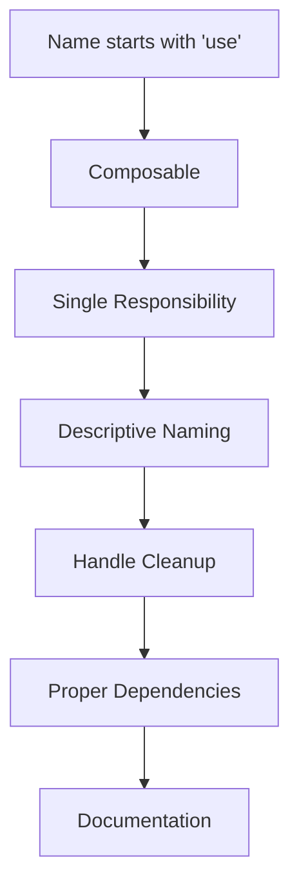

# React Custom Hooks Patterns

## Introduction

Custom hooks are one of React's most powerful features, allowing developers to extract component logic into reusable functions. They enable you to share stateful logic between components without requiring complex patterns like higher-order components or render props.

In this tutorial, we'll explore various patterns for creating and using custom hooks in React applications. By the end, you'll have a solid understanding of how to implement custom hooks to solve common problems and improve your React codebase.

## What Are Custom Hooks?

Custom hooks are JavaScript functions that start with the prefix `use` and can call other hooks. This naming convention is important as it signals to both developers and React's linting rules that the function follows the rules of Hooks.

Let's start with a simple example:

```jsx
import { useState, useEffect } from 'react';

function useDocumentTitle(title) {
  useEffect(() => {
    document.title = title;
    return () => {
      document.title = 'React App'; // Reset on unmount
    };
  }, [title]);
}
```

This custom hook changes the document title based on the provided value. We can use it in any component:

```jsx
function ProfilePage({ username }) {
  useDocumentTitle(`${username}'s Profile`);
  
  return (
    <div>
      <h1>{username}'s Profile</h1>
      {/* Rest of the component */}
    </div>
  );
}
```

## Common Custom Hooks Patterns

Let's explore several patterns for creating useful custom hooks.

### Pattern 1: State Management Hooks

These hooks encapsulate state logic to make it reusable across components.

#### Example: `useToggle` Hook

```jsx
import { useState, useCallback } from 'react';

function useToggle(initialState = false) {
  const [state, setState] = useState(initialState);
  
  const toggle = useCallback(() => {
    setState(prevState => !prevState);
  }, []);

  return [state, toggle];
}
```

Usage:

```jsx
function Accordion() {
  const [isOpen, toggleOpen] = useToggle(false);
  
  return (
    <div>
      <button onClick={toggleOpen}>
        {isOpen ? 'Hide Content' : 'Show Content'}
      </button>
      
      {isOpen && (
        <div className="content">
          This content is toggleable!
        </div>
      )}
    </div>
  );
}
```

### Pattern 2: Side Effect Hooks

These hooks manage side effects like API calls, subscriptions, or browser APIs.

#### Example: `useFetch` Hook

```jsx
import { useState, useEffect } from 'react';

function useFetch(url) {
  const [data, setData] = useState(null);
  const [loading, setLoading] = useState(true);
  const [error, setError] = useState(null);

  useEffect(() => {
    const abortController = new AbortController();
    
    async function fetchData() {
      try {
        setLoading(true);
        const response = await fetch(url, { signal: abortController.signal });
        
        if (!response.ok) {
          throw new Error(`HTTP error! Status: ${response.status}`);
        }
        
        const result = await response.json();
        setData(result);
        setError(null);
      } catch (err) {
        if (err.name !== 'AbortError') {
          setError(err.message);
          setData(null);
        }
      } finally {
        setLoading(false);
      }
    }

    fetchData();
    
    return () => {
      abortController.abort();
    };
  }, [url]);

  return { data, loading, error };
}
```

Usage:

```jsx
function UserProfile({ userId }) {
  const { data, loading, error } = useFetch(`https://api.example.com/users/${userId}`);
  
  if (loading) return <div>Loading...</div>;
  if (error) return <div>Error: {error}</div>;
  
  return (
    <div className="user-profile">
      <h2>{data.name}</h2>
      <p>Email: {data.email}</p>
      {/* Other user details */}
    </div>
  );
}
```

### Pattern 3: Reducer Hooks

For more complex state logic, custom hooks can leverage useReducer.

#### Example: `useFormInput` Hook

```jsx
import { useReducer } from 'react';

function formReducer(state, action) {
  switch (action.type) {
    case 'change':
      return {
        ...state,
        [action.field]: action.value
      };
    case 'reset':
      return action.initialState;
    default:
      return state;
  }
}

function useFormInput(initialState) {
  const [state, dispatch] = useReducer(formReducer, initialState);

  const handleChange = (field) => (e) => {
    dispatch({
      type: 'change',
      field,
      value: e.target.value
    });
  };

  const reset = () => {
    dispatch({ type: 'reset', initialState });
  };

  return { state, handleChange, reset };
}
```

Usage:

```jsx
function RegistrationForm() {
  const { state, handleChange, reset } = useFormInput({
    username: '',
    email: '',
    password: ''
  });

  const handleSubmit = (e) => {
    e.preventDefault();
    console.log('Form submitted:', state);
    // Submit form data
    reset();
  };

  return (
    <form onSubmit={handleSubmit}>
      <div>
        <label htmlFor="username">Username:</label>
        <input
          id="username"
          type="text"
          value={state.username}
          onChange={handleChange('username')}
        />
      </div>
      <div>
        <label htmlFor="email">Email:</label>
        <input
          id="email"
          type="email"
          value={state.email}
          onChange={handleChange('email')}
        />
      </div>
      <div>
        <label htmlFor="password">Password:</label>
        <input
          id="password"
          type="password"
          value={state.password}
          onChange={handleChange('password')}
        />
      </div>
      <button type="submit">Register</button>
      <button type="button" onClick={reset}>Reset</button>
    </form>
  );
}
```

### Pattern 4: Composition of Hooks

Custom hooks can compose other hooks to create more complex behavior.

#### Example: `useLocalStorage` Hook

```jsx
import { useState, useEffect } from 'react';

function useLocalStorage(key, initialValue) {
  // Get from local storage then parse stored json or return initialValue
  const readValue = () => {
    if (typeof window === 'undefined') {
      return initialValue;
    }

    try {
      const item = window.localStorage.getItem(key);
      return item ? JSON.parse(item) : initialValue;
    } catch (error) {
      console.warn(`Error reading localStorage key "${key}":`, error);
      return initialValue;
    }
  };

  // State to store our value
  const [storedValue, setStoredValue] = useState(readValue);

  // Return a wrapped version of useState's setter function that persists the new value to localStorage.
  const setValue = value => {
    try {
      // Allow value to be a function so we have the same API as useState
      const valueToStore = value instanceof Function ? value(storedValue) : value;
      
      // Save state
      setStoredValue(valueToStore);
      
      // Save to local storage
      if (typeof window !== 'undefined') {
        window.localStorage.setItem(key, JSON.stringify(valueToStore));
      }
    } catch (error) {
      console.warn(`Error setting localStorage key "${key}":`, error);
    }
  };

  useEffect(() => {
    const handleStorageChange = () => {
      setStoredValue(readValue());
    };
    
    window.addEventListener('storage', handleStorageChange);
    return () => window.removeEventListener('storage', handleStorageChange);
  }, []);

  return [storedValue, setValue];
}
```

Usage:

```jsx
function ThemeSelector() {
  const [theme, setTheme] = useLocalStorage('theme', 'light');

  const toggleTheme = () => {
    setTheme(prevTheme => prevTheme === 'light' ? 'dark' : 'light');
  };
  
  return (
    <div className={`app ${theme}`}>
      <button onClick={toggleTheme}>
        Switch to {theme === 'light' ? 'Dark' : 'Light'} Mode
      </button>
      <p>Current theme: {theme}</p>
    </div>
  );
}
```

### Pattern 5: Context Provider Hooks

This pattern combines custom hooks with React Context to provide global state.

```jsx
import { createContext, useContext, useState } from 'react';

// Create context
const AuthContext = createContext();

// Provider hook that wraps your app and makes auth object available to any child component that calls useAuth().
function useAuthProvider() {
  const [user, setUser] = useState(null);

  const login = (credentials) => {
    // In a real app, validate credentials with an API
    return new Promise((resolve) => {
      setTimeout(() => {
        setUser({ id: 1, name: 'John Doe', email: 'john@example.com' });
        resolve(true);
      }, 1000);
    });
  };

  const logout = () => {
    setUser(null);
  };

  return {
    user,
    login,
    logout,
    isAuthenticated: !!user
  };
}

// Provider component
export function AuthProvider({ children }) {
  const auth = useAuthProvider();
  return <AuthContext.Provider value={auth}>{children}</AuthContext.Provider>;
}

// Hook for child components to get the auth object and re-render when it changes
export function useAuth() {
  return useContext(AuthContext);
}
```

Usage:

```jsx
// App.js
import { AuthProvider } from './hooks/useAuth';

function App() {
  return (
    <AuthProvider>
      <Router>
        {/* Your app routes */}
        <Navigation />
        <Switch>
          <Route exact path="/" component={Home} />
          <Route path="/login" component={Login} />
          <PrivateRoute path="/dashboard" component={Dashboard} />
        </Switch>
      </Router>
    </AuthProvider>
  );
}

// Navigation.js
import { useAuth } from './hooks/useAuth';

function Navigation() {
  const { user, logout, isAuthenticated } = useAuth();
  
  return (
    <nav>
      <ul>
        <li><Link to="/">Home</Link></li>
        {isAuthenticated ? (
          <>
            <li><Link to="/dashboard">Dashboard</Link></li>
            <li>
              <span>Welcome, {user.name}</span>
              <button onClick={logout}>Logout</button>
            </li>
          </>
        ) : (
          <li><Link to="/login">Login</Link></li>
        )}
      </ul>
    </nav>
  );
}
```

### Pattern 6: Event Handling Hooks

These hooks simplify event handling in React components.

#### Example: `useClickOutside` Hook

```jsx
import { useEffect, useRef } from 'react';

function useClickOutside(handler) {
  const ref = useRef();
  
  useEffect(() => {
    const listener = (event) => {
      // Do nothing if clicking ref's element or descendent elements
      if (!ref.current || ref.current.contains(event.target)) {
        return;
      }
      
      handler();
    };
    
    document.addEventListener('mousedown', listener);
    document.addEventListener('touchstart', listener);
    
    return () => {
      document.removeEventListener('mousedown', listener);
      document.removeEventListener('touchstart', listener);
    };
  }, [ref, handler]);
  
  return ref;
}
```

Usage:

```jsx
function Dropdown({ title, children }) {
  const [isOpen, setIsOpen] = useState(false);
  const dropdownRef = useClickOutside(() => {
    if (isOpen) setIsOpen(false);
  });
  
  return (
    <div className="dropdown" ref={dropdownRef}>
      <button onClick={() => setIsOpen(!isOpen)}>
        {title}
      </button>
      
      {isOpen && (
        <div className="dropdown-content">
          {children}
        </div>
      )}
    </div>
  );
}
```

## Best Practices for Custom Hooks

When creating custom hooks, follow these best practices:



1. **Follow the naming convention**: Always prefix custom hook names with `use` to signal that they follow the rules of Hooks.

2. **Keep hooks focused**: Each hook should handle a single responsibility or concern.

3. **Handle cleanup properly**: Ensure any subscriptions, timers, or event listeners are cleaned up to avoid memory leaks.

4. **Use dependency arrays correctly**: Make sure your `useEffect` and `useCallback` hooks have properly defined dependencies.

5. **Write tests**: Custom hooks should be tested separately from components to verify their behavior.

6. **Document your hooks**: Include comments or documentation explaining the hook's purpose, parameters, and return values.

## Real-world Example: Building a Complete Form System

Let's combine multiple hook patterns to build a comprehensive form system:

```jsx
// hooks/useForm.js
import { useState, useEffect } from 'react';

function useForm({ initialValues, validate, onSubmit }) {
  const [values, setValues] = useState(initialValues);
  const [errors, setErrors] = useState({});
  const [touched, setTouched] = useState({});
  const [isSubmitting, setIsSubmitting] = useState(false);

  useEffect(() => {
    if (isSubmitting) {
      const noErrors = Object.keys(errors).length === 0;
      if (noErrors) {
        onSubmit(values);
        setIsSubmitting(false);
      } else {
        setIsSubmitting(false);
      }
    }
  }, [errors, isSubmitting, values, onSubmit]);

  const handleChange = (event) => {
    const { name, value } = event.target;
    setValues({ ...values, [name]: value });
  };

  const handleBlur = (event) => {
    const { name } = event.target;
    setTouched({ ...touched, [name]: true });
    
    if (validate) {
      const validationErrors = validate(values);
      setErrors(validationErrors);
    }
  };

  const handleSubmit = (event) => {
    event.preventDefault();
    
    // Mark all fields as touched
    const allTouched = Object.keys(values).reduce(
      (acc, key) => ({ ...acc, [key]: true }),
      {}
    );
    setTouched(allTouched);

    if (validate) {
      const validationErrors = validate(values);
      setErrors(validationErrors);
      setIsSubmitting(Object.keys(validationErrors).length === 0);
    } else {
      setIsSubmitting(true);
    }
  };

  return {
    values,
    errors,
    touched,
    isSubmitting,
    handleChange,
    handleBlur,
    handleSubmit,
    setValues
  };
}

export default useForm;
```

Usage:

```jsx
function SignupForm() {
  const validate = (values) => {
    const errors = {};
    
    if (!values.email) {
      errors.email = 'Email is required';
    } else if (!/\S+@\S+\.\S+/.test(values.email)) {
      errors.email = 'Email address is invalid';
    }
    
    if (!values.password) {
      errors.password = 'Password is required';
    } else if (values.password.length < 8) {
      errors.password = 'Password must be at least 8 characters';
    }
    
    if (values.password !== values.confirmPassword) {
      errors.confirmPassword = 'Passwords do not match';
    }
    
    return errors;
  };

  const handleSubmit = (values) => {
    console.log('Form submitted with:', values);
    // Submit to your API
    alert('Signup successful!');
  };

  const {
    values,
    errors,
    touched,
    handleChange,
    handleBlur,
    handleSubmit,
  } = useForm({
    initialValues: {
      email: '',
      password: '',
      confirmPassword: ''
    },
    validate,
    onSubmit: handleSubmit
  });

  return (
    <form onSubmit={handleSubmit}>
      <h2>Sign Up</h2>
      
      <div className="form-group">
        <label htmlFor="email">Email</label>
        <input
          id="email"
          name="email"
          type="email"
          value={values.email}
          onChange={handleChange}
          onBlur={handleBlur}
        />
        {touched.email && errors.email && (
          <div className="error">{errors.email}</div>
        )}
      </div>
      
      <div className="form-group">
        <label htmlFor="password">Password</label>
        <input
          id="password"
          name="password"
          type="password"
          value={values.password}
          onChange={handleChange}
          onBlur={handleBlur}
        />
        {touched.password && errors.password && (
          <div className="error">{errors.password}</div>
        )}
      </div>
      
      <div className="form-group">
        <label htmlFor="confirmPassword">Confirm Password</label>
        <input
          id="confirmPassword"
          name="confirmPassword"
          type="password"
          value={values.confirmPassword}
          onChange={handleChange}
          onBlur={handleBlur}
        />
        {touched.confirmPassword && errors.confirmPassword && (
          <div className="error">{errors.confirmPassword}</div>
        )}
      </div>
      
      <button type="submit">Sign Up</button>
    </form>
  );
}
```

## Summary

Custom hooks are an essential pattern in modern React applications. They allow you to:

1. **Extract and reuse stateful logic** between components
2. **Simplify complex components** by extracting logic into smaller, focused hooks
3. **Share functionality** across your application
4. **Create composition-based APIs** rather than inheritance-based ones
5. **Write more testable code** by isolating logic

By mastering custom hooks patterns, you'll write more maintainable, readable, and reusable React code. Remember to follow the patterns and best practices outlined in this tutorial to create hooks that provide value throughout your application.

## Additional Resources

- [React Docs: Building Your Own Hooks](https://reactjs.org/docs/hooks-custom.html)
- [useHooks](https://usehooks.com/) - A collection of ready-to-use custom hooks
- [React Hooks Testing Library](https://github.com/testing-library/react-hooks-testing-library) - For testing your custom hooks

## Exercises

1. Create a `useWindowSize` hook that tracks browser window dimensions.
2. Implement a `useDebounce` hook that delays the execution of a function.
3. Build a `usePagination` hook for handling pagination in lists.
4. Create a `useTheme` hook with Context API to provide theme switching capabilities.
5. Implement a `usePermission` hook that checks if a user has permission to access certain features.

Remember, custom hooks become more powerful when they're focused on solving specific problems in your application.