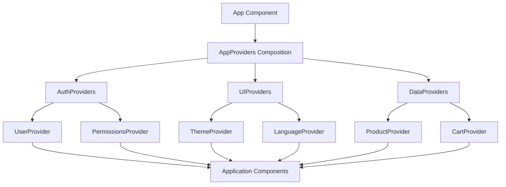

# React Context Composition

## Introduction

React Context provides a way to pass data through the component tree without having to pass props down manually at every level. While using a single Context can be sufficient for simple applications, complex applications often require multiple contexts to manage different aspects of state. This is where **Context Composition** becomes valuable.

Context Composition is the pattern of nesting multiple context providers to organize and structure your application's state management. It allows you to:

- Separate concerns by domain or functionality
- Avoid creating a monolithic context that handles everything
- Make your code more maintainable and testable
- Combine multiple contexts without prop drilling

In this tutorial, we'll explore how to effectively compose multiple React Contexts and use this pattern to build more maintainable React applications.

## Understanding the Problem

Before diving into Context Composition, let's understand the problem it solves. Consider this example where we have multiple contexts in an application:

```jsx
function App() {
  return (
    <ThemeContext.Provider value={themeData}>
      <UserContext.Provider value={userData}>
        <NotificationContext.Provider value={notificationData}>
          <LanguageContext.Provider value={languageData}>
            <AppContent />
          </LanguageContext.Provider>
        </NotificationContext.Provider>
      </UserContext.Provider>
    </ThemeContext.Provider>
  );
}
```

This approach creates what's commonly called "provider hell" or "wrapper hell" - a deeply nested hierarchy of context providers that makes your code harder to read and maintain.

## The Context Composition Pattern

Context Composition helps solve this problem by organizing related contexts together and composing them in a more structured way.

### Step 1: Create Individual Contexts

First, let's create separate context files for different concerns:

```jsx
// ThemeContext.js
import React, { createContext, useState, useContext } from 'react';

const ThemeContext = createContext();

export function ThemeProvider({ children }) {
  const [theme, setTheme] = useState('light');
  
  const toggleTheme = () => {
    setTheme(prevTheme => prevTheme === 'light' ? 'dark' : 'light');
  };
  
  return (
    <ThemeContext.Provider value={{ theme, toggleTheme }}>
      {children}
    </ThemeContext.Provider>
  );
}

export const useTheme = () => useContext(ThemeContext);
```

```jsx
// UserContext.js
import React, { createContext, useState, useContext } from 'react';

const UserContext = createContext();

export function UserProvider({ children }) {
  const [user, setUser] = useState(null);
  
  const login = (userData) => {
    setUser(userData);
  };
  
  const logout = () => {
    setUser(null);
  };
  
  return (
    <UserContext.Provider value={{ user, login, logout }}>
      {children}
    </UserContext.Provider>
  );
}

export const useUser = () => useContext(UserContext);
```

### Step 2: Create a Composition Component

Now, let's create a composition component that combines these providers:

```jsx
// AppProviders.js
import React from 'react';
import { ThemeProvider } from './ThemeContext';
import { UserProvider } from './UserContext';

export function AppProviders({ children }) {
  return (
    <ThemeProvider>
      <UserProvider>
        {children}
      </UserProvider>
    </ThemeProvider>
  );
}
```

### Step 3: Use the Composition Component

Finally, we can use our composed providers in the main App component:

```jsx
// App.js
import React from 'react';
import { AppProviders } from './AppProviders';
import Dashboard from './Dashboard';

function App() {
  return (
    <AppProviders>
      <Dashboard />
    </AppProviders>
  );
}

export default App;
```

### Step 4: Consume the Context

Now, components can consume any context they need:

```jsx
// Dashboard.js
import React from 'react';
import { useTheme } from './ThemeContext';
import { useUser } from './UserContext';

function Dashboard() {
  const { theme, toggleTheme } = useTheme();
  const { user, logout } = useUser();
  
  return (
    <div className={`dashboard ${theme}`}>
      {user ? (
        <>
          <h1>Welcome, {user.name}!</h1>
          <button onClick={logout}>Logout</button>
        </>
      ) : (
        <h1>Please log in</h1>
      )}
      <button onClick={toggleTheme}>
        Switch to {theme === 'light' ? 'dark' : 'light'} mode
      </button>
    </div>
  );
}

export default Dashboard;
```

## Advanced Context Composition Techniques

### Creating Domain-Specific Provider Compositions

For larger applications, you might want to group related contexts into domain-specific providers:

```jsx
// AuthProviders.js
import React from 'react';
import { UserProvider } from './UserContext';
import { PermissionsProvider } from './PermissionsContext';

export function AuthProviders({ children }) {
  return (
    <UserProvider>
      <PermissionsProvider>
        {children}
      </PermissionsProvider>
    </UserProvider>
  );
}
```

```jsx
// UIProviders.js
import React from 'react';
import { ThemeProvider } from './ThemeContext';
import { LanguageProvider } from './LanguageContext';

export function UIProviders({ children }) {
  return (
    <ThemeProvider>
      <LanguageProvider>
        {children}
      </LanguageProvider>
    </ThemeProvider>
  );
}
```

Then compose these domain-specific providers:

```jsx
// AppProviders.js
import React from 'react';
import { AuthProviders } from './AuthProviders';
import { UIProviders } from './UIProviders';
import { DataProviders } from './DataProviders';

export function AppProviders({ children }) {
  return (
    <AuthProviders>
      <UIProviders>
        <DataProviders>
          {children}
        </DataProviders>
      </UIProviders>
    </AuthProviders>
  );
}
```

### Creating a Provider Composer Component

To make composition even more flexible, you can create a generic provider composer:

```jsx
// ProviderComposer.js
import React from 'react';

export function ProviderComposer({ providers = [], children }) {
  return providers.reduceRight(
    (acc, Provider) => <Provider>{acc}</Provider>,
    children
  );
}
```

Using the composer:

```jsx
// App.js
import React from 'react';
import { ProviderComposer } from './ProviderComposer';
import { ThemeProvider } from './ThemeContext';
import { UserProvider } from './UserContext';
import { LanguageProvider } from './LanguageContext';
import Dashboard from './Dashboard';

function App() {
  return (
    <ProviderComposer
      providers={[
        ThemeProvider,
        UserProvider,
        LanguageProvider
      ]}
    >
      <Dashboard />
    </ProviderComposer>
  );
}
```

This approach makes your provider structure more declarative and easier to modify.

## Real-World Example: E-commerce Application

Let's see how Context Composition works in a real-world e-commerce application:

```jsx
// contexts/CartContext.js
import React, { createContext, useContext, useReducer } from 'react';

const CartContext = createContext();

const initialState = {
  items: [],
  total: 0
};

function cartReducer(state, action) {
  switch (action.type) {
    case 'ADD_ITEM':
      const newItems = [...state.items, action.payload];
      return {
        ...state,
        items: newItems,
        total: newItems.reduce((sum, item) => sum + item.price, 0)
      };
    case 'REMOVE_ITEM':
      const filteredItems = state.items.filter(item => item.id !== action.payload);
      return {
        ...state,
        items: filteredItems,
        total: filteredItems.reduce((sum, item) => sum + item.price, 0)
      };
    default:
      return state;
  }
}

export function CartProvider({ children }) {
  const [cart, dispatch] = useReducer(cartReducer, initialState);
  
  const addToCart = (product) => {
    dispatch({ type: 'ADD_ITEM', payload: product });
  };
  
  const removeFromCart = (productId) => {
    dispatch({ type: 'REMOVE_ITEM', payload: productId });
  };
  
  return (
    <CartContext.Provider value={{ cart, addToCart, removeFromCart }}>
      {children}
    </CartContext.Provider>
  );
}

export const useCart = () => useContext(CartContext);
```

```jsx
// contexts/ProductContext.js
import React, { createContext, useContext, useState, useEffect } from 'react';

const ProductContext = createContext();

export function ProductProvider({ children }) {
  const [products, setProducts] = useState([]);
  const [loading, setLoading] = useState(true);
  const [error, setError] = useState(null);
  
  useEffect(() => {
    async function fetchProducts() {
      try {
        setLoading(true);
        // In a real app, this would be a fetch to your API
        const response = await fetch('/api/products');
        const data = await response.json();
        setProducts(data);
        setLoading(false);
      } catch (err) {
        setError(err);
        setLoading(false);
      }
    }
    
    fetchProducts();
  }, []);
  
  return (
    <ProductContext.Provider value={{ products, loading, error }}>
      {children}
    </ProductContext.Provider>
  );
}

export const useProducts = () => useContext(ProductContext);
```

Now, compose these contexts for the e-commerce application:

```jsx
// providers/ShopProviders.js
import React from 'react';
import { CartProvider } from '../contexts/CartContext';
import { ProductProvider } from '../contexts/ProductContext';
import { UserProvider } from '../contexts/UserContext';

export function ShopProviders({ children }) {
  return (
    <UserProvider>
      <ProductProvider>
        <CartProvider>
          {children}
        </CartProvider>
      </ProductProvider>
    </UserProvider>
  );
}
```

And use it in your application:

```jsx
// App.js
import React from 'react';
import { ShopProviders } from './providers/ShopProviders';
import { ThemeProvider } from './contexts/ThemeContext';
import Shop from './components/Shop';

function App() {
  return (
    <ThemeProvider>
      <ShopProviders>
        <Shop />
      </ShopProviders>
    </ThemeProvider>
  );
}

export default App;
```

A component that uses multiple contexts:

```jsx
// components/ProductList.js
import React from 'react';
import { useProducts } from '../contexts/ProductContext';
import { useCart } from '../contexts/CartContext';
import { useTheme } from '../contexts/ThemeContext';

function ProductList() {
  const { products, loading } = useProducts();
  const { cart, addToCart } = useCart();
  const { theme } = useTheme();
  
  if (loading) return <p>Loading products...</p>;
  
  return (
    <div className={`product-list ${theme}`}>
      <h2>Available Products</h2>
      <ul>
        {products.map(product => (
          <li key={product.id}>
            <h3>{product.name}</h3>
            <p>${product.price}</p>
            <button onClick={() => addToCart(product)}>
              Add to Cart
            </button>
          </li>
        ))}
      </ul>
      
      <div className="cart-summary">
        <h3>Cart ({cart.items.length} items)</h3>
        <p>Total: ${cart.total}</p>
      </div>
    </div>
  );
}

export default ProductList;
```

## Context Composition Architecture Flow

Here's a visual representation of how Context Composition works:



## Best Practices for Context Composition

1. **Separate concerns**: Group related state and functionality into separate contexts
2. **Keep providers shallow**: Aim for a flat hierarchy of providers rather than deeply nested ones
3. **Create custom hooks**: Export custom hooks for consuming contexts to make usage simpler
4. **Compose at the right level**: Only compose providers at the level where they're needed
5. **Consider performance**: Remember that context updates can cause re-renders
6. **Memoize context values**: Use `useMemo` to prevent unnecessary re-renders

```jsx
// Memoizing context values
import React, { createContext, useState, useMemo } from 'react';

export function ThemeProvider({ children }) {
  const [theme, setTheme] = useState('light');
  
  const toggleTheme = () => {
    setTheme(prevTheme => prevTheme === 'light' ? 'dark' : 'light');
  };
  
  // Memoize the context value to prevent unnecessary re-renders
  const contextValue = useMemo(() => ({
    theme,
    toggleTheme
  }), [theme]);
  
  return (
    <ThemeContext.Provider value={contextValue}>
      {children}
    </ThemeContext.Provider>
  );
}
```

## Common Pitfalls and How to Avoid Them

### 1. Circular Dependencies

**Problem**: Context providers depend on each other, leading to circular dependencies.

**Solution**: Design your state management to avoid tight coupling between contexts.

### 2. Context Hell

**Problem**: Too many nested contexts making code hard to read.

**Solution**: Use the Provider Composer pattern or composition components.

### 3. Excessive Re-renders

**Problem**: Context changes cause all consumers to re-render.

**Solution**: Split contexts into smaller pieces and memoize values.

```jsx
// Before: One large context that causes many re-renders
const AppContext = createContext({
  user: null,
  theme: 'light',
  cart: [],
  notifications: []
});

// After: Split into focused contexts
const UserContext = createContext(null);
const ThemeContext = createContext('light');
const CartContext = createContext([]);
const NotificationContext = createContext([]);
```

### 4. Context Duplication

**Problem**: Multiple instances of the same context provider.

**Solution**: Ensure providers are composed at the right level of your application.

## Summary

Context Composition is a powerful pattern that allows you to:

- Organize your application's state by domain or functionality
- Avoid the "provider hell" problem of deeply nested context providers
- Create more maintainable and testable React applications
- Combine multiple contexts in a structured way

By following the steps outlined in this tutorial and adopting the best practices, you can effectively implement Context Composition in your React applications, leading to cleaner code and better state management.

## Additional Resources

- Explore the [React Context API documentation](https://reactjs.org/docs/context.html)
- Understand [React Hooks](https://reactjs.org/docs/hooks-intro.html) in depth
- Learn more about the [useReducer hook](https://reactjs.org/docs/hooks-reference.html#usereducer) for complex state management

## Exercises

1. Create a simple application with at least three different contexts (theme, user, and notifications)
2. Implement the Provider Composer pattern to simplify context nesting
3. Build a small e-commerce page that uses Context Composition to manage products, cart, and user state
4. Refactor an existing application that uses a single large context into smaller, composed contexts
5. Create a custom hook that combines data from multiple contexts

By mastering Context Composition, you'll be able to build more maintainable React applications with cleaner and more organized code.