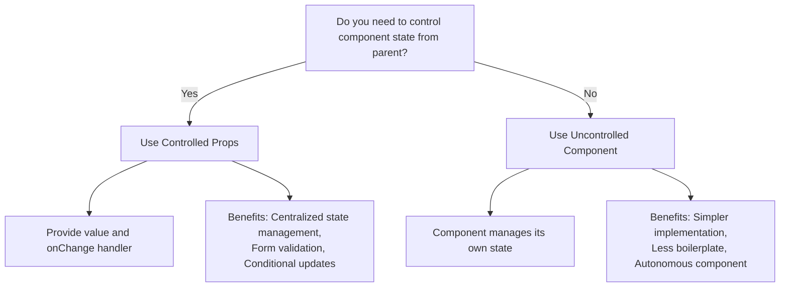

# React Controlled Props

## Introduction

The Controlled Props pattern is a powerful React pattern that gives parent components control over the state of their children. This pattern follows React's principle of "lifting state up," allowing state to be managed at a higher level while still being used by child components.

In standard React components, state is often encapsulated within the component itself. However, there are scenarios where you want multiple components to share the same state, or you need a parent component to dictate how a child component should behave. This is where controlled props come in.

In this guide, we'll explore:
- What controlled props are and why they're useful
- How to implement controlled components
- When to use controlled vs. uncontrolled components
- Real-world applications and best practices

## What Are Controlled Props?

Controlled props is a pattern where a component's state is controlled by its parent through props instead of being managed internally. The component becomes a "controlled component" when:

1. It receives its current state values via props
2. It notifies changes through callback props (like `onChange`)
3. It doesn't maintain its own internal state for values controlled by the parent

This is similar to how HTML form elements work with React - you provide the `value` and handle changes through an `onChange` handler.

## Basic Implementation

Let's start with a simple example of a controlled input component:

```jsx
// Uncontrolled input (manages its own state)
function UncontrolledInput() {
  const [value, setValue] = React.useState('');
  
  return (
    <input
      value={value}
      onChange={(e) => setValue(e.target.value)}
    />
  );
}

// Controlled input (parent manages state)
function ControlledInput({ value, onChange }) {
  return (
    <input
      value={value}
      onChange={(e) => onChange(e.target.value)}
    />
  );
}

// Usage of controlled input
function ParentComponent() {
  const [inputValue, setInputValue] = React.useState('');
  
  return (
    <div>
      <ControlledInput
        value={inputValue}
        onChange={setInputValue}
      />
      <p>Current value: {inputValue}</p>
    </div>
  );
}
```

In the controlled version, the parent component manages the state and passes it down to the child. The child notifies the parent of any changes, allowing the parent to update the state accordingly.

## Why Use Controlled Props?

Controlled props provide several benefits:

1. **Centralized state management** - State can be managed in one place and shared across components
2. **Form validation** - Validate input before updating state
3. **Conditional updates** - Sometimes prevent state updates based on certain conditions
4. **Synchronization** - Keep multiple components synchronized with the same data
5. **Testing** - Easier to test components since you can provide exact props without relying on internal state

## Creating a Custom Controlled Component

Let's create a more complex example - a custom toggle button component that can be used in both controlled and uncontrolled modes:

```jsx
import React, { useState, useEffect } from 'react';

function ToggleButton({ on: controlledOn, onChange, defaultOn = false }) {
  // Determine if component is controlled
  const isControlled = controlledOn !== undefined;
  
  // Only use internal state for uncontrolled mode
  const [uncontrolledOn, setUncontrolledOn] = useState(defaultOn);
  
  // Use controlled or uncontrolled value based on props
  const on = isControlled ? controlledOn : uncontrolledOn;
  
  function handleToggle() {
    if (!isControlled) {
      setUncontrolledOn(!on);
    }
    // Always call onChange if provided
    if (onChange) {
      onChange(!on);
    }
  }
  
  return (
    <button 
      onClick={handleToggle}
      className={on ? 'toggle-on' : 'toggle-off'}
    >
      {on ? 'ON' : 'OFF'}
    </button>
  );
}

// Usage examples:
function App() {
  // Uncontrolled usage
  return (
    <div>
      <h3>Uncontrolled Toggle:</h3>
      <ToggleButton defaultOn={true} onChange={(on) => console.log('Toggle:', on)} />
      
      <ControlledExample />
    </div>
  );
}

// Controlled usage example
function ControlledExample() {
  const [toggleState, setToggleState] = useState(false);
  
  return (
    <div>
      <h3>Controlled Toggle:</h3>
      <ToggleButton 
        on={toggleState} 
        onChange={setToggleState} 
      />
      <p>The toggle is {toggleState ? 'on' : 'off'}</p>
      <button onClick={() => setToggleState(!toggleState)}>
        Toggle from parent
      </button>
    </div>
  );
}
```

This implementation handles both controlled and uncontrolled scenarios:
- If `on` prop is provided, it's a controlled component
- If only `defaultOn` is provided, it manages its own state
- The component always calls the `onChange` prop when the state changes

## Handling Derived State

Sometimes, you need to synchronize internal state with incoming props. Before React 16.3, `componentWillReceiveProps` was commonly used for this purpose. Now, we can use combination of `useEffect` and `useState` to handle this:

```jsx
function Counter({ count: controlledCount, onChange }) {
  // Check if component is controlled
  const isControlled = controlledCount !== undefined;
  const [uncontrolledCount, setUncontrolledCount] = useState(0);
  
  // Use either controlled or uncontrolled value
  const count = isControlled ? controlledCount : uncontrolledCount;
  
  // Increment handler
  const increment = () => {
    const newCount = count + 1;
    if (!isControlled) {
      setUncontrolledCount(newCount);
    }
    if (onChange) {
      onChange(newCount);
    }
  };
  
  return (
    <div>
      <p>Count: {count}</p>
      <button onClick={increment}>Increment</button>
    </div>
  );
}
```

## Real-World Example: Custom Select Component

Let's build a more practical example - a custom select component that could be used in forms:

```jsx
function CustomSelect({ 
  options, 
  value: controlledValue, 
  onChange, 
  placeholder = "Select an option..."
}) {
  const [isOpen, setIsOpen] = useState(false);
  const [uncontrolledValue, setUncontrolledValue] = useState(null);
  
  // Determine if component is controlled
  const isControlled = controlledValue !== undefined;
  const value = isControlled ? controlledValue : uncontrolledValue;
  
  const handleSelect = (option) => {
    setIsOpen(false);
    
    if (!isControlled) {
      setUncontrolledValue(option);
    }
    
    if (onChange) {
      onChange(option);
    }
  };
  
  const displayValue = value ? value.label : placeholder;
  
  return (
    <div className="custom-select">
      <div 
        className="select-trigger" 
        onClick={() => setIsOpen(!isOpen)}
      >
        {displayValue}
        <span className="arrow">▼</span>
      </div>
      
      {isOpen && (
        <ul className="options-list">
          {options.map((option) => (
            <li 
              key={option.value} 
              onClick={() => handleSelect(option)}
              className={value?.value === option.value ? 'selected' : ''}
            >
              {option.label}
            </li>
          ))}
        </ul>
      )}
    </div>
  );
}

// Usage in a form
function UserForm() {
  const [country, setCountry] = useState(null);
  const [city, setCity] = useState(null);
  
  const countries = [
    { value: 'us', label: 'United States' },
    { value: 'ca', label: 'Canada' },
    { value: 'mx', label: 'Mexico' }
  ];
  
  const citiesByCountry = {
    us: [
      { value: 'nyc', label: 'New York City' },
      { value: 'la', label: 'Los Angeles' }
    ],
    ca: [
      { value: 'tor', label: 'Toronto' },
      { value: 'van', label: 'Vancouver' }
    ],
    mx: [
      { value: 'mex', label: 'Mexico City' },
      { value: 'can', label: 'Cancun' }
    ]
  };
  
  // Reset city when country changes
  useEffect(() => {
    setCity(null);
  }, [country]);
  
  return (
    <form>
      <div>
        <label>Country:</label>
        <CustomSelect
          options={countries}
          value={country}
          onChange={setCountry}
        />
      </div>
      
      {country && (
        <div>
          <label>City:</label>
          <CustomSelect
            options={citiesByCountry[country.value] || []}
            value={city}
            onChange={setCity}
            placeholder="Select a city..."
          />
        </div>
      )}
      
      <div>
        <button type="submit">Submit</button>
      </div>
    </form>
  );
}
```

This example demonstrates several benefits of controlled props:
1. The parent form controls the state of the select components
2. The city select is dependent on the country select value
3. When country changes, city resets automatically

## Controlled Props vs. Uncontrolled Props

Here's a comparison to help you decide when to use each approach:



### When to Use Controlled Props:
- Form validation needs to happen in the parent
- Multiple components need to share the same state
- You need to restrict how/when the component state can change
- The parent component needs to control the internal state of child components

### When to Use Uncontrolled Components:
- For simpler components without complex state requirements
- When you don't need to track the component's state in the parent
- To reduce boilerplate when state management isn't critical

## Best Practices and Common Pitfalls

### Best Practices:

1. **Consistent API**: Keep your controlled component API consistent with HTML standards when possible (`value`/`onChange`, `checked`/`onChange`, etc.)

2. **Default to uncontrolled**: Consider starting with uncontrolled components and upgrading to controlled when needed

3. **Clear documentation**: Document whether your component can be used in controlled or uncontrolled mode

4. **Default props**: Include sensible defaults for uncontrolled mode

5. **Support both modes**: Design components that can work in both controlled and uncontrolled modes when possible

### Common Pitfalls:

1. **Switching modes**: Don't switch between controlled and uncontrolled during a component's lifecycle

```jsx
// BAD: Switching between controlled and uncontrolled
<Input value="controlled" /> // controlled
<Input /> // uncontrolled 
<Input value={undefined} /> // controlled with undefined value
```

2. **Missing onChange**: Always provide an `onChange` handler for controlled components

```jsx
// BAD: No way to update the value
<Input value="fixed value" />

// GOOD: Provides update mechanism
<Input value="initial value" onChange={handleChange} />
```

3. **Derived state**: Be careful when using both props and state for the same value

## Summary

The Controlled Props pattern is a powerful technique for creating flexible and reusable components in React. By allowing parent components to control the state of their children, you can build more maintainable and predictable applications.

Key takeaways:
- Controlled components receive their state via props and notify changes through callbacks
- This pattern allows centralized state management, validation, and synchronization
- Components can support both controlled and uncontrolled modes for maximum flexibility
- Follow consistent API patterns when implementing controlled components
- Choose between controlled and uncontrolled based on your specific requirements

## Additional Resources and Exercises

### Exercises:

1. Convert a simple form with multiple inputs to use controlled components
2. Create a custom slider component that can be used in both controlled and uncontrolled modes
3. Implement a tabs component where the active tab can be controlled by the parent component
4. Build a controlled modal component that manages open/closed state

### Further Learning:

- [React Documentation on Controlled Components](https://reactjs.org/docs/forms.html#controlled-components)
- [React Hooks API Reference](https://reactjs.org/docs/hooks-reference.html)
- Explore component libraries like Material-UI or Ant Design to see how they implement controlled components

By mastering the Controlled Props pattern, you'll be able to create more flexible, reusable, and maintainable React components that can be easily integrated into various parts of your application.