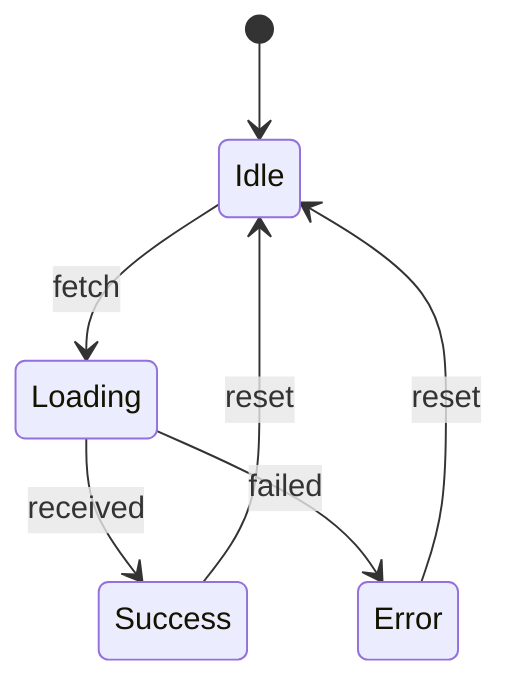

# React State Machines

## Introduction

When building React applications, managing state becomes increasingly complex as your application grows. You might start with simple `useState` hooks or perhaps move to `useReducer` for more complex state logic. However, as your application's states, transitions, and side effects multiply, even these approaches can become unwieldy.

State machines provide a structured approach to managing complex state logic. They explicitly define:

- All possible states your component can be in
- Events that can cause state transitions
- Rules that determine how states change in response to events
- Actions that should execute during transitions

In this guide, we'll explore how state machines can bring clarity, predictability, and reliability to your React applications.

## Understanding State Machines

### What is a State Machine?

A state machine is a mathematical model that describes all possible states of an application and the transitions between those states. At any given time, a state machine can be in exactly one of its defined states.



### Key Concepts

1. **States**: Distinct situations where your application behaves differently (idle, loading, success, error)
2. **Events**: Triggers that may cause state transitions (fetch, received, failed)
3. **Transitions**: Rules defining how states change in response to events
4. **Actions**: Side effects executed during transitions
5. **Guards**: Conditions that must be true for a transition to occur

## Implementing State Machines in React

### Manual Implementation

Let's start with a simple example by manually implementing a state machine for a login form:

```jsx
import React, { useState, useEffect } from 'react';

const LoginForm = () => {
  // States: 'idle', 'loading', 'success', 'error'
  const [machineState, setMachineState] = useState('idle');
  const [errorMessage, setErrorMessage] = useState('');
  const [formData, setFormData] = useState({ username: '', password: '' });

  const handleChange = (e) => {
    setFormData({
      ...formData,
      [e.target.name]: e.target.value
    });
  };

  const handleSubmit = async (e) => {
    e.preventDefault();
    
    // Transition to loading state
    setMachineState('loading');
    
    try {
      // Simulate API call
      await new Promise(resolve => setTimeout(resolve, 1500));
      
      if (formData.username === 'user' && formData.password === 'password') {
        // Transition to success state
        setMachineState('success');
      } else {
        throw new Error('Invalid credentials');
      }
    } catch (error) {
      // Transition to error state
      setMachineState('error');
      setErrorMessage(error.message);
    }
  };

  const reset = () => {
    setMachineState('idle');
    setErrorMessage('');
    setFormData({ username: '', password: '' });
  };

  // Render based on current state
  return (
    <div>
      {machineState === 'idle' && (
        <form onSubmit={handleSubmit}>
          <div>
            <label htmlFor="username">Username:</label>
            <input
              type="text"
              id="username"
              name="username"
              value={formData.username}
              onChange={handleChange}
            />
          </div>
          <div>
            <label htmlFor="password">Password:</label>
            <input
              type="password"
              id="password"
              name="password"
              value={formData.password}
              onChange={handleChange}
            />
          </div>
          <button type="submit">Login</button>
        </form>
      )}
      
      {machineState === 'loading' && <div>Logging in...</div>}
      
      {machineState === 'success' && (
        <div>
          <div>Login successful!</div>
          <button onClick={reset}>Logout</button>
        </div>
      )}
      
      {machineState === 'error' && (
        <div>
          <div>Error: {errorMessage}</div>
          <button onClick={reset}>Try Again</button>
        </div>
      )}
    </div>
  );
};
```

This implementation works, but as complexity increases, managing transitions and ensuring correct state changes becomes error-prone.

### Using useReducer

We can improve our implementation using `useReducer`, which gets us closer to a proper state machine:

```jsx
import React, { useReducer } from 'react';

// Define state machine events
const EVENTS = {
  SUBMIT: 'SUBMIT',
  SUCCESS: 'SUCCESS',
  ERROR: 'ERROR',
  RESET: 'RESET'
};

// State machine reducer
function loginMachineReducer(state, event) {
  switch (state.status) {
    case 'idle':
      if (event.type === EVENTS.SUBMIT) {
        return { status: 'loading', data: null, error: null };
      }
      return state;
    
    case 'loading':
      if (event.type === EVENTS.SUCCESS) {
        return { status: 'success', data: event.data, error: null };
      }
      if (event.type === EVENTS.ERROR) {
        return { status: 'error', data: null, error: event.error };
      }
      return state;
    
    case 'success':
    case 'error':
      if (event.type === EVENTS.RESET) {
        return { status: 'idle', data: null, error: null };
      }
      return state;
      
    default:
      return state;
  }
}

const LoginForm = () => {
  const [formData, setFormData] = React.useState({ username: '', password: '' });
  const [state, dispatch] = useReducer(loginMachineReducer, {
    status: 'idle',
    data: null,
    error: null
  });

  const handleChange = (e) => {
    setFormData({
      ...formData,
      [e.target.name]: e.target.value
    });
  };

  const handleSubmit = async (e) => {
    e.preventDefault();
    dispatch({ type: EVENTS.SUBMIT });
    
    try {
      // Simulate API call
      await new Promise(resolve => setTimeout(resolve, 1500));
      
      if (formData.username === 'user' && formData.password === 'password') {
        dispatch({ 
          type: EVENTS.SUCCESS, 
          data: { username: formData.username } 
        });
      } else {
        throw new Error('Invalid credentials');
      }
    } catch (error) {
      dispatch({ type: EVENTS.ERROR, error: error.message });
    }
  };

  const reset = () => {
    dispatch({ type: EVENTS.RESET });
    setFormData({ username: '', password: '' });
  };

  return (
    <div>
      {state.status === 'idle' && (
        <form onSubmit={handleSubmit}>
          <div>
            <label htmlFor="username">Username:</label>
            <input
              type="text"
              id="username"
              name="username"
              value={formData.username}
              onChange={handleChange}
            />
          </div>
          <div>
            <label htmlFor="password">Password:</label>
            <input
              type="password"
              id="password"
              name="password"
              value={formData.password}
              onChange={handleChange}
            />
          </div>
          <button type="submit">Login</button>
        </form>
      )}
      
      {state.status === 'loading' && <div>Logging in...</div>}
      
      {state.status === 'success' && (
        <div>
          <div>Welcome, {state.data.username}!</div>
          <button onClick={reset}>Logout</button>
        </div>
      )}
      
      {state.status === 'error' && (
        <div>
          <div>Error: {state.error}</div>
          <button onClick={reset}>Try Again</button>
        </div>
      )}
    </div>
  );
};
```

This approach is better but still lacks some features of a full state machine implementation.

### Using XState

[XState](https://xstate.js.org/) is a popular library for implementing state machines in JavaScript applications. It provides a complete set of tools for defining and working with state machines.

First, install XState:

```bash
npm install xstate @xstate/react
```

Now let's implement our login form using XState:

```jsx
import React, { useState } from 'react';
import { createMachine, assign } from 'xstate';
import { useMachine } from '@xstate/react';

// Define the state machine
const loginMachine = createMachine({
  id: 'login',
  initial: 'idle',
  context: {
    username: '',
    error: null
  },
  states: {
    idle: {
      on: {
        SUBMIT: 'loading'
      }
    },
    loading: {
      invoke: {
        src: 'performLogin',
        onDone: {
          target: 'success',
          actions: assign({
            username: (_, event) => event.data.username
          })
        },
        onError: {
          target: 'error',
          actions: assign({
            error: (_, event) => event.data
          })
        }
      }
    },
    success: {
      on: {
        RESET: {
          target: 'idle',
          actions: 'clearForm'
        }
      }
    },
    error: {
      on: {
        RESET: {
          target: 'idle',
          actions: 'clearForm'
        }
      }
    }
  }
});

const LoginForm = () => {
  const [formData, setFormData] = useState({ username: '', password: '' });
  
  const [state, send] = useMachine(loginMachine, {
    services: {
      performLogin: async (_, event) => {
        // Simulate API call
        await new Promise(resolve => setTimeout(resolve, 1500));
        
        if (formData.username === 'user' && formData.password === 'password') {
          return { username: formData.username };
        } else {
          throw 'Invalid credentials';
        }
      }
    },
    actions: {
      clearForm: () => {
        setFormData({ username: '', password: '' });
      }
    }
  });

  const handleChange = (e) => {
    setFormData({
      ...formData,
      [e.target.name]: e.target.value
    });
  };

  const handleSubmit = (e) => {
    e.preventDefault();
    send('SUBMIT');
  };

  return (
    <div>
      {state.matches('idle') && (
        <form onSubmit={handleSubmit}>
          <div>
            <label htmlFor="username">Username:</label>
            <input
              type="text"
              id="username"
              name="username"
              value={formData.username}
              onChange={handleChange}
            />
          </div>
          <div>
            <label htmlFor="password">Password:</label>
            <input
              type="password"
              id="password"
              name="password"
              value={formData.password}
              onChange={handleChange}
            />
          </div>
          <button type="submit">Login</button>
        </form>
      )}
      
      {state.matches('loading') && <div>Logging in...</div>}
      
      {state.matches('success') && (
        <div>
          <div>Welcome, {state.context.username}!</div>
          <button onClick={() => send('RESET')}>Logout</button>
        </div>
      )}
      
      {state.matches('error') && (
        <div>
          <div>Error: {state.context.error}</div>
          <button onClick={() => send('RESET')}>Try Again</button>
        </div>
      )}
    </div>
  );
};
```

With XState, we get:
- Clear visualization of our machine
- Guaranteed valid state transitions
- Automatic handling of side effects
- Protection against impossible states

## Real-World Example: Shopping Cart

Let's implement a shopping cart with multiple states using XState:

```jsx
import React from 'react';
import { createMachine, assign } from 'xstate';
import { useMachine } from '@xstate/react';

const cartMachine = createMachine({
  id: 'cart',
  initial: 'empty',
  context: {
    items: [],
    error: null
  },
  states: {
    empty: {
      on: {
        ADD_ITEM: {
          target: 'items',
          actions: 'addItem'
        }
      }
    },
    items: {
      on: {
        ADD_ITEM: {
          target: 'items',
          actions: 'addItem'
        },
        REMOVE_ITEM: [
          {
            target: 'empty',
            cond: (context, event) => {
              const updatedItems = context.items.filter(item => item.id !== event.item.id);
              return updatedItems.length === 0;
            },
            actions: 'removeItem'
          },
          {
            target: 'items',
            actions: 'removeItem'
          }
        ],
        CHECKOUT: 'checkingOut'
      }
    },
    checkingOut: {
      invoke: {
        src: 'submitOrder',
        onDone: 'orderSuccess',
        onError: {
          target: 'orderError',
          actions: assign({
            error: (_, event) => event.data
          })
        }
      }
    },
    orderSuccess: {
      on: {
        RESET: {
          target: 'empty',
          actions: 'clearCart'
        }
      }
    },
    orderError: {
      on: {
        RETRY: 'checkingOut',
        MODIFY: 'items',
        RESET: {
          target: 'empty',
          actions: 'clearCart'
        }
      }
    }
  }
});

const ShoppingCart = () => {
  const [state, send] = useMachine(cartMachine, {
    actions: {
      addItem: assign({
        items: (context, event) => [...context.items, event.item]
      }),
      removeItem: assign({
        items: (context, event) => 
          context.items.filter(item => item.id !== event.item.id)
      }),
      clearCart: assign({
        items: [],
        error: null
      })
    },
    services: {
      submitOrder: async (context) => {
        // Simulate API call
        await new Promise(resolve => setTimeout(resolve, 1500));
        
        // Simulate success or failure
        if (Math.random() > 0.3) {
          return { orderId: `ORD-${Date.now()}` };
        } else {
          throw 'Payment processing failed';
        }
      }
    }
  });

  // Sample products
  const products = [
    { id: 1, name: 'React Book', price: 39.99 },
    { id: 2, name: 'JavaScript Course', price: 29.99 },
    { id: 3, name: 'Node.js Guide', price: 49.99 }
  ];

  // Calculate total
  const cartTotal = state.context.items.reduce(
    (total, item) => total + item.price,
    0
  ).toFixed(2);

  return (
    <div>
      <h2>Products</h2>
      <div className="products">
        {products.map(product => (
          <div key={product.id} className="product-card">
            <h3>{product.name}</h3>
            <p>${product.price}</p>
            <button
              onClick={() => send('ADD_ITEM', { item: product })}
            >
              Add to Cart
            </button>
          </div>
        ))}
      </div>

      <h2>Shopping Cart</h2>
      
      {state.matches('empty') && (
        <p>Your cart is empty.</p>
      )}
      
      {(state.matches('items') || state.matches('orderError')) && (
        <div>
          <ul>
            {state.context.items.map((item, index) => (
              <li key={index}>
                {item.name} - ${item.price}
                <button
                  onClick={() => send('REMOVE_ITEM', { item })}
                >
                  Remove
                </button>
              </li>
            ))}
          </ul>
          <p><strong>Total: ${cartTotal}</strong></p>
          <button
            onClick={() => send('CHECKOUT')}
          >
            Checkout
          </button>
        </div>
      )}
      
      {state.matches('checkingOut') && (
        <div>
          <p>Processing your order...</p>
          <div className="loading-spinner"></div>
        </div>
      )}
      
      {state.matches('orderSuccess') && (
        <div>
          <h3>Order Placed Successfully!</h3>
          <p>Thank you for your purchase.</p>
          <button
            onClick={() => send('RESET')}
          >
            Shop Again
          </button>
        </div>
      )}
      
      {state.matches('orderError') && (
        <div>
          <h3>Error Processing Order</h3>
          <p>{state.context.error}</p>
          <div className="error-buttons">
            <button onClick={() => send('RETRY')}>
              Try Again
            </button>
            <button onClick={() => send('MODIFY')}>
              Modify Cart
            </button>
            <button onClick={() => send('RESET')}>
              Empty Cart
            </button>
          </div>
        </div>
      )}
    </div>
  );
};
```

In this example, the shopping cart can be in several states:
- `empty`: No items in the cart
- `items`: One or more items in the cart
- `checkingOut`: Processing the order
- `orderSuccess`: Order was submitted successfully
- `orderError`: There was a problem with the order

## Benefits of State Machines in React

1. **Predictability**: State transitions are explicitly defined, making behavior predictable.
2. **Visualization**: State machines can be visualized, making complex logic easier to understand and communicate.
3. **Impossible States**: State machines prevent impossible states by design.
4. **Testing**: Each state and transition can be isolated and tested independently.
5. **Developer Experience**: Clearer mental model and code organization for complex stateful components.

## When to Use State Machines

State machines shine in components with:
- Multiple interdependent states
- Complex transition logic
- Time-based state changes
- Multiple side effects
- Many edge cases

Examples include:
- Form wizards with multiple steps
- Authentication flows
- Media players
- Shopping carts
- Game state management

## Best Practices

1. **Start Simple**: Don't reach for state machines for every component. Simple state often just needs `useState`.
2. **Separate Concerns**: Keep UI rendering separate from state machine logic.
3. **Named Events**: Use descriptive constants for events (e.g., `SUBMIT` instead of strings).
4. **Avoid Nested Machines**: Prefer composition of smaller machines over deeply nested ones.
5. **Testing**: Test each state and transition individually.

## Summary

State machines provide a structured approach to managing complex state in React applications. By explicitly defining states, events, transitions, and actions, you can create more predictable, maintainable, and bug-resistant code.

While simple components can often get by with `useState` or `useReducer`, state machines become increasingly valuable as your application's complexity grows. Libraries like XState make implementing state machines in React straightforward while providing powerful features like visualization, testing, and state persistence.

## Additional Resources

- [XState Documentation](https://xstate.js.org/docs/)
- [Visualizer for XState](https://stately.ai/viz)
- [The State of State Machines in React](https://daveceddia.com/state-machines-in-react/)
- [Finite State Machines with React](https://css-tricks.com/finite-state-machines-with-react/)

## Exercises

1. Convert a form with multiple steps (e.g., user details, shipping, payment) to use a state machine.
2. Implement a traffic light component using state machines that cycles between red, yellow, and green.
3. Create a file upload component with states for idle, uploading, success, and error.
4. Enhance the shopping cart example to include a "wishlist" feature where items can be moved between the wishlist and cart.
5. Visualize one of your state machines using the XState visualizer and optimize its structure.