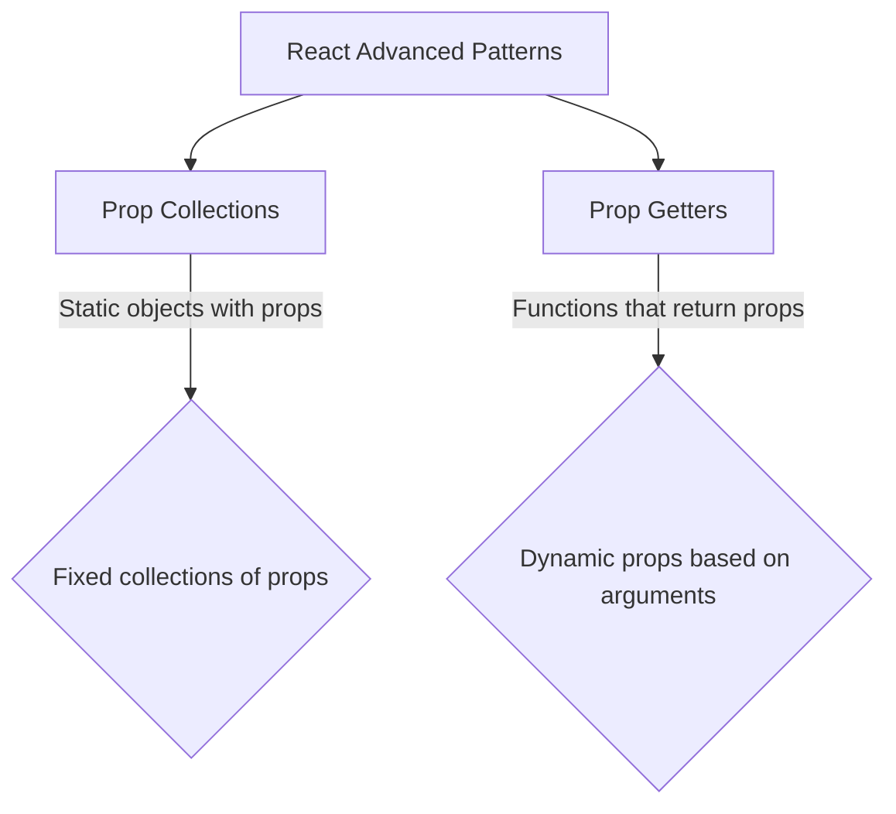

# React Prop Collections

## Introduction

When building reusable React components, one challenge developers face is maintaining a clean and intuitive API. As components grow in complexity, they often require numerous props to be passed down to child components, which can lead to verbose and error-prone code. **Prop Collections** is a pattern that helps solve this problem by grouping related props together and providing them as a single object, making component APIs more organized and easier to use.

In this tutorial, we'll explore the Prop Collections pattern in-depth, understand its benefits, and learn how to implement it in your React applications.

## Understanding Prop Collections

Prop Collections is an advanced React pattern where you group logically related props into an object (collection) and provide them to the consumer of your component or hook. Instead of passing multiple individual props, users of your component will receive pre-configured collections that they can spread directly onto their elements.

### Basic Concept

At its core, the Prop Collections pattern looks like this:

```jsx
// Without prop collections
<button
  onClick={handleClick}
  onMouseDown={handleMouseDown}
  onKeyDown={handleKeyDown}
  aria-pressed={isPressed}
  role="button"
>
  Click me
</button>

// With prop collections
<button {...buttonProps}>
  Click me
</button>
```

Where `buttonProps` is an object containing all the necessary props grouped together.

## Implementing Prop Collections

Let's see how to implement the Prop Collections pattern in a simple toggle component:

### Basic Toggle Component

First, let's create a basic toggle component without prop collections:

```jsx
import React, { useState } from 'react';

function Toggle({ onToggle }) {
  const [on, setOn] = useState(false);
  
  const toggle = () => {
    const newState = !on;
    setOn(newState);
    onToggle?.(newState);
  };
  
  return (
    <div>
      <button 
        onClick={toggle}
        aria-pressed={on}
        role="switch"
      >
        {on ? 'ON' : 'OFF'}
      </button>
      <span>{on ? '✅ Enabled' : '❌ Disabled'}</span>
    </div>
  );
}

export default Toggle;
```

### Applying Prop Collections

Now, let's refactor this component to use prop collections:

```jsx
import React, { useState } from 'react';

function Toggle({ onToggle }) {
  const [on, setOn] = useState(false);
  
  const toggle = () => {
    const newState = !on;
    setOn(newState);
    onToggle?.(newState);
  };
  
  // Create prop collections
  const buttonProps = {
    onClick: toggle,
    'aria-pressed': on,
    role: 'switch',
  };
  
  const labelProps = {
    'aria-live': 'polite',
    'aria-label': on ? 'enabled' : 'disabled',
  };
  
  return (
    <div>
      <button {...buttonProps}>
        {on ? 'ON' : 'OFF'}
      </button>
      <span {...labelProps}>
        {on ? '✅ Enabled' : '❌ Disabled'}
      </span>
    </div>
  );
}

export default Toggle;
```

In this example, we've organized related props into two collections: `buttonProps` and `labelProps`. This makes our component's render function cleaner and more maintainable.

## Custom Hooks with Prop Collections

Prop Collections become even more powerful when combined with custom hooks. Let's build a reusable `useToggle` hook that provides prop collections:

```jsx
import { useState, useCallback } from 'react';

function useToggle(initialState = false) {
  const [on, setOn] = useState(initialState);
  
  const toggle = useCallback(() => {
    setOn(prevOn => !prevOn);
  }, []);
  
  const setToggleState = useCallback((state) => {
    setOn(Boolean(state));
  }, []);
  
  // Create prop collections
  const togglerProps = {
    'aria-pressed': on,
    onClick: toggle,
    role: 'switch',
  };
  
  const displayProps = {
    'aria-live': 'polite',
    'aria-label': on ? 'active' : 'inactive',
  };
  
  return {
    on,
    toggle,
    setToggleState,
    togglerProps,
    displayProps,
  };
}

export default useToggle;
```

Now, we can use this hook in multiple components:

```jsx
function ToggleButton() {
  const { on, togglerProps, displayProps } = useToggle();
  
  return (
    <div>
      <button {...togglerProps}>
        {on ? 'ON' : 'OFF'}
      </button>
      <span {...displayProps}>
        {on ? '✅ Enabled' : '❌ Disabled'}
      </span>
    </div>
  );
}
```

## Real-World Example: Accessible Modal

Let's explore a more practical example using prop collections for an accessible modal component:

```jsx
import { useState, useCallback } from 'react';

function useModal(initialOpen = false) {
  const [isOpen, setIsOpen] = useState(initialOpen);
  
  const open = useCallback(() => setIsOpen(true), []);
  const close = useCallback(() => setIsOpen(false), []);

  // Generate a unique ID for accessibility attributes
  const modalId = useId();
  const titleId = `${modalId}-title`;
  
  // Prop collections
  const triggerProps = {
    'aria-controls': modalId,
    'aria-expanded': isOpen,
    onClick: open,
  };
  
  const modalProps = {
    id: modalId,
    'aria-labelledby': titleId,
    'aria-hidden': !isOpen,
    role: 'dialog',
  };
  
  const titleProps = {
    id: titleId,
  };
  
  const closeButtonProps = {
    onClick: close,
    'aria-label': 'Close modal',
  };
  
  return {
    isOpen,
    open,
    close,
    triggerProps,
    modalProps,
    titleProps,
    closeButtonProps,
  };
}
```

And here's how to use it:

```jsx
function App() {
  const {
    isOpen,
    triggerProps,
    modalProps,
    titleProps,
    closeButtonProps
  } = useModal();

  return (
    <div>
      <button {...triggerProps}>Open Modal</button>
      
      {isOpen && (
        <div className="modal-overlay">
          <div className="modal-content" {...modalProps}>
            <h2 {...titleProps}>Welcome to the Modal</h2>
            <p>This is an accessible modal using prop collections.</p>
            <button {...closeButtonProps}>✕</button>
          </div>
        </div>
      )}
    </div>
  );
}
```

## Benefits of Prop Collections

Prop Collections offer several advantages:

1. **Cleaner API**: Users of your component or hook receive grouped props instead of numerous individual props.

2. **Improved Accessibility**: You can ensure that all necessary accessibility attributes are included in the prop collections.

3. **Consistent Behavior**: Common event handlers and properties are consistently applied.

4. **Better Maintainability**: Changes to the implementation details can be made in one place without affecting the component's API.

5. **Reduced Boilerplate**: Consumers of your component can spread prop collections instead of writing the same props repeatedly.

## Understanding Prop Collections vs. Prop Getters

It's worth noting the distinction between Prop Collections and Prop Getters, which is another related pattern:



- **Prop Collections**: Fixed objects containing related props
- **Prop Getters**: Functions that return prop objects, potentially customized based on arguments

## Best Practices

1. **Group props logically**: Create separate collections for different parts of your component (button props, input props, etc.).

2. **Include accessibility attributes**: Make sure to include ARIA attributes and roles in your prop collections.

3. **Use descriptive names**: Name your prop collections clearly to indicate their purpose (`triggerProps`, `modalProps`, etc.).

4. **Keep collections focused**: Each collection should serve a specific purpose.

5. **Document prop collections**: Make sure to document what each prop collection contains and how it should be used.

## Practical Exercise: ToDo Item Component

Let's build a ToDo item component using prop collections:

```jsx
import React, { useState } from 'react';

function useTodoItem(initialCompleted = false) {
  const [completed, setCompleted] = useState(initialCompleted);
  
  const toggle = () => setCompleted(prev => !prev);
  
  // Prop collections
  const containerProps = {
    className: `todo-item ${completed ? 'completed' : ''}`,
    'data-status': completed ? 'completed' : 'active',
  };
  
  const checkboxProps = {
    type: 'checkbox',
    checked: completed,
    onChange: toggle,
    'aria-label': 'Mark as completed',
  };
  
  const labelProps = {
    style: {
      textDecoration: completed ? 'line-through' : 'none',
      color: completed ? '#888' : '#000',
    },
  };
  
  const deleteButtonProps = {
    'aria-label': 'Delete todo item',
    className: 'delete-button',
  };
  
  return {
    completed,
    toggle,
    containerProps,
    checkboxProps,
    labelProps,
    deleteButtonProps,
  };
}

function TodoItem({ text, onDelete }) {
  const {
    containerProps,
    checkboxProps,
    labelProps,
    deleteButtonProps
  } = useTodoItem();
  
  const handleDelete = () => {
    onDelete?.();
  };
  
  return (
    <div {...containerProps}>
      <input {...checkboxProps} />
      <span {...labelProps}>{text}</span>
      <button {...deleteButtonProps} onClick={handleDelete}>✕</button>
    </div>
  );
}
```

## Summary

Prop Collections is a powerful pattern that allows you to organize props together in logical groupings, making your component APIs cleaner and more intuitive. By providing pre-configured collections of props, you reduce boilerplate code and ensure consistency throughout your application.

When combined with custom hooks, prop collections enable highly reusable and maintainable component interfaces. They're particularly valuable for complex components that require numerous props or when building component libraries.

The key benefits include:
- Cleaner component APIs
- Reduced boilerplate for consumers
- Better organization of related props
- Improved accessibility by ensuring necessary attributes are present

## Additional Resources

- Try refactoring an existing component to use prop collections
- Implement prop collections in a custom hook
- Explore how to combine prop collections with other patterns like Compound Components or Context

Challenge yourself to create a form component that uses prop collections for form elements like inputs, labels, and submit buttons.