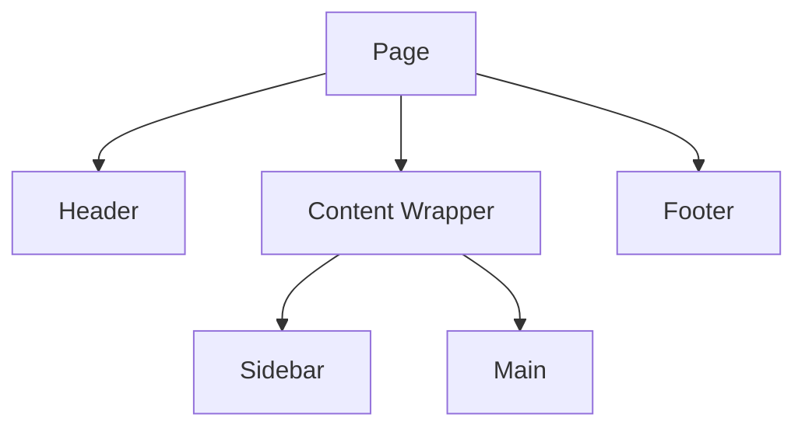

# React Component Composition

## Introduction

Component composition is one of the most powerful patterns in React, allowing you to build complex user interfaces by combining smaller, reusable components. Instead of creating large, monolithic components that handle multiple responsibilities, composition encourages you to build smaller, focused components that can be combined together like building blocks.

In this tutorial, we'll explore how to use component composition effectively to create more maintainable, flexible, and reusable React applications.

## Why Use Component Composition?

Before diving into the implementation details, let's understand why component composition is so important:

1. **Reusability**: Small components can be reused across your application
2. **Maintainability**: Simpler components are easier to understand and modify
3. **Separation of concerns**: Each component handles one specific task
4. **Flexibility**: Components can be arranged in different ways to create various UI layouts
5. **Testing**: Smaller components are easier to test in isolation

## Basic Component Composition

At its simplest, component composition involves nesting components within other components. Let's see a basic example:

```jsx
// Button.jsx
function Button({ children, onClick }) {
  return (
    <button 
      onClick={onClick}
      className="primary-button"
    >
      {children}
    </button>
  );
}

// Card.jsx
function Card({ title, children }) {
  return (
    <div className="card">
      <h2 className="card-title">{title}</h2>
      <div className="card-content">
        {children}
      </div>
    </div>
  );
}

// App.jsx
function App() {
  return (
    <div className="app">
      <Card title="Important Notification">
        <p>This is an important message for all users.</p>
        <Button onClick={() => console.log('Button clicked')}>
          Acknowledge
        </Button>
      </Card>
    </div>
  );
}
```

In this example:
- We have a reusable `Button` component that can be used anywhere
- We have a `Card` component that can wrap any content
- In the `App` component, we compose these components together

The output would be a card with a title, a paragraph of text, and a button - all structured exactly as we've defined them.

## The `children` Prop

The key to component composition is React's `children` prop. When you include content between opening and closing tags of a component, React automatically passes that content as a special prop called `children`.

```jsx
function Container({ children }) {
  return (
    <div className="container">
      {children}
    </div>
  );
}

// Usage
function App() {
  return (
    <Container>
      <h1>Hello World</h1>
      <p>This content is passed as children to the Container component</p>
    </Container>
  );
}
```

## Specialized Components with Composition

Let's look at a more practical example. Instead of creating multiple variants of a component using conditional props, we can use composition to create specialized components:

```jsx
// Instead of this:
function Button({ variant, size, children, ...props }) {
  return (
    <button 
      className={`btn btn-${variant} btn-${size}`}
      {...props}
    >
      {children}
    </button>
  );
}

// Usage:
<Button variant="primary" size="large">Click me</Button>
<Button variant="warning" size="small">Warning</Button>
```

We can use composition to create more specialized components:

```jsx
// Base button component
function Button({ children, className, ...props }) {
  return (
    <button 
      className={`btn ${className || ''}`}
      {...props}
    >
      {children}
    </button>
  );
}

// Specialized button components
function PrimaryButton(props) {
  return <Button className="btn-primary" {...props} />;
}

function WarningButton(props) {
  return <Button className="btn-warning" {...props} />;
}

function LargeButton(props) {
  return <Button className="btn-large" {...props} />;
}

// Usage:
function App() {
  return (
    <div>
      <PrimaryButton>Click me</PrimaryButton>
      <WarningButton>Warning</WarningButton>
      <LargeButton>Large Button</LargeButton>
      
      {/* You can still compose them together */}
      <LargeButton className="btn-primary">Large Primary Button</LargeButton>
    </div>
  );
}
```

This approach makes your code more readable and maintainable, as each component has a clear, single responsibility.

## Advanced Composition Patterns

### 1. Compound Components

Compound components are components that work together to form a complete UI element. Think of them like `<select>` and `<option>` in HTML.

```jsx
// Menu.jsx
import React, { createContext, useContext, useState } from 'react';

const MenuContext = createContext();

function Menu({ children }) {
  const [activeItem, setActiveItem] = useState(null);
  
  return (
    <MenuContext.Provider value={{ activeItem, setActiveItem }}>
      <div className="menu">
        {children}
      </div>
    </MenuContext.Provider>
  );
}

function MenuItem({ children, value }) {
  const { activeItem, setActiveItem } = useContext(MenuContext);
  
  const isActive = value === activeItem;
  
  return (
    <div 
      className={`menu-item ${isActive ? 'active' : ''}`}
      onClick={() => setActiveItem(value)}
    >
      {children}
    </div>
  );
}

// Attach MenuItem as a property of Menu
Menu.Item = MenuItem;

// Usage
function App() {
  return (
    <Menu>
      <Menu.Item value="home">Home</Menu.Item>
      <Menu.Item value="products">Products</Menu.Item>
      <Menu.Item value="about">About Us</Menu.Item>
    </Menu>
  );
}
```

This pattern creates a clear relationship between components and enforces proper usage.

### 2. Render Props

The render props pattern allows you to share code between components using a prop whose value is a function.

```jsx
// MouseTracker.jsx
function MouseTracker({ render }) {
  const [position, setPosition] = useState({ x: 0, y: 0 });
  
  function handleMouseMove(event) {
    setPosition({
      x: event.clientX,
      y: event.clientY
    });
  }
  
  return (
    <div 
      style={{ height: '100vh' }}
      onMouseMove={handleMouseMove}
    >
      {render(position)}
    </div>
  );
}

// Usage
function App() {
  return (
    <MouseTracker
      render={({ x, y }) => (
        <div>
          <h1>Mouse Position:</h1>
          <p>X: {x}, Y: {y}</p>
        </div>
      )}
    />
  );
}
```

This pattern is powerful because it lets you inject behavior into components without tight coupling.

### 3. Using Children as a Function

A variation of the render props pattern is to use the `children` prop as a function:

```jsx
function DataFetcher({ url, children }) {
  const [data, setData] = useState(null);
  const [loading, setLoading] = useState(true);
  const [error, setError] = useState(null);
  
  useEffect(() => {
    async function fetchData() {
      try {
        setLoading(true);
        const response = await fetch(url);
        const result = await response.json();
        setData(result);
        setLoading(false);
      } catch (err) {
        setError(err);
        setLoading(false);
      }
    }
    
    fetchData();
  }, [url]);
  
  return children({ data, loading, error });
}

// Usage
function App() {
  return (
    <DataFetcher url="https://api.example.com/data">
      {({ data, loading, error }) => {
        if (loading) return <p>Loading...</p>;
        if (error) return <p>Error: {error.message}</p>;
        
        return (
          <div>
            <h1>Data:</h1>
            <pre>{JSON.stringify(data, null, 2)}</pre>
          </div>
        );
      }}
    </DataFetcher>
  );
}
```

## Real-World Example: Building a Layout System

Let's see how component composition can help us build a flexible layout system:

```jsx
// Layout components
function Page({ children }) {
  return <div className="page">{children}</div>;
}

function Header({ children }) {
  return <header className="header">{children}</header>;
}

function Sidebar({ children }) {
  return <aside className="sidebar">{children}</aside>;
}

function Main({ children }) {
  return <main className="main-content">{children}</main>;
}

function Footer({ children }) {
  return <footer className="footer">{children}</footer>;
}

// Usage
function App() {
  return (
    <Page>
      <Header>
        <h1>My Amazing App</h1>
        <nav>
          <a href="/">Home</a>
          <a href="/about">About</a>
          <a href="/contact">Contact</a>
        </nav>
      </Header>
      
      <div className="content-wrapper">
        <Sidebar>
          <h3>Categories</h3>
          <ul>
            <li>Category 1</li>
            <li>Category 2</li>
            <li>Category 3</li>
          </ul>
        </Sidebar>
        
        <Main>
          <h2>Welcome to My App</h2>
          <p>This is the main content area of the application.</p>
          <button>Learn More</button>
        </Main>
      </div>
      
      <Footer>
        <p>&copy; 2023 My Amazing App. All rights reserved.</p>
      </Footer>
    </Page>
  );
}
```

This approach gives you incredible flexibility to change your layout structure without modifying the components themselves.



## Building Flexible Components

To make your components even more flexible, you can accept additional props like className, style, and other HTML attributes:

```jsx
function Button({ children, className, ...rest }) {
  return (
    <button 
      className={`default-button ${className || ''}`}
      {...rest}
    >
      {children}
    </button>
  );
}

// Usage
function App() {
  return (
    <div>
      <Button 
        className="custom-style" 
        onClick={() => console.log('clicked')} 
        disabled={false}
        data-testid="submit-button"
      >
        Click Me
      </Button>
    </div>
  );
}
```

By spreading the `...rest` props onto the underlying HTML element, you allow consumers of your component to add any additional HTML attributes they need.

## When to Use Component Composition

Composition is ideal when:

1. You find yourself writing components with many conditional props or complex rendering logic
2. You want to create reusable UI patterns that can adapt to various content
3. You need to share behavior between components
4. You want to build a component library that's flexible and easy to use

## When to Consider Other Patterns

While composition is powerful, it's not always the right choice:

1. For very simple UI elements, a single component with props may be clearer
2. When state management becomes complex, you might need additional patterns or libraries
3. For highly specific components with no reuse potential, abstracting too much might add unnecessary complexity

## Summary

Component composition is a foundational pattern in React that helps you build flexible, reusable, and maintainable applications. By breaking your UI into smaller components and composing them together, you create a more modular codebase that's easier to understand and extend.

Key takeaways:

1. Use the `children` prop to create flexible container components
2. Create specialized components through composition rather than complex props
3. Consider compound components, render props, and other composition patterns for more complex scenarios
4. Design components that can be easily composed with others
5. Always think about reusability and maintainability

## Exercises

1. Take an existing complex component in your codebase and break it into smaller, composable pieces
2. Create a `Card` component that can display different types of content through composition
3. Implement a `Tabs` component using the compound component pattern
4. Build a form component library using composition (inputs, labels, error messages, etc.)
5. Refactor a component that uses many conditional props to use composition instead

## Additional Resources

- [React Official Documentation on Composition vs Inheritance](https://reactjs.org/docs/composition-vs-inheritance.html)
- [Kent C. Dodds' Blog on Advanced React Component Patterns](https://kentcdodds.com/blog/advanced-react-component-patterns)
- [Thinking in React](https://reactjs.org/docs/thinking-in-react.html)

By mastering component composition, you'll be able to create more elegant, flexible React applications with clean, maintainable code.