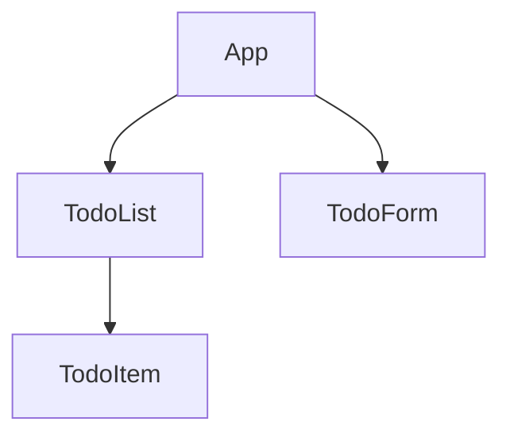

# Create React App

## Introduction

Create React App (CRA) is an officially supported way to create single-page React applications with no build configuration. It sets up your development environment so you can use the latest JavaScript features, provides a nice developer experience, and optimizes your app for production.

When getting started with React, one of the biggest challenges is setting up a proper development environment. You need to configure tools like Webpack, Babel, ESLint, and more. Create React App handles all this for you so you can focus on writing code rather than configuring build tools.

## Why Use Create React App?

Create React App offers several advantages for React developers:

- **Zero Configuration**: No need to configure Webpack, Babel, ESLint, or other build tools.
- **Single Dependency**: You only need to manage one dependency (react-scripts) which contains all the build tools.
- **No Lock-In**: If your project requirements outgrow CRA, you can "eject" at any time.
- **Optimized Production Build**: Built-in optimizations for production deployment.
- **Modern JavaScript Features**: Use the latest JavaScript features without extra configuration.
- **Development Server**: Built-in development server with hot reload.

## Getting Started with Create React App

### Prerequisites

Before you begin, make sure you have Node.js installed (version 14.0.0 or higher). You can check your Node version with:

```bash
node -v
```

### Creating Your First App

To create a new React application using Create React App, run the following command:

```bash
npx create-react-app my-app
```

This command will create a new directory called `my-app` with a ready-to-use React application structure.

Once the installation is complete, you'll see a success message with instructions:

```
Success! Created my-app at /path/to/my-app
Inside that directory, you can run several commands:

  npm start
    Starts the development server.

  npm run build
    Bundles the app into static files for production.

  npm test
    Starts the test runner.

  npm run eject
    Removes this tool and copies build dependencies, configuration files
    and scripts into the app directory. If you do this, you can't go back!

We suggest that you begin by typing:

  cd my-app
  npm start
```

### Project Structure

After creating a new app, your project structure will look like this:

```
my-app/
  README.md
  node_modules/
  package.json
  public/
    index.html
    favicon.ico
  src/
    App.css
    App.js
    App.test.js
    index.css
    index.js
    logo.svg
```

Let's understand the key files and directories:

- **public/**: Contains static assets that won't be processed by Webpack
  - **index.html**: The HTML template for your app
- **src/**: Contains the React source code for your application
  - **index.js**: The entry point for your app
  - **App.js**: The main component
- **package.json**: Lists dependencies and contains scripts to run, build, and test your app
- **node_modules/**: Contains all the npm packages your project depends on

## Using Create React App

### Starting the Development Server

To start the development server, navigate to your project directory and run:

```bash
cd my-app
npm start
```

This will start the development server at `http://localhost:3000`. Any changes you make to your code will automatically refresh the browser.

### Creating Components

Let's create a simple component to understand the workflow. Replace the content of `src/App.js` with:

```jsx
import React, { useState } from 'react';
import './App.css';

function App() {
  const [count, setCount] = useState(0);

  return (
    <div className="App">
      <header className="App-header">
        <h1>Counter App</h1>
        <p>Current count: {count}</p>
        <button onClick={() => setCount(count + 1)}>
          Increment
        </button>
        <button onClick={() => setCount(count - 1)}>
          Decrement
        </button>
      </header>
    </div>
  );
}

export default App;
```

This creates a simple counter application with increment and decrement buttons.

### Adding Styles

Create React App supports various ways to style your components. You can:

1. Use regular CSS files (imported directly into components)
2. Use CSS Modules (filename.module.css)
3. Use Sass/SCSS (requires adding the sass dependency)

Let's update our `App.css` to style our counter app:

```css
.App {
  text-align: center;
}

.App-header {
  background-color: #282c34;
  min-height: 100vh;
  display: flex;
  flex-direction: column;
  align-items: center;
  justify-content: center;
  font-size: calc(10px + 2vmin);
  color: white;
}

button {
  margin: 10px;
  padding: 10px 20px;
  font-size: 16px;
  border: none;
  border-radius: 5px;
  background-color: #61dafb;
  cursor: pointer;
  transition: background-color 0.3s;
}

button:hover {
  background-color: #21a1c9;
}
```

### Adding Dependencies

To add new dependencies to your project, you can use npm or yarn:

```bash
npm install axios
# or
yarn add axios
```

Then import and use the dependency in your components:

```jsx
import axios from 'axios';
```

### Running Tests

Create React App comes with Jest testing framework pre-configured. To run tests:

```bash
npm test
```

This will start the test runner in watch mode.

### Building for Production

When you're ready to deploy your application, create an optimized production build:

```bash
npm run build
```

This creates a `build` directory with optimized files ready for deployment.

## Environment Variables

Create React App allows you to use environment variables for different configurations across environments. By default, it supports `.env` files:

```
.env                # Loaded in all environments
.env.local          # Loaded in all environments, ignored by git
.env.development    # Loaded in development environment
.env.production     # Loaded in production environment
```

To use an environment variable in your code, prefix it with `REACT_APP_`:

```env
REACT_APP_API_URL=https://api.example.com
```

Then in your React code:

```jsx
fetch(process.env.REACT_APP_API_URL + '/users')
```

## Advanced: Customizing Configuration

### Adding CSS Preprocessors

To use Sass in your project, install the dependency:

```bash
npm install sass
# or
yarn add sass
```

Then rename your .css files to .scss or .sass and import them:

```jsx
import './App.scss';
```

### Using TypeScript

To create a new TypeScript project:

```bash
npx create-react-app my-typescript-app --template typescript
```

To add TypeScript to an existing project:

```bash
npm install --save typescript @types/node @types/react @types/react-dom @types/jest
```

Then rename files from `.js` to `.tsx`.

### Ejecting from Create React App

If you need more control over the build configuration, you can "eject" from Create React App:

```bash
npm run eject
```

⚠️ **Warning**: This is a one-way operation. Once you eject, you can't go back!

Ejecting gives you full control over configuration files and all the dependencies (Webpack, Babel, ESLint, etc.).

## Real-World Example: Building a Todo Application

Let's create a more comprehensive example of a Todo application using Create React App:

First, let's create the component structure:



Now, let's implement these components:

### TodoItem.js

```jsx
import React from 'react';

function TodoItem({ todo, onToggle, onDelete }) {
  return (
    <div className={`todo-item ${todo.completed ? 'completed' : ''}`}>
      <input 
        type="checkbox" 
        checked={todo.completed} 
        onChange={() => onToggle(todo.id)} 
      />
      <span>{todo.text}</span>
      <button onClick={() => onDelete(todo.id)}>Delete</button>
    </div>
  );
}

export default TodoItem;
```

### TodoList.js

```jsx
import React from 'react';
import TodoItem from './TodoItem';

function TodoList({ todos, onToggle, onDelete }) {
  return (
    <div className="todo-list">
      <h2>Todo List</h2>
      {todos.length === 0 ? (
        <p>No todos yet! Add a new one.</p>
      ) : (
        todos.map(todo => (
          <TodoItem 
            key={todo.id} 
            todo={todo} 
            onToggle={onToggle} 
            onDelete={onDelete} 
          />
        ))
      )}
    </div>
  );
}

export default TodoList;
```

### TodoForm.js

```jsx
import React, { useState } from 'react';

function TodoForm({ onAdd }) {
  const [text, setText] = useState('');

  const handleSubmit = (e) => {
    e.preventDefault();
    if (!text.trim()) return;
    onAdd(text);
    setText('');
  };

  return (
    <form className="todo-form" onSubmit={handleSubmit}>
      <input
        type="text"
        value={text}
        onChange={(e) => setText(e.target.value)}
        placeholder="Add a new todo..."
      />
      <button type="submit">Add Todo</button>
    </form>
  );
}

export default TodoForm;
```

### App.js

```jsx
import React, { useState, useEffect } from 'react';
import TodoList from './TodoList';
import TodoForm from './TodoForm';
import './App.css';

function App() {
  const [todos, setTodos] = useState(() => {
    // Load todos from local storage
    const savedTodos = localStorage.getItem('todos');
    return savedTodos ? JSON.parse(savedTodos) : [];
  });

  // Save todos to local storage whenever they change
  useEffect(() => {
    localStorage.setItem('todos', JSON.stringify(todos));
  }, [todos]);

  const addTodo = (text) => {
    setTodos([...todos, {
      id: Date.now(),
      text,
      completed: false
    }]);
  };

  const toggleTodo = (id) => {
    setTodos(todos.map(todo =>
      todo.id === id ? { ...todo, completed: !todo.completed } : todo
    ));
  };

  const deleteTodo = (id) => {
    setTodos(todos.filter(todo => todo.id !== id));
  };

  return (
    <div className="App">
      <header className="App-header">
        <h1>Todo App</h1>
        <TodoForm onAdd={addTodo} />
        <TodoList 
          todos={todos} 
          onToggle={toggleTodo} 
          onDelete={deleteTodo} 
        />
      </header>
    </div>
  );
}

export default App;
```

### App.css

```css
.App {
  text-align: center;
  max-width: 600px;
  margin: 0 auto;
  padding: 20px;
}

.App-header {
  min-height: 100vh;
  display: flex;
  flex-direction: column;
  align-items: center;
}

.todo-form {
  margin-bottom: 20px;
  width: 100%;
  display: flex;
}

.todo-form input {
  flex-grow: 1;
  padding: 10px;
  border: 1px solid #ccc;
  border-radius: 4px 0 0 4px;
  font-size: 16px;
}

.todo-form button {
  padding: 10px 15px;
  background-color: #0275d8;
  color: white;
  border: none;
  border-radius: 0 4px 4px 0;
  cursor: pointer;
  font-size: 16px;
}

.todo-item {
  display: flex;
  align-items: center;
  padding: 10px;
  margin: 5px 0;
  border: 1px solid #eee;
  border-radius: 4px;
  text-align: left;
}

.todo-item.completed span {
  text-decoration: line-through;
  color: #888;
}

.todo-item input {
  margin-right: 10px;
}

.todo-item span {
  flex-grow: 1;
}

.todo-item button {
  padding: 5px 10px;
  background-color: #d9534f;
  color: white;
  border: none;
  border-radius: 4px;
  cursor: pointer;
}

.todo-list {
  width: 100%;
}
```

This example demonstrates several key concepts:
- Component composition
- State management with useState and useEffect
- Event handling
- Local storage for data persistence
- Conditional rendering
- CSS styling in Create React App

## Summary

Create React App provides an excellent starting point for building React applications without the hassle of configuring complex build tools. It offers:

- A modern development environment with features like hot module reloading
- A streamlined workflow for building, testing, and deploying React applications
- Support for modern JavaScript features, CSS preprocessors, and TypeScript
- Production optimizations for performance

Whether you're building a simple prototype or a complex single-page application, Create React App gives you everything you need to get started quickly.

## Additional Resources

For further learning, check out:

1. [Create React App Official Documentation](https://create-react-app.dev/)
2. [React Official Documentation](https://reactjs.org/)
3. [Using TypeScript with Create React App](https://create-react-app.dev/docs/adding-typescript/)
4. [Testing in Create React App](https://create-react-app.dev/docs/running-tests/)
5. [Deployment Options](https://create-react-app.dev/docs/deployment/)

## Exercises

1. Create a new React application using Create React App.
2. Modify the counter app to include a reset button and a feature to increment/decrement by a custom value.
3. Build the Todo application from the example and add features like:
   - Todo categories/tags
   - Due dates for todos
   - Filtering todos by completion status
4. Try adding a CSS preprocessor like Sass to your project.
5. Add React Router to your Todo application to create multiple pages (active todos, completed todos, etc.).

By mastering Create React App, you'll be well-equipped to build modern, efficient React applications with minimal configuration overhead.