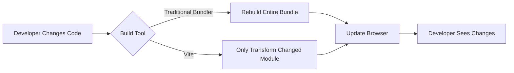

# React Vite

## Introduction

When starting a new React project, one of the first choices you need to make is which build tool to use. Traditionally, Create React App (CRA) has been the go-to solution, but Vite has emerged as a powerful alternative that offers significant performance improvements. In this guide, we'll explore what Vite is, why it's becoming popular in the React ecosystem, and how to set up and use it effectively for your React projects.

Vite (French for "quick", pronounced `/vit/`) is a modern build tool created by Evan You, the creator of Vue.js. Despite its origins in the Vue ecosystem, Vite works excellently with React and other frameworks, providing a lightning-fast development experience through innovative techniques like native ES modules and hot module replacement (HMR).

## What Makes Vite Special?

Vite offers several advantages over traditional bundlers like webpack (which powers Create React App):

1. **Extremely Fast Development Server**: Vite leverages native ES modules in the browser to serve code instantly, without bundling during development.

2. **Instant Hot Module Replacement (HMR)**: Changes to your code are reflected almost immediately in the browser.

3. **Optimized Production Builds**: For production, Vite uses Rollup, which creates highly optimized bundles.

4. **Out-of-the-box TypeScript Support**: No need for additional configuration to use TypeScript.

5. **Rich Feature Set**: Includes CSS preprocessing, asset handling, and more without complex configuration.

Let's see how Vite compares to traditional bundlers in this diagram:



## Getting Started with React Vite

### Creating a New React Project with Vite

To create a new React project using Vite, you'll need Node.js version 14.18+ or 16+. Then, run one of the following commands:

```bash
# Using npm
npm create vite@latest my-react-app -- --template react

# Using yarn
yarn create vite my-react-app --template react

# Using pnpm
pnpm create vite my-react-app --template react
```

This will create a new React project with the following structure:

```plaintext
my-react-app/
├── node_modules/
├── public/
│   └── vite.svg
├── src/
│   ├── assets/
│   │   └── react.svg
│   ├── App.css
│   ├── App.jsx
│   ├── index.css
│   └── main.jsx
├── .eslintrc.cjs
├── .gitignore
├── index.html
├── package.json
├── vite.config.js
└── README.md
```

### Running Your React Vite Project

Navigate to your project directory and run the following commands:

```bash
cd my-react-app

# Install dependencies
npm install

# Start the development server
npm run dev
```

You'll see something like:

```plaintext
  VITE v4.4.0  ready in 237 ms

  ➜  Local:   http://localhost:5173/
  ➜  Network: use --host to expose
  ➜  press h to show help
```

Open your browser and go to http://localhost:5173 to see your React application.

## Understanding the Basic React Vite Setup

Let's examine the key files in a React Vite project:

### 1. index.html

Unlike CRA, in Vite the `index.html` file is at the project root:

```html
<!doctype html>
<html lang="en">
  <head>
    <meta charset="UTF-8" />
    <link rel="icon" type="image/svg+xml" href="/vite.svg" />
    <meta name="viewport" content="width=device-width, initial-scale=1.0" />
    <title>Vite + React</title>
  </head>
  <body>
    <div id="root"></div>
    <script type="module" src="/src/main.jsx"></script>
  </body>
</html>
```

The script tag with `type="module"` is important - it allows Vite to use native ES modules.

### 2. main.jsx

This is the entry point of your application:

```jsx
import React from 'react'
import ReactDOM from 'react-dom/client'
import App from './App.jsx'
import './index.css'

ReactDOM.createRoot(document.getElementById('root')).render(
  <React.StrictMode>
    <App />
  </React.StrictMode>,
)
```

### 3. App.jsx

The main component of your application:

```jsx
import { useState } from 'react'
import reactLogo from './assets/react.svg'
import viteLogo from '/vite.svg'
import './App.css'

function App() {
  const [count, setCount] = useState(0)

  return (
    <>
      <div>
        <a href="https://vitejs.dev" target="_blank" rel="noreferrer">
          
        </a>
        <a href="https://react.dev" target="_blank" rel="noreferrer">
          
        </a>
      </div>
      <h1>Vite + React</h1>
      <div className="card">
        <button onClick={() => setCount((count) => count + 1)}>
          count is {count}
        </button>
        <p>
          Edit <code>src/App.jsx</code> and save to test HMR
        </p>
      </div>
      <p className="read-the-docs">
        Click on the Vite and React logos to learn more
      </p>
    </>
  )
}

export default App
```

### 4. vite.config.js

This is where you configure Vite:

```javascript
import { defineConfig } from 'vite'
import react from '@vitejs/plugin-react'

// https://vitejs.dev/config/
export default defineConfig({
  plugins: [react()],
})
```

## Customizing Your Vite Configuration

Vite is highly configurable. Here are some common configurations you might want to use:

### Setting a Base Path

If your application is deployed to a subdirectory, you can set the base path:

```javascript
// vite.config.js
import { defineConfig } from 'vite'
import react from '@vitejs/plugin-react'

export default defineConfig({
  plugins: [react()],
  base: '/my-app/'
})
```

### Adding Aliases for Import Paths

To simplify import paths, you can add aliases:

```javascript
// vite.config.js
import { defineConfig } from 'vite'
import react from '@vitejs/plugin-react'
import path from 'path'

export default defineConfig({
  plugins: [react()],
  resolve: {
    alias: {
      '@': path.resolve(__dirname, './src'),
      '@components': path.resolve(__dirname, './src/components')
    }
  }
})
```

Now you can use these aliases in your imports:

```jsx
// Before
import Button from '../../components/Button'

// After
import Button from '@components/Button'
```

### Adding Environment Variables

Vite has built-in support for environment variables. Create a `.env` file in your project root:

```plaintext
VITE_API_URL=https://api.example.com
```

To use this variable in your code:

```jsx
// access with import.meta.env
console.log(import.meta.env.VITE_API_URL) // https://api.example.com
```

Note: Only variables prefixed with `VITE_` are exposed to your client-side code.

## Practical Example: Building a Todo App with React and Vite

Let's build a simple todo application to demonstrate Vite in action. We'll create a todo list with the ability to add, toggle, and delete todos.

### Step 1: Create the Project

```bash
npm create vite@latest todo-app -- --template react
cd todo-app
npm install
```

### Step 2: Create Todo Components

Let's create a `components` folder inside `src`:

```bash
mkdir -p src/components
```

First, create a TodoItem component:

```jsx
// src/components/TodoItem.jsx
import { useState } from 'react';

function TodoItem({ todo, onToggle, onDelete }) {
  return (
    <div style={{ 
      display: 'flex', 
      alignItems: 'center',
      marginBottom: '10px',
      textDecoration: todo.completed ? 'line-through' : 'none' 
    }}>
      <input 
        type="checkbox" 
        checked={todo.completed} 
        onChange={() => onToggle(todo.id)} 
      />
      <span style={{ marginLeft: '10px', flexGrow: 1 }}>{todo.text}</span>
      <button 
        onClick={() => onDelete(todo.id)}
        style={{ background: '#ff4d4d', color: 'white', border: 'none', padding: '5px 10px' }}
      >
        Delete
      </button>
    </div>
  );
}

export default TodoItem;
```

Next, create a TodoList component:

```jsx
// src/components/TodoList.jsx
import { useState } from 'react';
import TodoItem from './TodoItem';

function TodoList() {
  const [todos, setTodos] = useState([]);
  const [input, setInput] = useState('');

  const addTodo = () => {
    if (input.trim()) {
      setTodos([
        ...todos, 
        { 
          id: Date.now(), 
          text: input.trim(), 
          completed: false 
        }
      ]);
      setInput('');
    }
  };

  const toggleTodo = (id) => {
    setTodos(
      todos.map(todo => 
        todo.id === id ? { ...todo, completed: !todo.completed } : todo
      )
    );
  };

  const deleteTodo = (id) => {
    setTodos(todos.filter(todo => todo.id !== id));
  };

  return (
    <div>
      <h2>Vite React Todo App</h2>
      
      <div style={{ display: 'flex', marginBottom: '20px' }}>
        <input 
          type="text" 
          value={input}
          onChange={(e) => setInput(e.target.value)}
          onKeyPress={(e) => e.key === 'Enter' && addTodo()}
          style={{ flexGrow: 1, padding: '8px', marginRight: '10px' }}
          placeholder="Add a new todo..."
        />
        <button 
          onClick={addTodo}
          style={{ background: '#4CAF50', color: 'white', border: 'none', padding: '8px 15px' }}
        >
          Add
        </button>
      </div>
      
      <div>
        {todos.length > 0 ? (
          todos.map(todo => (
            <TodoItem 
              key={todo.id} 
              todo={todo} 
              onToggle={toggleTodo} 
              onDelete={deleteTodo} 
            />
          ))
        ) : (
          <p>No todos yet. Add one above!</p>
        )}
      </div>
    </div>
  );
}

export default TodoList;
```

### Step 3: Update App.jsx

Now, let's update the main App component to use our TodoList:

```jsx
// src/App.jsx
import TodoList from './components/TodoList'
import './App.css'

function App() {
  return (
    <div className="App">
      <TodoList />
    </div>
  )
}

export default App
```

### Step 4: Update App.css

Let's add some basic styling:

```css
/* src/App.css */
#root {
  max-width: 1280px;
  margin: 0 auto;
  padding: 2rem;
}

.App {
  width: 100%;
  max-width: 500px;
  margin: 0 auto;
  padding: 20px;
  background-color: #f5f5f5;
  border-radius: 8px;
  box-shadow: 0 2px 4px rgba(0, 0, 0, 0.1);
}
```

### Step 5: Run the Application

```bash
npm run dev
```

Visit http://localhost:5173 to see your todo application in action!

### Output

The application will have:
- An input field to add new todos
- A list of todos with checkboxes to mark them as complete
- Delete buttons to remove todos
- Completed todos will have a strike-through style

This simple todo app demonstrates the power and simplicity of using Vite with React.

## Building for Production

When you're ready to deploy your application, you can build for production with:

```bash
npm run build
```

This will create a `dist` folder with optimized, minified code ready for deployment. To preview the production build locally:

```bash
npm run preview
```

## Advanced Vite Features

### 1. CSS Pre-processors

Vite supports CSS pre-processors out of the box. Just install the corresponding pre-processor and you're good to go:

```bash
# For Sass
npm add -D sass

# For Less
npm add -D less
```

Then, you can directly import `.scss` or `.less` files:

```jsx
import './styles.scss'
```

### 2. Using TypeScript

Vite has built-in TypeScript support. To start a new React project with TypeScript:

```bash
npm create vite@latest my-react-ts-app -- --template react-ts
```

### 3. CSS Modules

Vite supports CSS Modules without any configuration. Just name your CSS files with the `.module.css` suffix:

```css
/* Button.module.css */
.button {
  background: blue;
  color: white;
}
```

And then import it in your component:

```jsx
import styles from './Button.module.css'

function Button() {
  return <button className={styles.button}>Click me</button>
}
```

### 4. Adding SVG Support

Vite allows importing SVGs as React components with a plugin:

```bash
npm add -D vite-plugin-svgr
```

Update your Vite config:

```javascript
// vite.config.js
import { defineConfig } from 'vite'
import react from '@vitejs/plugin-react'
import svgr from 'vite-plugin-svgr'

export default defineConfig({
  plugins: [react(), svgr()]
})
```

Now you can import SVGs as components:

```jsx
import { ReactComponent as Logo } from './logo.svg'

function Header() {
  return (
    <header>
      <Logo width={50} height={50} />
    </header>
  )
}
```

## Common Issues and Troubleshooting

### Issue 1: Environment Variables Not Working

Remember that only variables prefixed with `VITE_` are exposed to your client-side code:

```plaintext
# Will be exposed
VITE_API_KEY=abc123

# Will NOT be exposed
API_KEY=abc123
```

### Issue 2: HMR Not Working Properly

If hot module replacement isn't working, check if you've modified the `vite.config.js` file incorrectly. Reset to defaults and gradually add configurations to identify the issue.

### Issue 3: Build Errors

If you're encountering build errors, try clearing the cache:

```bash
rm -rf node_modules/.vite
```

## Summary

Vite provides a modern, fast development experience for React applications. We've covered:

- What Vite is and why it's gaining popularity
- Setting up a basic React project with Vite
- Configuring Vite for your specific needs
- Building a practical todo application
- Advanced features like CSS pre-processors, TypeScript, and CSS Modules
- Common issues and troubleshooting tips

By using Vite for your React projects, you'll benefit from faster development times, instant hot module replacement, and optimized production builds. As the React ecosystem continues to evolve, Vite represents the next generation of build tools that prioritize developer experience without compromising on performance.

## Further Resources

To continue learning about Vite and React, check out these resources:

1. [Vite Official Documentation](https://vitejs.dev/guide/)
2. [Vite for React Documentation](https://vitejs.dev/guide/features.html#jsx)
3. [React Documentation](https://react.dev)

## Exercises

1. Convert an existing Create React App project to Vite and compare the performance.
2. Add a feature to the todo app to persist todos in local storage.
3. Configure Vite to use path aliases for cleaner imports in your project.
4. Create a multi-page application using React Router with Vite.
5. Set up a Vite project with TypeScript, CSS Modules, and SCSS support.

Vite's speed and simplicity make it an excellent choice for modern React development, especially as applications grow in complexity. Happy coding!