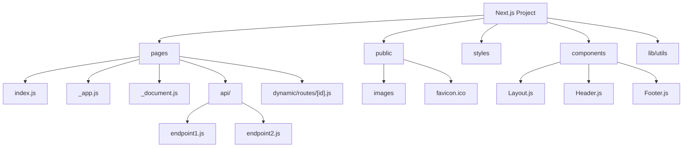

# React Next.js Overview

## Introduction

Next.js is a powerful React framework that enables functionality such as server-side rendering, static site generation, API routes, and more without requiring complex configuration. Created and maintained by Vercel, Next.js has become one of the most popular choices for building modern web applications using React.

In this guide, we'll explore what Next.js is, why it's beneficial, its core features, and how to get started with your first Next.js application. Whether you're building a personal blog, an e-commerce site, or a complex web application, Next.js provides tools and optimizations to enhance your development experience and application performance.

## What is Next.js?

Next.js is a React framework that provides structure, features, and optimizations for your application. It builds upon React's component-based architecture and adds features such as:

- **Server-Side Rendering (SSR)**: Renders React components on the server before sending them to the client
- **Static Site Generation (SSG)**: Pre-renders pages at build time for faster loading
- **Incremental Static Regeneration (ISR)**: Updates static content after deployment without rebuilding the entire site
- **API Routes**: Build API endpoints as part of your Next.js application
- **File-based Routing**: Automatic routing based on your file structure
- **Built-in CSS and Sass Support**: Import CSS/SCSS files directly into your components
- **Code Splitting**: Automatically splits your code bundles for better performance

## Why Use Next.js?

Before diving into features and code examples, let's understand why Next.js has become a preferred choice for many React developers:

1. **Enhanced Performance**: Server-side rendering and static generation improve loading times and SEO.
2. **Developer Experience**: Built-in features like routing and API handling reduce boilerplate code.
3. **Scalability**: Designed to scale from small sites to large applications.
4. **Production-Ready**: Optimized builds with automatic code splitting.
5. **Strong Community**: Large ecosystem with plugins, examples, and community support.
6. **Zero Configuration**: Works out of the box with sensible defaults.

## Getting Started with Next.js

Let's start by creating a basic Next.js application:

```bash
npx create-next-app@latest my-next-app
cd my-next-app
npm run dev
```

This will set up a new Next.js project with the latest version and start the development server. By default, your application will be running at `http://localhost:3000`.

## File-Based Routing

Next.js uses a file-based routing system where files in the `pages` directory automatically become routes in your application.

```
pages/
  index.js         # Routes to /
  about.js         # Routes to /about
  blog/
    index.js       # Routes to /blog
    [slug].js      # Routes to /blog/:slug (Dynamic route)
  api/
    hello.js       # API route at /api/hello
```

Let's create a simple page:

```jsx
// pages/index.js
import Head from 'next/head'

export default function Home() {
  return (
    <div>
      <Head>
        <title>Next.js Demo</title>
        <meta name="description" content="My first Next.js app" />
      </Head>

      <main>
        <h1>Welcome to Next.js!</h1>
        <p>This is a simple Next.js application.</p>
      </main>
    </div>
  )
}
```

## Navigation Between Pages

Next.js provides a `Link` component for client-side navigation between pages:

```jsx
// pages/index.js
import Link from 'next/link'

export default function Home() {
  return (
    <div>
      <h1>Home Page</h1>
      <Link href="/about">
        About Us
      </Link>
    </div>
  )
}

// pages/about.js
import Link from 'next/link'

export default function About() {
  return (
    <div>
      <h1>About Page</h1>
      <Link href="/">
        Back Home
      </Link>
    </div>
  )
}
```

## Data Fetching Methods

Next.js provides several methods for data fetching:

### 1. getStaticProps (Static Site Generation)

Used for pages that can be pre-rendered at build time:

```jsx
// pages/blog.js
export default function Blog({ posts }) {
  return (
    <div>
      <h1>Blog Posts</h1>
      <ul>
        {posts.map((post) => (
          <li key={post.id}>{post.title}</li>
        ))}
      </ul>
    </div>
  )
}

// This function runs at build time
export async function getStaticProps() {
  // In a real app, this would be an API call
  const posts = [
    { id: 1, title: "Introduction to Next.js" },
    { id: 2, title: "Working with React Components" },
    { id: 3, title: "API Routes in Next.js" }
  ]
  
  return {
    props: {
      posts,
    },
  }
}
```

### 2. getServerSideProps (Server-Side Rendering)

Used when you need to fetch data at request time:

```jsx
// pages/dashboard.js
export default function Dashboard({ user }) {
  return (
    <div>
      <h1>Dashboard</h1>
      <p>Welcome, {user.name}!</p>
    </div>
  )
}

// This function runs on every request
export async function getServerSideProps() {
  // In a real app, this might come from a database or API
  const user = { name: "John Doe", role: "Admin" }
  
  return {
    props: {
      user,
    },
  }
}
```

### 3. getStaticPaths (Dynamic Routes with SSG)

For pre-rendering dynamic routes:

```jsx
// pages/posts/[id].js
export default function Post({ post }) {
  return (
    <div>
      <h1>{post.title}</h1>
      <p>{post.content}</p>
    </div>
  )
}

export async function getStaticPaths() {
  // Specify which paths to pre-render
  return {
    paths: [
      { params: { id: '1' } },
      { params: { id: '2' } }
    ],
    fallback: false // Or 'blocking' or true
  }
}

export async function getStaticProps({ params }) {
  // Fetch data for a single post
  const post = {
    id: params.id,
    title: `Post ${params.id}`,
    content: `This is the content for post ${params.id}`
  }
  
  return {
    props: {
      post,
    },
  }
}
```

## API Routes

Next.js allows you to create API endpoints within your application by adding files to the `pages/api` directory:

```jsx
// pages/api/hello.js
export default function handler(req, res) {
  res.status(200).json({ message: 'Hello from Next.js!' })
}
```

You can test this API by navigating to `/api/hello` in your browser or using a tool like Postman.

## CSS and Styling in Next.js

Next.js provides several options for styling your application:

### 1. CSS Modules

```jsx
// pages/index.js
import styles from './index.module.css'

export default function Home() {
  return (
    <div className={styles.container}>
      <h1 className={styles.title}>Hello Next.js!</h1>
    </div>
  )
}
```

```css
/* index.module.css */
.container {
  padding: 2rem;
  max-width: 800px;
  margin: 0 auto;
}

.title {
  color: #0070f3;
  font-size: 2.5rem;
}
```

### 2. Global CSS

```jsx
// pages/_app.js
import '../styles/globals.css'

function MyApp({ Component, pageProps }) {
  return <Component {...pageProps} />
}

export default MyApp
```

### 3. Styled JSX (Built-in)

```jsx
export default function Button() {
  return (
    <div>
      <button>Click me</button>
      <style jsx>{`
        button {
          background: #0070f3;
          color: white;
          border: none;
          padding: 0.5rem 1rem;
          border-radius: 4px;
          cursor: pointer;
        }
        button:hover {
          background: #0061d5;
        }
      `}</style>
    </div>
  )
}
```

## Building a Real-World Example: Blog with Next.js

Let's build a simple blog application to demonstrate Next.js features in action:

### Project Structure

```
my-blog/
  pages/
    index.js
    posts/
      [slug].js
    api/
      posts.js
  components/
    Layout.js
    PostCard.js
  data/
    posts.json
  styles/
    globals.css
```

### 1. Blog Home Page (pages/index.js)

```jsx
import Link from 'next/link';
import Layout from '../components/Layout';
import PostCard from '../components/PostCard';

export default function Home({ posts }) {
  return (
    <Layout title="My Next.js Blog">
      <h1>Latest Blog Posts</h1>
      <div className="posts-grid">
        {posts.map(post => (
          <PostCard key={post.slug} post={post} />
        ))}
      </div>
    </Layout>
  );
}

export async function getStaticProps() {
  // In a real application, this would fetch from an API or database
  const posts = [
    {
      slug: 'hello-nextjs',
      title: 'Hello Next.js',
      excerpt: 'Learn about the amazing features of Next.js',
      date: '2023-05-15'
    },
    {
      slug: 'react-patterns',
      title: 'Common React Patterns',
      excerpt: 'Exploring useful patterns in React development',
      date: '2023-05-10'
    }
  ];
  
  return {
    props: { posts }
  };
}
```

### 2. Single Post Page (pages/posts/[slug].js)

```jsx
import Layout from '../../components/Layout';

export default function Post({ post }) {
  if (!post) return <div>Loading...</div>;
  
  return (
    <Layout title={post.title}>
      <article>
        <h1>{post.title}</h1>
        <div className="post-meta">Posted on {post.date}</div>
        <div className="post-content">{post.content}</div>
      </article>
    </Layout>
  );
}

export async function getStaticPaths() {
  // In a real app, you would fetch this from an API
  const posts = [
    { slug: 'hello-nextjs' },
    { slug: 'react-patterns' }
  ];
  
  const paths = posts.map(post => ({
    params: { slug: post.slug }
  }));
  
  return { paths, fallback: 'blocking' };
}

export async function getStaticProps({ params }) {
  // In a real app, fetch the specific post details
  const post = {
    slug: params.slug,
    title: params.slug === 'hello-nextjs' ? 'Hello Next.js' : 'Common React Patterns',
    date: params.slug === 'hello-nextjs' ? '2023-05-15' : '2023-05-10',
    content: `This is the content for the ${params.slug} post. In a real application, this would be much longer and formatted with Markdown.`
  };
  
  return {
    props: { post },
    revalidate: 60 // Regenerate this page at most once per minute
  };
}
```

### 3. Layout Component (components/Layout.js)

```jsx
import Head from 'next/head';
import Link from 'next/link';

export default function Layout({ children, title }) {
  return (
    <div className="layout">
      <Head>
        <title>{title || 'Next.js Blog'}</title>
        <meta name="description" content="A blog built with Next.js" />
      </Head>
      
      <header>
        <nav>
          <Link href="/">
            Home
          </Link>
        </nav>
      </header>
      
      <main>{children}</main>
      
      <footer>
        <p>© {new Date().getFullYear()} My Next.js Blog</p>
      </footer>
    </div>
  );
}
```

### 4. PostCard Component (components/PostCard.js)

```jsx
import Link from 'next/link';

export default function PostCard({ post }) {
  return (
    <div className="post-card">
      <h2>
        <Link href={`/posts/${post.slug}`}>
          {post.title}
        </Link>
      </h2>
      <div className="post-date">{post.date}</div>
      <p>{post.excerpt}</p>
      <Link href={`/posts/${post.slug}`}>
        Read more →
      </Link>
    </div>
  );
}
```

## Next.js Project Structure Visualization



## Deployment

One of Next.js's strengths is how easy it is to deploy your application. You can deploy to Vercel (the creators of Next.js) with a single command or just by connecting your GitHub repository.

```bash
# Install Vercel CLI
npm i -g vercel

# Deploy your Next.js app
vercel
```

Other deployment options include Netlify, AWS, DigitalOcean, and any platform that supports Node.js.

## Summary

Next.js is a powerful React framework that enhances your development experience with built-in features like:

- File-based routing
- Server-side rendering (SSR)
- Static site generation (SSG)
- Incremental static regeneration (ISR)
- API routes
- Built-in CSS support
- Code splitting and optimizations

It's ideal for building modern web applications, from simple landing pages to complex, data-driven applications. This overview covered the fundamentals, but Next.js offers many more features to explore as you advance in your development journey.

## Additional Resources and Exercises

### Resources

1. [Next.js Official Documentation](https://nextjs.org/docs)
2. [Next.js GitHub Repository](https://github.com/vercel/next.js)
3. [Learn Next.js](https://nextjs.org/learn)

### Exercises

1. **Blog Enhancement**: Add features to the blog example we built:
   - Add categories to posts
   - Implement a search function
   - Add pagination for posts

2. **E-Commerce Product Page**: Build a product listing page with:
   - Dynamic product pages
   - Add to cart functionality
   - Product filtering

3. **Authentication Practice**: Implement a simple authentication system using:
   - Next.js API routes
   - JWT tokens
   - Protected pages

4. **Data Fetching Comparison**: Create three versions of the same page using:
   - `getStaticProps`
   - `getServerSideProps`
   - Client-side fetching with `useEffect`
   Compare the performance and use cases for each approach.

By completing these exercises, you'll gain practical experience with the most important aspects of Next.js development.

Happy coding!