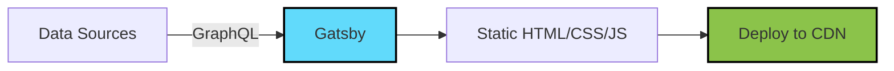

# React Gatsby Overview

## Introduction

Gatsby is a powerful static site generator built on top of React that empowers developers to create lightning-fast websites and applications. As part of the JAMstack (JavaScript, APIs, and Markup) architecture, Gatsby pre-builds pages at build time rather than rendering them on the server at runtime, resulting in exceptional performance, security, and scalability.

In this guide, we'll explore what Gatsby is, why it's popular, and how you can use it to build modern web applications.

## What is Gatsby?

Gatsby is an open-source framework that combines the best parts of React, GraphQL, webpack, and other modern technologies to help developers build websites that are:

- **Fast**: Pre-rendered HTML, automatic code splitting, and prefetching
- **Secure**: No server-side processes or databases to attack
- **Scalable**: Static files can be served from a CDN globally
- **Developer-friendly**: Hot reloading, modern JavaScript, React components
- **Plugin-rich**: Large ecosystem of plugins for various functionalities



## Why Use Gatsby?

Gatsby offers several advantages that make it a popular choice for building modern websites:

1. **Performance**: Pre-rendered static pages load extremely fast, providing an excellent user experience.
2. **SEO-friendly**: Static HTML is easily indexable by search engines.
3. **Data flexibility**: Pull data from anywhere (CMS, APIs, Markdown, etc.) using GraphQL.
4. **Progressive Web App features**: Works offline, app-like experience.
5. **Strong ecosystem**: Rich plugin library and active community.
6. **Modern development**: Uses React, GraphQL, and the latest JavaScript features.

## Getting Started with Gatsby

Let's set up a basic Gatsby project to see how it works:

### Prerequisites

Before starting, make sure you have:
- Node.js (12.13.0 or higher)
- npm or yarn

### Installation

First, install the Gatsby CLI globally:

```bash
npm install -g gatsby-cli
```

### Creating a New Project

Create a new Gatsby site using the default starter:

```bash
gatsby new my-gatsby-site
cd my-gatsby-site
```

### Project Structure

A typical Gatsby project structure looks like this:

```
my-gatsby-site/
├── node_modules/
├── src/
│   ├── components/
│   ├── pages/
│   ├── templates/
│   └── images/
├── gatsby-config.js
├── gatsby-node.js
├── gatsby-browser.js
├── gatsby-ssr.js
└── package.json
```

Key directories and files:
- **src/pages**: React components in this directory automatically become pages
- **src/components**: Reusable React components
- **gatsby-config.js**: Main configuration file for your Gatsby site
- **gatsby-node.js**: API for controlling site build process

### Running Your Site

Start the development server:

```bash
gatsby develop
```

Your site will be available at `http://localhost:8000`

## Creating Pages in Gatsby

### Page Components

In Gatsby, React components in the `src/pages` directory automatically become pages. Let's create a simple page:

```jsx
// src/pages/about.js
import React from 'react'

const AboutPage = () => {
  return (
    <main>
      <h1>About Me</h1>
      <p>This is a sample about page created with Gatsby.</p>
    </main>
  )
}

export default AboutPage
```

This will create a page at `/about`.

### Linking Between Pages

Use Gatsby's `Link` component for navigation between internal pages:

```jsx
// src/pages/index.js
import React from 'react'
import { Link } from 'gatsby'

const HomePage = () => {
  return (
    <main>
      <h1>Welcome to my Gatsby site!</h1>
      <p>This is the homepage.</p>
      <Link to="/about/">About Me</Link>
    </main>
  )
}

export default HomePage
```

## Working with Data in Gatsby

One of Gatsby's most powerful features is its data layer which uses GraphQL to pull data from various sources.

### GraphQL in Gatsby

Gatsby uses GraphQL to collect and transform data during build time. Here's how you can query data:

```jsx
// src/pages/index.js
import React from 'react'
import { graphql } from 'gatsby'

export const query = graphql`
  query HomePageQuery {
    site {
      siteMetadata {
        title
        description
      }
    }
  }
`

const HomePage = ({ data }) => {
  const { title, description } = data.site.siteMetadata
  
  return (
    <main>
      <h1>{title}</h1>
      <p>{description}</p>
    </main>
  )
}

export default HomePage
```

### Data Sources with Plugins

Gatsby has plugins to pull data from various sources:

```js
// gatsby-config.js
module.exports = {
  siteMetadata: {
    title: 'My Gatsby Site',
    description: 'A simple Gatsby site',
  },
  plugins: [
    // Source data from filesystem
    {
      resolve: `gatsby-source-filesystem`,
      options: {
        name: `blog`,
        path: `${__dirname}/content/blog`,
      },
    },
    // Transform Markdown
    `gatsby-transformer-remark`,
  ],
}
```

## Creating Dynamic Pages

For content-driven sites, you often need to create pages programmatically from data:

```js
// gatsby-node.js
const path = require('path')

exports.createPages = async ({ graphql, actions }) => {
  const { createPage } = actions
  const blogPostTemplate = path.resolve(`src/templates/blog-post.js`)
  
  const result = await graphql(`
    query {
      allMarkdownRemark {
        edges {
          node {
            frontmatter {
              slug
            }
          }
        }
      }
    }
  `)
  
  result.data.allMarkdownRemark.edges.forEach(({ node }) => {
    createPage({
      path: node.frontmatter.slug,
      component: blogPostTemplate,
      context: {
        slug: node.frontmatter.slug,
      },
    })
  })
}
```

And the corresponding template:

```jsx
// src/templates/blog-post.js
import React from 'react'
import { graphql } from 'gatsby'

export const query = graphql`
  query($slug: String!) {
    markdownRemark(frontmatter: { slug: { eq: $slug } }) {
      frontmatter {
        title
        date
      }
      html
    }
  }
`

const BlogPostTemplate = ({ data }) => {
  const { markdownRemark } = data
  const { frontmatter, html } = markdownRemark
  
  return (
    <article>
      <h1>{frontmatter.title}</h1>
      <p>{frontmatter.date}</p>
      <div dangerouslySetInnerHTML={{ __html: html }} />
    </article>
  )
}

export default BlogPostTemplate
```

## Building and Deploying

When you're ready to deploy, build your site with:

```bash
gatsby build
```

This generates a `public` directory with static files that can be deployed to any static hosting service like Netlify, Vercel, GitHub Pages, or AWS S3.

For a quick way to test your build locally:

```bash
gatsby serve
```

This will serve your production build at `http://localhost:9000`.

## Real-World Example: Creating a Blog

Let's put together what we've learned to create a simple blog:

1. **Set up project with required plugins**:

```js
// gatsby-config.js
module.exports = {
  siteMetadata: {
    title: 'My Gatsby Blog',
    description: 'A blog built with Gatsby',
  },
  plugins: [
    `gatsby-plugin-react-helmet`,
    {
      resolve: `gatsby-source-filesystem`,
      options: {
        name: `posts`,
        path: `${__dirname}/content/posts`,
      },
    },
    {
      resolve: `gatsby-transformer-remark`,
      options: {
        plugins: [
          `gatsby-remark-prismjs`,
          `gatsby-remark-images`,
        ],
      },
    },
    `gatsby-plugin-sharp`,
    `gatsby-transformer-sharp`,
  ],
}
```

2. **Create a blog post in Markdown**:

```markdown
// content/posts/first-post.md
---
title: "My First Blog Post"
date: "2023-05-15"
slug: "/blog/first-post"
---

# Hello World!

This is my first blog post written in Markdown.

## Code Example

```javascript
function greeting() {
  console.log("Hello, Gatsby!");
}
```

3. **Create templates and pages for the blog**:

```jsx
// src/templates/post.js
import React from 'react'
import { graphql, Link } from 'gatsby'
import Layout from '../components/layout'

export const query = graphql`
  query($slug: String!) {
    markdownRemark(frontmatter: { slug: { eq: $slug } }) {
      frontmatter {
        title
        date(formatString: "MMMM DD, YYYY")
      }
      html
    }
  }
`

const PostTemplate = ({ data }) => {
  const { markdownRemark } = data
  const { frontmatter, html } = markdownRemark
  
  return (
    <Layout>
      <article>
        <h1>{frontmatter.title}</h1>
        <p>{frontmatter.date}</p>
        <div dangerouslySetInnerHTML={{ __html: html }} />
        <Link to="/blog">Back to Blog</Link>
      </article>
    </Layout>
  )
}

export default PostTemplate
```

4. **Create blog index page**:

```jsx
// src/pages/blog.js
import React from 'react'
import { graphql, Link } from 'gatsby'
import Layout from '../components/layout'

export const query = graphql`
  query {
    allMarkdownRemark(sort: { frontmatter: { date: DESC } }) {
      edges {
        node {
          frontmatter {
            title
            date(formatString: "MMMM DD, YYYY")
            slug
          }
          excerpt
        }
      }
    }
  }
`

const BlogPage = ({ data }) => {
  const posts = data.allMarkdownRemark.edges
  
  return (
    <Layout>
      <h1>Blog</h1>
      {posts.map(({ node }) => (
        <article key={node.frontmatter.slug}>
          <h2>
            <Link to={node.frontmatter.slug}>{node.frontmatter.title}</Link>
          </h2>
          <p>{node.frontmatter.date}</p>
          <p>{node.excerpt}</p>
        </article>
      ))}
    </Layout>
  )
}

export default BlogPage
```

5. **Create the pages dynamically**:

```js
// gatsby-node.js
const path = require('path')

exports.createPages = async ({ graphql, actions }) => {
  const { createPage } = actions
  const postTemplate = path.resolve(`src/templates/post.js`)
  
  const result = await graphql(`
    query {
      allMarkdownRemark {
        edges {
          node {
            frontmatter {
              slug
            }
          }
        }
      }
    }
  `)
  
  result.data.allMarkdownRemark.edges.forEach(({ node }) => {
    createPage({
      path: node.frontmatter.slug,
      component: postTemplate,
      context: {
        slug: node.frontmatter.slug,
      },
    })
  })
}
```

## Summary

Gatsby is a powerful React-based framework that enables developers to build lightning-fast websites and applications. Its key strengths include:

- Static site generation for optimal performance
- React-based component architecture
- GraphQL data layer for flexible content sourcing
- Rich plugin ecosystem
- Modern development experience
- SEO-friendly by default

By leveraging these features, you can create websites that are not only fast but also maintainable and scalable.

## Additional Resources

To further develop your Gatsby skills, check out these resources:

1. [Gatsby Official Documentation](https://www.gatsbyjs.com/docs/)
2. [Gatsby Tutorial](https://www.gatsbyjs.com/tutorial/)
3. [Gatsby Plugin Library](https://www.gatsbyjs.com/plugins/)
4. [Gatsby Starters](https://www.gatsbyjs.com/starters/)

## Exercises

1. Create a personal portfolio site using Gatsby.
2. Add a blog section to your portfolio that sources content from Markdown files.
3. Implement image optimization using Gatsby's image plugins.
4. Source content from a headless CMS like Contentful or Sanity.
5. Set up a continuous deployment pipeline for your Gatsby site using GitHub Actions and Netlify or Vercel.

As you work with Gatsby, you'll discover its flexibility and power for creating modern web experiences that are both developer-friendly and high-performing.