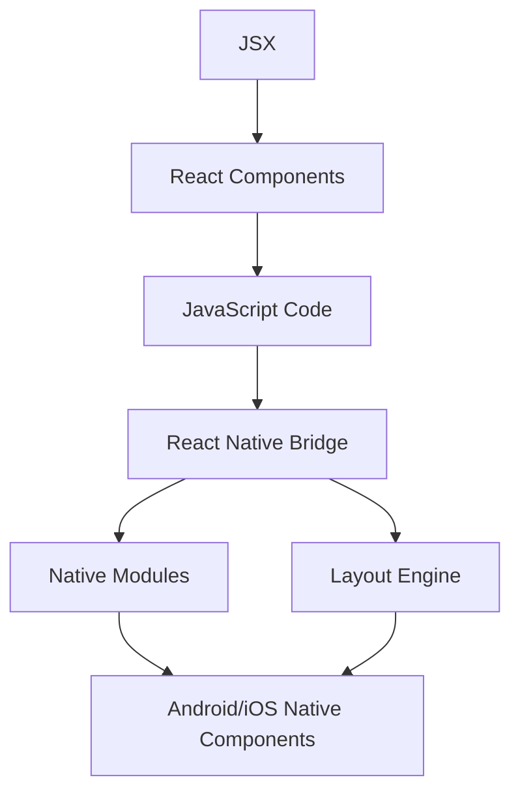

# React Native Introduction

## What is React Native?

React Native is a popular framework developed by Facebook that allows you to build native mobile applications for iOS and Android using JavaScript and React. Unlike other cross-platform frameworks that render web views, React Native translates your React components to actual native UI elements, resulting in applications that look, feel, and perform like they were built using the platform's native language.

React Native follows the "learn once, write anywhere" approach, which means that once you understand React principles, you can apply them to build applications for different platforms while respecting each platform's unique characteristics.

## Why React Native?

Before diving into the technical aspects, let's understand why React Native has gained such popularity:

1. **Cross-platform development**: Build for both iOS and Android with a single codebase
2. **Familiar React paradigm**: Use the same component-based architecture as React web
3. **Native performance**: Render actual native UI components, not WebViews
4. **Hot reloading**: See changes instantly during development without losing state
5. **Large community**: Access to extensive libraries, tools, and support
6. **Lower development time and cost**: Faster development compared to building separate native apps

## Setting Up Your Environment

To get started with React Native, you'll need to set up your development environment. There are two main approaches:

### Expo CLI (Recommended for beginners)

Expo is a set of tools built around React Native that makes it easier to get started without having to install and configure native development tools.

```bash
# Install Expo CLI
npm install -g expo-cli

# Create a new project
expo init MyFirstApp

# Navigate to project directory
cd MyFirstApp

# Start the development server
npm start
```

### React Native CLI (For more control)

If you need direct access to native modules and deeper customization, you can use the React Native CLI.

```bash
# Install React Native CLI
npm install -g react-native-cli

# Create a new project
npx react-native init MyFirstApp

# Navigate to project directory
cd MyFirstApp

# Run on Android
npx react-native run-android

# Run on iOS (macOS only)
npx react-native run-ios
```

## Your First React Native App

Let's create a simple "Hello World" application to understand the basic structure:

```jsx
import React from 'react';
import { View, Text, StyleSheet } from 'react-native';

const App = () => {
  return (
    <View style={styles.container}>
      <Text style={styles.text}>Hello, React Native!</Text>
    </View>
  );
};

const styles = StyleSheet.create({
  container: {
    flex: 1,
    justifyContent: 'center',
    alignItems: 'center',
    backgroundColor: '#F5FCFF',
  },
  text: {
    fontSize: 24,
    fontWeight: 'bold',
    color: '#333',
  },
});

export default App;
```

This simple app displays "Hello, React Native!" centered on the screen with some styling applied.

## Core Components and APIs

React Native provides a set of built-in components that map to native UI elements on iOS and Android:

| React Native Component | Android View | iOS UIView |
|------------------------|--------------|------------|
| `<View>`               | `ViewGroup`  | `UIView`   |
| `<Text>`               | `TextView`   | `UITextView`|
| `<Image>`              | `ImageView`  | `UIImageView`|
| `<ScrollView>`         | `ScrollView` | `UIScrollView`|
| `<TextInput>`          | `EditText`   | `UITextField`|

### Key Components

Let's look at some of the most commonly used components:

#### View

The `View` component is similar to a `div` in web development and is the basic building block:

```jsx
import { View, StyleSheet } from 'react-native';

const BoxContainer = () => {
  return (
    <View style={styles.container}>
      <View style={styles.redBox} />
      <View style={styles.blueBox} />
      <View style={styles.greenBox} />
    </View>
  );
};

const styles = StyleSheet.create({
  container: {
    flex: 1,
    flexDirection: 'row',
    justifyContent: 'space-around',
    alignItems: 'center',
  },
  redBox: {
    width: 50,
    height: 50,
    backgroundColor: 'red',
  },
  blueBox: {
    width: 50,
    height: 50,
    backgroundColor: 'blue',
  },
  greenBox: {
    width: 50,
    height: 50,
    backgroundColor: 'green',
  },
});
```

This creates a row of three colored boxes evenly spaced and centered.

#### Text

The `Text` component is used for displaying text:

```jsx
import { Text, StyleSheet } from 'react-native';

const TextExample = () => {
  return (
    <Text style={styles.title}>
      Main Title
      <Text style={styles.subtitle}>
        Subtitle text can be nested
      </Text>
    </Text>
  );
};

const styles = StyleSheet.create({
  title: {
    fontSize: 24,
    fontWeight: 'bold',
    color: '#000',
  },
  subtitle: {
    fontSize: 18,
    color: '#666',
    fontWeight: 'normal',
  },
});
```

#### Button

React Native provides a simple `Button` component:

```jsx
import { Button, Alert, View } from 'react-native';

const ButtonExample = () => {
  return (
    <View style={{ margin: 20 }}>
      <Button
        title="Press Me"
        onPress={() => Alert.alert('Button pressed!')}
        color="#841584"
      />
    </View>
  );
};
```

## Styling in React Native

React Native uses JavaScript for styling, similar to CSS but with camelCase property names. Styles are typically created using `StyleSheet.create()`:

```jsx
import { View, Text, StyleSheet } from 'react-native';

const StyledComponent = () => {
  return (
    <View style={styles.card}>
      <Text style={styles.cardTitle}>Card Title</Text>
      <Text style={styles.cardDescription}>This is a styled card component in React Native</Text>
    </View>
  );
};

const styles = StyleSheet.create({
  card: {
    backgroundColor: '#fff',
    borderRadius: 8,
    padding: 16,
    margin: 8,
    shadowColor: '#000',
    shadowOffset: { width: 0, height: 2 },
    shadowOpacity: 0.1,
    shadowRadius: 4,
    elevation: 2, // for Android shadow
  },
  cardTitle: {
    fontSize: 18,
    fontWeight: 'bold',
    marginBottom: 8,
  },
  cardDescription: {
    fontSize: 14,
    color: '#666',
  },
});
```

### Flexbox Layout

React Native uses Flexbox for layout, with a few differences from CSS:

- `flexDirection` defaults to `column` instead of `row`
- `alignContent` defaults to `flex-start` instead of `stretch`
- `flexShrink` is not 1 by default
- The `flex` parameter only accepts a single number

```jsx
import { View, StyleSheet } from 'react-native';

const FlexboxExample = () => {
  return (
    <View style={styles.container}>
      <View style={[styles.box, { flex: 1, backgroundColor: 'red' }]} />
      <View style={[styles.box, { flex: 2, backgroundColor: 'green' }]} />
      <View style={[styles.box, { flex: 1, backgroundColor: 'blue' }]} />
    </View>
  );
};

const styles = StyleSheet.create({
  container: {
    flex: 1,
    flexDirection: 'column',
  },
  box: {
    height: 50, // height will be overridden by flex
  },
});
```

This creates a layout with three boxes where the green box takes twice as much space as the others.

## Handling User Input

Let's create a simple form to understand how to handle user input in React Native:

```jsx
import React, { useState } from 'react';
import { View, TextInput, Button, Text, StyleSheet, Alert } from 'react-native';

const SimpleForm = () => {
  const [name, setName] = useState('');
  const [email, setEmail] = useState('');

  const handleSubmit = () => {
    if (!name || !email) {
      Alert.alert('Error', 'Please fill all fields');
      return;
    }
    Alert.alert('Success', `Name: ${name}\nEmail: ${email}`);
  };

  return (
    <View style={styles.container}>
      <Text style={styles.label}>Name:</Text>
      <TextInput
        style={styles.input}
        placeholder="Enter your name"
        value={name}
        onChangeText={setName}
      />
      
      <Text style={styles.label}>Email:</Text>
      <TextInput
        style={styles.input}
        placeholder="Enter your email"
        value={email}
        onChangeText={setEmail}
        keyboardType="email-address"
        autoCapitalize="none"
      />
      
      <Button
        title="Submit"
        onPress={handleSubmit}
      />
    </View>
  );
};

const styles = StyleSheet.create({
  container: {
    padding: 20,
  },
  label: {
    fontSize: 16,
    marginBottom: 5,
    fontWeight: 'bold',
  },
  input: {
    height: 40,
    borderWidth: 1,
    borderColor: '#ddd',
    borderRadius: 5,
    marginBottom: 15,
    paddingHorizontal: 10,
  },
});
```

## Navigation

Navigation is a crucial part of mobile apps. React Navigation is the most popular library for handling navigation in React Native apps:

```bash
# Install React Navigation
npm install @react-navigation/native

# Install dependencies
npm install react-native-screens react-native-safe-area-context

# Install stack navigator
npm install @react-navigation/stack
```

Here's a simple example of navigation between screens:

```jsx
import React from 'react';
import { NavigationContainer } from '@react-navigation/native';
import { createStackNavigator } from '@react-navigation/stack';
import { View, Text, Button, StyleSheet } from 'react-native';

// Define your screens
const HomeScreen = ({ navigation }) => (
  <View style={styles.screen}>
    <Text style={styles.title}>Home Screen</Text>
    <Button
      title="Go to Details"
      onPress={() => navigation.navigate('Details', { itemId: 86, title: 'Item Details' })}
    />
  </View>
);

const DetailsScreen = ({ route, navigation }) => {
  // Get parameters from the route
  const { itemId, title } = route.params;
  
  return (
    <View style={styles.screen}>
      <Text style={styles.title}>Details Screen</Text>
      <Text>Item ID: {itemId}</Text>
      <Text>Title: {title}</Text>
      <Button title="Go back" onPress={() => navigation.goBack()} />
    </View>
  );
};

// Create a stack navigator
const Stack = createStackNavigator();

// Define your navigator
const App = () => {
  return (
    <NavigationContainer>
      <Stack.Navigator initialRouteName="Home">
        <Stack.Screen name="Home" component={HomeScreen} options={{ title: 'Overview' }} />
        <Stack.Screen name="Details" component={DetailsScreen} />
      </Stack.Navigator>
    </NavigationContainer>
  );
};

const styles = StyleSheet.create({
  screen: {
    flex: 1,
    alignItems: 'center',
    justifyContent: 'center',
    padding: 20,
  },
  title: {
    fontSize: 24,
    marginBottom: 20,
    fontWeight: 'bold',
  },
});

export default App;
```

## Accessing Native Features

React Native allows you to access native device features through built-in APIs or community packages.

### Using the Camera

Let's see how to use the device camera with Expo's Camera API:

```jsx
import React, { useState, useEffect, useRef } from 'react';
import { StyleSheet, Text, View, Button, Image } from 'react-native';
import { Camera } from 'expo-camera';

const CameraExample = () => {
  const [hasPermission, setHasPermission] = useState(null);
  const [type, setType] = useState(Camera.Constants.Type.back);
  const [photo, setPhoto] = useState(null);
  const cameraRef = useRef(null);

  useEffect(() => {
    (async () => {
      const { status } = await Camera.requestCameraPermissionsAsync();
      setHasPermission(status === 'granted');
    })();
  }, []);

  const takePicture = async () => {
    if (cameraRef.current) {
      const options = { quality: 0.5, base64: true };
      const data = await cameraRef.current.takePictureAsync(options);
      setPhoto(data.uri);
    }
  };

  if (hasPermission === null) {
    return <View />;
  }
  if (hasPermission === false) {
    return <Text>No access to camera</Text>;
  }

  return (
    <View style={styles.container}>
      {photo ? (
        <View style={styles.photoContainer}>
          <Image source={{ uri: photo }} style={styles.photo} />
          <Button title="Take Another" onPress={() => setPhoto(null)} />
        </View>
      ) : (
        <Camera style={styles.camera} type={type} ref={cameraRef}>
          <View style={styles.buttonContainer}>
            <Button
              title="Flip Camera"
              onPress={() => {
                setType(
                  type === Camera.Constants.Type.back
                    ? Camera.Constants.Type.front
                    : Camera.Constants.Type.back
                );
              }}
            />
            <Button title="Take Picture" onPress={takePicture} />
          </View>
        </Camera>
      )}
    </View>
  );
};

const styles = StyleSheet.create({
  container: {
    flex: 1,
  },
  camera: {
    flex: 1,
  },
  buttonContainer: {
    flex: 1,
    backgroundColor: 'transparent',
    flexDirection: 'row',
    justifyContent: 'space-around',
    margin: 20,
    position: 'absolute',
    bottom: 0,
    left: 0,
    right: 0,
  },
  photoContainer: {
    flex: 1,
    alignItems: 'center',
    justifyContent: 'center',
  },
  photo: {
    width: 300,
    height: 300,
    marginBottom: 20,
  },
});
```

## Building and Deploying

When your app is ready for distribution, you'll need to build and deploy it.

### Building with Expo

```bash
# Build for Android
expo build:android

# Build for iOS
expo build:ios
```

### Building with React Native CLI

For Android:
```bash
cd android
./gradlew assembleRelease
```

For iOS:
```bash
cd ios
xcodebuild -workspace YourApp.xcworkspace -scheme YourApp -configuration Release
```

## React Native Architecture Overview



## Summary

In this introduction to React Native, we've covered:

- What React Native is and its advantages
- Setting up a development environment
- Creating a simple React Native application
- Working with core components like View, Text, and Button
- Styling in React Native using StyleSheet
- Handling user input with forms
- Navigation between screens
- Accessing native device features
- Building and deploying your app

React Native offers a powerful way to build cross-platform mobile applications using your existing JavaScript and React knowledge. By combining the efficiency of web development with the performance of native apps, React Native represents an excellent choice for mobile app development.

## Additional Resources

To continue learning React Native, check out these resources:

1. [Official React Native Documentation](https://reactnative.dev/docs/getting-started)
2. [Expo Documentation](https://docs.expo.dev/)
3. [React Navigation Documentation](https://reactnavigation.org/docs/getting-started)

## Practice Exercises

1. Create a todo list app with the ability to add, delete, and mark tasks as complete.
2. Build a simple weather app that fetches data from a weather API and displays it.
3. Create a photo gallery app that uses the device's camera and photo library.
4. Implement a multi-screen app with different types of navigation (stack, tab, drawer).
5. Add persistence to an app using AsyncStorage to save and retrieve data.

As you explore React Native further, you'll discover its rich ecosystem and how it can help you build powerful mobile applications efficiently.