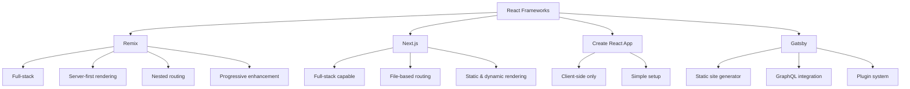

# React Remix Introduction

## What is Remix?

Remix is a full-stack web framework built on top of React that focuses on web fundamentals and modern user experience. Created by the team behind React Router, Remix leverages web standards to deliver fast, resilient, and user-friendly applications.

Unlike traditional React applications that primarily focus on client-side rendering, Remix embraces server-side rendering and a more holistic approach to web development, providing tools and conventions for both frontend and backend development.

## Why Remix?

Remix was designed to address several challenges that web developers face today:

- **Performance**: By leveraging server-side rendering and intelligent data loading strategies
- **Progressive Enhancement**: Building applications that work even when JavaScript fails
- **User Experience**: Providing fast feedback and transitions between pages
- **Developer Experience**: Simplifying complex tasks with conventions and patterns

## Key Features of Remix

### Nested Routing

Remix uses a file-based routing system similar to Next.js, but with a focus on nested routes and layouts. This approach aligns with how the web naturally works and allows for more intuitive code organization.

### Data Loading and Mutations

One of Remix's core strengths is its data handling model:

- **Loaders**: Server functions that fetch data for routes
- **Actions**: Server functions that handle form submissions and data mutations
- **Resource Routes**: API endpoints built right into the routing system

### Error Boundaries and Catching

Remix has built-in error handling at the route level, making applications more resilient. If one part of your app fails, the rest continues to function.

## Getting Started with Remix

### Installation

Let's start by creating a new Remix project:

```bash
npx create-remix@latest my-remix-app
cd my-remix-app
npm run dev
```

This creates a new Remix application and starts the development server. By default, your app will be available at http://localhost:3000.

### Project Structure

A typical Remix project structure looks like this:

```
app/
├── entry.client.tsx    # Client entry point
├── entry.server.tsx    # Server entry point
├── root.tsx           # Root component (like App.js in React)
└── routes/            # Your application routes
    ├── _index.tsx     # The home page route
    └── about.tsx      # The /about route
public/                # Static assets
```

## Creating Your First Route

Routes in Remix are defined as files in the `app/routes` directory. Let's create a simple route:

```jsx
// app/routes/hello.tsx
export default function Hello() {
  return (
    <div>
      <h1>Hello, Remix!</h1>
      <p>This is my first Remix route.</p>
    </div>
  );
}
```

Visit `http://localhost:3000/hello` to see your new route in action.

## Working with Data

### Data Loading with Loaders

One of the most powerful features of Remix is the loader function, which lets you fetch data on the server:

```jsx
// app/routes/users.tsx
import { json } from "@remix-run/node";
import { useLoaderData } from "@remix-run/react";

// This runs on the server
export async function loader() {
  const users = await fetchUsers(); // Imagine this is your API call
  return json({ users });
}

// This component renders in the browser
export default function Users() {
  const { users } = useLoaderData<typeof loader>();
  
  return (
    <div>
      <h1>Users</h1>
      <ul>
        {users.map(user => (
          <li key={user.id}>{user.name}</li>
        ))}
      </ul>
    </div>
  );
}
```

### Form Submissions with Actions

Remix uses HTML forms for data mutations, enhanced with JavaScript when available:

```jsx
// app/routes/new-post.tsx
import { redirect, json } from "@remix-run/node";
import { Form, useActionData } from "@remix-run/react";

export async function action({ request }) {
  const formData = await request.formData();
  const title = formData.get("title");
  const content = formData.get("content");
  
  const errors = {};
  if (!title) errors.title = "Title is required";
  if (!content) errors.content = "Content is required";
  
  if (Object.keys(errors).length > 0) {
    return json({ errors });
  }
  
  await createPost({ title, content });
  
  return redirect("/posts");
}

export default function NewPost() {
  const actionData = useActionData<typeof action>();
  
  return (
    <div>
      <h1>Create New Post</h1>
      <Form method="post">
        <div>
          <label>
            Title:
            <input type="text" name="title" />
          </label>
          {actionData?.errors?.title && (
            <p style={{ color: "red" }}>{actionData.errors.title}</p>
          )}
        </div>
        
        <div>
          <label>
            Content:
            <textarea name="content" />
          </label>
          {actionData?.errors?.content && (
            <p style={{ color: "red" }}>{actionData.errors.content}</p>
          )}
        </div>
        
        <button type="submit">Create Post</button>
      </Form>
    </div>
  );
}
```

## Nested Routes and Layouts

Remix allows you to create nested routes that share UI elements:

```jsx
// app/routes/dashboard.tsx
import { Outlet } from "@remix-run/react";

export default function Dashboard() {
  return (
    <div>
      <h1>Dashboard</h1>
      <nav>
        <ul>
          <li><a href="/dashboard/profile">Profile</a></li>
          <li><a href="/dashboard/settings">Settings</a></li>
        </ul>
      </nav>
      
      {/* Child routes will render here */}
      <Outlet />
    </div>
  );
}
```

```jsx
// app/routes/dashboard.profile.tsx
export default function Profile() {
  return (
    <div>
      <h2>User Profile</h2>
      <p>This is your profile page.</p>
    </div>
  );
}
```

## Real-World Example: Todo Application

Let's build a simple todo application to demonstrate Remix's capabilities:

```jsx
// app/routes/todos.tsx
import { json, redirect } from "@remix-run/node";
import { useLoaderData, Form } from "@remix-run/react";
import { useState } from "react";

// Mock database
let todos = [
  { id: 1, text: "Learn Remix", completed: false },
  { id: 2, text: "Build an app", completed: false }
];

export async function loader() {
  return json({ todos });
}

export async function action({ request }) {
  const formData = await request.formData();
  const intent = formData.get("intent");
  
  if (intent === "create") {
    const text = formData.get("text");
    if (!text) return json({ error: "Text is required" });
    
    todos.push({
      id: todos.length + 1,
      text,
      completed: false
    });
  }
  
  if (intent === "toggle") {
    const id = parseInt(formData.get("id"));
    const todo = todos.find(t => t.id === id);
    if (todo) {
      todo.completed = !todo.completed;
    }
  }
  
  if (intent === "delete") {
    const id = parseInt(formData.get("id"));
    todos = todos.filter(t => t.id !== id);
  }
  
  return redirect("/todos");
}

export default function Todos() {
  const { todos } = useLoaderData<typeof loader>();
  const [newTodo, setNewTodo] = useState("");
  
  return (
    <div>
      <h1>Todo List</h1>
      
      <Form method="post" onSubmit={() => setNewTodo("")}>
        <input 
          type="text" 
          name="text" 
          value={newTodo}
          onChange={e => setNewTodo(e.target.value)}
          placeholder="Add a new todo" 
        />
        <button type="submit" name="intent" value="create">
          Add
        </button>
      </Form>
      
      <ul>
        {todos.map(todo => (
          <li key={todo.id} style={{ textDecoration: todo.completed ? "line-through" : "none" }}>
            {todo.text}
            
            <Form method="post" style={{ display: "inline" }}>
              <input type="hidden" name="id" value={todo.id} />
              <button type="submit" name="intent" value="toggle">
                {todo.completed ? "Undo" : "Complete"}
              </button>
            </Form>
            
            <Form method="post" style={{ display: "inline" }}>
              <input type="hidden" name="id" value={todo.id} />
              <button type="submit" name="intent" value="delete">
                Delete
              </button>
            </Form>
          </li>
        ))}
      </ul>
    </div>
  );
}
```

This example demonstrates:
- Data loading with the `loader` function
- Data mutations with the `action` function
- Form handling
- State management (both server and client)

## Remix vs. Other React Frameworks

Here's how Remix compares to other popular React frameworks:



## Summary

Remix represents a modern approach to building web applications with React. It embraces web fundamentals and standards while providing a more integrated full-stack development experience.

Key takeaways:
- Remix is a full-stack React framework for building modern web applications
- It provides server-side rendering with client-side enhancements
- The nested routing system aligns with how the web naturally works
- Data loading and mutations are handled through loaders and actions
- Forms are central to the Remix data mutation philosophy
- Remix prioritizes performance and progressive enhancement

## Further Resources

To deepen your understanding of Remix:

1. Official Remix Documentation: [https://remix.run/docs](https://remix.run/docs)
2. Remix GitHub Repository: [https://github.com/remix-run/remix](https://github.com/remix-run/remix)
3. Remix Blog: [https://remix.run/blog](https://remix.run/blog)

## Practice Exercises

1. Create a simple blog application with Remix that shows a list of posts and individual post pages.
2. Implement a user authentication system using Remix's sessions.
3. Build a multi-step form with validation using nested routes.
4. Create a real-time dashboard by combining Remix with WebSockets.
5. Explore how to deploy a Remix application to different hosting providers.