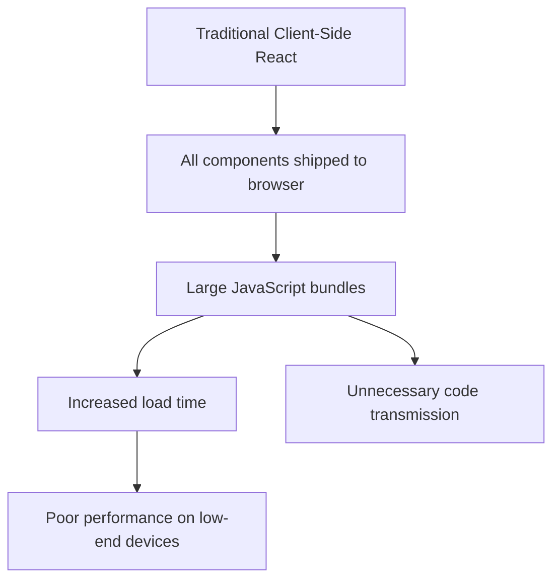
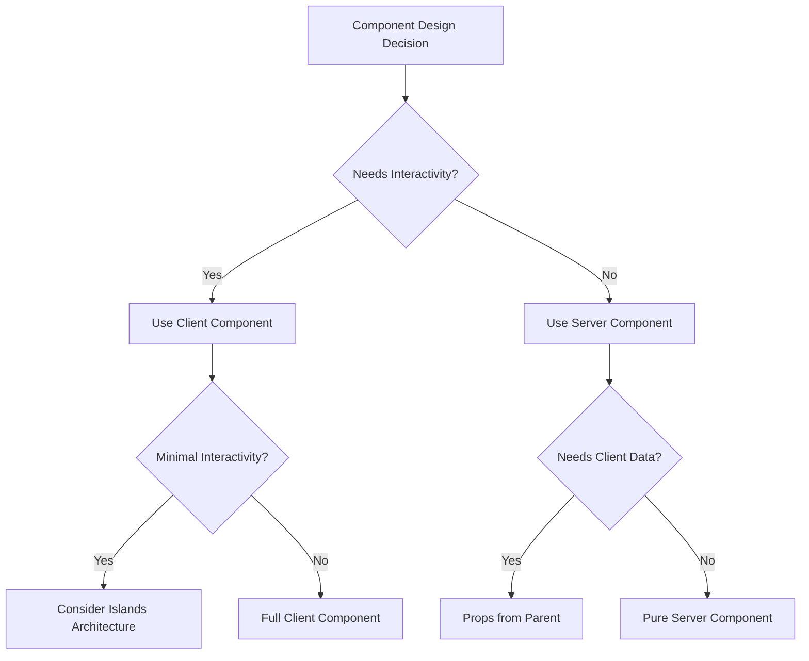

# React Server Components

## Introduction

React Server Components (RSCs) represent a paradigm shift in how we build React applications. Introduced as an experimental feature by the React team, they allow components to render directly on the server, reducing bundle size and improving performance.

Unlike traditional client components that must be shipped to the browser to render, Server Components execute on the server and send only the necessary HTML to the client. This approach combines the best aspects of server-side rendering with the interactivity of client-side React.

## Understanding the Problem

To appreciate React Server Components, let's first understand the problems they address:



Traditional React applications face several challenges:
- All component code must be shipped to the client
- Large JavaScript bundles impact performance
- Users on slow connections or low-end devices suffer
- Data fetching often requires client-side waterfalls

## What Are React Server Components?

React Server Components provide a solution by splitting your application into:

1. **Server Components**: Run only on the server and don't increase client bundle size
2. **Client Components**: Run on the client with full interactivity
3. **Shared Components**: Can be used in either environment

### Key Benefits

- **Reduced Bundle Size**: Server components aren't shipped to the client
- **Direct Backend Access**: Server components can directly access databases, file systems, etc.
- **Automatic Code Splitting**: Only the necessary client components are sent
- **Improved Performance**: Less JavaScript to download, parse and execute
- **Enhanced Security**: Sensitive code stays on the server

## Getting Started with Server Components

### Prerequisites

To work with React Server Components, you'll need:

- A Next.js 13+ application with the App Router
- Node.js 16.8 or later
- Basic understanding of React

### Basic Example

Here's a simple example of how server and client components work together:

First, create a server component that fetches data:

```jsx
// app/products/page.js - Server Component (default)
async function ProductsPage() {
  // This code runs only on the server
  const products = await fetchProductsFromDatabase();
  
  return (
    <div>
      <h1>Our Products</h1>
      <ProductList products={products} />
    </div>
  );
}

export default ProductsPage;
```

Now, let's create a client component that includes interactivity:

```jsx
// components/AddToCart.js - Client Component
"use client"; // This directive marks it as a client component

import { useState } from 'react';

export default function AddToCart({ productId }) {
  const [isAdded, setIsAdded] = useState(false);
  
  function handleAddToCart() {
    // Client-side logic
    setIsAdded(true);
    
    // Make API call to add to cart
    fetch('/api/cart/add', {
      method: 'POST',
      body: JSON.stringify({ productId })
    });
  }
  
  return (
    <button onClick={handleAddToCart} disabled={isAdded}>
      {isAdded ? 'Added to Cart' : 'Add to Cart'}
    </button>
  );
}
```

Now we can use both components together:

```jsx
// components/ProductList.js - Server Component
import AddToCart from './AddToCart';

export default function ProductList({ products }) {
  return (
    <ul className="product-grid">
      {products.map(product => (
        <li key={product.id} className="product-card">
          <h2>{product.name}</h2>
          <p>{product.description}</p>
          <p className="price">${product.price}</p>
          
          {/* Client Component inserted into Server Component */}
          <AddToCart productId={product.id} />
        </li>
      ))}
    </ul>
  );
}
```

## Server Components vs. Client Components

Understanding when to use each type of component is crucial for optimal application architecture:

| Feature | Server Component | Client Component |
|---------|-----------------|------------------|
| Data Fetching | Direct database access | Via API calls |
| File System | Can access filesystem | No direct access |
| State | Cannot use useState | Can use useState |
| Effects | Cannot use useEffect | Can use useEffect |
| Browser APIs | No access | Full access |
| Event Handlers | Cannot use | Can use |
| Bundle Size | Zero client impact | Adds to bundle |
| Directive | Default behavior | Requires "use client" |

## Real-World Application: Dynamic Blog

Let's build a more comprehensive example - a blog with server-rendered content and client-side interactions:

```jsx
// app/blog/[slug]/page.js - Server Component
import { getPostBySlug } from '@/lib/posts';
import CommentSection from '@/components/CommentSection';
import LikeButton from '@/components/LikeButton';
import { Suspense } from 'react';

export async function generateMetadata({ params }) {
  const post = await getPostBySlug(params.slug);
  return { 
    title: post.title,
    description: post.excerpt 
  };
}

export default async function BlogPost({ params }) {
  const post = await getPostBySlug(params.slug);
  
  return (
    <article>
      <h1>{post.title}</h1>
      <div className="meta">
        <time>{new Date(post.date).toLocaleDateString()}</time>
        <span>By {post.author}</span>
      </div>
      
      <div className="content" dangerouslySetInnerHTML={{ __html: post.content }} />
      
      {/* Client component for interactivity */}
      <LikeButton postId={post.id} initialLikes={post.likes} />
      
      <hr />
      
      <Suspense fallback={<p>Loading comments...</p>}>
        <CommentSection postId={post.id} />
      </Suspense>
    </article>
  );
}
```

The like button client component:

```jsx
// components/LikeButton.js - Client Component
"use client";

import { useState } from 'react';
import { HeartIcon, HeartFilledIcon } from '@/components/Icons';

export default function LikeButton({ postId, initialLikes }) {
  const [likes, setLikes] = useState(initialLikes);
  const [hasLiked, setHasLiked] = useState(false);
  
  async function handleLike() {
    if (hasLiked) return;
    
    setLikes(prev => prev + 1);
    setHasLiked(true);
    
    await fetch('/api/posts/like', {
      method: 'POST',
      body: JSON.stringify({ postId })
    });
  }
  
  return (
    <button 
      onClick={handleLike}
      className={`like-button ${hasLiked ? 'liked' : ''}`}
      aria-label={hasLiked ? "Liked" : "Like this post"}
    >
      {hasLiked ? <HeartFilledIcon /> : <HeartIcon />}
      <span>{likes} likes</span>
    </button>
  );
}
```

And the comments section component:

```jsx
// components/CommentSection.js
import { getComments } from '@/lib/comments';
import NewCommentForm from './NewCommentForm';

export default async function CommentSection({ postId }) {
  // Fetch comments on server
  const comments = await getComments(postId);
  
  return (
    <section className="comments">
      <h2>{comments.length} Comments</h2>
      
      <ul className="comment-list">
        {comments.map(comment => (
          <li key={comment.id} className="comment">
            <div className="comment-header">
              <strong>{comment.author}</strong>
              <time>{new Date(comment.date).toLocaleDateString()}</time>
            </div>
            <p>{comment.content}</p>
          </li>
        ))}
      </ul>
      
      {/* Client component for adding new comments */}
      <NewCommentForm postId={postId} />
    </section>
  );
}
```

```jsx
// components/NewCommentForm.js - Client Component
"use client";

import { useState } from 'react';

export default function NewCommentForm({ postId }) {
  const [comment, setComment] = useState('');
  const [author, setAuthor] = useState('');
  const [isSubmitting, setIsSubmitting] = useState(false);
  
  async function handleSubmit(e) {
    e.preventDefault();
    setIsSubmitting(true);
    
    try {
      await fetch('/api/comments/create', {
        method: 'POST',
        body: JSON.stringify({ postId, author, content: comment })
      });
      
      // Reset form
      setComment('');
      setAuthor('');
      
      // This would require server actions or client-side revalidation
      // to show the new comment without a full page reload
    } catch (error) {
      console.error('Failed to post comment:', error);
    } finally {
      setIsSubmitting(false);
    }
  }
  
  return (
    <form onSubmit={handleSubmit} className="comment-form">
      <h3>Leave a comment</h3>
      <div className="form-group">
        <label htmlFor="author">Name</label>
        <input
          id="author"
          value={author}
          onChange={e => setAuthor(e.target.value)}
          required
        />
      </div>
      <div className="form-group">
        <label htmlFor="comment">Comment</label>
        <textarea
          id="comment"
          value={comment}
          onChange={e => setComment(e.target.value)}
          required
          rows={4}
        />
      </div>
      <button type="submit" disabled={isSubmitting}>
        {isSubmitting ? 'Posting...' : 'Post Comment'}
      </button>
    </form>
  );
}
```

## Best Practices

When working with React Server Components, follow these best practices:

1. **Keep Client Components Lean**: Minimize the size of client components to reduce bundle size.
2. **Use Server Components by Default**: Start with server components and only use client components when needed for interactivity.
3. **Avoid Props Drilling**: Pass only the necessary data from server to client components.
4. **Partition by Interactivity**: Split your UI based on interactive vs. non-interactive parts.
5. **Leverage Suspense**: Use Suspense boundaries to improve loading states.
6. **Avoid Server/Client Boundary Confusion**: Be explicit about which components run where.



## Common Patterns

### Data Fetching

Instead of using `useEffect` for data fetching, use async/await directly in server components:

```jsx
// Server Component
async function ProductPage({ id }) {
  const product = await fetchProduct(id);
  return <ProductDisplay product={product} />;
}
```

### Progressive Enhancement

Build your app to work without JavaScript, then enhance with client components:

```jsx
// Server Component
import ClientEnhancement from './ClientEnhancement';

export default async function EnhancedPage() {
  const data = await fetchData();
  
  return (
    <div>
      <h1>{data.title}</h1>
      <div>{data.content}</div>
      
      {/* Client-side enhancement */}
      <ClientEnhancement initialData={data} />
    </div>
  );
}
```

### Islands Architecture

Render mostly static content on the server with interactive "islands" on the client:

```jsx
// page.js - Server Component
import InteractiveWidget from './InteractiveWidget';

export default async function IslandsPage() {
  const content = await fetchPageContent();
  
  return (
    <div className="page-layout">
      <header>
        <h1>{content.title}</h1>
      </header>
      
      <main>
        <div className="static-content" dangerouslySetInnerHTML={{ __html: content.body }} />
        
        {/* Interactive island */}
        <div className="widget-container">
          <InteractiveWidget data={content.widgetData} />
        </div>
        
        <div className="more-static-content" dangerouslySetInnerHTML={{ __html: content.footer }} />
      </main>
    </div>
  );
}
```

## Challenges and Considerations

While React Server Components offer many benefits, they also come with challenges:

1. **Mental Model**: Developers need to learn a new way of thinking about components
2. **Ecosystem Support**: Not all libraries support the server component pattern yet
3. **Framework Dependency**: Currently requires Next.js or similar frameworks
4. **Debugging**: Cross-environment debugging can be complex
5. **Server Requirements**: Requires server infrastructure, not suitable for static sites

## Summary

React Server Components represent a significant evolution in React's architecture, allowing developers to build applications with improved performance by executing component code on the server when possible. By splitting components into server and client parts, applications can provide fast initial loads with reduced JavaScript bundles while maintaining rich interactivity where needed.

Key takeaways:
- Server Components run only on the server and reduce client-side JavaScript
- Client Components provide interactivity and are marked with "use client"
- This hybrid approach combines the best of server-side rendering with client-side interactivity
- The pattern fits well with Next.js App Router and the future of React applications

React Server Components are still evolving, but they represent an important direction for the React ecosystem that addresses real performance and developer experience challenges.

## Additional Resources

To deepen your understanding of React Server Components:

1. Experiment with a simple Next.js 13+ application using the App Router
2. Try converting an existing React application to use Server Components
3. Explore how to optimize data fetching in Server Components

### Further Reading

- [React Server Components RFC](https://github.com/reactjs/rfcs/blob/main/text/0188-server-components.md)
- [Next.js Documentation on Server Components](https://nextjs.org/docs/app/building-your-application/rendering/server-components)
- [React Documentation on Server Components](https://react.dev/blog/2023/03/22/react-labs-what-we-have-been-working-on-march-2023#react-server-components)

### Practice Exercises

1. Create a simple blog application using Server Components for content and Client Components for comments
2. Build a product catalog with server-rendered listings and client-side filtering
3. Implement a dashboard with static content and interactive data visualization widgets