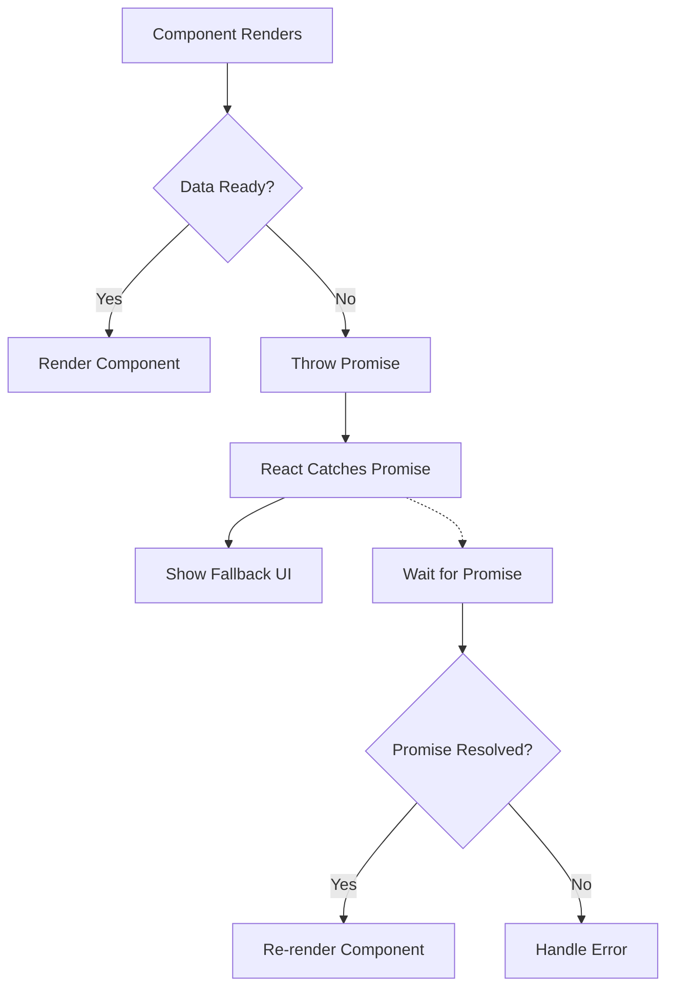

# React Suspense

## Introduction

React Suspense is a powerful feature in the React ecosystem that changes how we handle asynchronous operations like data fetching, code splitting, and resource loading. Introduced as an experimental feature and gradually making its way to stable releases, Suspense helps developers create better loading states and improve user experience during these async operations.

At its core, Suspense lets you "suspend" rendering while components are waiting for something (like data or code) and display a fallback UI during this time. This creates a more consistent, predictable way to handle loading states throughout your application.

## Understanding React Suspense

### The Problem Suspense Solves

Before diving into how Suspense works, let's understand the problem it addresses:

Without Suspense, handling loading states in React applications typically involves:

- Conditional rendering with loading flags
- Complex state management for loading/error/success states
- Nested loading indicators that can cause layout shifts
- Inconsistent loading experiences across different parts of your app

Here's a common pre-Suspense approach:

```jsx
function UserProfile({ userId }) {
  const [user, setUser] = useState(null);
  const [loading, setLoading] = useState(true);
  const [error, setError] = useState(null);

  useEffect(() => {
    fetchUser(userId)
      .then(data => {
        setUser(data);
        setLoading(false);
      })
      .catch(err => {
        setError(err);
        setLoading(false);
      });
  }, [userId]);

  if (loading) return <LoadingSpinner />;
  if (error) return <ErrorMessage error={error} />;
  
  return (
    <div className="profile">
      <h2>{user.name}</h2>
      <p>{user.bio}</p>
    </div>
  );
}
```

This pattern works but gets cumbersome as applications grow, especially with nested loading states.

### The Suspense Approach

React Suspense provides a cleaner abstraction for handling these loading states. Here's the basic structure:

```jsx
<Suspense fallback={<LoadingSpinner />}>
  <ComponentThatMayTriggerSuspense />
</Suspense>
```

The `Suspense` component takes a `fallback` prop, which is shown during loading, and wraps components that might need to "suspend" rendering while waiting for something.

## Core Features of Suspense

### 1. Code Splitting with Suspense

One of the earliest stable use cases for Suspense is code splitting with React.lazy:

```jsx
import React, { Suspense, lazy } from 'react';

// Lazy-load component
const HeavyFeature = lazy(() => import('./HeavyFeature'));

function App() {
  return (
    <div className="app">
      <Header />
      <Suspense fallback={<LoadingSpinner />}>
        <HeavyFeature />
      </Suspense>
      <Footer />
    </div>
  );
}
```

**What happens here:**
1. The `HeavyFeature` component isn't loaded until it's rendered
2. When `App` renders, it triggers the import
3. During loading, `Suspense` shows the `LoadingSpinner`
4. When the component loads, it replaces the fallback

### 2. Data Fetching with Suspense

Data fetching with Suspense is implemented by libraries like React Query, SWR, or frameworks like Next.js or Remix. Here's a conceptual example:

```jsx
import { Suspense } from 'react';
import { fetchUserData } from './api';

// A resource that can suspend
const userResource = createResource(fetchUserData(userId));

function UserProfile() {
  // This will suspend if data isn't ready
  const user = userResource.read();
  
  return (
    <div className="profile">
      <h2>{user.name}</h2>
      <p>{user.bio}</p>
    </div>
  );
}

function App() {
  return (
    <div className="app">
      <Suspense fallback={<LoadingSpinner />}>
        <UserProfile />
      </Suspense>
    </div>
  );
}
```

**Note:** The above example is conceptual. The `createResource` function isn't part of React but represents how data fetching libraries implement Suspense compatibility.

### 3. Nested Suspense Boundaries

You can nest Suspense components to create more granular loading experiences:

```jsx
function Dashboard() {
  return (
    <div className="dashboard">
      <Suspense fallback={<DashboardSkeleton />}>
        <UserInfo />
        <Suspense fallback={<ChartPlaceholder />}>
          <ExpensiveChart />
        </Suspense>
        <Suspense fallback={<TablePlaceholder />}>
          <DataTable />
        </Suspense>
      </Suspense>
    </div>
  );
}
```

This creates a waterfall effect where parts of the UI appear as they become ready.

## Real-world Implementation

Let's build a practical example: a posts and comments section that loads data with Suspense:

```jsx
import React, { Suspense } from 'react';
import { useSuspenseQuery } from '@tanstack/react-query';

// Component for displaying a single post
function Post({ id }) {
  const { data: post } = useSuspenseQuery({
    queryKey: ['post', id],
    queryFn: () => fetch(`https://jsonplaceholder.typicode.com/posts/${id}`).then(res => res.json())
  });

  return (
    <div className="post">
      <h2>{post.title}</h2>
      <p>{post.body}</p>
    </div>
  );
}

// Component for displaying comments
function Comments({ postId }) {
  const { data: comments } = useSuspenseQuery({
    queryKey: ['comments', postId],
    queryFn: () => fetch(`https://jsonplaceholder.typicode.com/posts/${postId}/comments`).then(res => res.json())
  });

  return (
    <div className="comments">
      <h3>Comments</h3>
      {comments.map(comment => (
        <div key={comment.id} className="comment">
          <h4>{comment.name}</h4>
          <p>{comment.body}</p>
        </div>
      ))}
    </div>
  );
}

// Full article component with post and comments
function Article({ id }) {
  return (
    <article>
      <Suspense fallback={<p>Loading post...</p>}>
        <Post id={id} />
        <Suspense fallback={<p>Loading comments...</p>}>
          <Comments postId={id} />
        </Suspense>
      </Suspense>
    </article>
  );
}

// Usage
function BlogPage() {
  return (
    <div className="blog">
      <h1>My Blog</h1>
      <Article id={1} />
    </div>
  );
}
```

**Output flow:**
1. Initial render: Shows "Loading post..."
2. When post data arrives: Shows post content and "Loading comments..."
3. When comments arrive: Shows complete article with comments

### Using Suspense with Error Boundaries

Suspense works best when combined with Error Boundaries for handling errors:

```jsx
import { ErrorBoundary } from 'react-error-boundary';

function BlogWithErrorHandling() {
  return (
    <ErrorBoundary
      fallback={<div>Something went wrong loading the article</div>}
    >
      <Suspense fallback={<ArticleSkeleton />}>
        <Article id={1} />
      </Suspense>
    </ErrorBoundary>
  );
}
```

## SuspenseList (Experimental)

React is also working on a `SuspenseList` component to coordinate multiple Suspense components:

```jsx
import { Suspense, SuspenseList } from 'react';

function News() {
  return (
    <SuspenseList revealOrder="forwards" tail="collapsed">
      <Suspense fallback={<NewsItemSkeleton />}>
        <NewsItem id="1" />
      </Suspense>
      <Suspense fallback={<NewsItemSkeleton />}>
        <NewsItem id="2" />
      </Suspense>
      <Suspense fallback={<NewsItemSkeleton />}>
        <NewsItem id="3" />
      </Suspense>
    </SuspenseList>
  );
}
```

**Note:** SuspenseList is experimental and not yet available in stable React releases.

## Suspense Architecture

To better understand how Suspense works, let's visualize the flow:



## Best Practices

1. **Use Appropriate Boundaries**: Place Suspense boundaries strategically to avoid UI flashing.

2. **Combine with Error Boundaries**: Always wrap Suspense components with Error Boundaries.

3. **Waterfalls vs. Parallel Loading**: Be conscious of loading waterfalls. Use parallel data fetching when possible.

4. **Skeleton UI**: Create meaningful loading states that match your component's actual layout.

5. **Avoid Frequent Suspense Toggling**: Prevent loading indicators from flashing briefly by using techniques like delayed transitions.

## Common Challenges and Solutions

### Challenge 1: Loading Waterfalls

**Problem**: Nested Suspense components create loading waterfalls.

**Solution**: Prefetch data or move data fetching higher in the component tree.

```jsx
// Instead of each component fetching its own data
function ParentComponent() {
  // Prefetch all needed data
  prefetchUser();
  prefetchPosts();
  
  return (
    <Suspense fallback={<Loading />}>
      <ChildComponent />
    </Suspense>
  );
}
```

### Challenge 2: Coordinating Multiple Loading States

**Problem**: Multiple independent components suspending without coordination.

**Solution**: Use libraries that support parallel data fetching or the experimental SuspenseList.

## Summary

React Suspense represents a paradigm shift in how we handle asynchronous operations in React applications. By decoupling the "waiting" state from our components, it allows for cleaner component code and more consistent loading experiences.

Key takeaways:
- Suspense provides a declarative way to handle loading states
- It works well for code splitting with React.lazy
- Data fetching with Suspense requires compatible libraries
- Nested Suspense boundaries allow for granular loading states
- Error Boundaries should be used alongside Suspense for error handling

As the React team continues to develop Suspense, we can expect even better integration with data fetching patterns and more sophisticated features for orchestrating loading states.

## Additional Resources

- [React Documentation on Suspense](https://react.dev/reference/react/Suspense)
- [TanStack Query's Suspense Integration](https://tanstack.com/query/latest/docs/react/guides/suspense)
- [SWR's Suspense Support](https://swr.vercel.app/docs/suspense)

## Exercises

1. Convert an existing component with manual loading states to use Suspense and React.lazy.
2. Create a news feed application with nested Suspense boundaries for different sections.
3. Implement a data fetching solution with Suspense using React Query or SWR.
4. Build a photo gallery that lazy loads images using Suspense.
5. Compare the performance and user experience of traditional loading approaches versus Suspense-based loading.