# React Concurrent Mode

## Introduction

React Concurrent Mode represents one of the most significant architectural advancements in React's history. It's a set of features that fundamentally changes how React renders updates to the user interface. Rather than being fully synchronous (where React must complete rendering once it starts), Concurrent Mode allows React to work on multiple UI updates simultaneously, pause and resume work, and prioritize more urgent updates.

Think of Concurrent Mode as giving React the ability to multitask, similar to how modern operating systems work. This enables your applications to stay responsive even during intensive rendering operations, resulting in a smoother user experience.

:::note
As of React 18, many of the concepts from Concurrent Mode have been integrated into React's core architecture. It's now simply referred to as "concurrent features" rather than a separate "mode".
:::

## Why Concurrent Mode Matters

Traditional React rendering has a limitation: once it starts rendering a component tree, it can't be interrupted until the entire process completes. This can cause problems such as:

1. **UI freezes** during heavy calculations or rendering
2. **Delayed user feedback** when typing or interacting
3. **Wasted work** when newer updates supersede in-progress ones

Concurrent Mode addresses these issues by making rendering interruptible, leading to more responsive interfaces.

## Key Concepts in Concurrent Mode

### 1. Interruptible Rendering

Without Concurrent Mode, React's rendering process is like a phone call—once started, it must finish before anything else can happen. With Concurrent Mode, rendering is more like an email conversation—it can be paused and resumed as needed.

```jsx
// Traditional rendering behavior (simplified concept)
function traditionalRender() {
  startRendering();
  // Once started, this process cannot be interrupted
  // If it takes 500ms, the UI is frozen for 500ms
  completeRendering();
}

// Concurrent Mode rendering behavior (simplified concept)
function concurrentRender() {
  const renderTask = startRendering();
  
  if (userInteractionHappened()) {
    // Pause the current render
    pauseRendering(renderTask);
    // Handle the user interaction
    respondToUserInput();
    // Resume the rendering later
    resumeRendering(renderTask);
  }
}
```

### 2. Time Slicing

Time slicing allows React to split rendering work into chunks and spread them out over multiple frames, ensuring that the browser remains responsive for user interactions.

```mermaid
gantt
    title Rendering Process
    dateFormat  s
    axisFormat %S
    
    section Without Concurrent Mode
    Long render task (freezes UI)            :a1, 0, 5s
    
    section With Concurrent Mode
    Render chunk 1                           :b1, 0, 1s
    Browser handles user input               :b2, after b1, 0.5s
    Render chunk 2                           :b3, after b2, 1s
    Browser animation frame                  :b4, after b3, 0.5s
    Render chunk 3                           :b5, after b4, 1s
    Final update                             :b6, after b5, 1s
```



### 3. Priority-based Rendering

Concurrent Mode introduces the concept of rendering priority. React can prioritize updates based on their urgency:

- **Urgent updates** (like typing, clicking, pressing) get immediate attention
- **Transition updates** (like page transitions) can be handled with lower priority
- **Background updates** (like data prefetching) receive the lowest priority

## Using Concurrent Features in React 18+

### The `useTransition` Hook

One of the most practical ways to leverage concurrent features is with the `useTransition` hook, which lets you mark UI updates as transitions (non-urgent).

```jsx
import React, { useState, useTransition } from 'react';

function SearchComponent() {
  const [query, setQuery] = useState('');
  const [searchResults, setSearchResults] = useState([]);
  const [isPending, startTransition] = useTransition();

  function handleChange(e) {
    // Urgent update - update the input immediately
    const newQuery = e.target.value;
    setQuery(newQuery);
    
    // Mark the search results update as a transition (lower priority)
    startTransition(() => {
      // Expensive search operation
      const results = performExpensiveSearch(newQuery);
      setSearchResults(results);
    });
  }

  return (
    <div>
      <input
        value={query}
        onChange={handleChange}
        placeholder="Search..."
      />
      {isPending ? (
        <p>Loading results...</p>
      ) : (
        <ul>
          {searchResults.map(item => (
            <li key={item.id}>{item.name}</li>
          ))}
        </ul>
      )}
    </div>
  );
}

// Simulated expensive operation
function performExpensiveSearch(query) {
  // In a real app, this might be fetching from an API or filtering a large dataset
  const results = [];
  // Artificial delay to simulate expensive calculation
  for (let i = 0; i < 5000; i++) {
    if (i % 500 === 0) {
      results.push({
        id: i,
        name: `Result ${i} for "${query}"`
      });
    }
  }
  return results;
}
```

In the example above:
- The input field updates immediately (high priority)
- The search results update is marked as a transition (lower priority)
- The `isPending` state tells us when a transition is in progress

This ensures the input remains responsive even when the search operation is computationally expensive.

### The `startTransition` Function

For cases where you can't use hooks (outside of components), React provides the standalone `startTransition` function:

```jsx
import { startTransition } from 'react';

function updateSomething() {
  // Urgent state update
  setUrgentState('new value');
  
  // Mark this state update as a transition (lower priority)
  startTransition(() => {
    setNonUrgentState('new value that requires heavy computation');
  });
}
```

### Suspense Integration

Concurrent Mode works beautifully with React Suspense, allowing for more granular loading states and better user experiences:

```jsx
import { Suspense, useState, useTransition } from 'react';
import { fetchData } from './api';

// This component will suspend while data is loading
const DataComponent = ({ resource }) => {
  const data = resource.read();
  return <div>{data.map(item => <div key={item.id}>{item.name}</div>)}</div>;
};

function AppWithSuspense() {
  const [resource, setResource] = useState(initialResource);
  const [isPending, startTransition] = useTransition();
  
  return (
    <div>
      <button
        onClick={() => {
          startTransition(() => {
            // Fetch new data and update the resource
            const newResource = fetchData('new-data');
            setResource(newResource);
          });
        }}
        disabled={isPending}
      >
        {isPending ? 'Loading...' : 'Refresh Data'}
      </button>
      
      <Suspense fallback={<div>Loading data...</div>}>
        <DataComponent resource={resource} />
      </Suspense>
    </div>
  );
}
```

## Real-world Applications

### Example 1: Responsive Search Interface

A common UI pattern is a search interface that shows results as users type. Without concurrent features, the input might lag as the app tries to process and display results for each keystroke.

```jsx
import React, { useState, useTransition } from 'react';

function ProductSearch({ products }) {
  const [query, setQuery] = useState('');
  const [filteredProducts, setFilteredProducts] = useState(products);
  const [isPending, startTransition] = useTransition();
  
  function handleSearch(e) {
    const searchQuery = e.target.value;
    
    // Update the input immediately
    setQuery(searchQuery);
    
    // Filter products with lower priority
    startTransition(() => {
      if (searchQuery === '') {
        setFilteredProducts(products);
      } else {
        const filtered = products.filter(product =>
          product.name.toLowerCase().includes(searchQuery.toLowerCase())
        );
        setFilteredProducts(filtered);
      }
    });
  }
  
  return (
    <div className="product-search">
      <input 
        type="text"
        value={query}
        onChange={handleSearch}
        placeholder="Search products..."
        className="search-input"
      />
      
      <div className="results-container">
        {isPending && query !== '' ? (
          <div className="loading-indicator">Filtering products...</div>
        ) : (
          <ul className="product-list">
            {filteredProducts.map(product => (
              <li key={product.id} className="product-item">
                <h3>{product.name}</h3>
                <p>${product.price}</p>
              </li>
            ))}
          </ul>
        )}
      </div>
    </div>
  );
}
```

### Example 2: Tab Switching with Complex Content

When switching between tabs that contain complex content, concurrent features can help keep the interface responsive:

```jsx
import React, { useState, useTransition } from 'react';

function TabbedInterface({ tabs }) {
  const [activeTab, setActiveTab] = useState(tabs[0].id);
  const [isPending, startTransition] = useTransition();
  
  function handleTabChange(tabId) {
    startTransition(() => {
      setActiveTab(tabId);
    });
  }
  
  const activeTabContent = tabs.find(tab => tab.id === activeTab).content;
  
  return (
    <div className="tabbed-interface">
      <div className="tabs">
        {tabs.map(tab => (
          <button
            key={tab.id}
            className={`tab-button ${activeTab === tab.id ? 'active' : ''} ${isPending ? 'pending' : ''}`}
            onClick={() => handleTabChange(tab.id)}
          >
            {tab.label}
          </button>
        ))}
      </div>
      
      <div className="tab-content">
        {isPending ? (
          <div className="tab-loading-indicator">Changing tab...</div>
        ) : (
          activeTabContent
        )}
      </div>
    </div>
  );
}

// Usage
function App() {
  const tabs = [
    {
      id: 'dashboard',
      label: 'Dashboard',
      content: <DashboardTab />
    },
    {
      id: 'analytics',
      label: 'Analytics',
      content: <AnalyticsTab />
    },
    {
      id: 'settings',
      label: 'Settings',
      content: <SettingsTab />
    }
  ];
  
  return <TabbedInterface tabs={tabs} />;
}
```

## Pitfalls and Considerations

### 1. Effects and Transitions

Be cautious with state updates in effects when using transitions:

```jsx
// Might cause issues
useEffect(() => {
  startTransition(() => {
    // State update in a transition inside an effect
    setStateValue(newValue);
  });
}, [dependency]);

// Better approach
useEffect(() => {
  // Normal state update in effect
  setStateValue(newValue);
}, [dependency]);
```

### 2. Multiple Transitions

When using multiple transitions, understand that React will batch them based on their start time and priority:

```jsx
// Both updates will be part of the same transition
startTransition(() => {
  setStateA(newValueA);
  setStateB(newValueB);
});

// These are separate transitions, might be handled differently
startTransition(() => setStateA(newValueA));
startTransition(() => setStateB(newValueB));
```

### 3. Avoiding Excessive Transitions

Not everything needs to be a transition. Use transitions for computationally expensive updates that might cause UI freezes:

```jsx
// Probably doesn't need a transition
function handleClick() {
  setIsOpen(!isOpen); // Simple toggle, unlikely to cause performance issues
}

// Good candidate for a transition
function handleSearch(query) {
  startTransition(() => {
    const results = searchLargeDataset(query); // Expensive operation
    setSearchResults(results);
  });
}
```

## React 18 Automatic Batching and Concurrent Features

React 18 introduced automatic batching of state updates across all contexts (not just event handlers). This works well with concurrent features:

```jsx
function handleClick() {
  // In React 18, these are automatically batched into a single render
  setCount(c => c + 1);
  setFlag(f => !f);
  setUser(u => ({ ...u, name: 'John' }));
  
  // For expensive updates, still use transitions
  startTransition(() => {
    setExpensiveState(calculateNewValue());
  });
}
```

## Summary

React Concurrent Mode, now integrated into React as "concurrent features," fundamentally changes how React handles rendering. By making the rendering process interruptible and introducing priority-based updates, React applications can deliver a more responsive user experience even under heavy computational loads.

Key takeaways:
1. Concurrent features make rendering interruptible, allowing React to pause work to handle more urgent tasks
2. The `useTransition` hook and `startTransition` function let you mark updates as non-urgent
3. Time slicing splits rendering work into smaller chunks to maintain UI responsiveness
4. Concurrent features work especially well with Suspense for data fetching
5. For most applications, adopting concurrent features is a progressive enhancement

## Additional Resources and Exercises

### Resources:
- [React Documentation on Concurrent Features](https://react.dev/reference/react/useTransition)
- [React 18 Release Announcement](https://react.dev/blog/2022/03/29/react-v18)

### Exercises:

1. **Transition Practice**: Convert an existing component that performs filtering or sorting on a large dataset to use transitions.

2. **Loading States**: Create a component that uses both transitions and Suspense to provide a smooth loading experience.

3. **Performance Comparison**: Build the same UI-intensive component twice—once with transitions and once without—and compare the performance using React DevTools.

4. **Advanced Challenge**: Implement a virtualized list component that uses transitions to update the list data without blocking user scrolling.

By understanding and implementing concurrent features in your React applications, you'll be able to create more responsive and user-friendly interfaces, especially for complex, data-heavy applications.