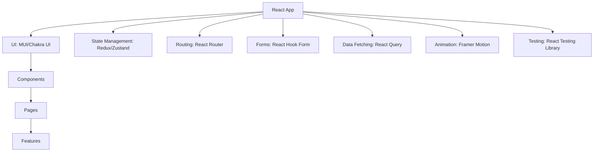

# React Community Libraries

## Introduction

One of the greatest strengths of React is its vibrant and active community. Beyond the core React library, thousands of open-source libraries extend React's capabilities, solve common problems, and provide pre-built components to accelerate development.

In this guide, we'll explore some of the most popular and useful community libraries in the React ecosystem. Understanding these tools will help you avoid "reinventing the wheel" and leverage battle-tested solutions for common challenges when building applications.

## Why Use Community Libraries?

Before diving into specific libraries, let's understand why utilizing community libraries is beneficial:

1. **Save development time** - Use pre-built solutions for common problems
2. **Leverage community expertise** - Benefit from battle-tested code maintained by many developers
3. **Maintain focus** - Concentrate on your core application logic rather than utility functions
4. **Stay modern** - Community libraries often implement best practices and modern patterns

## Popular React UI Component Libraries

UI component libraries provide ready-made, styled UI elements that you can assemble to create your application's interface.

### Material-UI (MUI)

[Material-UI](https://mui.com/) implements Google's Material Design in React components.

**Installation:**

```bash
npm install @mui/material @emotion/react @emotion/styled
# or
yarn add @mui/material @emotion/react @emotion/styled
```

**Usage Example:**

```jsx
import React from 'react';
import Button from '@mui/material/Button';
import TextField from '@mui/material/TextField';

function LoginForm() {
  return (
    <form>
      <TextField
        label="Email"
        variant="outlined"
        fullWidth
        margin="normal"
      />
      <TextField
        label="Password"
        type="password"
        variant="outlined"
        fullWidth
        margin="normal"
      />
      <Button variant="contained" color="primary" type="submit">
        Login
      </Button>
    </form>
  );
}

export default LoginForm;
```

### Chakra UI

[Chakra UI](https://chakra-ui.com/) is a simple, modular component library with a focus on accessibility.

**Installation:**

```bash
npm install @chakra-ui/react @emotion/react @emotion/styled framer-motion
# or
yarn add @chakra-ui/react @emotion/react @emotion/styled framer-motion
```

**Usage Example:**

```jsx
import React from 'react';
import { Box, Button, FormControl, FormLabel, Input, VStack } from '@chakra-ui/react';

function ContactForm() {
  return (
    <Box as="form" p={4} borderWidth="1px" borderRadius="lg">
      <VStack spacing={4}>
        <FormControl id="name">
          <FormLabel>Name</FormLabel>
          <Input placeholder="Enter your name" />
        </FormControl>
        <FormControl id="email">
          <FormLabel>Email</FormLabel>
          <Input type="email" placeholder="Enter your email" />
        </FormControl>
        <FormControl id="message">
          <FormLabel>Message</FormLabel>
          <Input as="textarea" placeholder="Your message" height="100px" />
        </FormControl>
        <Button colorScheme="blue" width="full" type="submit">
          Submit
        </Button>
      </VStack>
    </Box>
  );
}

export default ContactForm;
```

## State Management Libraries

React's built-in state management is suitable for many applications, but complex applications often benefit from dedicated state management libraries.

### Redux

[Redux](https://redux.js.org/) is the most popular state management library for React applications.

**Installation:**

```bash
npm install redux react-redux @reduxjs/toolkit
# or
yarn add redux react-redux @reduxjs/toolkit
```

**Basic Redux Usage:**

```jsx
// Creating a Redux store with Redux Toolkit
import { configureStore, createSlice } from '@reduxjs/toolkit';

// Define a slice of state
const counterSlice = createSlice({
  name: 'counter',
  initialState: { value: 0 },
  reducers: {
    increment: (state) => {
      state.value += 1;
    },
    decrement: (state) => {
      state.value -= 1;
    },
  },
});

// Export actions
export const { increment, decrement } = counterSlice.actions;

// Create the store
const store = configureStore({
  reducer: {
    counter: counterSlice.reducer,
  },
});

export default store;
```

**Using the store in a component:**

```jsx
import React from 'react';
import { useSelector, useDispatch } from 'react-redux';
import { increment, decrement } from './counterSlice';

function CounterComponent() {
  const count = useSelector((state) => state.counter.value);
  const dispatch = useDispatch();

  return (
    <div>
      <h2>Counter: {count}</h2>
      <button onClick={() => dispatch(increment())}>Increment</button>
      <button onClick={() => dispatch(decrement())}>Decrement</button>
    </div>
  );
}

export default CounterComponent;
```

### Zustand

[Zustand](https://github.com/pmndrs/zustand) is a minimal state management solution with a simple API.

**Installation:**

```bash
npm install zustand
# or
yarn add zustand
```

**Usage Example:**

```jsx
import create from 'zustand';
import React from 'react';

// Create store
const useStore = create((set) => ({
  bears: 0,
  increasePopulation: () => set((state) => ({ bears: state.bears + 1 })),
  removeAllBears: () => set({ bears: 0 }),
}));

// Use store in component
function BearCounter() {
  const bears = useStore((state) => state.bears);
  const increasePopulation = useStore((state) => state.increasePopulation);
  const removeAllBears = useStore((state) => state.removeAllBears);
  
  return (
    <div>
      <h2>Bear population: {bears}</h2>
      <button onClick={increasePopulation}>Add bear</button>
      <button onClick={removeAllBears}>Remove all bears</button>
    </div>
  );
}

export default BearCounter;
```

## Routing Libraries

### React Router

[React Router](https://reactrouter.com/) is the standard routing library for React applications.

**Installation:**

```bash
npm install react-router-dom
# or
yarn add react-router-dom
```

**Basic Setup:**

```jsx
import React from 'react';
import { BrowserRouter, Routes, Route, Link } from 'react-router-dom';

// Page components
const Home = () => <h2>Home Page</h2>;
const About = () => <h2>About Us</h2>;
const Contact = () => <h2>Contact Us</h2>;

function App() {
  return (
    <BrowserRouter>
      <nav>
        <ul>
          <li><Link to="/">Home</Link></li>
          <li><Link to="/about">About</Link></li>
          <li><Link to="/contact">Contact</Link></li>
        </ul>
      </nav>

      <Routes>
        <Route path="/" element={<Home />} />
        <Route path="/about" element={<About />} />
        <Route path="/contact" element={<Contact />} />
      </Routes>
    </BrowserRouter>
  );
}

export default App;
```

## Form Handling Libraries

### React Hook Form

[React Hook Form](https://react-hook-form.com/) provides efficient form validation with minimal re-renders.

**Installation:**

```bash
npm install react-hook-form
# or
yarn add react-hook-form
```

**Basic Usage:**

```jsx
import React from 'react';
import { useForm } from 'react-hook-form';

function SignupForm() {
  const { register, handleSubmit, formState: { errors } } = useForm();
  
  const onSubmit = (data) => {
    console.log('Form submitted:', data);
    // Send data to server, etc.
  };

  return (
    <form onSubmit={handleSubmit(onSubmit)}>
      <div>
        <label>Username</label>
        <input 
          {...register('username', { required: 'Username is required' })} 
        />
        {errors.username && <p>{errors.username.message}</p>}
      </div>
      
      <div>
        <label>Email</label>
        <input 
          type="email"
          {...register('email', { 
            required: 'Email is required',
            pattern: {
              value: /^[A-Z0-9._%+-]+@[A-Z0-9.-]+\.[A-Z]{2,}$/i,
              message: "Invalid email address"
            }
          })} 
        />
        {errors.email && <p>{errors.email.message}</p>}
      </div>
      
      <div>
        <label>Password</label>
        <input 
          type="password"
          {...register('password', { 
            required: 'Password is required',
            minLength: {
              value: 8,
              message: 'Password must be at least 8 characters'
            }
          })} 
        />
        {errors.password && <p>{errors.password.message}</p>}
      </div>
      
      <button type="submit">Sign Up</button>
    </form>
  );
}

export default SignupForm;
```

## Data Fetching Libraries

### React Query

[React Query](https://tanstack.com/query/latest) simplifies fetching, caching, synchronizing, and updating server state.

**Installation:**

```bash
npm install @tanstack/react-query
# or
yarn add @tanstack/react-query
```

**Setup and Usage:**

```jsx
import React from 'react';
import { QueryClient, QueryClientProvider, useQuery } from '@tanstack/react-query';

const queryClient = new QueryClient();

// App setup with provider
function App() {
  return (
    <QueryClientProvider client={queryClient}>
      <UserList />
    </QueryClientProvider>
  );
}

// Component using React Query
function UserList() {
  const { isLoading, error, data } = useQuery({
    queryKey: ['users'],
    queryFn: () =>
      fetch('https://jsonplaceholder.typicode.com/users')
        .then((res) => res.json())
  });

  if (isLoading) return <div>Loading...</div>;
  if (error) return <div>Error: {error.message}</div>;

  return (
    <div>
      <h2>Users</h2>
      <ul>
        {data.map(user => (
          <li key={user.id}>{user.name}</li>
        ))}
      </ul>
    </div>
  );
}

export default App;
```

## Animation Libraries

### Framer Motion

[Framer Motion](https://www.framer.com/motion/) is a production-ready animation library for React.

**Installation:**

```bash
npm install framer-motion
# or
yarn add framer-motion
```

**Simple Animation Example:**

```jsx
import React, { useState } from 'react';
import { motion } from 'framer-motion';

function AnimatedBox() {
  const [isOpen, setIsOpen] = useState(false);

  return (
    <div>
      <button onClick={() => setIsOpen(!isOpen)}>
        Toggle
      </button>
      
      <motion.div
        animate={{
          scale: isOpen ? 1.2 : 1,
          backgroundColor: isOpen ? '#ff0055' : '#0099ff',
          borderRadius: isOpen ? '50%' : '0%',
        }}
        transition={{ duration: 0.5 }}
        style={{
          width: 100,
          height: 100,
          margin: '20px 0',
        }}
      />
    </div>
  );
}

export default AnimatedBox;
```

## Testing Libraries

### React Testing Library

[React Testing Library](https://testing-library.com/docs/react-testing-library/intro/) provides utilities for testing React components in a user-centric way.

**Installation:**

```bash
npm install --save-dev @testing-library/react @testing-library/jest-dom
# or
yarn add --dev @testing-library/react @testing-library/jest-dom
```

**Example Test:**

```jsx
// Button.js
import React from 'react';

function Button({ onClick, children }) {
  return (
    <button onClick={onClick} type="button">
      {children}
    </button>
  );
}

export default Button;
```

```jsx
// Button.test.js
import React from 'react';
import { render, screen, fireEvent } from '@testing-library/react';
import '@testing-library/jest-dom';
import Button from './Button';

test('calls onClick when clicked', () => {
  const handleClick = jest.fn();
  render(<Button onClick={handleClick}>Click me</Button>);
  
  const button = screen.getByText(/click me/i);
  fireEvent.click(button);
  
  expect(handleClick).toHaveBeenCalledTimes(1);
});

test('renders button text correctly', () => {
  render(<Button onClick={() => {}}>Hello World</Button>);
  const button = screen.getByText(/hello world/i);
  expect(button).toBeInTheDocument();
});
```

## Real-World Project Structure

Let's see how these libraries might work together in a real-world React application structure:



## Choosing the Right Libraries

When selecting libraries for your project, consider:

1. **Project requirements** - Don't add libraries you don't need
2. **Bundle size** - Libraries add to your application's size
3. **Community support** - Look for active maintenance and widespread usage
4. **Learning curve** - Some libraries require more time to master
5. **Documentation** - Good documentation accelerates development

## Summary

The React ecosystem offers a wealth of community libraries that can accelerate your development process and improve your application's quality. In this guide, we've explored:

- UI component libraries like Material-UI and Chakra UI
- State management solutions like Redux and Zustand
- Routing with React Router
- Form handling with React Hook Form
- Data fetching with React Query
- Animation with Framer Motion
- Testing with React Testing Library

By leveraging these tools, you can focus on solving your application's unique problems rather than reinventing solutions to common challenges.

## Additional Resources

- [Awesome React](https://github.com/enaqx/awesome-react) - A curated list of React resources
- [npm trends](https://www.npmtrends.com/) - Compare package download trends to evaluate popularity
- [Bundlephobia](https://bundlephobia.com/) - Check the bundle size impact of libraries

## Exercises

1. Create a simple to-do application using React and at least three community libraries discussed in this guide.
2. Take an existing React application and refactor it to use a state management library.
3. Experiment with different UI component libraries to build the same interface, and compare the developer experience.
4. Build a small form with validation using React Hook Form and submit data using React Query.