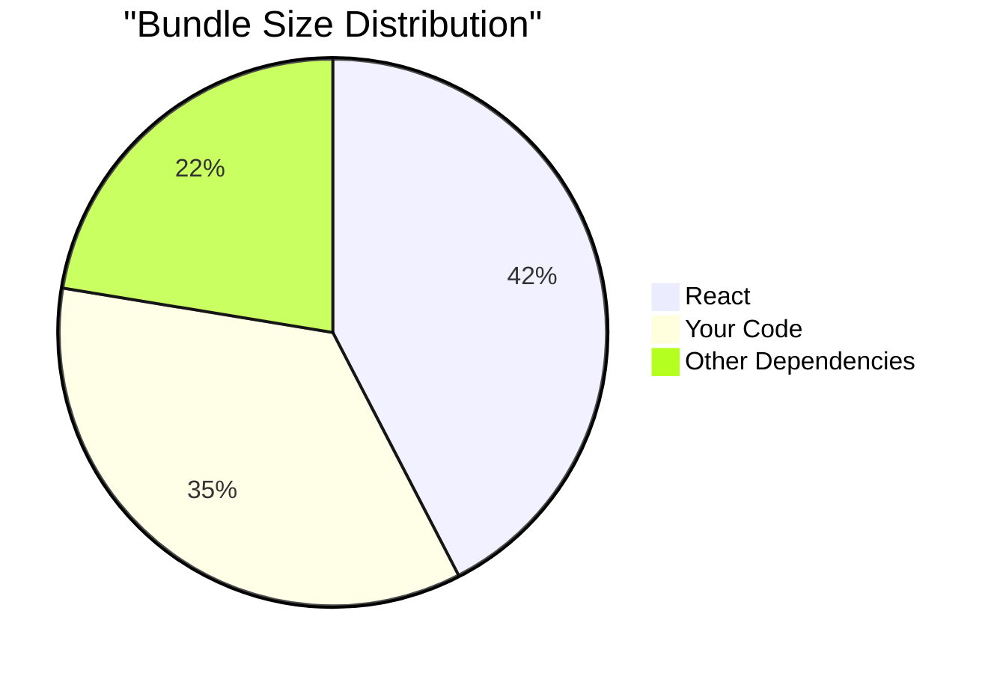

# React Build Process

## Introduction

The React build process is a crucial step in taking your application from development to production. When you're developing a React app, you're working with a setup that prioritizes developer experience—providing detailed error messages, hot reloading, and uncompressed code for easier debugging. However, this setup isn't suitable for production environments where performance, load time, and efficiency are critical.

In this guide, we'll explore the React build process, understand what happens when you "build" a React application, and learn how to optimize your app for production deployment.

## What is the React Build Process?

The React build process transforms your development code into production-ready files optimized for performance and browser compatibility. This process involves:

1. Bundling - Combining multiple JavaScript files into a few optimized bundles
2. Minification - Removing unnecessary characters (spaces, comments) from code
3. Transpilation - Converting modern JavaScript features to be compatible with older browsers
4. Optimization - Applying various techniques to improve performance


## Understanding the Build Pipeline

### 1. The Build Command

If you're using Create React App (CRA), the build process is as simple as running:

```bash
npm run build
# or
yarn build
```

This command triggers a series of steps defined in your project's build configuration.

### 2. What Happens During the Build

Let's break down what happens when you run the build command:

#### a. Bundle Creation

The bundler (typically Webpack in CRA) analyzes your application's dependency tree, starting from entry points like `src/index.js`. It then:

- Resolves all imports and requires
- Creates optimized bundles of JavaScript and CSS
- Applies various optimizations like tree shaking (removing unused code)

#### b. Transpilation

Modern JavaScript features are transpiled to ensure compatibility with older browsers:

```jsx
// Input: Modern JavaScript with JSX
const Greeting = ({ name }) => <h1>Hello, {name}!</h1>;

// Output: Transpiled JavaScript
var Greeting = function Greeting(_ref) {
  var name = _ref.name;
  return React.createElement("h1", null, "Hello, ", name, "!");
};
```

#### c. Asset Processing

Static assets like images and fonts are processed:
- Images below a certain size might be converted to base64 strings
- Larger files are copied to the output directory with hashed filenames
- CSS is extracted, minified, and optimized

#### d. HTML Generation

A production HTML file is generated with:
- References to the bundled JavaScript and CSS
- Proper metadata
- Content hash references for cache busting

## The Output: Your Build Folder

After the build process completes, you'll have a `build` folder (or `dist` in some configurations) containing:

```
build/
  ├── static/
  │   ├── css/
  │   │   ├── main.[hash].css
  │   │   └── main.[hash].css.map
  │   ├── js/
  │   │   ├── main.[hash].js
  │   │   └── main.[hash].js.map
  │   └── media/
  │       └── [file].[hash].[ext]
  ├── asset-manifest.json
  ├── favicon.ico
  ├── index.html
  └── ...
```

These files are optimized for production and ready to be deployed to a web server.

## Optimization Techniques

### 1. Code Splitting

Code splitting allows you to divide your application into smaller chunks that load on demand, improving initial load time.

```jsx
// Instead of importing directly
// import HeavyComponent from './HeavyComponent';

// Use dynamic import for code splitting
import React, { lazy, Suspense } from 'react';

const HeavyComponent = lazy(() => import('./HeavyComponent'));

function App() {
  return (
    <div>
      <Suspense fallback={<div>Loading...</div>}>
        <HeavyComponent />
      </Suspense>
    </div>
  );
}
```

### 2. Environment Variables

Create React App lets you use environment variables to configure your build:

```jsx
// Use environment variables to configure your app
function ApiService() {
  // This will be replaced with the actual value during build
  const apiUrl = process.env.REACT_APP_API_URL;
  
  return <div>API URL: {apiUrl}</div>;
}
```

You can set these in a `.env` file:

```
REACT_APP_API_URL=https://api.example.com
REACT_APP_FEATURE_FLAG=true
```

### 3. Source Maps

Source maps help with debugging production code by mapping the minified code back to the original source code. They're generated by default but can be controlled:

```jsx
// In package.json you can control source map generation
{
  "scripts": {
    // Generate source maps
    "build": "GENERATE_SOURCEMAP=true react-scripts build",
    
    // Disable source maps for smaller build size
    "build:no-maps": "GENERATE_SOURCEMAP=false react-scripts build"
  }
}
```

## Customizing the Build Process

### Ejecting from Create React App

If you need more control over the build process, you can "eject" from Create React App:

```bash
npm run eject
```

⚠️ **Warning**: This is a one-way operation. Once you eject, you can't go back!

After ejecting, you'll have access to all the configuration files, including:
- Webpack configuration
- Babel configuration
- ESLint configuration
- All the scripts and dependencies

### Using Build Alternatives

Instead of ejecting, consider these alternatives:

1. **react-app-rewired**: Customize CRA without ejecting
   ```bash
   npm install react-app-rewired --save-dev
   ```

2. **CRACO** (Create React App Configuration Override)
   ```bash
   npm install @craco/craco --save-dev
   ```

Example CRACO configuration:

```js
// craco.config.js
module.exports = {
  webpack: {
    alias: {
      '@components': path.resolve(__dirname, 'src/components'),
      '@utils': path.resolve(__dirname, 'src/utils'),
    },
  },
};
```

## Analyzing Your Build

You can analyze your build size to identify large packages using tools like `source-map-explorer`:

```bash
npm install source-map-explorer --save-dev
```

Add to your package.json:

```json
"scripts": {
  "analyze": "source-map-explorer 'build/static/js/*.js'",
}
```

Run after building:

```bash
npm run build
npm run analyze
```

This will open a visualization of your bundle size:



## Real-world Build Considerations

### 1. Progressive Web App (PWA)

To build a React app as a PWA:

```bash
# If using CRA
npx create-react-app my-app --template cra-template-pwa
```

The build will include:
- Service worker registration
- Web App Manifest
- Offline capabilities

### 2. Server-Side Rendering (SSR)

For projects requiring SSR, the build process differs:

```jsx
// Server entry point (simplified example)
import express from 'express';
import React from 'react';
import { renderToString } from 'react-dom/server';
import App from './App';

const app = express();

app.get('*', (req, res) => {
  const html = renderToString(<App />);
  
  res.send(`
    <!DOCTYPE html>
    <html>
      <head><title>SSR React App</title></head>
      <body>
        <div id="root">${html}</div>
        <script src="/client.js"></script>
      </body>
    </html>
  `);
});

app.listen(3000);
```

This requires a specialized build setup that generates both client and server bundles.

### 3. TypeScript Support

When using TypeScript, the build process includes type checking:

```tsx
// TypeScript React component
interface GreetingProps {
  name: string;
  age?: number;
}

const Greeting: React.FC<GreetingProps> = ({ name, age }) => (
  <div>
    <h1>Hello, {name}!</h1>
    {age && <p>You are {age} years old.</p>}
  </div>
);

export default Greeting;
```

## Troubleshooting Common Build Issues

### 1. Build Fails Due to ESLint Errors

By default, CRA fails the build if there are ESLint errors. You can bypass this:

```bash
# Ignore linting errors during build
DISABLE_ESLINT_PLUGIN=true npm run build
```

### 2. Out of Memory Errors

For large applications, you might encounter memory issues:

```bash
# Increase Node memory limit
NODE_OPTIONS=--max_old_space_size=4096 npm run build
```

### 3. Missing Dependencies

If you see errors about missing modules:

```bash
# Check for and install missing dependencies
npm install --save some-missing-package
```

## Summary

The React build process transforms your development code into optimized, production-ready files. This involves bundling, minification, transpilation, and various optimizations to ensure your app loads quickly and performs well in production.

Key points to remember:

- The build process creates static files ready for deployment
- Optimization techniques like code splitting can improve performance
- Create React App handles most configuration, but you can customize when needed
- Analyzing your bundle size helps identify performance bottlenecks
- Different deployment targets (PWA, SSR) have different build requirements

## Additional Resources

- [Create React App Documentation on Production Builds](https://create-react-app.dev/docs/production-build/)
- [Webpack Documentation](https://webpack.js.org/)
- [React Optimization Techniques](https://reactjs.org/docs/optimizing-performance.html)
- [Code Splitting in React](https://reactjs.org/docs/code-splitting.html)

## Exercises

1. Create a React application and run the build process. Compare the original source code with the output in the build folder.
2. Implement code splitting for a large component in your React application.
3. Use environment variables to configure different API endpoints for development and production.
4. Analyze your bundle size and identify at least one package that could be optimized or replaced.
5. Set up a custom build configuration using CRACO to add a feature like SASS processing or alias paths.