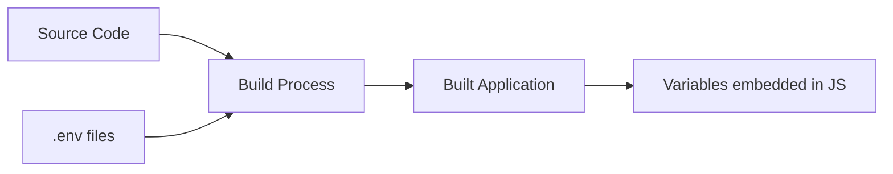

# React Environment Variables

## Introduction

Environment variables are a crucial part of modern web application development, especially when deploying React applications to different environments like development, staging, and production. They allow you to store configuration data outside your application code, keeping sensitive information like API keys secure while also enabling environment-specific configurations.

In this guide, we'll explore how to use environment variables in React applications, why they're important, and best practices for implementing them in your projects.

## Why Use Environment Variables?

Before diving into implementation details, let's understand why environment variables are essential:

1. **Security**: Keep sensitive information like API keys and passwords out of your codebase
2. **Environment-specific configuration**: Use different settings for development, testing, and production
3. **Simplify deployment**: Change configuration without modifying code
4. **Avoid hardcoding**: Prevent hard-to-maintain values scattered throughout your code

## Environment Variables in Create React App

Create React App (CRA) has built-in support for environment variables. Let's explore how to use them:

### Built-in Environment Variables

CRA provides a default environment variable called `NODE_ENV`. Its value depends on the command you're running:

- `npm start`: `NODE_ENV` is set to `development`
- `npm test`: `NODE_ENV` is set to `test`
- `npm run build`: `NODE_ENV` is set to `production`

You can access this variable in your code as `process.env.NODE_ENV`:

```jsx
import React from 'react';

function EnvironmentInfo() {
  return (
    <div>
      <h2>Current Environment: {process.env.NODE_ENV}</h2>
      {process.env.NODE_ENV === 'development' && (
        <p>You are in development mode!</p>
      )}
    </div>
  );
}

export default EnvironmentInfo;
```

### Custom Environment Variables

To create custom environment variables, prefix them with `REACT_APP_` in your `.env` files:

```
REACT_APP_API_URL=https://api.example.com
REACT_APP_API_KEY=your-api-key
```

These can be accessed in your code as `process.env.REACT_APP_API_URL` and `process.env.REACT_APP_API_KEY`.

:::caution
Only variables that start with `REACT_APP_` will be embedded in your built application. Other variables will be ignored for security reasons.
:::

### Example: Using an API Key

Let's see how to use an environment variable to store an API key:

```jsx
import React, { useState, useEffect } from 'react';

function WeatherWidget() {
  const [weatherData, setWeatherData] = useState(null);
  const [loading, setLoading] = useState(true);
  const [error, setError] = useState(null);

  useEffect(() => {
    const fetchWeather = async () => {
      try {
        // Using environment variable for the API key
        const apiKey = process.env.REACT_APP_WEATHER_API_KEY;
        const response = await fetch(
          `https://api.weatherservice.com/data?key=${apiKey}&city=NewYork`
        );
        
        if (!response.ok) {
          throw new Error('Weather data fetch failed');
        }
        
        const data = await response.json();
        setWeatherData(data);
        setLoading(false);
      } catch (err) {
        setError(err.message);
        setLoading(false);
      }
    };

    fetchWeather();
  }, []);

  if (loading) return <div>Loading weather data...</div>;
  if (error) return <div>Error: {error}</div>;
  
  return (
    <div>
      <h2>Weather in {weatherData.city}</h2>
      <p>Temperature: {weatherData.temperature}°C</p>
      <p>Condition: {weatherData.condition}</p>
    </div>
  );
}

export default WeatherWidget;
```

## Setting Up Different Environment Files

CRA supports different `.env` files for various environments:

- `.env`: Default file loaded in all environments
- `.env.development`: Used during development (`npm start`)
- `.env.test`: Used during testing (`npm test`)
- `.env.production`: Used during production build (`npm run build`)

Additionally, you can create local variants that aren't committed to your repository:

- `.env.local`: Loaded for all environments except test
- `.env.development.local`, `.env.test.local`, `.env.production.local`

The priority order (from highest to lowest) is:

1. `.env.{environment}.local`
2. `.env.{environment}`
3. `.env.local`
4. `.env`

### Example Environment Files

Here's an example of different environment files:

`.env` (default for all environments):
```
REACT_APP_WEBSITE_NAME=My Amazing React App
```

`.env.development` (development-specific):
```
REACT_APP_API_URL=http://localhost:3001/api
REACT_APP_DEBUG_MODE=true
```

`.env.production` (production-specific):
```
REACT_APP_API_URL=https://api.myamazingapp.com
REACT_APP_DEBUG_MODE=false
```

## Accessing Environment Variables

To use these variables in your React components:

```jsx
import React from 'react';

function Header() {
  return (
    <header>
      <h1>{process.env.REACT_APP_WEBSITE_NAME}</h1>
      {process.env.REACT_APP_DEBUG_MODE === 'true' && (
        <div className="debug-banner">Debug Mode Active</div>
      )}
    </header>
  );
}

export default Header;
```

## Environment Variables at Build Time vs. Runtime

An important concept to understand is that environment variables in Create React App are embedded during the build process, not at runtime.



This means:

1. Values are "baked in" when you run `npm run build`
2. To change values after building, you need to rebuild the application
3. You can't change environment variables after deployment without rebuilding

### Runtime Environment Configuration

For truly dynamic configuration, you can:

1. Create a configuration file that's loaded at runtime
2. Use a server-side approach to inject variables

Here's a simple runtime configuration approach:

**public/config.js**:
```javascript
window.RUNTIME_CONFIG = {
  API_URL: "https://api.example.com",
  FEATURE_FLAGS: {
    NEW_DASHBOARD: true
  }
};
```

Include this in your `public/index.html`:
```html
<script src="%PUBLIC_URL%/config.js"></script>
```

Then use it in your components:
```jsx
function ApiService() {
  // Use runtime config if available, fall back to build-time env var
  const apiUrl = window.RUNTIME_CONFIG?.API_URL || process.env.REACT_APP_API_URL;
  
  // Now use apiUrl for API calls
  // ...
}
```

## Security Considerations

Keep these security points in mind:

1. **Environment variables are embedded in the build**: They are visible in the JavaScript bundle. Never include sensitive secrets in frontend code.
2. **API keys exposed to clients**: If you include API keys in your React app, users can extract them. Use backend proxies for sensitive APIs.
3. **Use `.env.local` for secrets**: Add local-only env files to your `.gitignore` to avoid committing secrets.

## Practical Example: Feature Flags

Here's a real-world example of using environment variables for feature flags:

```jsx
import React from 'react';

function App() {
  return (
    <div className="app">
      <header>
        <h1>{process.env.REACT_APP_WEBSITE_NAME}</h1>
      </header>
      
      <main>
        {/* Feature flag for new dashboard */}
        {process.env.REACT_APP_ENABLE_NEW_DASHBOARD === 'true' ? (
          <NewDashboard />
        ) : (
          <LegacyDashboard />
        )}
        
        {/* Feature flag for experimental features */}
        {process.env.REACT_APP_ENABLE_EXPERIMENTS === 'true' && (
          <ExperimentalFeatures />
        )}
      </main>
    </div>
  );
}

function NewDashboard() {
  return <div className="dashboard">New Dashboard Experience</div>;
}

function LegacyDashboard() {
  return <div className="dashboard">Classic Dashboard</div>;
}

function ExperimentalFeatures() {
  return <div className="experimental">Experimental Feature Section</div>;
}

export default App;
```

## Using TypeScript with Environment Variables

If you're using TypeScript with React, you can enhance type safety for environment variables:

Create a `react-app-env.d.ts` file (CRA might have already generated one):

```typescript
/// <reference types="react-scripts" />

declare namespace NodeJS {
  interface ProcessEnv {
    NODE_ENV: 'development' | 'production' | 'test';
    REACT_APP_API_URL: string;
    REACT_APP_API_KEY: string;
    REACT_APP_ENABLE_NEW_DASHBOARD: string;
    // Add other env variables here
  }
}
```

This gives you proper type checking and autocomplete for your environment variables.

## Environment Variables Beyond Create React App

If you're not using CRA, you can set up environment variables with:

1. **Webpack**: Use `DefinePlugin` or `dotenv-webpack` plugin
2. **Vite**: Uses `.env` files similar to CRA, but with `VITE_` prefix instead
3. **Next.js**: Has its own environment variables system with server-side and client-side variables

## Summary

Environment variables are a powerful tool in React applications that help you:

- Configure your application for different environments
- Keep sensitive data out of your codebase
- Implement feature flags for gradual rollouts
- Make your application more maintainable and configurable

Remember these key points:
- In Create React App, use the `REACT_APP_` prefix for custom variables
- Environment variables are embedded at build time, not runtime
- Never put truly sensitive information in frontend code
- Use different `.env` files for different environments

## Additional Resources

- [Create React App: Environment Variables Documentation](https://create-react-app.dev/docs/adding-custom-environment-variables/)
- [Twelve-Factor App Methodology: Config](https://12factor.net/config)
- [Handling Secrets in Frontend Applications (Best Practices)](https://blog.bitsrc.io/frontend-security-handling-secrets-in-frontend-applications-9ae989337eb4)

## Exercises

1. Create a React application that uses environment variables to switch between a local API and a production API.
2. Implement a feature flag system using environment variables to enable/disable certain components.
3. Set up a development, staging, and production environment configuration with appropriate `.env` files.
4. Create a runtime configuration system that allows changing settings without rebuilding the application.