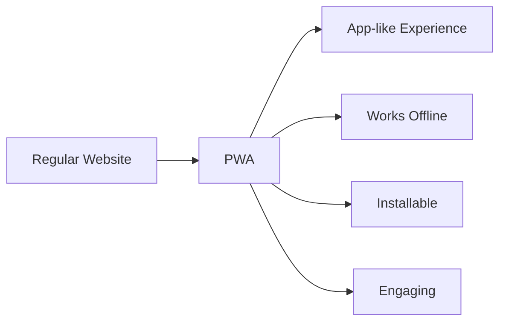
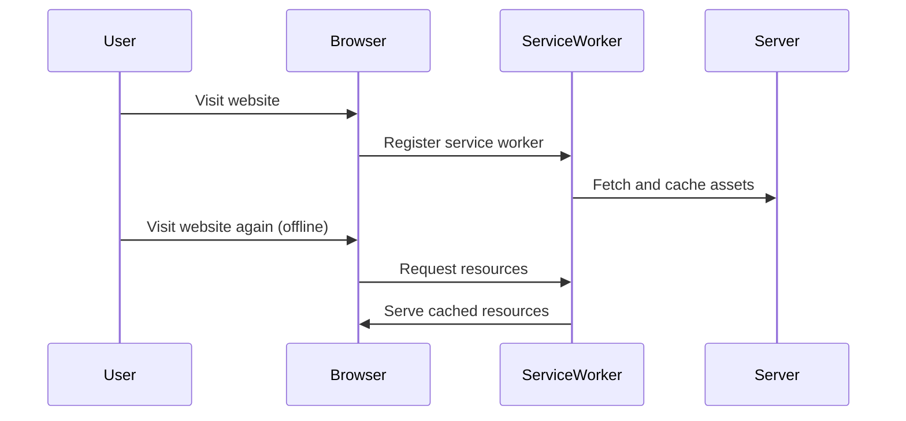

# React Progressive Web Apps

## Introduction

Progressive Web Apps (PWAs) represent a revolutionary approach to web development that combines the best features of websites and mobile applications. They load quickly, work offline, receive push notifications, and can be installed on a user's device, providing an app-like experience without requiring users to visit an app store.

In this guide, we'll learn how to transform a React application into a fully-functional Progressive Web App. We'll cover:

- What makes a web app "progressive"
- Setting up a React app for PWA capabilities
- Implementing service workers for offline functionality
- Creating and customizing the web app manifest
- Testing and deploying your React PWA

## What are Progressive Web Apps?

Progressive Web Apps are websites that use modern web capabilities to provide an app-like experience to users. They're characterized by:

1. **Reliability** - Load instantly and never show the "dinosaur" offline page, even in uncertain network conditions
2. **Fast** - Respond quickly to user interactions with smooth animations
3. **Engaging** - Feel like a natural app on the device, with immersive user experience



## Setting Up a React App for PWA

### Creating a New PWA-ready React App

If you're starting a new project, Create React App provides built-in PWA templates:

```bash
# Create a new React app with PWA template
npx create-react-app my-pwa --template cra-template-pwa

# Or for TypeScript
npx create-react-app my-pwa --template cra-template-pwa-typescript
```

### Converting an Existing React App to PWA

If you have an existing React app created with Create React App, you can enable PWA features by:

1. Updating the `index.js` file:

```jsx
import React from 'react';
import ReactDOM from 'react-dom/client';
import './index.css';
import App from './App';
import * as serviceWorkerRegistration from './serviceWorkerRegistration';

const root = ReactDOM.createRoot(document.getElementById('root'));
root.render(
  <React.StrictMode>
    <App />
  </React.StrictMode>
);

// If you want your app to work offline and load faster, you can change
// unregister() to register() below.
serviceWorkerRegistration.register();
```

2. Creating the necessary service worker files (if not already present):
   - `serviceWorkerRegistration.js`
   - `service-worker.js`

For apps not created with Create React App, you'll need to manually add these files or use libraries like `workbox-webpack-plugin`.

## Understanding Service Workers

Service workers act as a proxy between the web app, the browser, and the network. They enable offline functionality by caching assets and API responses.

### How Service Workers Function



### Service Worker Lifecycle

1. **Registration**: The browser registers the service worker
2. **Installation**: The service worker installs and caches essential assets
3. **Activation**: The service worker activates and takes control of the client
4. **Idle**: The service worker waits for events
5. **Fetch/Message**: The service worker handles fetch or message events
6. **Termination**: The browser terminates the service worker when not in use

## Creating the Web App Manifest

The Web App Manifest is a JSON file that provides information about your web application to the browser. It defines how your app appears when installed on a user's device.

Create or modify the `manifest.json` file in your public folder:

```json
{
  "short_name": "React PWA",
  "name": "React Progressive Web App Example",
  "icons": [
    {
      "src": "favicon.ico",
      "sizes": "64x64 32x32 24x24 16x16",
      "type": "image/x-icon"
    },
    {
      "src": "logo192.png",
      "type": "image/png",
      "sizes": "192x192"
    },
    {
      "src": "logo512.png",
      "type": "image/png",
      "sizes": "512x512"
    }
  ],
  "start_url": ".",
  "display": "standalone",
  "theme_color": "#000000",
  "background_color": "#ffffff"
}
```

Ensure the manifest is linked in your HTML:

```html
<link rel="manifest" href="%PUBLIC_URL%/manifest.json" />
```

## Implementing Offline Functionality

### Basic Caching Strategy

Let's implement a simple caching strategy in our service worker:

```javascript
// service-worker.js
const CACHE_NAME = 'react-pwa-v1';
const urlsToCache = [
  '/',
  '/index.html',
  '/static/js/main.chunk.js',
  '/static/js/0.chunk.js',
  '/static/js/bundle.js',
];

// Install a service worker
self.addEventListener('install', (event) => {
  event.waitUntil(
    caches.open(CACHE_NAME)
      .then((cache) => {
        console.log('Opened cache');
        return cache.addAll(urlsToCache);
      })
  );
});

// Cache and return requests
self.addEventListener('fetch', (event) => {
  event.respondWith(
    caches.match(event.request)
      .then((response) => {
        // Cache hit - return response
        if (response) {
          return response;
        }
        return fetch(event.request);
      })
  );
});

// Update a service worker
self.addEventListener('activate', (event) => {
  const cacheWhitelist = [CACHE_NAME];
  event.waitUntil(
    caches.keys().then((cacheNames) => {
      return Promise.all(
        cacheNames.map((cacheName) => {
          if (cacheWhitelist.indexOf(cacheName) === -1) {
            return caches.delete(cacheName);
          }
        })
      );
    })
  );
});
```

### Using Workbox for Advanced Caching

Google's Workbox library simplifies service worker implementation with pre-built strategies:

```javascript
// service-worker.js using Workbox
import { precacheAndRoute } from 'workbox-precaching';
import { registerRoute } from 'workbox-routing';
import { CacheFirst, StaleWhileRevalidate } from 'workbox-strategies';
import { ExpirationPlugin } from 'workbox-expiration';
import { CacheableResponsePlugin } from 'workbox-cacheable-response';

// Precache static assets
precacheAndRoute(self.__WB_MANIFEST);

// Cache page navigations
registerRoute(
  ({ request }) => request.mode === 'navigate',
  new StaleWhileRevalidate({
    cacheName: 'pages',
    plugins: [
      new CacheableResponsePlugin({
        statuses: [0, 200],
      }),
    ],
  }),
);

// Cache images
registerRoute(
  ({ request }) => request.destination === 'image',
  new CacheFirst({
    cacheName: 'images',
    plugins: [
      new CacheableResponsePlugin({
        statuses: [0, 200],
      }),
      new ExpirationPlugin({
        maxEntries: 60,
        maxAgeSeconds: 30 * 24 * 60 * 60, // 30 Days
      }),
    ],
  }),
);
```

## Real-World Application: Building an Offline-Capable Todo App

Let's create a simple todo app that works offline:

```jsx
// App.js
import React, { useState, useEffect } from 'react';
import './App.css';

function App() {
  const [todos, setTodos] = useState([]);
  const [input, setInput] = useState('');
  const [status, setStatus] = useState('online');

  useEffect(() => {
    // Load todos from localStorage on start
    const savedTodos = localStorage.getItem('todos');
    if (savedTodos) {
      setTodos(JSON.parse(savedTodos));
    }
    
    // Update online/offline status
    const handleStatusChange = () => {
      setStatus(navigator.onLine ? 'online' : 'offline');
    };
    
    window.addEventListener('online', handleStatusChange);
    window.addEventListener('offline', handleStatusChange);
    
    return () => {
      window.removeEventListener('online', handleStatusChange);
      window.removeEventListener('offline', handleStatusChange);
    };
  }, []);

  // Save todos to localStorage whenever they change
  useEffect(() => {
    localStorage.setItem('todos', JSON.stringify(todos));
  }, [todos]);

  const addTodo = (e) => {
    e.preventDefault();
    if (!input.trim()) return;
    
    const newTodo = {
      id: Date.now(),
      text: input,
      completed: false
    };
    
    setTodos([...todos, newTodo]);
    setInput('');
  };

  const toggleTodo = (id) => {
    setTodos(todos.map(todo => 
      todo.id === id ? { ...todo, completed: !todo.completed } : todo
    ));
  };

  return (
    <div className="App">
      <header className="App-header">
        <h1>PWA Todo App</h1>
        <div className="status-indicator">
          Status: <span className={status}>{status}</span>
        </div>
        
        <form onSubmit={addTodo}>
          <input
            type="text"
            value={input}
            onChange={(e) => setInput(e.target.value)}
            placeholder="Add a new todo"
          />
          <button type="submit">Add</button>
        </form>
        
        <ul className="todo-list">
          {todos.map(todo => (
            <li
              key={todo.id}
              onClick={() => toggleTodo(todo.id)}
              className={todo.completed ? 'completed' : ''}
            >
              {todo.text}
            </li>
          ))}
        </ul>
      </header>
    </div>
  );
}

export default App;
```

```css
/* App.css */
.status-indicator {
  margin-bottom: 20px;
  font-size: 16px;
}

.online {
  color: green;
}

.offline {
  color: red;
}

.todo-list {
  width: 300px;
  text-align: left;
}

.todo-list li {
  cursor: pointer;
  padding: 8px;
  margin: 5px 0;
  background: #f1f1f1;
  border-radius: 4px;
}

.todo-list li.completed {
  text-decoration: line-through;
  color: #888;
}
```

This todo app:
- Stores todos in localStorage for offline use
- Shows the current online/offline status
- Allows users to add and toggle todos
- Persists data between sessions

## Testing Your PWA

### Using Lighthouse for Auditing

Chrome's Lighthouse is the go-to tool for auditing PWAs:

1. Open Chrome DevTools
2. Click on the "Lighthouse" tab
3. Check the "Progressive Web App" category
4. Click "Generate report"

Lighthouse will provide a detailed report with suggestions for improvement.

### Testing Offline Functionality

1. Open your app in Chrome
2. Open DevTools (F12)
3. Go to the "Network" tab
4. Check the "Offline" option
5. Refresh the page

Your app should still work even when offline!

### Testing Installation Experience

1. Visit your deployed PWA
2. Look for the install icon in the address bar or browser menu
3. Click it and follow the installation prompt
4. Your app should launch as a standalone application

## Deployment Considerations

When deploying your React PWA, consider:

1. **HTTPS** - PWAs require a secure context (HTTPS)
2. **Caching strategies** - Be careful with cache strategies to avoid serving stale content
3. **Service worker scope** - Service workers are limited to their scope (usually the directory they're served from)
4. **Updates** - Implement a mechanism to notify users when updates are available

Here's a simple component to notify users of updates:

```jsx
// UpdateNotification.js
import React, { useState, useEffect } from 'react';

function UpdateNotification() {
  const [showUpdateNotification, setShowUpdateNotification] = useState(false);

  useEffect(() => {
    // Listen for service worker update
    if ('serviceWorker' in navigator) {
      navigator.serviceWorker.addEventListener('controllerchange', () => {
        setShowUpdateNotification(true);
      });
    }
  }, []);

  const refreshApp = () => {
    window.location.reload();
  };

  if (!showUpdateNotification) return null;

  return (
    <div className="update-notification">
      <p>A new version is available!</p>
      <button onClick={refreshApp}>Update Now</button>
    </div>
  );
}

export default UpdateNotification;
```

## Summary

In this guide, we've learned:

- What Progressive Web Apps are and their benefits
- How to set up a React application for PWA capabilities
- The importance and implementation of service workers
- How to create and configure the web app manifest
- Building an offline-capable application
- Testing and deploying PWAs

By transforming your React application into a PWA, you provide users with a faster, more reliable, and engaging experience that works regardless of network conditions. PWAs represent a significant step forward in web development, combining the reach of the web with the capabilities of native applications.

## Additional Resources

- **Google's PWA Documentation**: [web.dev/progressive-web-apps](https://web.dev/progressive-web-apps/)
- **Workbox**: [developers.google.com/web/tools/workbox](https://developers.google.com/web/tools/workbox)
- **MDN PWA Guide**: [developer.mozilla.org/en-US/docs/Web/Progressive_web_apps](https://developer.mozilla.org/en-US/docs/Web/Progressive_web_apps)

## Exercises

1. Convert an existing React application into a PWA
2. Implement different caching strategies for different types of resources
3. Add a "Push Notification" feature to your PWA
4. Create a custom install prompt to improve the installation experience
5. Build an offline-first application that synchronizes data when the user comes back online

Happy coding, and enjoy building powerful Progressive Web Apps with React!