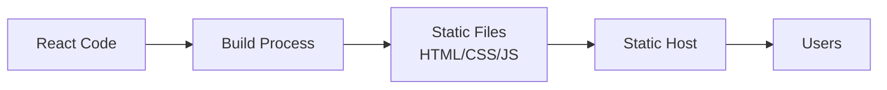

# React Static Site Hosting

## Introduction

After you've built your React application, the next crucial step is to make it accessible to users on the internet. Static site hosting is one of the most efficient, cost-effective, and straightforward ways to deploy a React application.

In this guide, we'll explore what static site hosting means for React applications, why it's often the preferred deployment method for many React projects, and how to deploy your application to some popular hosting platforms.

## What is Static Site Hosting?

Static site hosting refers to serving pre-built, static files (HTML, CSS, JavaScript) to users without server-side processing at request time. When you build a React application using tools like Create React App or Vite, the build process generates these static files that can be served directly by a web server.



### Advantages of Static Site Hosting

- **Performance**: Static sites load faster as content is pre-rendered.
- **Security**: Fewer vulnerabilities due to lack of server-side processing.
- **Scalability**: Static files are easier to distribute across CDN networks.
- **Cost-effectiveness**: Many platforms offer free or low-cost hosting for static sites.
- **Simplicity**: Deployment is straightforward with modern CI/CD workflows.

## Preparing Your React App for Static Hosting

Before you deploy your React application to a static hosting provider, you need to build it first. Here's how to do it:

### 1. Build Your React Application

For Create React App (CRA):

```bash
npm run build
# or
yarn build
```

For Vite:

```bash
npm run build
# or
yarn build
```

These commands will generate a `build` folder (CRA) or `dist` folder (Vite) containing all the static files needed to serve your application.

### 2. Test Your Build Locally

Before deploying, it's a good practice to verify that your built application works correctly:

For Create React App:

```bash
npx serve -s build
```

For Vite:

```bash
npm run preview
# or
yarn preview
```

This will start a local server, and you can visit the provided URL to see your production build in action.

## Popular Static Hosting Platforms for React

Let's explore how to deploy your React application to some of the most popular static hosting platforms:

### Netlify

Netlify is a popular platform that offers seamless deployment for static websites with excellent CI/CD integration.

#### Steps to Deploy on Netlify:

1. **Create an account and new site**:
   Go to [Netlify](https://www.netlify.com/) and sign up or log in.

2. **Manual Deployment**:
   
   Drag and drop your `build` or `dist` folder onto the Netlify dashboard.

3. **Connect to Git repository** (recommended for continuous deployment):

   ```bash
   # Install Netlify CLI
   npm install -g netlify-cli
   
   # Login to Netlify
   netlify login
   
   # Initialize and set up your project
   netlify init
   ```

4. **Configure build settings**:
   
   Create a `netlify.toml` file in your project root:

   ```toml
   [build]
     publish = "build"  # or "dist" for Vite
     command = "npm run build"
   
   [[redirects]]
     from = "/*"
     to = "/index.html"
     status = 200
   ```
   
   The redirects part is crucial for React Router to work correctly.

### Vercel

Vercel, created by the team behind Next.js, offers an excellent platform for deploying React applications with zero configuration.

#### Steps to Deploy on Vercel:

1. **Install Vercel CLI**:

   ```bash
   npm install -g vercel
   ```

2. **Login and Deploy**:

   ```bash
   vercel login
   
   # In your project directory:
   vercel
   ```

3. **For production deployment**:

   ```bash
   vercel --prod
   ```

4. **Connect to Git repository**:
   
   Alternatively, connect your GitHub, GitLab, or Bitbucket repository directly through the Vercel dashboard for automatic deployments.

### GitHub Pages

GitHub Pages is a free hosting service provided by GitHub that's great for personal projects or documentation sites.

#### Steps to Deploy on GitHub Pages:

1. **Install gh-pages package**:

   ```bash
   npm install --save-dev gh-pages
   ```

2. **Add deployment scripts to package.json**:

   ```json
   {
     "scripts": {
       "predeploy": "npm run build",
       "deploy": "gh-pages -d build"
     },
     "homepage": "https://yourusername.github.io/your-repo-name"
   }
   ```

   For Vite projects, replace `build` with `dist`.

3. **Deploy**:

   ```bash
   npm run deploy
   ```

4. **Configure GitHub repository**:
   
   Go to your repository's Settings > Pages, and ensure the source branch is set to `gh-pages`.

### Firebase Hosting

Firebase provides reliable, fast hosting with a global CDN and easy integration with other Firebase services.

#### Steps to Deploy on Firebase:

1. **Install Firebase CLI**:

   ```bash
   npm install -g firebase-tools
   ```

2. **Login and Initialize**:

   ```bash
   firebase login
   firebase init
   ```

   Select "Hosting" when prompted and follow the setup process.

3. **Configure firebase.json**:

   ```json
   {
     "hosting": {
       "public": "build",  // or "dist" for Vite
       "ignore": [
         "firebase.json",
         "**/.*",
         "**/node_modules/**"
       ],
       "rewrites": [
         {
           "source": "**",
           "destination": "/index.html"
         }
       ]
     }
   }
   ```

4. **Deploy**:

   ```bash
   firebase deploy
   ```

## Handling React Router in Static Hosting

Single Page Applications (SPAs) using React Router need special configuration to properly handle client-side routing. Since the routing happens on the client side, the server needs to return the `index.html` file for all routes.

### The Issue

When a user navigates directly to a route like `https://your-app.com/about`, the server looks for a file at `/about`, which doesn't exist in a static build.

### The Solution

Configure your hosting platform to redirect all requests to `index.html`. We've included this configuration in the examples above:

- **Netlify**: Using redirects in `netlify.toml`
- **Vercel**: Handles this automatically
- **GitHub Pages**: Requires a custom 404.html approach (see below)
- **Firebase**: Using rewrites in `firebase.json`

### For GitHub Pages (Special Case):

Create a `404.html` file with script to redirect to the correct route:

```html
<!DOCTYPE html>
<html>
  <head>
    <meta charset="utf-8">
    <script type="text/javascript">
      var pathSegments = window.location.pathname.split('/');
      var repoName = pathSegments[1];
      var route = pathSegments.slice(2).join('/');
      
      localStorage.setItem('redirect', route);
      window.location.href = '/' + repoName;
    </script>
  </head>
  <body>
    Redirecting...
  </body>
</html>
```

Then in your `index.html`, add:

```html
<script type="text/javascript">
  (function() {
    var redirect = localStorage.getItem('redirect');
    if (redirect && redirect !== window.location.pathname) {
      localStorage.removeItem('redirect');
      history.replaceState(null, null, redirect);
    }
  })();
</script>
```

## Optimizing Your Static React Site

To maximize the performance of your hosted React application:

### 1. Enable GZIP/Brotli Compression

Most hosting providers support this automatically, but if configuring a custom server, ensure compression is enabled.

### 2. Configure Proper Caching Headers

For optimal performance, set appropriate cache headers:

```
Cache-Control: public, max-age=31536000, immutable
```

For files with hashed names (like those generated by webpack), and:

```
Cache-Control: no-cache
```

For your `index.html`.

### 3. Use a Content Delivery Network (CDN)

Most static hosting providers include CDN functionality automatically.

### 4. Implement Code Splitting

Break your React application into smaller chunks that load on demand:

```jsx
import React, { Suspense, lazy } from 'react';

// Lazy load components
const Dashboard = lazy(() => import('./routes/Dashboard'));
const Settings = lazy(() => import('./routes/Settings'));

function App() {
  return (
    <Suspense fallback={<div>Loading...</div>}>
      <Routes>
        <Route path="/dashboard" element={<Dashboard />} />
        <Route path="/settings" element={<Settings />} />
      </Routes>
    </Suspense>
  );
}
```

## Common Issues and Troubleshooting

### 1. Routes Work Locally but Break When Deployed

**Issue**: Navigating directly to a route like `/about` returns a 404 error.
**Solution**: Ensure you've configured proper redirects on your hosting platform.

### 2. Assets Not Loading

**Issue**: Images, fonts, or other assets don't load after deployment.
**Solution**: Check for incorrect paths. Use relative paths or ensure your `homepage` is set correctly in `package.json`.

### 3. Environment Variables Not Working

**Issue**: Environment variables work locally but not in production.
**Solution**: Remember that in Create React App, only variables prefixed with `REACT_APP_` are included in the build.

For example:

```jsx
// This will work
console.log(process.env.REACT_APP_API_URL);

// This won't be available in the build
console.log(process.env.API_SECRET);
```

## Real-World Example: Deploying a React Portfolio

Let's walk through deploying a simple React portfolio site to Netlify:

1. **Create your React portfolio app**:

```bash
npx create-react-app my-portfolio
cd my-portfolio
```

2. **Add a simple homepage component**:

```jsx
// src/Home.js
import React from 'react';

function Home() {
  return (
    <div className="home">
      <h1>Welcome to My Portfolio</h1>
      <p>I'm a React developer passionate about building user interfaces</p>
      <div className="projects">
        <h2>My Projects</h2>
        <ul>
          <li>
            <h3>Project 1</h3>
            <p>A React web application for tracking fitness goals</p>
          </li>
          <li>
            <h3>Project 2</h3>
            <p>An e-commerce site built with React and Redux</p>
          </li>
        </ul>
      </div>
    </div>
  );
}

export default Home;
```

3. **Add it to App.js**:

```jsx
// src/App.js
import React from 'react';
import Home from './Home';
import './App.css';

function App() {
  return (
    <div className="App">
      <header className="App-header">
        <nav>
          <a href="#about">About</a>
          <a href="#projects">Projects</a>
          <a href="#contact">Contact</a>
        </nav>
      </header>
      <main>
        <Home />
      </main>
      <footer>
        <p>© 2023 My Portfolio</p>
      </footer>
    </div>
  );
}

export default App;
```

4. **Create a netlify.toml file**:

```toml
[build]
  publish = "build"
  command = "npm run build"

[[redirects]]
  from = "/*"
  to = "/index.html"
  status = 200
```

5. **Build and test locally**:

```bash
npm run build
npx serve -s build
```

6. **Deploy to Netlify**:

```bash
# Install Netlify CLI
npm install -g netlify-cli

# Login
netlify login

# Deploy
netlify deploy --prod
```

7. **Verify your deployment** by visiting the URL provided by Netlify.

## Summary

Static site hosting is an excellent option for deploying React applications due to its simplicity, performance benefits, and cost-effectiveness. In this guide, we've covered:

- What static site hosting is and its benefits for React applications
- How to prepare your React app for deployment
- Step-by-step instructions for deploying to popular hosting platforms
- Handling client-side routing with React Router
- Optimizing your deployed React application
- Common issues and their solutions
- A real-world example of deploying a React portfolio

By following these steps and best practices, you can efficiently deploy your React applications to make them accessible to users worldwide.

## Additional Resources

- [Create React App Deployment Documentation](https://create-react-app.dev/docs/deployment/)
- [Vite Deployment Guide](https://vitejs.dev/guide/static-deploy.html)
- [React Router Documentation on Static Hosting](https://reactrouter.com/en/main/guides/ssr)
- [Netlify React Deployment](https://www.netlify.com/blog/2016/07/22/deploy-react-apps-in-less-than-30-seconds/)
- [Vercel Documentation](https://vercel.com/docs)

## Exercises

1. Create a simple React application and deploy it to Netlify.
2. Add React Router to your application and configure it to work correctly with static hosting.
3. Implement code splitting in your React application and observe the performance benefits.
4. Compare loading times between your local development environment and your deployed static site.
5. Try deploying the same React application to different hosting providers and compare their features and performance.