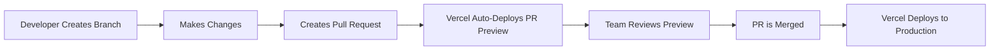

# React Vercel Deployment

## Introduction

Deploying your React application is a crucial step to make your project accessible to users worldwide. Among the many hosting platforms available, Vercel stands out as one of the most developer-friendly options, especially for React applications. 

Vercel (formerly known as Zeit) is a cloud platform designed specifically for frontend frameworks and static sites. It offers seamless integration with popular frameworks like React, Next.js, Vue, and others. What makes Vercel particularly attractive for React developers is its zero-configuration deployment process, built-in CI/CD pipeline, and great performance optimizations.

In this guide, we'll walk through the process of deploying a React application to Vercel, from initial setup to advanced deployment configurations.

## Why Choose Vercel for React Deployment?

Before diving into the deployment steps, let's understand why Vercel is an excellent choice for hosting React applications:

1. **Zero Configuration**: Vercel automatically detects React applications and sets up the build process.
2. **Performance Optimization**: Automatic edge caching, asset compression, and global CDN.
3. **Preview Deployments**: Every pull request gets its own deployment preview.
4. **Seamless GitHub/GitLab/Bitbucket Integration**: Connect your repository for continuous deployment.
5. **Custom Domains**: Easily connect your domain and manage SSL certificates.
6. **Environment Variables**: Secure way to store API keys and configuration.
7. **Serverless Functions**: Backend capabilities without managing servers.

## Prerequisites

Before we start deploying to Vercel, you'll need:

1. A React application (either created with Create React App, Next.js, or another React setup)
2. Your code hosted on GitHub, GitLab, or Bitbucket (recommended) or available locally
3. A Vercel account (free tier available)
4. Node.js installed on your local machine

## Deploying a React App to Vercel

### Step 1: Prepare Your React Application

Ensure your React application is properly set up with a `build` script in your `package.json` file. If you're using Create React App or Next.js, this is already configured for you.

For a standard React application created with Create React App, your `package.json` will have something like:

```json
{
  "name": "my-react-app",
  "version": "0.1.0",
  "scripts": {
    "start": "react-scripts start",
    "build": "react-scripts build",
    "test": "react-scripts test",
    "eject": "react-scripts eject"
  },
  // other dependencies and configurations
}
```

### Step 2: Create a Vercel Account

1. Visit [vercel.com](https://vercel.com) and sign up for an account.
2. You can sign up using GitHub, GitLab, Bitbucket, or email.
3. After signing up, you'll land on your dashboard.

### Step 3: Deploy Your React Application

#### Option 1: Deploy from a Git Provider (Recommended)

1. From the Vercel dashboard, click "New Project".
2. Import your repository from GitHub, GitLab, or Bitbucket.
   - If this is your first time, you'll need to install Vercel on your GitHub account and authorize access to repositories.
3. Select the repository containing your React application.
4. Configure your project:
   - Vercel will automatically detect that it's a React app
   - Framework Preset: "Create React App" (or "Next.js" if you're using Next.js)
   - Build Command: `npm run build` (usually auto-detected)
   - Output Directory: `build` (for Create React App) or `out`/`.next` (for Next.js) (usually auto-detected)
5. Click "Deploy".

Vercel will then:
- Clone your repository
- Install dependencies
- Build your application
- Deploy it to their global CDN

#### Option 2: Deploy Using Vercel CLI

If your code isn't hosted on a Git provider or you prefer CLI, you can use the Vercel CLI:

1. Install Vercel CLI globally:

```bash
npm install -g vercel
```

2. Navigate to your React project directory:

```bash
cd my-react-app
```

3. Run the deployment command:

```bash
vercel
```

4. Follow the CLI prompts:
   - Log in to your Vercel account (if not already logged in)
   - Set up and deploy your project by answering a few questions

### Step 4: Accessing Your Deployed Application

Once deployment is complete, Vercel will provide you with:

1. A unique URL for your project (e.g., `my-react-app-gamma.vercel.app`)
2. A deployment dashboard showing build logs, deployment status, and performance metrics
3. Options for custom domain configuration

Your React application is now live and accessible worldwide via Vercel's global CDN!

## Advanced Configurations

### Environment Variables

For applications that require environment variables (like API keys):

1. Go to your project in the Vercel dashboard
2. Navigate to "Settings" > "Environment Variables"
3. Add your environment variables (e.g., `REACT_APP_API_KEY`)
4. Choose which environments (Production, Preview, Development) should have access to each variable

Remember that for Create React App, environment variables need to be prefixed with `REACT_APP_` to be accessible in your code.

Example usage in your React app:

```jsx
function ApiComponent() {
  useEffect(() => {
    // Access environment variable
    const apiKey = process.env.REACT_APP_API_KEY;
    fetch(`https://api.example.com/data?key=${apiKey}`);
  }, []);
  
  return <div>API Component</div>;
}
```

### Custom Domain Setup

To connect your custom domain:

1. Go to your project in the Vercel dashboard
2. Navigate to "Settings" > "Domains"
3. Enter your domain name (e.g., `myreactapp.com`)
4. Follow the instructions to configure your domain's DNS settings

Vercel will automatically issue and renew an SSL certificate for your custom domain.

### Configure Build Settings

For more control over the build process:

1. Create a `vercel.json` file in your project root:

```json
{
  "version": 2,
  "builds": [
    {
      "src": "package.json",
      "use": "@vercel/static-build",
      "config": { "distDir": "build" }
    }
  ],
  "routes": [
    { "handle": "filesystem" },
    { "src": "/.*", "dest": "/index.html" }
  ]
}
```

This configuration specifies the build process and sets up a catch-all route for proper SPA (Single Page Application) routing.

### Automatic Preview Deployments

One of Vercel's best features is automatic preview deployments for pull requests:

1. When you create a pull request in your connected Git repository
2. Vercel automatically builds and deploys a preview version
3. A comment appears in your PR with a link to the preview
4. Team members can review visual changes before merging

Example workflow:



## Troubleshooting Common Issues

### Build Failures

If your build fails on Vercel but works locally:

1. Check the build logs in the Vercel dashboard
2. Verify that all dependencies are properly listed in your `package.json`
3. Ensure you're not using environment variables that aren't configured in Vercel
4. Check for case-sensitivity issues in imports (local machine might ignore these, but Vercel's Linux-based build system won't)

### Routing Issues

For SPAs with client-side routing (like React Router):

1. Add the appropriate route handling in `vercel.json` as shown above
2. Or use a `_redirects` file (for Netlify compatibility):

Create a file named `_redirects` in your `public` folder with:

```
/* /index.html 200
```

### Environment Variable Problems

If your app can't access environment variables:

1. Ensure they're prefixed with `REACT_APP_` for Create React App projects
2. Verify they're set correctly in the Vercel dashboard
3. Remember that environment variables are embedded at build time, not runtime

## Real-World Example: Deploying a React Weather App

Let's put everything together with a practical example of deploying a weather application:

1. Our React weather app uses an OpenWeatherMap API key
2. We need to deploy it to production with our API key secured
3. We want automatic deployments when we push to `main` branch

### Example Project Structure

```
weather-app/
├── public/
│   ├── index.html
│   └── favicon.ico
├── src/
│   ├── components/
│   │   ├── WeatherDisplay.js
│   │   └── SearchBar.js
│   ├── App.js
│   └── index.js
├── .env.local (contains REACT_APP_WEATHER_API_KEY)
├── .gitignore
├── package.json
└── README.md
```

### Steps to Deploy:

1. Ensure `.env.local` is in your `.gitignore` file to keep API key out of source control
2. Push your code to GitHub
3. Connect the repository to Vercel
4. Add `REACT_APP_WEATHER_API_KEY` in Vercel's Environment Variables section
5. Deploy the application

Example weather component using the API key:

```jsx
import React, { useEffect, useState } from 'react';

function WeatherDisplay({ city }) {
  const [weather, setWeather] = useState(null);
  const [loading, setLoading] = useState(true);
  const [error, setError] = useState(null);
  
  useEffect(() => {
    const apiKey = process.env.REACT_APP_WEATHER_API_KEY;
    
    if (!city) return;
    
    setLoading(true);
    fetch(`https://api.openweathermap.org/data/2.5/weather?q=${city}&appid=${apiKey}&units=metric`)
      .then(response => {
        if (!response.ok) throw new Error('Weather data not available');
        return response.json();
      })
      .then(data => {
        setWeather(data);
        setLoading(false);
      })
      .catch(err => {
        setError(err.message);
        setLoading(false);
      });
  }, [city]);
  
  if (loading) return <p>Loading weather information...</p>;
  if (error) return <p>Error: {error}</p>;
  if (!weather) return <p>Please search for a city</p>;
  
  return (
    <div className="weather-display">
      <h2>{weather.name}, {weather.sys.country}</h2>
      <div className="temperature">
        <span>{Math.round(weather.main.temp)}°C</span>
      </div>
      <div className="conditions">
        
        <span>{weather.weather[0].description}</span>
      </div>
    </div>
  );
}

export default WeatherDisplay;
```

## Deployment Workflow Best Practices

To maintain a professional deployment process:

1. **Use multiple environments**:
   - Production: `main` branch
   - Staging: `develop` branch
   - Preview: Pull requests

2. **Implement testing before deployment**:
   - Add tests to your React app
   - Configure Vercel to run tests before deployment

3. **Monitor performance**:
   - Use Vercel Analytics to track page performance
   - Set up alerts for performance regressions

4. **Use deployment protection rules**:
   - Password protect preview deployments
   - Restrict production deployments to specific team members

## Summary

In this guide, we've covered:

1. Why Vercel is an excellent platform for deploying React applications
2. Step-by-step deployment process to Vercel
3. Advanced configurations including environment variables and custom domains
4. Troubleshooting common deployment issues
5. A real-world example of deploying a React weather application
6. Best practices for maintaining a professional deployment workflow

Vercel makes deploying React applications remarkably simple while providing powerful features for teams of all sizes. By following this guide, you should be able to deploy your React app with confidence and take advantage of Vercel's excellent developer experience.

## Additional Resources

To deepen your understanding of React deployment on Vercel:

- [Vercel Documentation](https://vercel.com/docs)
- [Create React App Deployment Guide](https://create-react-app.dev/docs/deployment/)
- [Next.js Deployment Documentation](https://nextjs.org/docs/deployment)

## Exercises

1. Deploy a simple React counter application to Vercel using GitHub integration.
2. Set up a React application with environment variables and deploy it to Vercel.
3. Configure a custom domain for your Vercel-deployed React application.
4. Implement a CI/CD workflow with automated testing before deployment.
5. Create a React application that uses Vercel Serverless Functions to fetch data from a third-party API.