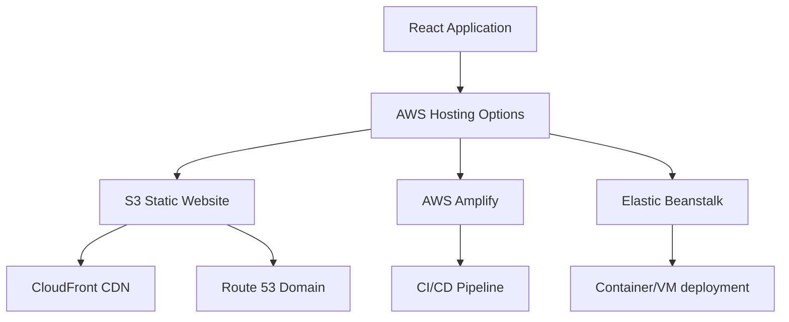

# React AWS Deployment

Amazon Web Services (AWS) provides a robust and scalable infrastructure for hosting your React applications. In this guide, we'll explore different ways to deploy React applications to AWS, from simple static site hosting to more complex architectures.

## Introduction to AWS for React Deployment

AWS offers multiple services that can host React applications, each with different features, complexity levels, and price points. Deploying to AWS gives your React app benefits like:

- Global content delivery with low latency
- Scalability to handle any amount of traffic
- High availability and reliability
- Security features and compliance certifications
- Integration with other AWS services

## AWS Hosting Options for React

Before diving into specific deployment methods, let's understand the main AWS services used for hosting React applications:



1. **S3 (Simple Storage Service)**: Perfect for static React apps (client-side rendering)
2. **AWS Amplify**: Complete solution with CI/CD, hosting, and backend services
3. **Elastic Beanstalk**: Suited for fullstack React apps with server components
4. **EC2 Instances**: For maximum control over your hosting environment

Let's explore each option in detail.

## Deploying to S3 + CloudFront (Basic Method)

This approach is ideal for simple React apps without a custom backend.

### Step 1: Build Your React Application

First, create a production build of your React application:

```bash
npm run build
# or
yarn build
```

This creates optimized static files in the `build` folder.

### Step 2: Create an S3 Bucket

1. Log in to the AWS Management Console
2. Navigate to S3
3. Click "Create bucket"
4. Choose a globally unique bucket name (e.g., `my-react-app`)
5. Select your preferred region
6. Uncheck "Block all public access" (since we want a public website)
7. Acknowledge the warning
8. Keep other settings as default and click "Create bucket"

### Step 3: Configure the Bucket for Static Website Hosting

1. Open your newly created bucket
2. Go to the "Properties" tab
3. Scroll down to "Static website hosting"
4. Click "Edit"
5. Select "Enable" 
6. Set "Index document" to `index.html`
7. Set "Error document" to `index.html` as well (for SPA routing)
8. Click "Save changes"

### Step 4: Set Bucket Permissions

Create a bucket policy to make the content publicly accessible:

1. Go to the "Permissions" tab
2. Under "Bucket Policy", click "Edit"
3. Add the following policy (replace `my-react-app` with your bucket name):

```json
{
  "Version": "2012-10-17",
  "Statement": [
    {
      "Effect": "Allow",
      "Principal": "*",
      "Action": "s3:GetObject",
      "Resource": "arn:aws:s3:::my-react-app/*"
    }
  ]
}
```

4. Click "Save changes"

### Step 5: Upload Your React Build Files

1. Go to the "Objects" tab
2. Click "Upload"
3. Add files from your React app's `build` folder
4. Click "Upload"

### Step 6: Access Your Website

Find the endpoint URL under Properties → Static website hosting → Bucket website endpoint.

The URL should look like: `http://my-react-app.s3-website-us-east-1.amazonaws.com`

### Adding CloudFront for Better Performance

To improve your app's performance with a CDN:

1. Navigate to CloudFront in the AWS console
2. Click "Create distribution"
3. For "Origin domain", select your S3 bucket endpoint
4. Under "Default cache behavior", set "Viewer protocol policy" to "Redirect HTTP to HTTPS"
5. For "Default root object", enter `index.html`
6. Create a custom error response for 403 and 404 errors:
   - HTTP error code: 403 (and another for 404)
   - Response page path: `/index.html`
   - HTTP response code: 200
7. Click "Create distribution"

Wait for deployment to complete (~15-30 minutes) and use the provided CloudFront domain name to access your website.

## Deploying React with AWS Amplify (Recommended for Most Users)

AWS Amplify provides a more streamlined approach with built-in CI/CD capabilities.

### Step 1: Push Your React Code to Git

Ensure your React project is in a Git repository (GitHub, BitBucket, GitLab, or AWS CodeCommit).

### Step 2: Set Up Amplify Hosting

1. Go to AWS Amplify Console
2. Click "Get Started" under "Amplify Hosting"
3. Select your Git provider and authorize AWS Amplify
4. Select your repository and branch
5. Configure build settings (Amplify typically auto-detects React settings)

Default build settings for React apps:

```yaml
version: 1
frontend:
  phases:
    preBuild:
      commands:
        - npm ci
    build:
      commands:
        - npm run build
  artifacts:
    baseDirectory: build
    files:
      - '**/*'
  cache:
    paths:
      - node_modules/**/*
```

6. Click "Next" and then "Save and deploy"

Amplify will now build and deploy your application automatically. Each time you push to your selected branch, Amplify will automatically rebuild and deploy the updated version.

### Setting Up Custom Domains in Amplify

1. On your app's main page in Amplify console, go to "Domain Management"
2. Click "Add domain"
3. Enter your domain and click "Configure domain"
4. Follow the verification and DNS setup instructions

### Handling React Router in Amplify

For SPAs using React Router, add the following rewrites and redirects:

1. Navigate to "Rewrites and redirects" for your app
2. Add a rule:
   - Source address: `</^[^.]+$|\.(?!(css|gif|ico|jpg|js|png|txt|svg|woff|woff2|ttf|map|json)$)([^.]+$)/>`
   - Target address: `/index.html`
   - Type: 200 (Rewrite)

This ensures that navigation works correctly for client-side routing.

## Deploying with Elastic Beanstalk (For Full-Stack Apps)

If your React app has a Node.js backend, Elastic Beanstalk may be a better choice.

### Step 1: Prepare Your Application

Modify your project structure to have a server that serves your React app:

```
my-app/
├── client/           # React app
│   ├── build/        # Production build
│   ├── public/
│   ├── src/
│   └── package.json
├── server/           # Server-side code
│   └── app.js        # Express server
├── .ebignore
├── package.json      # Root package.json
└── .elasticbeanstalk/
```

### Step 2: Create a Simple Express Server

Create a server that serves your React app (server/app.js):

```javascript
const express = require('express');
const path = require('path');
const app = express();

// Serve static files from React build
app.use(express.static(path.join(__dirname, '../client/build')));

// API endpoints go here
app.get('/api/hello', (req, res) => {
  res.json({ message: 'Hello from the backend!' });
});

// Handle React routing, return all requests to React app
app.get('*', (req, res) => {
  res.sendFile(path.join(__dirname, '../client/build', 'index.html'));
});

const PORT = process.env.PORT || 8080;
app.listen(PORT, () => {
  console.log(`Server running on port ${PORT}`);
});
```

Update your root package.json:

```json
{
  "name": "my-elastic-beanstalk-app",
  "version": "1.0.0",
  "scripts": {
    "start": "node server/app.js",
    "build": "cd client && npm install && npm run build",
    "deploy": "eb deploy"
  },
  "dependencies": {
    "express": "^4.17.1"
  },
  "devDependencies": {
    "aws-sdk": "^2.1001.0"
  }
}
```

### Step 3: Install EB CLI and Initialize

Install the Elastic Beanstalk CLI:

```bash
pip install awsebcli
```

Initialize your EB project:

```bash
eb init
```

Follow the prompts to select your region, application name, and platform (Node.js).

### Step 4: Create and Deploy Environment

Create your environment:

```bash
eb create my-react-environment
```

Once created, deploy your application:

```bash
npm run build  # Build your React app first
eb deploy
```

Your React application will now be accessible at the Elastic Beanstalk environment URL.

## Advanced AWS Deployment Considerations

### Using Environment Variables

For storing API keys and configuration securely:

#### With S3/CloudFront:
Use `.env.production` during the build process:

```
REACT_APP_API_URL=https://api.example.com
```

#### With Amplify:
Set environment variables in the Amplify Console:
1. Navigate to "Environment variables" in your app settings
2. Add key-value pairs for your environment variables
3. These will be available during build time

### Setting Up CI/CD Pipeline for S3

If not using Amplify, you can set up a GitHub Actions workflow for S3 deployments:

```yaml
name: Deploy to S3

on:
  push:
    branches:
      - main

jobs:
  build_and_deploy:
    runs-on: ubuntu-latest
    steps:
      - uses: actions/checkout@v2
      
      - name: Set up Node.js
        uses: actions/setup-node@v2
        with:
          node-version: '16'
          
      - name: Install dependencies
        run: npm ci
        
      - name: Build
        run: npm run build
        
      - name: Configure AWS credentials
        uses: aws-actions/configure-aws-credentials@v1
        with:
          aws-access-key-id: ${{ secrets.AWS_ACCESS_KEY_ID }}
          aws-secret-access-key: ${{ secrets.AWS_SECRET_ACCESS_KEY }}
          aws-region: us-east-1
          
      - name: Deploy to S3
        run: |
          aws s3 sync build/ s3://my-react-app --delete
          
      - name: Invalidate CloudFront
        run: |
          aws cloudfront create-invalidation --distribution-id ${{ secrets.CLOUDFRONT_DISTRIBUTION_ID }} --paths "/*"
```

### Monitoring and Analytics

Once your React app is deployed, set up monitoring:

1. **CloudWatch**: For logs and metrics
2. **X-Ray**: For tracing and performance analysis
3. **AWS WAF**: For security monitoring

Add to your CloudFront distribution:

1. Navigate to your CloudFront distribution
2. Under "Behaviors", edit the default behavior
3. Set "Cache policy" to "Managed-CachingOptimized"
4. Enable "Real-time logs"

## Common Deployment Issues and Solutions

### CORS Issues

If your React app makes API calls to separate AWS services:

```javascript
// Configure CORS on your API Gateway
const corsOptions = {
  "Access-Control-Allow-Origin": "*",
  "Access-Control-Allow-Headers": "Content-Type,Authorization",
  "Access-Control-Allow-Methods": "GET,POST,PUT,DELETE"
};
```

### React Router and S3/CloudFront

S3 doesn't natively support client-side routing. The solution is to:

1. Set the error document to `index.html` in your S3 configuration
2. For CloudFront, create custom error responses for 403/404 errors pointing to `/index.html`

### Cache Invalidation

After deploying updates to S3 and CloudFront:

```bash
# Invalidate CloudFront cache
aws cloudfront create-invalidation --distribution-id YOURDISTRUCTIONID --paths "/*"
```

## Cost Optimization

AWS can become expensive if not configured carefully:

1. **S3**: Use Intelligent-Tiering for automatically optimizing costs
2. **CloudFront**: Use caching to reduce origin requests
3. **Amplify**: Be mindful of build minutes, as they're limited in the free tier

For low-traffic sites, S3 + CloudFront is usually the most cost-effective solution.

## Summary

We've explored multiple ways to deploy React applications to AWS:

1. **S3 + CloudFront**: Simple, cost-effective for static sites
2. **AWS Amplify**: Great for most use cases with built-in CI/CD
3. **Elastic Beanstalk**: Ideal for full-stack applications

Each approach has its own advantages, and the best choice depends on your specific requirements, budget, and technical expertise.

## Additional Resources

- [AWS Amplify Documentation](https://docs.aws.amazon.com/amplify/)
- [S3 Static Website Hosting Documentation](https://docs.aws.amazon.com/AmazonS3/latest/userguide/WebsiteHosting.html)
- [CloudFront Developer Guide](https://docs.aws.amazon.com/AmazonCloudFront/latest/DeveloperGuide/)
- [AWS Free Tier](https://aws.amazon.com/free/) - Great for learning and small projects

## Practice Exercises

1. Deploy a simple React app to S3 and add CloudFront distribution
2. Set up a React app with AWS Amplify and connect it to your GitHub repository
3. Create a full-stack React application with a Node.js backend and deploy it to Elastic Beanstalk
4. Add a custom domain to your deployed React application
5. Set up a CI/CD pipeline that automatically deploys your React app when you push changes

By mastering these deployment techniques, you'll be able to confidently host your React applications on AWS's robust infrastructure.