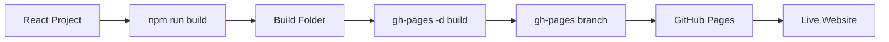

# React GitHub Pages

## Introduction

GitHub Pages provides an excellent free hosting solution for your React applications. It allows you to easily share your projects with others without the need for a dedicated hosting service. In this guide, we'll walk through the process of deploying a React application to GitHub Pages, from setting up your repository to configuring your project and performing the actual deployment.

GitHub Pages is particularly useful for:
- Portfolio projects
- Demo applications
- Documentation sites
- Small to medium-sized web applications

## Prerequisites

Before we begin, make sure you have:

- A GitHub account
- Git installed on your computer
- Node.js and npm installed
- A React application created (using Create React App or a similar tool)

## Setting Up Your GitHub Repository

First, you need a GitHub repository to host your project:

1. Log in to your GitHub account
2. Create a new repository or use an existing one
3. Push your React project code to the repository

:::tip
For personal projects, consider naming your repository `username.github.io` (replacing "username" with your GitHub username) to make it available at `https://username.github.io/`
:::

## Installing the GitHub Pages Package

To deploy your React app to GitHub Pages, you'll need to install the `gh-pages` package, which simplifies the deployment process.

```bash
npm install gh-pages --save-dev
```

or if you're using Yarn:

```bash
yarn add gh-pages --dev
```

## Configuring Your React App for GitHub Pages

### 1. Update your `package.json` file

Add the following fields to your `package.json`:

```json
{
  "homepage": "https://username.github.io/repository-name",
  "scripts": {
    "predeploy": "npm run build",
    "deploy": "gh-pages -d build",
    // ...existing scripts
  }
}
```

Replace `username` with your GitHub username and `repository-name` with your repository name.

### 2. Configuring React Router (if applicable)

If your application uses React Router, you'll need to configure it to work with GitHub Pages. GitHub Pages serves your app from a subdirectory, so you need to adjust your router accordingly.

For React Router v6:

```jsx
import { HashRouter } from "react-router-dom";

function App() {
  return (
    <HashRouter>
      {/* Your routes */}
    </HashRouter>
  );
}
```

Alternatively, you can use `BrowserRouter` with a `basename` prop:

```jsx
import { BrowserRouter } from "react-router-dom";

function App() {
  return (
    <BrowserRouter basename="/repository-name">
      {/* Your routes */}
    </BrowserRouter>
  );
}
```

## Building and Deploying Your React App

Now that your project is configured, you can deploy it to GitHub Pages:

```bash
npm run deploy
```

This command will:
1. Run the build script to create a production build of your app
2. Create a new branch called `gh-pages` in your repository
3. Push the contents of the `build` folder to this branch
4. Configure GitHub Pages to serve your site from this branch

## Setting Up GitHub Pages in Repository Settings

After running the deploy command, you need to configure your GitHub repository to serve the site:

1. Go to your GitHub repository
2. Click on "Settings"
3. Scroll down to the "GitHub Pages" section
4. In the "Source" dropdown, select the `gh-pages` branch
5. Click "Save"

After a few minutes, your site will be available at the URL you specified in the `homepage` field of your `package.json` file.

## Troubleshooting Common Issues

### 404 Errors

If you're experiencing 404 errors when navigating your deployed application:

1. Check that your React Router configuration is correct
2. Verify that asset paths in your code are relative, not absolute
3. Ensure the `homepage` field in `package.json` is correctly set

### Custom Domain Configuration

If you want to use a custom domain with your GitHub Pages site:

1. Go to your repository settings
2. In the GitHub Pages section, enter your custom domain
3. Create a CNAME record with your domain registrar pointing to `username.github.io`
4. Add a file named `CNAME` to the `public` folder of your React app containing your domain name

```
www.yourdomain.com
```

## Real-World Example: Portfolio Site

Let's walk through a complete example of deploying a simple React portfolio site to GitHub Pages:

1. Create a new React application:

```bash
npx create-react-app my-portfolio
cd my-portfolio
```

2. Add a simple portfolio component:

```jsx
// src/components/Portfolio.js
import React from 'react';

function Portfolio() {
  return (
    <div className="portfolio">
      <h1>Jane Doe - Web Developer</h1>
      <div className="projects">
        <div className="project">
          <h2>Project 1</h2>
          <p>A React application for task management</p>
        </div>
        <div className="project">
          <h2>Project 2</h2>
          <p>An e-commerce site built with React and Node.js</p>
        </div>
      </div>
    </div>
  );
}

export default Portfolio;
```

3. Update your `App.js`:

```jsx
// src/App.js
import './App.css';
import Portfolio from './components/Portfolio';

function App() {
  return (
    <div className="App">
      <Portfolio />
    </div>
  );
}

export default App;
```

4. Initialize Git and create a GitHub repository:

```bash
git init
git add .
git commit -m "Initial commit"
```

5. Connect to GitHub:

```bash
git remote add origin https://github.com/username/my-portfolio.git
git branch -M main
git push -u origin main
```

6. Install `gh-pages` and configure `package.json`:

```bash
npm install gh-pages --save-dev
```

Update `package.json`:

```json
{
  "name": "my-portfolio",
  "homepage": "https://username.github.io/my-portfolio",
  "version": "0.1.0",
  "private": true,
  "dependencies": {
    // ...dependencies
  },
  "scripts": {
    "predeploy": "npm run build",
    "deploy": "gh-pages -d build",
    "start": "react-scripts start",
    "build": "react-scripts build",
    "test": "react-scripts test",
    "eject": "react-scripts eject"
  },
  // ...rest of package.json
}
```

7. Deploy to GitHub Pages:

```bash
npm run deploy
```

8. Configure GitHub repository settings to use the `gh-pages` branch.

9. Visit your live portfolio at `https://username.github.io/my-portfolio`

## The Deployment Process Visualized

Here's a visual representation of how the GitHub Pages deployment process works:



## Summary

Deploying a React application to GitHub Pages is a straightforward process that provides free hosting for your projects. By following these steps, you can quickly share your React applications with others:

1. Create a GitHub repository for your project
2. Install the `gh-pages` package
3. Configure your `package.json` with the correct homepage and scripts
4. Run the deploy script
5. Configure GitHub Pages in your repository settings

GitHub Pages is perfect for personal projects, portfolios, and demonstration applications. However, for more complex applications that require backend services, you might need to consider more robust hosting solutions.

## Additional Resources

- [Official GitHub Pages Documentation](https://docs.github.com/en/pages)
- [Create React App Deployment Guide](https://create-react-app.dev/docs/deployment/#github-pages)
- [React Router Documentation](https://reactrouter.com/)

## Exercises

1. Create a simple React application and deploy it to GitHub Pages
2. Add React Router to your application and configure it for GitHub Pages
3. Create a portfolio website using React and host it on GitHub Pages
4. Configure a custom domain for your GitHub Pages site
5. Create a GitHub Action that automatically deploys your React app whenever you push to the main branch

By mastering GitHub Pages deployment for your React applications, you have a powerful and free way to share your projects with the world and showcase your development skills.