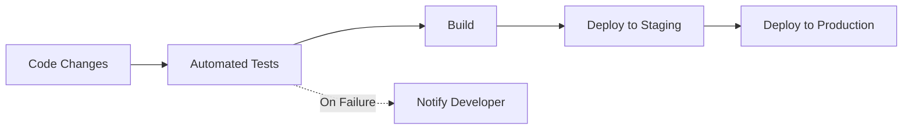
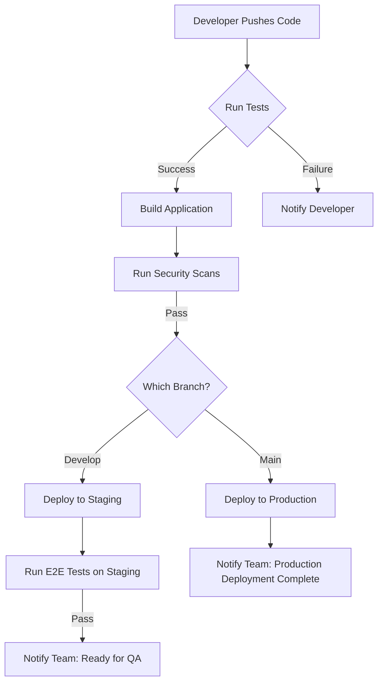

# React CI/CD Pipeline

## Introduction

Continuous Integration and Continuous Deployment (CI/CD) is a modern software development practice that enables developers to frequently deliver apps to customers by introducing automation into the development process. For React applications, CI/CD pipelines ensure that code changes are automatically tested, built, and deployed to production environments, reducing manual intervention and potential human errors.

In this tutorial, we'll walk through setting up a complete CI/CD pipeline for a React application. You'll learn how to automate testing, building, and deploying your React app using popular tools and services.

## What is a CI/CD Pipeline?

A CI/CD pipeline is an automated workflow that helps developers integrate code changes more frequently and reliably.



- **Continuous Integration (CI)**: Automatically building and testing code changes whenever they're pushed to a repository
- **Continuous Delivery (CD)**: Automatically preparing code for release to production
- **Continuous Deployment**: Automatically deploying code to production environments without manual intervention

## Benefits of CI/CD for React Applications

- Faster feedback on code changes
- Reduction in integration issues
- Consistent and reliable deployments
- Improved code quality through automated testing
- More time for developers to focus on writing features rather than manual deployments

## Prerequisites

Before setting up a CI/CD pipeline for your React application, you'll need:

- A React application hosted in a Git repository (GitHub, GitLab, or Bitbucket)
- Basic understanding of JavaScript/React
- Basic understanding of Git
- A hosting service for your React app (Netlify, Vercel, AWS, etc.)

## Setting Up a CI/CD Pipeline with GitHub Actions

Let's create a CI/CD pipeline using GitHub Actions, a popular and easy-to-use CI/CD tool integrated with GitHub.

### Step 1: Create a GitHub Actions Workflow File

In your React project, create a `.github/workflows` directory and add a file named `ci-cd.yml`:

```yaml
name: React App CI/CD

on:
  push:
    branches: [ main ]
  pull_request:
    branches: [ main ]

jobs:
  build-and-test:
    runs-on: ubuntu-latest
    
    steps:
    - uses: actions/checkout@v2
    
    - name: Setup Node.js
      uses: actions/setup-node@v2
      with:
        node-version: '16'
        
    - name: Install dependencies
      run: npm ci
      
    - name: Run tests
      run: npm test
      
    - name: Build
      run: npm run build
      
    - name: Upload build artifacts
      uses: actions/upload-artifact@v2
      with:
        name: build
        path: build/
```

This workflow will run whenever changes are pushed to the main branch or when a pull request is opened against the main branch. It installs dependencies, runs tests, and creates a build of your React application.

### Step 2: Add Deployment to the Workflow

Let's extend our workflow to deploy to Netlify (a popular hosting service for React applications):

```yaml
name: React App CI/CD

on:
  push:
    branches: [ main ]
  pull_request:
    branches: [ main ]

jobs:
  build-and-test:
    runs-on: ubuntu-latest
    
    steps:
    - uses: actions/checkout@v2
    
    - name: Setup Node.js
      uses: actions/setup-node@v2
      with:
        node-version: '16'
        
    - name: Install dependencies
      run: npm ci
      
    - name: Run tests
      run: npm test
      
    - name: Build
      run: npm run build
      
    - name: Upload build artifacts
      uses: actions/upload-artifact@v2
      with:
        name: build
        path: build/

  deploy:
    needs: build-and-test
    if: success() && github.ref == 'refs/heads/main'
    runs-on: ubuntu-latest
    
    steps:
    - name: Download build artifacts
      uses: actions/download-artifact@v2
      with:
        name: build
        path: build
        
    - name: Deploy to Netlify
      uses: netlify/actions/cli@master
      env:
        NETLIFY_AUTH_TOKEN: ${{ secrets.NETLIFY_AUTH_TOKEN }}
        NETLIFY_SITE_ID: ${{ secrets.NETLIFY_SITE_ID }}
      with:
        args: deploy --dir=build --prod
```

This updated workflow adds a deployment job that runs only when the build-and-test job succeeds and the changes are on the main branch.

### Step 3: Setting Up Environment Variables

For the deployment to work, you need to set up the necessary environment variables:

1. Get your Netlify authentication token from Netlify's user settings
2. Get your Netlify site ID from your Netlify site settings
3. Add these as secrets in your GitHub repository:
   - Go to your repository on GitHub
   - Click on "Settings" > "Secrets" > "New repository secret"
   - Add `NETLIFY_AUTH_TOKEN` and `NETLIFY_SITE_ID` with their respective values

## Example Pipeline for Different Environments

In real-world applications, you often need to deploy to different environments (development, staging, production). Here's how you can extend your workflow to handle multiple environments:

```yaml
name: React App CI/CD

on:
  push:
    branches: [ main, develop ]
  pull_request:
    branches: [ main, develop ]

jobs:
  build-and-test:
    runs-on: ubuntu-latest
    
    steps:
    - uses: actions/checkout@v2
    
    - name: Setup Node.js
      uses: actions/setup-node@v2
      with:
        node-version: '16'
        
    - name: Install dependencies
      run: npm ci
      
    - name: Run tests
      run: npm test
      
    - name: Build
      run: npm run build
      
    - name: Upload build artifacts
      uses: actions/upload-artifact@v2
      with:
        name: build
        path: build/

  deploy-to-dev:
    needs: build-and-test
    if: success() && github.ref == 'refs/heads/develop'
    runs-on: ubuntu-latest
    
    steps:
    # Similar to deploy job but using dev environment variables
    - name: Download build artifacts
      uses: actions/download-artifact@v2
      with:
        name: build
        path: build
        
    - name: Deploy to Netlify (Development)
      uses: netlify/actions/cli@master
      env:
        NETLIFY_AUTH_TOKEN: ${{ secrets.NETLIFY_AUTH_TOKEN }}
        NETLIFY_SITE_ID: ${{ secrets.NETLIFY_DEV_SITE_ID }}
      with:
        args: deploy --dir=build --prod
        
  deploy-to-production:
    needs: build-and-test
    if: success() && github.ref == 'refs/heads/main'
    runs-on: ubuntu-latest
    
    steps:
    - name: Download build artifacts
      uses: actions/download-artifact@v2
      with:
        name: build
        path: build
        
    - name: Deploy to Netlify (Production)
      uses: netlify/actions/cli@master
      env:
        NETLIFY_AUTH_TOKEN: ${{ secrets.NETLIFY_AUTH_TOKEN }}
        NETLIFY_SITE_ID: ${{ secrets.NETLIFY_PROD_SITE_ID }}
      with:
        args: deploy --dir=build --prod
```

## Adding Quality Checks to Your Pipeline

To ensure code quality, you can integrate additional checks into your pipeline:

### Linting

Add ESLint to your workflow to catch code style issues:

```yaml
- name: Lint
  run: npm run lint
```

Make sure your `package.json` has a lint script:

```json
{
  "scripts": {
    "lint": "eslint src/**/*.{js,jsx}"
  }
}
```

### Security Scanning

Add a step to check for vulnerable dependencies:

```yaml
- name: Security audit
  run: npm audit
```

### Performance Testing

For larger applications, you might want to add performance testing:

```yaml
- name: Performance testing
  run: npm run lighthouse
```

You'll need to set up Lighthouse CI for this to work.

## Setting Up Branch Protection Rules

To maximize the benefits of your CI/CD pipeline, configure branch protection rules in GitHub:

1. Go to your repository settings
2. Click on "Branches"
3. Add a rule for your main branch
4. Check options like:
   - Require status checks to pass before merging
   - Require branches to be up to date before merging
   - Include administrators

This ensures that code can only be merged into protected branches if all tests pass.

## Real-World Example: E-commerce React App Pipeline

Let's consider an example of a CI/CD pipeline for a React e-commerce application:



Implementation for this pipeline would include:

1. Unit and integration tests for React components
2. End-to-end tests using Cypress
3. Security scanning with npm audit and OWASP dependency check
4. Separate deployment steps for staging and production
5. Notifications to Slack or email

## Testing Your CI/CD Pipeline

After setting up your CI/CD pipeline:

1. Make a small change to your code
2. Commit and push to your repository
3. Monitor the GitHub Actions tab in your repository
4. Verify that all steps run correctly
5. Check that your application is deployed correctly

## Common Issues and Troubleshooting

1. **Build failures**
   - Check if all dependencies are properly installed
   - Ensure environment variables are correctly set

2. **Test failures**
   - Debug failing tests locally
   - Make sure tests are not dependent on specific environments

3. **Deployment failures**
   - Verify that deployment credentials are correct
   - Check if the build output is in the expected location

## Summary

In this tutorial, you learned how to:

- Set up a CI/CD pipeline for React applications using GitHub Actions
- Configure automated testing, building, and deployment
- Implement multi-environment deployments
- Add code quality and security checks
- Set up branch protection rules to enforce quality standards

A well-configured CI/CD pipeline saves time, reduces errors, and ensures that your React application is always in a deployable state. By automating the testing and deployment processes, you can focus more on developing new features and improving your application.

## Additional Resources

- [GitHub Actions Documentation](https://docs.github.com/en/actions)
- [React Testing Best Practices](https://reactjs.org/docs/testing.html)
- [Netlify Deployment Options](https://docs.netlify.com/site-deploys/overview/)
- [ESLint for React Projects](https://eslint.org/docs/user-guide/getting-started)

## Exercises

1. Set up a basic CI/CD pipeline for a simple React application using GitHub Actions.
2. Modify the pipeline to run linting checks before tests.
3. Add a step to the pipeline that generates a test coverage report.
4. Configure the pipeline to deploy to different environments based on Git branches.
5. Implement Slack notifications that inform the team about successful or failed deployments.